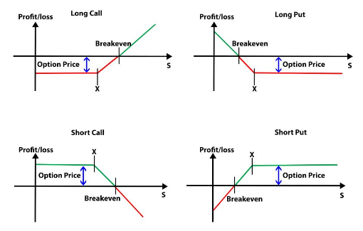

Algorithmic trading has transformed the way traders engage with financial markets, leveraging technology to develop strategies that can execute trades with precision and speed. One critical strategy within this domain is the utilization of the 9 EMA (Exponential Moving Average), lauded for its capacity to identify short-term trends effectively. The 9 EMA provides traders with a robust mechanism for analyzing price movements, allowing for rapid adaptation to market fluctuations.

This article investigates into the integral role of the 9 EMA in algorithmic trading, shedding light on its inherent benefits, methodologies for implementation, and exemplary practices. The 9 EMA is particularly noted for its ability to emphasize recent price data, distinguishing it from other moving averages that may not react as swiftly to market changes. This quality renders it a valuable tool for traders aiming to capitalize on short-lived market trends.



In addition to exploring the foundational aspects of the 9 EMA, the article will discuss EMA crossover strategies, notably the 9/30 trading method. This approach exploits the crossover between different moving averages to ascertain profitable entry and exit points in trending markets. Understanding these strategies equips traders with the knowledge to optimize their trading execution and enhance their portfolio performance.

Throughout this exploration, the article will provide insights into the tactical application of the 9 EMA within trading frameworks, offering practical guidance to maximize its utility. By integrating the 9 EMA into a comprehensive trading strategy, traders can refine their decision-making processes, heighten their market awareness, and potentially improve their trading outcomes. With these insights, the article aims to augment the trader's toolkit with a nuanced understanding of the 9 EMA's potential in algorithmic trading.

## Table of Contents

## Understanding the 9 EMA

The 9 EMA, or 9-period Exponential Moving Average, is a moving average technique that emphasizes recent price data more significantly than older data, making it particularly useful for traders focusing on short-term market trends. Unlike the Simple Moving Average (SMA), which assigns equal weight to all prices in the calculation period, the EMA gives more importance to the latest prices, thus reacting quickly to changes in the market.

To calculate the 9 EMA, the following formula is used:

$$
\text{EMA}_t = \left( \frac{2}{n+1} \right) \times (\text{Price}_t - \text{EMA}_{t-1}) + \text{EMA}_{t-1}
$$

Where:
- $\text{EMA}_t$ is the current EMA value
- $n$ is the number of periods (in this case, 9)
- $\text{Price}_t$ is the current price
- $\text{EMA}_{t-1}$ is the previous EMA value

The formula highlights the exponential nature of this average, wherein more weight is placed on the most recent data. The parameter $\frac{2}{n+1}$ is known as the smoothing [factor](/wiki/factor-investing), which in the case of 9 EMA equals $\frac{2}{10} = 0.2$. This responsiveness allows traders to identify emerging trends more efficiently compared to SMAs, which can be slower to respond to new price changes.

For practical application, traders can use the 9 EMA to ascertain the [momentum](/wiki/momentum) by observing whether the price is trading above or below the moving average line on the chart. If the price is above the 9 EMA, it often indicates an uptrend, prompting buy signals, whereas a price below the 9 EMA might suggest a downtrend, leading to sell signals.

The speed with which the 9 EMA adjusts to recent price changes aids traders in making timely decisions in fast-paced trading environments. This makes the 9 EMA a preferred choice for those involved in [day trading](/wiki/day-trading-spy) or other strategies where capturing short-term movements is paramount. By providing a clearer and quicker reflection of price activity, the 9 EMA empowers traders to act decisively, ensuring they remain aligned with the current momentum of the market.

## Implementing the 9 EMA Strategy

To implement the 9 EMA strategy, start by applying the 9 EMA to your trading chart. Most trading platforms, such as MetaTrader, TradingView, and NinjaTrader, include the 9 EMA in their standard set of technical indicators. This moving average is a powerful tool for traders who seek to exploit short-term price movements and is calculated using the exponential moving average formula:

$$

EMA_{today} = (Price_{today} \times \alpha) + (EMA_{yesterday} \times (1 - \alpha)) 
$$

where $\alpha$ (smoothing factor) is given by:

$$

\alpha = \frac{2}{n + 1}
$$

with $n$ being the number of periods (in this case, 9).

Once applied, the strategy involves monitoring price movements relative to the EMA line to determine potential buy or sell signals. A basic rule of thumb is:

- **Buy Signal**: When the price crosses above the 9 EMA, indicating an upward trend.
- **Sell Signal**: When the price crosses below the 9 EMA, suggesting a downtrend.

To enhance the reliability of these signals, the 9 EMA strategy is frequently used alongside other technical indicators, such as Relative Strength Index (RSI) or Moving Average Convergence Divergence (MACD). These additional indicators can help confirm potential entry or [exit](/wiki/exit-strategy) points, reducing the probability of false signals that may occur in volatile or sideways markets.

Proper risk management and position sizing are crucial to the success of the 9 EMA strategy. Traders should define stop-loss and take-profit levels based on their risk tolerance and the [volatility](/wiki/volatility-trading-strategies) of the asset being traded. A common practice is to use the Average True Range (ATR) to set these levels, ensuring they are adaptable to changing market conditions. Implementing risk-to-reward ratios, such as 1:2 or 1:3, allows traders to maintain favorable long-term trading outcomes even if not all trades are profitable.

Here is a simple Python implementation using the pandas library to calculate a 9 EMA and generate basic signals:

```python
import pandas as pd

# Assuming 'df' is your DataFrame with a 'Close' price column

# Calculate the 9 EMA
df['9_EMA'] = df['Close'].ewm(span=9, adjust=False).mean()

# Generate Buy/Sell signals
df['Signal'] = 0
df.loc[df['Close'] > df['9_EMA'], 'Signal'] = 1  # Buy signal
df.loc[df['Close'] < df['9_EMA'], 'Signal'] = -1 # Sell signal

# Print the DataFrame with the new columns
print(df[['Close', '9_EMA', 'Signal']])
```

This foundational approach can be expanded with more complex systems or integrated into [algorithmic trading](/wiki/algorithmic-trading) frameworks, providing a robust basis for recognizing short-term trends in the financial markets.

## The 9/30 Trading Strategy

The 9/30 trading strategy combines the 9-period Exponential Moving Average (EMA) with a 30-period Weighted Moving Average (WMA) to effectively identify trends and take advantage of pullbacks. This approach is beneficial in markets that display clear trends, as the crossover of these moving averages offers a straightforward signal for determining the direction of the trend. 

#### Setting up the 9/30 Trading System

1. **Apply Moving Averages**: Begin by plotting both the 9 EMA and the 30 WMA on your trading chart. Most trading platforms provide these indicators within their technical analysis tools. The 9 EMA provides quick responsiveness to recent price changes, while the 30 WMA emphasizes past market movements, smoothing out price fluctuations.

2. **Identify Crossover Points**: The core of the 9/30 strategy lies in the crossover of the two moving averages. A buy signal is generated when the 9 EMA crosses above the 30 WMA, indicating the beginning of an upward trend. Conversely, a sell signal occurs when the 9 EMA crosses below the 30 WMA, suggesting a downward trend.

3. **Utilize Pullbacks Effectively**: In trending markets, the strategy also focuses on capitalizing on pullbacks. When the price returns to the area between the 9 EMA and the 30 WMA during an existing trend, it presents an opportunity to enter trades in the direction of the established trend, benefiting from potential price reversals.

#### Application in Market Conditions

- **Trending Markets**: The 9/30 strategy is most effective in markets with distinct and sustained trends. By relying on the crossovers and pullbacks, traders can align their trades in sync with broader market movements, enhancing the potential for profitable opportunities.

- **Sideways or Ranging Markets**: In such conditions, the 9/30 strategy might yield less reliable signals. The frequency of crossovers increases without clear directional movement, leading to potential false signals. Traders may need to incorporate additional filters or complementary indicators to strengthen the reliability of their trading decisions in these environments.

Overall, the 9/30 trading strategy is a practical approach for traders aiming to harness short-term market trends. Its simplicity combined with the ability to adapt to different market conditions renders it a valuable component of algorithmic trading strategies.

## Backtesting the 9 EMA Strategy

Backtesting, an essential technique in [quantitative trading](/wiki/quantitative-trading), allows traders to evaluate the viability and effectiveness of the 9 EMA strategy by applying it to historical market data. This process involves simulating trades that would have occurred during the backtested period, thus providing insights into the potential performance of the strategy under different market conditions.

Several studies and practical applications have demonstrated the performance of the 9/30 strategy and standalone 9 EMA strategies across various financial instruments, such as stocks, currencies, and futures. The 9/30 strategy, which combines the 9-period Exponential Moving Average (EMA) with a 30-period Weighted Moving Average (WMA), aims to capture trend movements by identifying the crossover of these averages. In [backtesting](/wiki/backtesting), this strategy typically exhibits strong trend-following capabilities, often generating profitable trades during trending market conditions due to its ability to capitalize on pullbacks.

Performance metrics critical in evaluating the efficacy of these strategies include the Sharpe Ratio, Maximum Drawdown, and Win Rate. The Sharpe Ratio measures the risk-adjusted return, while the Maximum Drawdown assesses the largest peak-to-trough decline, indicating the strategy's vulnerability to loss. Additionally, the Win Rate provides the percentage of profitable trades relative to the total number of trades executed.

Backtesting results often reveal that the 9/30 strategy performs robustly in markets exhibiting clear trends, but its effectiveness may diminish in ranging or volatile market environments due to potential false signals. To enhance the strategy's performance, traders might consider incorporating additional filters or confirmations, such as Relative Strength Index (RSI) or Average True Range (ATR), to minimize false entries and improve trade validation. Furthermore, optimizing the EMA and WMA periods through parameter tuning can align the strategy more closely with the specific characteristics of different trading instruments.

The insights garnered from backtesting are invaluable as they allow traders to assess the strategy's historical profitability and volatility, shaping expectations for its application in live markets. The iterative process of backtesting, refining, and re-evaluating strategies ensures that traders are better equipped to deploy the 9 EMA and its variants effectively in algorithmic trading environments.

## Advantages and Disadvantages

The 9 EMA (Exponential Moving Average) offers a range of advantages for traders focused on capturing short-term market movements. Its appeal largely stems from its simplicity and effectiveness, characteristics highly valued by both novice and seasoned traders. By applying more weight to the most recent prices, the 9 EMA reacts swiftly to market changes, providing timely signals for buy or sell decisions. This quick response enables traders to exploit emerging trends, potentially leading to more profitable trades.

One of the primary advantages of the 9 EMA is its ease of implementation. Most trading platforms include the 9 EMA as a standard technical indicator, making it accessible for traders at all levels. The straightforward calculation involves using the formula:

$$

\text{EMA}_{\text{current}} = \left(\frac{\text{Price}_{\text{current}} \times (\text{Multiplier}) + \text{EMA}_{\text{previous}} \times (1 - \text{Multiplier})}\right)
$$

where the multiplier is calculated as:

$$

\text{Multiplier} = \frac{2}{n + 1} 
$$

and $n$ is the number of periods (in this case, 9). This mathematical simplicity makes the 9 EMA a practical choice for those who prefer less complex analytical tools.

Despite its strengths, the 9 EMA is not without disadvantages. One significant downside is its susceptibility to producing false signals in markets that are range-bound or experiencing high volatility. Such conditions can lead to frequent whipsaws, where the price crosses back and forth over the EMA line, resulting in unreliable trading signals. Consequently, the 9 EMA is most effective in trending markets, where it can reliably indicate the direction of the price movement.

To mitigate the risk of false signals, it is advisable to use the 9 EMA in conjunction with additional indicators. For instance, combining it with momentum oscillators or support and resistance levels can provide more robust confirmations of potential trading opportunities. By doing so, traders can enhance the accuracy of their trade entries and exits, thereby improving overall performance.

In summary, while the 9 EMA is a potent tool for short-term trading, its utility is maximized when combined with broader strategic insights. By understanding its limitations and supplementing it with complementary indicators, traders can integrate the 9 EMA into a comprehensive trading strategy effectively. This balance ensures the 9 EMA remains a valuable component within any trader's toolkit.

## Conclusion

The 9 EMA is a powerful tool for traders interested in capturing market trends effectively. By employing it in conjunction with broader trading strategies like the 9/30 method, traders can notably enhance their entry and exit points. This method, which involves the interplay between the 9 EMA and the 30-period Weighted Moving Average (WMA), helps in identifying significant trend directions and optimizing trading decisions during pullbacks. The swiftness of the 9 EMA in responding to price changes ensures that traders are better positioned to exploit short-term market movements.

However, it's crucial to acknowledge that the integration of the 9 EMA into trading does not automatically guarantee success. Effective risk management and continual adaptation to market fluctuations remain essential components of any successful trading strategy. Applying rigorous backtesting methods to historical data is vital to understanding potential outcomes and refining the strategy for diverse market conditions. Through systematic evaluation, traders can gauge the reliability of the 9 EMA and its associated strategies, adjusting parameters to enhance performance.

In algorithmic trading environments, where precision and quick decision-making are paramount, the 9 EMA offers significant opportunities. With its ability to provide timely signals and its ease of integration into automated systems, it serves as a robust asset for those looking to leverage technology in trading. By coupling the 9 EMA with strategic planning and continual market assessment, traders can harness its benefits to achieve greater consistency and profitability in their trading endeavors.

## References & Further Reading

[1]: Kirkpatrick, C. D., & Dahlquist, J. R. (2010). ["Technical Analysis: The Complete Resource for Financial Market Technicians."](https://books.google.com/books/about/Technical_Analysis.html?id=62-9CgAAQBAJ) FT Press.

[2]: Murphy, J. J. (1999). ["Technical Analysis of the Financial Markets: A Comprehensive Guide to Trading Methods and Applications."](https://www.amazon.com/Technical-Analysis-Financial-Markets-Comprehensive/dp/0735200661) New York Institute of Finance.

[3]: Pring, M. J. (2002). ["Technical Analysis Explained: The Successful Investor's Guide to Spotting Investment Trends and Turning Points."](https://www.amazon.com/Technical-Analysis-Explained-Fifth-Successful/dp/0071825177) McGraw-Hill.

[4]: Appel, G. (2008). ["Technical Analysis: Power Tools for Active Investors."](https://www.amazon.com/Technical-Analysis-Power-Active-Investors/dp/0132930048) FT Press.

[5]: Jovanovic, F., & Le Gall, F. (2001). ["Does God Practice a Random Walk? The 'Financial Physics' of a Nineteenth-Century Forerunner, Jules Regnault."](https://papers.ssrn.com/sol3/papers.cfm?abstract_id=3294556) Management Science, Vol. 47, No. 5.