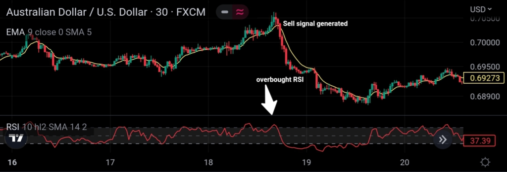

The 9 EMA trading strategy is a widely adopted approach in algorithmic trading due to its straightforward methodology and proven effectiveness in tracking short-term market trends. This strategy utilizes the 9-period Exponential Moving Average (EMA) as a core indicator to generate buy and sell signals by concentrating on recent price changes. 

The EMA calculation gives greater weight to the most recent prices, making it more responsive than simple moving averages to new information. Mathematically, the EMA is given by the formula:



$$

EMA_{t} = \left( \frac{P_{t} - EMA_{t-1}}{N+1} \right) + EMA_{t-1}
$$

where $P_{t}$ is the current closing price, $EMA_{t-1}$ is the previous period's EMA, and $N$ is the number of periods, which is 9 in this case.

This technique is applicable to a wide range of financial instruments, including stocks, forex, and commodities, thereby offering versatility. Traders of varying experience levels, from beginners to seasoned professionals, favor the 9 EMA strategy for its simplicity and practical utility in dynamic market environments.

In this article, the focus will be on the rules, benefits, practical implementation, and potential performance outcomes of the 9 EMA strategy. Practical examples and potential variations will also be discussed to provide a comprehensive understanding of how this strategy can be effectively applied in real-world trading scenarios.

## Table of Contents

## What is the 9 EMA Trading Strategy?

The 9 EMA trading strategy is founded on the use of the 9-day Exponential Moving Average (EMA) to track and capitalize on short-term trends within financial markets. The EMA is a type of moving average that places greater weight on the most recent data points, making it more responsive to recent price changes compared to the simple moving average (SMA). The mathematical formula for calculating the EMA involves the application of a smoothing [factor](/wiki/factor-investing), commonly denoted as:

$$
\text{EMA}_t = \left( \frac{2}{n + 1} \right) \times \left( \text{Price}_t - \text{EMA}_{t-1} \right) + \text{EMA}_{t-1}
$$

where $\text{EMA}_t$ is the EMA value at the current time period $t$, $\text{Price}_t$ is the current price, $\text{EMA}_{t-1}$ is the EMA value from the previous period, and $n$ is the number of periods.

Traders employing this strategy focus on identifying entry and [exit](/wiki/exit-strategy) points by observing the relationship between market prices and the 9 EMA. A common rule of thumb is to initiate a buy order when the price crosses above the 9 EMA, signaling a potential upward [momentum](/wiki/momentum). Conversely, a sell order is triggered when the price falls below the 9 EMA, suggesting a downward trend.

This approach is particularly advantageous in rapidly changing markets, as the emphasis on recent prices permits traders to respond promptly to emerging trends. The use of a shorter period, such as 9 days, ensures that the EMA remains current and aligned with the latest market movements, offering traders the agility needed to adapt their strategies accordingly.

## Benefits of the 9 EMA Strategy

The 9 EMA trading strategy is renowned for its efficacy in rapidly identifying shifts in market trends, making it an advantageous tool for traders seeking to capitalize on short-term price movements. This is primarily due to the nature of the Exponential Moving Average, which places greater emphasis on recent prices, thereby providing a more responsive metric to detect changes in trend direction. Unlike the simple moving average, the exponential nature of the EMA reduces the lag, enabling quicker responses to price dynamics.

One of the prominent advantages of the 9 EMA strategy is its versatility across a wide array of financial instruments and markets. Whether applied to stocks, foreign exchange, or commodities, the 9 EMA serves as a reliable indicator of market sentiment. This adaptability makes it a favored choice among traders who may wish to diversify their trading portfolios across various asset classes.

Implementing the 9 EMA strategy is straightforward, rendering it accessible to both novice and experienced traders. The simplicity of the EMA calculation, which involves weighting recent prices more heavily than older ones, allows for easy integration into trading platforms. The formula for the EMA is:

$$
EMA_{\text{today}} = \left( \frac{2}{N+1} \right) \times (\text{Price}_{\text{today}} - EMA_{\text{yesterday}}) + EMA_{\text{yesterday}}
$$

where $N$ is the number of periods, here specified as 9 for the 9 EMA.

Additionally, the strategy can be enhanced through the combination with other technical indicators, such as the Relative Strength Index (RSI) or Bollinger Bands, providing further confirmation of potential buy or sell signals. This combination aids in filtering false signals and improving accuracy, particularly in volatile market conditions.

The strategy's ability to generate straightforward buy and sell signals, based on the price's position relative to the 9 EMA, is another compelling aspect. When the price rises above the 9 EMA, it is typically considered a buy signal, while a drop below is viewed as a sell signal. This clear decision framework contributes to its accessibility for traders at all levels, from beginners seeking a foundational strategy to seasoned traders looking for a reliable tool in their trading arsenal.

In conclusion, the 9 EMA strategy offers a robust, adaptable, and easy-to-implement approach to trading, facilitating rapid identification of trend changes and supporting informed decision-making across various markets and instruments.

## Key Components of the 9 EMA Strategy

The 9 EMA trading strategy relies fundamentally on the 9-period Exponential Moving Average (EMA), which is employed to discern short-term market trends. The 9 EMA is a technical indicator that gives greater weight to the most recent prices, making it particularly responsive to price changes and allowing traders to identify emerging trends swiftly.

### Exponential Moving Average

The formula for calculating the Exponential Moving Average (EMA) for a particular day is given by:

$$
\text{EMA}_t = \alpha \times \text{Price}_t + (1 - \alpha) \times \text{EMA}_{t-1}
$$

where:
- $\alpha = \frac{2}{n+1}$
- $\text{Price}_t$ is the price of the asset at time $t$
- $\text{EMA}_{t-1}$ is the EMA calculated for the previous period
- $n$ is the number of periods (in this case, 9)

### Generating Buy and Sell Signals

Buy and sell signals in the 9 EMA trading strategy are straightforward. A buy signal is generated when the market price of an asset crosses above the 9 EMA, indicating potential upward momentum, while a sell signal is initiated when the price drops below the 9 EMA, suggesting downward pressure. This binary signal helps traders enter or exit positions based on the price's relation to the EMA.

### Risk Management

Risk management is integral to the success of the 9 EMA strategy. Effective risk management involves several key practices:

1. **Position Sizing**: Traders must determine the size of each trade based on their total capital and willingness to take risks. This includes defining the percentage of their account balance they're prepared to risk on a single trade.

2. **Stop-Loss Orders**: Implementing stop-loss orders allows traders to set predetermined exit points for their trades, thereby limiting potential losses in situations where the market moves unfavorably.

3. **Diversification**: To further manage risk, traders are encouraged to diversify their portfolios across different instruments or asset classes. This practice can help mitigate the impact of adverse price movements in any single market or asset.

```python
def calculate_ema(prices, period=9):
    ema = [sum(prices[:period]) / period]  # Start with SMA as the first EMA
    alpha = 2 / (period + 1)
    for price in prices[period:]:
        next_ema = alpha * price + (1 - alpha) * ema[-1]
        ema.append(next_ema)
    return ema

# Example usage
prices = [22, 24, 23, 24, 25, 26, 28, 27, 29, 30, 31]  # Example prices
ema_9 = calculate_ema(prices)
```

This script demonstrates the implementation of a simple moving average calculation in Python using historical price data. By integrating tailored indicators and sound risk management practices, traders can enhance the effectiveness of the 9 EMA strategy while reducing potential trading risks.

## Implementing the 9 EMA Strategy

To successfully implement the 9 EMA trading strategy, begin by selecting the security you wish to trade; options include stocks, futures, or currencies. Each of these financial instruments may behave differently, so it's essential to understand the characteristics and [volatility](/wiki/volatility-trading-strategies) of your chosen market.

Once you've selected a security, define your trading rules clearly. This includes specifying the conditions under which you will enter and exit positions. For instance, a simple rule might be to enter a buy position when the price closes above the 9-period EMA and sell when it falls below. If you are considering automation, you can code these rules using a platform that supports [algorithmic trading](/wiki/algorithmic-trading). Python is a popular choice for this task due to its extensive libraries and community support. A simple implementation using Python's pandas library might look like this:

```python
import pandas as pd

# Load historical data
data = pd.read_csv('path_to_csv.csv')
data['EMA9'] = data['Close'].ewm(span=9, adjust=False).mean()

# Generate signals
data['Signal'] = 0
data['Signal'][9:] = np.where(data['Close'][9:] > data['EMA9'][9:], 1, -1)
data['Position'] = data['Signal'].diff()

# Example filter: Buy when position changes to 1, sell when changes to -1
buys = data[data['Position'] == 1]
sells = data[data['Position'] == -1]
```

After coding your strategy, conduct [backtesting](/wiki/backtesting) using historical data to evaluate its potential performance. Backtesting involves applying your trading rules to past market data to see how your strategy would have fared. It is crucial to use accurate historical data and consider transaction costs and slippage in your analysis to ensure realistic results.

Once you are satisfied with the backtesting results, consider forward testing with a demo account. Forward testing provides a simulated trading environment where you can apply your strategy to live market conditions without financial risk. This step is vital to assess how your strategy handles current market dynamics, including unanticipated events and market volatility.

When you are prepared to transition to live trading, begin by trading with a small amount of capital. This approach minimizes your financial risk while offering practical experience. It's important to monitor your strategy's performance regularly and make necessary adjustments in response to evolving market conditions. Implementing robust risk management and continually refining your approach will contribute to long-term trading success.

## Risk Management Strategies

Risk management strategies are crucial components in executing the 9 EMA trading strategy effectively. These strategies help traders protect their capital from adverse market movements and manage exposure, enhancing the overall success of their trades. One of the primary tools employed in risk management is the stop-loss order. This tool is designed to automatically sell a security when its price reaches a pre-determined level, thereby limiting potential losses. For example, if a stock is purchased at $100, a trader might set a stop-loss order at $95 to prevent too much capital loss if the stock value declines.

Position sizing is another key element of risk management, intended to optimize the allocation of capital based on the size of the trading account and the trader's risk tolerance. A trader with a larger account might allocate a small percentage of their total capital to each trade, minimizing the impact of any single loss. Conversely, a trader with a smaller account may need to be more cautious with their position sizes. Position sizing can be guided by the formula:

$$
\text{Position Size} = \frac{\text{Account Balance} \times \text{Risk per Trade (\%)}}{\text{Stop Loss (in \$)}}
$$

This formula ensures that traders only risk a set percentage of their account balance on any single trade, thereby preserving capital in spite of potential market volatility.

Diversification is another fundamental principle in risk management that involves spreading investments across various instruments or sectors. By diversifying, traders can mitigate the impact of negative trends in a single market, as adverse conditions in one sector may not necessarily affect another. This can involve trading multiple asset classes such as stocks, commodities, or currencies, each responding differently to the same macroeconomic events.

When implementing these strategies, traders should be aware of the current market conditions and adjust their risk management tactics accordingly. While stop-loss orders provide a straightforward mechanism for limiting losses, in highly volatile markets, they may result in frequent, unnecessary exits. Thus, the choice between fixed stop-loss levels and dynamic alternatives, such as trailing stop-losses that adjust with market fluctuations, should be made based on specific market conditions and individual trading styles.

In summary, robust risk management is indispensable for successful trading. It involves using stop-loss orders to limit losses, adopting strategic position sizing to manage exposure, and diversifying across multiple instruments to cushion against adverse movements. Employing these strategies not only protects capital but also contributes to more consistent trading performance.

## Advantages and Disadvantages

The 9 EMA trading strategy is favored by traders for its ability to rapidly react to price changes. The exponential moving average (EMA) places greater weight on more recent prices, thus allowing traders to identify and act on emerging trends swiftly. This quick-response characteristic is particularly advantageous in volatile markets where timely entry and exit can significantly impact profitability. Additionally, the strategy's applicability across different markets, such as stocks, [forex](/wiki/forex-system), and commodities, enhances its versatility and broadens its use case for traders. The straightforward nature of the strategy makes it accessible to traders of varying experience levels, facilitating ease of implementation without requiring complex technical analysis tools.

However, the 9 EMA strategy does have limitations. One significant drawback is its potential to generate false signals, especially in erratic market conditions. During such times, price movements can briefly breach the EMA line, triggering entries or exits that may not correspond to sustainable trends. Furthermore, the strategy's reliance on momentum makes it less adaptable to diverse market conditions, particularly in sideways or mean-reverting environments where prices oscillate around a mean value rather than trending. In these scenarios, the strategy may lead to frequent losses due to the whipsaw effect, where prices fluctuate back and forth across the EMA without establishing a clear direction.

In conclusion, while the 9 EMA trading strategy provides a straightforward and effective approach for capturing short-term market trends, it necessitates cautious application and consideration of market conditions to avoid its pitfalls. Integrating additional indicators or risk management practices could enhance its performance and mitigate its disadvantages.

## Tips to Optimize the 9 EMA Strategy

Combining the 9 EMA trading strategy with other technical indicators such as the Relative Strength Index (RSI) or Bollinger Bands can enhance its effectiveness by providing confirmation signals. For instance, traders may look for a buy signal when the price moves above the 9 EMA while the RSI indicates an oversold condition. Similarly, a sell signal might be strengthened when the price drops below the EMA while the RSI suggests overbought conditions. Bollinger Bands, which measure market volatility and identify overbought or oversold levels, can further validate signals by showing price movements relative to the upper or lower bands. 

Adapting the strategy to prevailing market conditions is crucial. During trending markets, the 9 EMA strategy can effectively capture momentum. However, in sideways or choppy markets, it may produce false signals. Traders can employ filters, such as only taking trades in the direction of the longer-term trend, to minimize potential losses. Additionally, recognizing market volatility can guide the adjustment of stop-loss levels and position sizes.

Robust risk management practices are essential for optimizing the 9 EMA strategy. Employing stop-loss orders can protect against significant losses, while trailing stops can help lock in profits as trades move favorably. Position sizing should reflect the trader's risk tolerance and account size, ensuring that no single trade unduly impacts overall capital. Diversification across different instruments can also mitigate the risks associated with individual market movements. By integrating these elements, traders can improve the performance and reliability of the 9 EMA strategy.

## Conclusion

The 9 EMA trading strategy is a straightforward yet highly effective approach for traders seeking to capitalize on short-term price movements within trend-following markets. Its reliance on the 9-period Exponential Moving Average allows traders to identify and act on recent price trends, thus facilitating timely trading decisions. As outlined, the simplicity of using a single indicator to generate buy and sell signals contributes to its appeal across diverse trading platforms and instruments.

However, while the 9 EMA strategy is beneficial in capturing trends, it is not universally applicable in all market conditions. Specifically, its efficacy can diminish in mean-reverting or extremely volatile markets where price movements do not follow clear trends. In such cases, traders may need to adjust the strategy or combine it with other analytical tools, like the Relative Strength Index (RSI) or Bollinger Bands, to increase its accuracy and reduce the likelihood of false signals.

Furthermore, the continuous evolution of market dynamics necessitates ongoing learning and adaptation for traders employing the 9 EMA strategy. By staying informed about market trends and refining risk management practices, traders can enhance their overall strategy effectiveness. Adaptive techniques, such as altering the EMA period based on market conditions or integrating additional confirmation signals, are instrumental in maintaining profitability and reducing risk exposure.

In conclusion, the 9 EMA trading strategy serves as a valuable tool for traders focusing on short-term trends. Its straightforward implementation and efficient signal generation cater to traders at all experience levels. Nevertheless, recognizing and adapting to the limitations posed by varying market conditions is crucial for traders aiming to optimize its performance across different trading environments.

## References & Further Reading

[1]: Bergstra, J., Bardenet, R., Bengio, Y., & Kégl, B. (2011). ["Algorithms for Hyper-Parameter Optimization."](https://papers.nips.cc/paper/4443-algorithms-for-hyper-parameter-optimization) Advances in Neural Information Processing Systems 24.

[2]: ["Advances in Financial Machine Learning"](https://www.amazon.com/Advances-Financial-Machine-Learning-Marcos/dp/1119482089) by Marcos Lopez de Prado

[3]: ["Evidence-Based Technical Analysis: Applying the Scientific Method and Statistical Inference to Trading Signals"](https://www.amazon.com/Evidence-Based-Technical-Analysis-Scientific-Statistical/dp/0470008741) by David Aronson

[4]: ["Machine Learning for Algorithmic Trading"](https://github.com/PacktPublishing/Machine-Learning-for-Algorithmic-Trading-Second-Edition) by Stefan Jansen

[5]: ["Quantitative Trading: How to Build Your Own Algorithmic Trading Business"](https://books.google.com/books/about/Quantitative_Trading.html?id=j70yEAAAQBAJ) by Ernest P. Chan