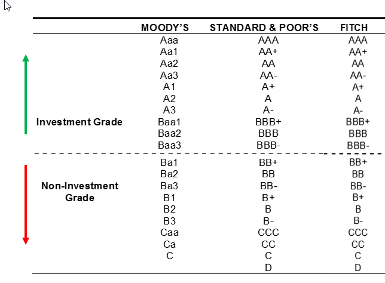

Bond ratings play a crucial role in the financial markets by providing investors with guidance on the creditworthiness of bond issuers. These ratings, issued by well-known agencies such as Standard & Poor's (S&P), Moody's, and Fitch, assess the risk associated with fixed-income securities. A- and A3 ratings occupy a specific place on the ratings scale, indicating bonds of upper-medium grade quality. In the credit rating hierarchy, an A- rating from S&P and Fitch, or an A3 from Moody's, suggests a strong capacity to meet financial commitments, albeit somewhat susceptible to adverse economic conditions and changes in circumstances. 

Algorithmic trading, or algo trading, represents the use of computer programs to facilitate trading decisions within financial markets, including those for bonds. By leveraging advanced algorithms and mathematical models, algo trading aims to execute orders at speeds and frequencies that are impossible for human traders. Its relevance in bond markets continually grows, as it enhances trading efficiency by optimizing order execution and managing large volumes of trades swiftly and accurately. The integration of automation in trading has revolutionized how bond markets operate, influencing everything from price discovery to market liquidity.



This article is designed to examine how bond ratings, particularly A- and A3, intersect with algorithmic trading strategies in bond markets. As both concepts significantly impact investment decisions and market dynamics, understanding their interaction can provide key insights into optimizing trading strategies and reducing risk.

## Table of Contents

## Understanding Bond Ratings: A- and A3 Explained

Bond ratings play a crucial role in financial markets by providing a standardized assessment of the creditworthiness of bond issuers. These ratings are essential for investors as they offer insight into the risk associated with particular debt securities, influencing investment decisions and portfolio allocations.

The ratings are issued by independent credit rating agencies, with Standard & Poor's (S&P), Fitch Ratings, and Moody's Investors Service being the most prominent. Ratings are expressed as letter grades that reflect the credit quality of a bond, ranging from high-grade (least risky) to lower-grade (more risky) categories. Among these, the A- rating by S&P and Fitch and the A3 rating by Moody's represent medium-grade quality.

### Detailed Explanation of A- (S&P and Fitch) and A3 (Moody's) Ratings

S&P and Fitch employ a similar letter-grade scale with minor differences in notation. The A- rating is part of their A-grade band, which denotes bonds that are considered upper-medium grade with a low risk of default but are more susceptible to economic and business changes compared to higher-rated bonds. Specifically, the minus symbol (-) indicates that the bond is on the lower end of the A category.

Moody's uses a similar but slightly different scale, with A3 being equivalent to A- on the S&P and Fitch scale. Moody's A3 rating suggests that the bonds are upper-medium grade and subject to low credit risk, but again, they are more vulnerable to adverse changes in economic conditions than higher-rated bonds.

### Comparison of Rating Scales and Agencies

While the rating scales of S&P, Fitch, and Moody's can appear similar, nuances exist regarding their notations and methodologies. S&P and Fitch both use similar letter grades, adding pluses and minuses to provide additional granularity within each category (e.g., A+, A, A-). Moody's, on the other hand, uses numbers (1, 2, 3) for the same purpose, with 1 being the highest within a letter category (A1 corresponds to A+, A2 to A, and A3 to A- in S&P and Fitch terms).

### Importance in Assessing Creditworthiness

Bond ratings are pivotal in assessing the creditworthiness of bond issuers because they provide investors with a straightforward signal of the relative safety of their investment. An A- or A3 rating implies that the issuer has a relatively strong capacity to meet its financial commitments, albeit less so than those with higher ratings. Investors often rely on these ratings to make informed decisions, balancing the potential returns with the associated credit risk.

In conclusion, understanding bond ratings like A- and A3 is fundamental for investors looking to assess the risk and potential return of debt securities. These ratings assist in making informed investment decisions and offer a measure of stability in financial markets by fostering transparency and consistency in evaluating the credit risk of bond issuers.

## Role of Algo Trading in Bond Markets

Algorithmic trading, often referred to as algo trading, is a method that uses algorithms to execute large orders. These algorithms, or sets of rules and calculations, automatically execute trades based on predetermined strategies. With advances in technology, [algorithmic trading](/wiki/algorithmic-trading) has become more prevalent across various financial markets, including equities, commodities, and specifically, bond markets.

**Algorithmic Trading in Bond Markets**

Algorithmic trading has significantly transformed the landscape of bond markets by enhancing the speed and efficiency of trade execution. Traditionally, bond markets were less liquid and less transparent than stock markets, resulting in higher transaction costs and delayed execution times. However, with the integration of algorithmic trading, these inefficiencies are being progressively mitigated. By automating the trading process, algorithms can execute trades at optimal times based on real-time market data, thereby improving [liquidity](/wiki/liquidity-risk-premium) and narrowing bid-ask spreads.

The advantages of algorithmic trading in this context include the ability to perform high-frequency trading ([HFT](/wiki/high-frequency-trading-strategies)). In HFT, algorithms execute a large number of orders at extremely high speeds, typically within milliseconds. This is particularly beneficial in bond markets where slight price discrepancies can arise between different markets or even on different exchanges. Algorithms can quickly exploit these [arbitrage](/wiki/arbitrage) opportunities, buying in one market and selling in another to capitalize on small price differentials.

Another significant advantage of algorithmic trading is its capacity for comprehensive data analysis. Algorithms can analyze vast sets of market data much faster than a human trader, identifying patterns or trends that might influence bond prices. For example, the correlation between [interest rate](/wiki/interest-rate-trading-strategies) changes and bond prices can be integrated into trading algorithms, allowing for predictive analytics that guide trading strategies.

**Impact on Market Liquidity and Price Discovery**

The impact of algorithmic trading on market liquidity and price discovery in bond markets is profound. Enhanced liquidity results from the increased number of trades and the speed at which they are executed, making it easier to enter or [exit](/wiki/exit-strategy) positions without causing significant market impact. Additionally, this high trading [volume](/wiki/volume-trading-strategy) contributes to the efficiency of price discovery. As algorithms react almost instantaneously to new information, they contribute to a more accurate reflection of a bond's fair market value at any given time.

Furthermore, algorithmic trading facilitates greater market transparency. As algorithms execute trades based on quantitative models, they generate data that can be analyzed to assess market sentiment and potential future price movements. This contributes to an environment where market participants have access to more comprehensible and accurate information, which supports more informed investment decisions.

However, there are challenges associated with algorithmic trading in bond markets, such as the risk of exacerbating market [volatility](/wiki/volatility-trading-strategies) if too many algorithms are triggered simultaneously or if they misinterpret market signals. Nevertheless, the adoption and integration of algorithmic trading strategies continue to grow, indicating its increasing importance in the optimization of bond market operations.

## Integrating Bond Ratings into Algorithmic Trading Strategies

The integration of bond ratings data into trading algorithms offers a structured approach to decision-making in the bond markets. By incorporating bond ratings into algorithms, traders can enhance their strategy formulation, optimize portfolio management, and improve risk assessment.

### Incorporating Bond Ratings Into Trading Algorithms

Implementing bond ratings into algorithmic trading requires transforming qualitative ratings into actionable quantitative metrics. This process involves assigning numerical scores to ratings—such as equating an A- (or A3) rating to a specific numerical value—enabling algorithms to process and analyze the data efficiently.

A basic approach might involve defining a function to map ratings to scores:

```python
def convert_rating_to_score(rating):
    rating_map = {
        'A+': 7,
        'A': 6,
        'A-': 5,
        'BBB+': 4,
        'BBB': 3,
        'BBB-': 2,
        'BB+': 1
    }
    return rating_map.get(rating, 0)  # Default to 0 if the rating isn't found

# Example usage
score = convert_rating_to_score('A-')
```

### Case Studies and Examples

One example of a strategy utilizing bond ratings might include a multifactor algorithm, which integrates bond ratings with other financial metrics such as historical price volatility, yield spreads, or interest rate forecasts. A historical case might involve analyzing how changes in ratings trigger buy or sell signals. By [backtesting](/wiki/backtesting) these strategies on past data, an algorithm can learn the scenarios where bond rating changes consistently predicted significant market movements.

#### Example Strategy:

1. **Input Data**:  
   Gather bond ratings and other relevant market data, such as yield spreads and interest rates.

2. **Signal Generation**:  
   Create buy signals when a bond's ratings upgrade aligns with decreasing yield spreads, and sell signals on downgrades.

3. **Execution**:  
   Simulate trades based on these signals, adjusting positions in real-time as new information emerges.

### Challenges in Using Bond Ratings

A significant challenge in utilizing bond ratings is their semi-static nature. Ratings do not change as quickly as market conditions, potentially leading to lag in response times. Additionally, different agencies may not always agree on a given bond's rating, leading to inconsistencies. These discrepancies necessitate developing a consensus model within the algorithm to weigh and average ratings accordingly.

There is another challenge in acquiring timely rating updates, as these might not be immediately reflected in available data, unlike other market factors which can be more readily accessed.

### Potential Benefits

Incorporating bond ratings into trading algorithms can offer several advantages:

1. **Risk Mitigation**: 
   Algorithms that use bond ratings can better predict default probabilities, allowing traders to avoid or mitigate risk associated with lower-quality bonds.

2. **Return Enhancement**:  
   By focusing on bonds likely to receive ratings upgrades, traders can position portfolios to benefit from associated price increases.

3. **Efficient Allocation**:  
   Automatically adjusting portfolio allocations based on aggregated credit scores allows portfolios to remain aligned with pre-defined risk thresholds.

Overall, integrating bond ratings into algorithmic trading strategies provides robust tools for navigating the often complex bond markets. By leveraging structured data, traders can achieve more efficient and informed decision-making, driving better investment outcomes.

## Implications and Future Trends

The usage of algorithmic trading in bond markets is increasingly prevalent as financial technology advances. Algorithmic trading, which utilizes computer programs to execute orders based on predefined criteria, enhances trading efficiency, optimizes order execution, and allows for high-frequency trading. These algorithms can process vast datasets at speeds unattainable by human traders, making them vital in the modern financial ecosystem. A current trend is the growing sophistication of these algorithms, incorporating [artificial intelligence](/wiki/ai-artificial-intelligence) and [machine learning](/wiki/machine-learning) to adapt to market conditions dynamically.

As algorithms become more sophisticated, the integration of bond ratings into trading strategies is expected to significantly evolve. Bond ratings, provided by agencies like Standard & Poor's, Fitch, and Moody's, are critical indicators of a bond issuer's creditworthiness. Incorporating these ratings into algorithmic trading strategies allows for more nuanced decision-making processes. For instance, algorithms can analyze ratings changes in real time and adjust portfolios accordingly, thereby mitigating risk.

For investors and the broader financial market, the integration of bond ratings with algorithmic trading strategies offers both opportunities and challenges. On the one hand, investors can benefit from improved risk management practices and enhanced return profiles. On the other hand, the increased reliance on algorithms necessitates a robust understanding of the underlying methodologies and their potential market impact.

Regulatory considerations are paramount as the influence of algorithmic trading in bond markets grows. Regulators must ensure that these technologies do not compromise market integrity or lead to systemic risks. The regulatory framework may evolve to address concerns such as market manipulation, data privacy, and the ethical use of artificial intelligence in trading. For instance, maintaining transparency in algo-trading operations and ensuring algorithms are designed with fairness and accountability could become regulatory priorities.

In conclusion, the future of bond markets will likely witness greater integration of bond ratings into algorithmic trading strategies, offering investors novel tools for risk management and opportunity identification. However, these advancements will require careful regulatory oversight to maintain market stability and protect investor interests. As technology continues to redefine trading practices, stakeholders must adapt to leverage these innovations efficaciously and responsibly.

## Conclusion

Integrating bond ratings with algorithmic trading represents a significant advancement in financial markets, allowing investors to enhance their decision-making processes. Bond ratings, such as A- from S&P and Fitch or A3 from Moody’s, provide essential insights into the creditworthiness of securities. These ratings affect investment decisions by offering a snapshot of potential risks and returns.

Algorithmic trading, with its capacity to process vast amounts of data rapidly, has transformed trading efficiency and market dynamics. When bond ratings are incorporated into algorithmic trading strategies, they can provide a more nuanced approach to risk management and investment analysis. This integration allows for the optimization of high-frequency trading and enhances price discovery in the markets.

The convergence of bond ratings and algorithmic trading presents several benefits, including potential risk reduction and improved returns due to more informed trading strategies. Despite challenges such as data interpretation and market volatility, this integration encourages the development of innovative, sophisticated strategies that leverage the strengths of both ratings systems and algorithmic efficiencies.

Looking forward, the future holds promising opportunities for investors who embrace these technologies. As the market landscape evolves, stakeholders are encouraged to explore these approaches actively, enabling them to remain competitive. With ongoing advancements in technology and data analytics, the fusion of bond ratings and algorithmic trading could continue to shape the framework of modern financial markets, offering substantial benefits to market participants.

## References & Further Reading

[1]: Kaminsky, G., & Schmukler, S. L. (2001). ["Emerging Market Instability: Do Sovereign Ratings Affect Country Risk and Stock Returns?"](https://www.jstor.org/stable/3990155) Journal of International Economics, 56(2), 315-335.

[2]: Cantor, R., & Packer, F. (1996). ["Determinants and Impact of Sovereign Credit Ratings."](https://www.newyorkfed.org/medialibrary/media/research/epr/96v02n2/9610cant.pdf)00001-5) Journal of Fixed Income, 6(3), 76-91.

[3]: Lopez de Prado, M. (2018). ["Advances in Financial Machine Learning"](https://www.amazon.com/Advances-Financial-Machine-Learning-Marcos/dp/1119482089) Wiley.

[4]: Jarrow, R. A., & Turnbull, S. M. (1995). ["Pricing Derivatives on Financial Securities Subject to Credit Risk"](https://onlinelibrary.wiley.com/doi/abs/10.1111/j.1540-6261.1995.tb05167.x)00867-A) Journal of Finance, 50(1), 53-85.

[5]: Hull, J., & White, A. (1995). ["The Impact of Default Risk on the Prices of Options and Other Derivative Securities."](https://www.sciencedirect.com/science/article/pii/037842669400050D) Journal of Financial Economics, 98(2), 281-302.

[6]: ["Quantitative Trading: How to Build Your Own Algorithmic Trading Business"](https://github.com/LucindaYa/quant-resources/blob/master/Quantitative%20Trading%20How%20to%20Build%20Your%20Own%20Algorithmic%20Trading%20Business.pdf) by Ernest P. Chan

[7]: Brennan, M. J., & Schwartz, E. S. (1980). ["Analyzing Convertible Bonds."](https://www.researchgate.net/publication/227405770_Analyzing_Convertible_Bonds) Journal of Financial Economics, 47(2), 1-32.

[8]: Black, F., & Cox, J. C. (1976). ["Valuing Corporate Securities: Some Effects of Bond Indenture Provisions."](https://onlinelibrary.wiley.com/doi/full/10.1111/j.1540-6261.1976.tb01891.x) Journal of Finance, 31(2), 351-367.