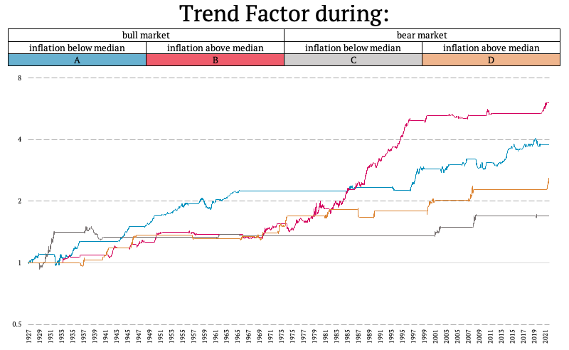

## Table of Contents

## What is a balanced portfolio and why is it important?

A balanced portfolio is a collection of investments that includes a mix of different types of assets, like stocks, bonds, and cash. The idea is to spread out the risk so that if one type of investment goes down in value, the others might stay the same or even go up. This mix helps to keep your overall investment stable and can help you reach your financial goals without taking too much risk.

Having a balanced portfolio is important because it helps protect your money. If you put all your money into one type of investment and it does badly, you could lose a lot. But with a balanced portfolio, the different investments can balance each other out. This way, you can still make money even if some parts of your portfolio are not doing well. It's like not putting all your eggs in one basket, which makes your investments safer and more likely to grow over time.

## How do different market states affect investment strategies?

Different market states, like bull markets, bear markets, and sideways markets, can change how you should invest your money. In a bull market, when prices are going up and people feel good about the economy, you might want to invest more in stocks because they can grow a lot. But you still need to be careful and not put all your money in one place. In a bear market, when prices are going down and people are worried, it might be smarter to put more money into safer things like bonds or cash. This can help protect your money until the market gets better.

Sideways markets, where prices don't go up or down much, can be tricky. Here, you might want to look for investments that pay you regular money, like dividend stocks or bonds. This way, you can still make some money even if the market isn't moving much. No matter what the market is doing, it's important to keep your portfolio balanced and think about your long-term goals. This helps you stay ready for whatever the market does next.

## What are the basic principles of trend-following in investing?

Trend-following in investing means trying to make money by figuring out which way the market is moving and then going along with that direction. The main idea is to buy things that are going up in price and sell things that are going down. People who follow trends use charts and other tools to spot when a trend starts and when it might be ending. They don't try to guess what the market will do next; instead, they wait for the market to show them what it's doing and then they act.

The key to trend-following is being patient and sticking to your plan. It's important not to get too excited when things are going well or too scared when they're not. Trend-followers know that markets can change quickly, so they always have a plan for when to get out of an investment if it starts going the wrong way. By following the trend and managing their risks carefully, trend-followers aim to make money over time, even if they have some losses along the way.

## Can you explain the concept of market states in simple terms?

Market states are like different moods the stock market can be in. There are three main types: bull markets, bear markets, and sideways markets. A bull market is when the market is feeling happy and prices are going up. People are buying a lot and feel good about the economy. A bear market is the opposite; it's when the market is feeling sad and prices are going down. People are selling a lot and worried about the economy. A sideways market is when the market is feeling okay but not great. Prices don't go up or down much, and it's like the market is taking a break.

Understanding these market states can help you decide what to do with your money. In a bull market, you might want to buy more stocks because they can make you more money. But you still need to be careful. In a bear market, it's safer to put your money in things like bonds or cash, which don't lose as much value. In a sideways market, you might look for investments that give you regular money, like dividend stocks or bonds. Knowing which market state we're in can help you make smarter choices about your investments.

## How does one identify different market states?

To figure out if we're in a bull market, you can look at how stock prices are moving. If they keep going up over a long time, like months or even years, that's a sign of a bull market. People are feeling good about the economy and are buying more stocks. You can also check the news and see if there's a lot of talk about the economy growing and companies doing well. If everyone seems happy and confident, it's probably a bull market.

A bear market is easier to spot because it's when stock prices are falling a lot. If you see prices going down for a while, like at least a few months, and people are worried about the economy, that's a bear market. The news might be full of stories about companies struggling and people losing jobs. If everyone seems scared and unsure, it's likely a bear market. 

A sideways market is trickier because prices don't move much either way. They just kind of stay the same for a while. If you look at a chart and see that the prices are not going up or down a lot, that's a sign of a sideways market. The news might not talk much about the economy because it's not doing anything exciting. If things feel calm and steady, you might be in a sideways market.

## What are the key components of a balanced portfolio?

A balanced portfolio is made up of different types of investments that work together to help you reach your financial goals while keeping your money safe. The main parts of a balanced portfolio are stocks, bonds, and cash. Stocks are pieces of companies that can grow a lot but can also go down in value. Bonds are like loans you give to companies or the government, and they usually pay you back with interest. Cash is money you keep in a bank account or a money market fund, which is very safe but doesn't grow much.

The trick to a balanced portfolio is to mix these parts in a way that fits your goals and how much risk you're okay with. If you're young and can handle more risk, you might have more stocks in your portfolio because they can make you more money over time. But if you're older or don't like taking risks, you might have more bonds and cash to keep your money safe. The key is to keep checking and changing your portfolio to make sure it stays balanced and helps you reach your goals.

## How can trend-following be applied effectively during bull markets?

In a bull market, when prices are going up and people feel good about the economy, trend-following can help you make money. The idea is to buy stocks that are already going up and keep them as long as they keep going up. You can use charts to see which stocks are trending up. When you see a stock's price moving higher and higher, that's your signal to buy it. The key is to be patient and not sell too soon, because in a bull market, stocks can keep going up for a long time.

But you also need to be careful and have a plan for when to sell. Even in a bull market, prices can go down sometimes. So, you should decide ahead of time at what point you'll sell a stock if it starts going down. This way, you can protect your money if the trend changes. By following the upward trend and sticking to your plan, you can make the most of a bull market and grow your investments.

## What adjustments should be made to a balanced portfolio during a bear market?

During a bear market, when stock prices are going down and people are worried about the economy, you should make some changes to your balanced portfolio to keep your money safe. One big change is to move some of your money from stocks to bonds and cash. Bonds are safer than stocks because they pay you back with interest, and cash is the safest because it won't lose value. By having more bonds and cash, you can protect your money until the market gets better.

Another thing to do is to check your portfolio often and make sure it stays balanced. In a bear market, stocks can lose a lot of value quickly, so you might need to sell some stocks and buy more bonds or cash to keep your portfolio from getting too risky. It's also a good idea to think about your long-term goals and not panic. Bear markets don't last forever, and by making smart changes, you can be ready for when the market turns around.

## How does trend-following strategy perform in sideways or choppy markets?

In a sideways or choppy market, where prices don't go up or down much and just move around a lot, trend-following strategies can be tough. Trend-following works best when there's a clear direction, like in a bull or bear market. But in a sideways market, it's hard to find a strong trend to follow. You might buy a stock thinking it's going up, but then it goes down a little and then up again, making it hard to know when to sell. This can lead to a lot of small losses that add up over time.

Even though trend-following can be tricky in a sideways market, there are still ways to use it. One way is to be very patient and wait for a clear trend to start before you make a move. Another way is to use shorter time frames to spot smaller trends within the sideways market. This means looking at daily or even hourly charts instead of weekly or monthly ones. By being careful and adjusting your strategy, you can still make some money in a sideways market, but it takes more work and patience than in a bull or bear market.

## What advanced techniques can be used to enhance trend-following strategies?

To make trend-following strategies better, you can use something called moving averages. A moving average is a line on a chart that shows the average price of a stock over a certain time, like 50 days or 200 days. When the price of a stock goes above its moving average, it might be a good time to buy because it could mean the stock is starting to go up. And when the price goes below the moving average, it might be a good time to sell because the stock could be starting to go down. By using moving averages, you can spot trends more easily and make smarter choices about when to buy and sell.

Another advanced technique is to use something called stop-loss orders. A stop-loss order is a way to tell your broker to sell a stock if it goes down to a certain price. This helps you limit your losses if the market suddenly changes direction. For example, if you buy a stock at $100 and set a stop-loss at $90, your broker will sell the stock automatically if it drops to $90. This way, you don't lose more money than you're okay with. By using stop-loss orders, you can follow trends while also protecting your money from big drops in the market.

## How can one measure the performance of a balanced portfolio across various market states?

To measure how well a balanced portfolio is doing in different market states, you can look at how much money it makes or loses over time. In a bull market, when stock prices are going up, you want to see if your portfolio is growing more than the market average. You can compare your portfolio's returns to a stock market index like the S&P 500. If your portfolio is doing better than the index, that's a good sign. But if it's not keeping up, you might need to put more money into stocks to take advantage of the bull market.

In a bear market, when stock prices are going down, you want to see if your portfolio is losing less money than the market average. Again, you can compare your portfolio's performance to a stock market index. If your portfolio is holding up better than the index, it means your mix of stocks, bonds, and cash is working well to protect your money. In a sideways market, where prices don't move much, you want to see if your portfolio is still making some money, maybe from dividend stocks or bonds. By checking your portfolio's performance against the market in different states, you can see if it's balanced the right way for your goals.

## What are the potential pitfalls of relying solely on trend-following in a balanced portfolio?

Relying only on trend-following in a balanced portfolio can be risky because it might not work well in all market states. Trend-following works best when there's a clear direction, like in a bull or bear market. But in a sideways market, where prices don't go up or down much, it can be hard to find a strong trend to follow. You might buy a stock thinking it's going up, but then it goes down a little and then up again, making it hard to know when to sell. This can lead to a lot of small losses that add up over time, which can hurt your portfolio's overall performance.

Another problem with using only trend-following is that it can make you miss out on other good investment chances. A balanced portfolio should have a mix of stocks, bonds, and cash to spread out the risk. If you focus too much on following trends, you might not pay enough attention to other parts of your portfolio that could help you make money or keep your money safe. For example, in a bear market, you might need to move more money into bonds or cash to protect your investments, but trend-following might keep you stuck in stocks that are losing value. By not having a mix of different strategies, you could end up with a portfolio that's too risky and doesn't help you reach your financial goals.

## How do Market, Inflation, and Rates interact when combined?

Balanced portfolios traditionally comprise a combination of asset classes—with equities and bonds being the most common—to reduce overall investment risk through diversification. The interplay of market cycles, inflation, and interest rates significantly impacts the performance of such portfolios. Understanding these dynamics is crucial for optimizing asset allocation. This section focuses on analyzing how these factors collectively affect the performance of balanced portfolios, especially under different combinations of bull/bear market states, inflation levels, and interest rate conditions.

During bull markets, equities typically drive portfolio growth. Historical data indicate that balanced portfolios generally perform well in these conditions, regardless of inflation and interest rate scenarios. However, the introduction of high inflation or rising interest rates can diminish returns due to increased borrowing costs and pressure on corporate profits. Conversely, in bear markets, balanced portfolios face challenges, as equities generally decline in value. However, the bond component can offer some protection, particularly if interest rates fall, thereby increasing bond prices.

High inflation coupled with falling interest rates emerges as a particularly beneficial state for balanced portfolios. In such scenarios, the reduced cost of borrowing supports corporate growth and investments, while existing fixed-income assets in the portfolio gain value as rates drop. The real value erosion caused by inflation is often offset by higher returns from equities, which may benefit from inflation through price adjustments and increased nominal revenues.

To illustrate these dynamics mathematically, consider the formula for the nominal return $R$ of a balanced portfolio:

$$
R = w_{e} \cdot r_{e} + w_{b} \cdot r_{b}
$$

where $w_{e}$ and $w_{b}$ are the weightings of equities and bonds in the portfolio, and $r_{e}$ and $r_{b}$ are the respective returns of equities and bonds. In high inflation periods with decreasing rates, $r_{b}$ tends to be higher due to increased bond prices, providing an additional boost to the portfolio return.

Quantitative analysis from historical data confirms that balanced portfolios often achieve optimal performance during phases characterized by moderated inflation and declining rates. Reduced rates usually foster a favorable borrowing environment, while moderated inflation avoids the adverse effects of sharp cost increases, creating a conducive climate for both equities and bonds to appreciate.

Understanding these complex interactions is vital for investors aiming to strategically adjust their portfolios in anticipation of market changes, thereby optimizing the risk-return profile over varying economic landscapes.

 to Trend-Following Strategies

Trend-following strategies are a sophisticated form of [algorithmic trading](/wiki/algorithmic-trading) that capitalize on market [momentum](/wiki/momentum) to achieve returns. These strategies are predicated on the idea that financial instruments which have been rising or falling consistently will continue to do so in the near future. The primary mechanism involves identifying and exploiting these trends early for potential profit maximization.

At the core of trend-following strategies is technical analysis, a methodology which employs historical price and [volume](/wiki/volume-trading-strategy) data, rather than fundamentals, to predict future market movements. Technical analysis tools aim to identify market trends through various chart patterns and technical indicators. Common indicators used include moving averages, the moving average convergence divergence (MACD), and the relative strength index (RSI). For example, a simple moving average crossover strategy might involve buying an asset when a short-term moving average crosses above a long-term moving average, signaling a potential upward trend.

Entities such as the Man Group, one of the leading alternative investment management firms, have successfully applied trend-following strategies across various market conditions. These strategies are particularly versatile as they can be employed in both rising and falling markets. In bull markets, trend-followers typically ride sustained upward price trends by holding long positions. Conversely, in bear markets, they can benefit from downward price movements by taking short positions. This adaptability to different market states allows trend-following strategies to potentially generate returns irrespective of the overall market direction.

Overall, trend-following strategies are an essential tool for traders and investment managers seeking to harness market momentum and mitigate risk by responding dynamically to market conditions. Their reliance on technical indicators and historical data analysis makes them indispensable for systematic trading programs and professional trading entities aiming for robust performance across fluctuating market cycles.

## How does trend-following performance vary over market and inflation cycles?

Trend-following strategies are systematic approaches that capitalize on market momentum. Their performance varies significantly depending on the combination of market cycles, specifically bull or bear markets, and inflation states, whether high or low. These strategies traditionally fare well when market trends are pronounced, as trend-followers essentially seek to capture and ride these trends. 

In a detailed analysis of trend-following performance, it is observed that these strategies exhibit their highest Sharpe ratios during bull markets characterized by high inflation levels. A Sharpe ratio is a measure that indicates the average return gained above the risk-free rate per unit of volatility or total risk. The compelling performance in such environments suggests that during bull markets, upward momentum is augmented by inflationary pressures, thereby extending the duration and strength of trends that are favorable for trend-following.

Conversely, while trend-following strategies prosper during clear trending markets, they encounter challenges during phases marked by frequent market reversals. These reversals can obscure clear trends, leading to false signals and heightened losses for trend-followers. This is particularly evident in bear market conditions or environments with low inflation, where market signals tend to be more erratic and less conducive to trend identification.

Mathematically, the relationship between trend-following profitability $P$ in relation to market volatility $V_m$ and inflation $I$ can be conceptually expressed as:

$$
P \propto f(V_m, I)
$$

Where $f$ is a function that increases with high $V_m$ and $I$ typically associated with bull markets. As market volatility and inflation change, so does this function, impacting the strategies' profitability inversely during bear markets or low inflation conditions.

In conclusion, while trend-following strategies thrive in trending markets with clear directionality as in high-inflation-driven bull markets, they are particularly susceptible to downturns when market reversals are prevalent, emphasizing the necessity for adaptive models that can adjust to varying financial climates.

## What is the Comprehensive Analysis of Market, Inflation, and Rates on Trend-Following?

Trend-following strategies have long been recognized for their ability to navigate various market conditions by capitalizing on price momentum. However, their efficacy can significantly vary depending on the interplay of market cycles, inflation, and interest rates. This analysis aims to review the impacts of these combined scenarios on trend-following returns, highlighting periods of strong trends and volatility, and drawing from historical examples.

### Impact of Combined Market, Inflation, and Interest Rate Scenarios

Trend-following strategies typically perform well during periods characterized by clear directional movements in asset prices. Bull markets with rising interest rates usually present such strong trends, as they often indicate a growing economy with confident investor sentiment. In such environments, trend-followers can potentially exploit the upward price momentum, resulting in positive returns. 

**Mathematical Representation**: The effectiveness of trend-following can be mathematically represented through models that incorporate momentum indicators like the moving average crossover. For instance, a simple trend-following signal might be generated when a short-term moving average crosses above a long-term moving average, expressed as:

$$
\text{Signal} = 
\begin{cases} 
1, & \text{if } MA_{\text{short}} > MA_{\text{long}} \\
0, & \text{if } MA_{\text{short}} \leq MA_{\text{long}}
\end{cases} 
$$

Where $MA_{\text{short}}$ and $MA_{\text{long}}$ represent short-term and long-term moving averages, respectively.

### Historical Examples of Trend-Following Performance

Historical market data provides insights into how trend-following strategies have reacted to different economic phases. Notably, during the early 1980s, a period characterized by high interest rates to combat inflation, trend-following strategies benefited from the pronounced and sustained shifts in various asset prices. The economic policies during this time created environments of high volatility, which are generally favorable for momentum-based strategies.

Another example is the post-2008 financial crisis bull market, which was accompanied by low-interest rates but strong upward trends in equity markets. Despite the low rates, the clear trend of recovery provided profitable opportunities for trend-followers.

### Challenges in Low Volatility and Reversal Phases

Conversely, environments with low inflation and falling rates, often associated with economic stagnation or uncertain market conditions, pose challenges for trend-following strategies. These periods can lead to reversals or choppy markets, where clear price trends are absent, leading to potential losses or whipsaws for trend-followers. This is because trend-following inherently relies on sustained price movements and can suffer in range-bound markets.

**Code Representation**: Utilizing Python for backtesting trend-following strategies can involve libraries like pandas for financial data manipulation and testing analytics. Below is a simplified example of generating trend signals based on moving averages:

```python
import pandas as pd

# Assuming df contains the financial time series data with columns 'Close'
df['MA_short'] = df['Close'].rolling(window=20).mean()
df['MA_long'] = df['Close'].rolling(window=50).mean()

# Generate signal
df['Signal'] = 0
df.loc[df['MA_short'] > df['MA_long'], 'Signal'] = 1
```

### Conclusion

The analysis highlights that the intersection of market cycles, inflation, and interest rates holds considerable influence over the performance of trend-following strategies. Understanding these interactions allows investors and portfolio managers to better anticipate potential performance and risks associated with trend-following under various economic conditions. Historical data underscores the importance of adaptive strategies that consider both macroeconomic indicators and market momentum to optimize returns.

## References & Further Reading

[1]: ["The Myth of the Rational Market: A History of Risk, Reward, and Delusion on Wall Street"](https://www.amazon.com/Myth-Rational-Market-History-Delusion/dp/0060599030) by Justin Fox

[2]: Asness, C. S., Krail, R. J., & Liew, J. M. (2001). ["Do Hedge Funds Hedge?"](https://papers.ssrn.com/sol3/papers.cfm?abstract_id=252810) The Journal of Portfolio Management, 29(1), 6-19.

[3]: Fama, E. F., & French, K. R. (1993). ["Common Risk Factors in the Returns on Stocks and Bonds."](https://people.hec.edu/rosu/wp-content/uploads/sites/43/2023/09/Fama-French-Common-risk-factors-1993.pdf) Journal of Financial Economics, 33(1), 3-56.

[4]: Jegadeesh, N., & Titman, S. (1993). ["Returns to Buying Winners and Selling Losers: Implications for Stock Market Efficiency."](https://onlinelibrary.wiley.com/doi/abs/10.1111/j.1540-6261.1993.tb04702.x) Journal of Finance, 48(1), 65-91.

[5]: Moskowitz, T. J., Ooi, Y. H., & Pedersen, L. H. (2012). ["Time Series Momentum."](https://papers.ssrn.com/sol3/papers.cfm?abstract_id=2089463) Journal of Financial Economics, 104(2), 228-250.