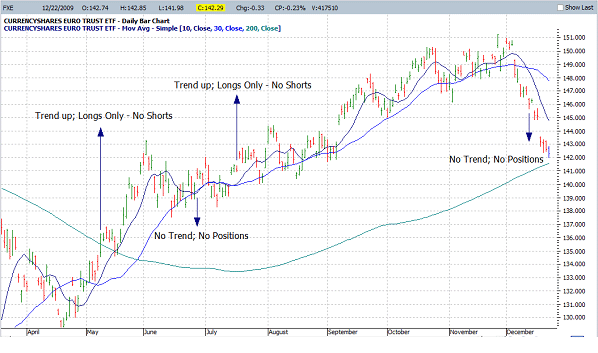

This article investigates the behavior of balanced portfolios and trend-following strategies across various market conditions, with a primary focus on understanding their performance under scenarios such as rising interest rates, high inflation, and different market cycles. Balanced portfolios, often considered the cornerstone of conservative investment strategies, aim to provide stability and growth by diversifying across a variety of asset classes. Meanwhile, trend-following strategies leverage momentum in market trends, offering a dynamic approach that adapts to changing market conditions. 

The analysis centers on assessing how these strategies react to economic factors that significantly influence financial markets. Rising interest rates might affect the cost of borrowing and investment returns, while high inflation can erode asset value and purchasing power. Additionally, market cycles, encompassing periods of expansion or contraction, affect asset performance differently based on their characteristics.



By utilizing historical market data from sources like Quantpedia, the article seeks to provide insights into how these factors have historically impacted the performance of such strategies. Quantpedia offers an extensive collection of mostly academic research backed by empirical evidence, which serves as a basis for correlating historical market cycles with investment performance. Understanding these influences is crucial for making informed decisions regarding asset allocation and risk management, ensuring that investment strategies remain robust across varying economic landscapes. This comprehensive analysis not only aids investors in understanding past patterns but also equips them with strategies for future market navigation.

## Table of Contents

## Understanding a Balanced Portfolio

A balanced portfolio is an investment strategy that divides assets among diverse asset classes, typically equities and fixed income, to achieve a blend of stability and growth potential. The AOR US [ETF](/wiki/etf-trading-strategies), or the iShares Core Growth Allocation ETF, exemplifies such a strategy by allocating its holdings across a mix of stocks and bonds. This diversified approach aims to capitalize on the growth opportunities of equities while mitigating risk through the stability offered by bonds.

In reconstructing the AOR ETF’s historical performance over a century, Quantpedia utilizes a multi-[factor](/wiki/factor-investing) regression model. This model seeks to simulate past performance by leveraging historical data on various economic factors and asset returns. The multi-factor regression approach allows for an estimation of how the AOR ETF might have performed under past market conditions, taking into account the fluctuating dynamics of equity and bond markets, as well as macroeconomic influencers like inflation and interest rates.

The performance analysis of a balanced portfolio such as the AOR US ETF across different market states reveals important insights. During varying stock market phases—bull and bear markets—the equities component predominantly drives the portfolio's returns. In bull markets, equities often generate strong capital gains, enhancing the overall performance of the portfolio. Conversely, in bear markets, the bond allocation helps cushion the impact of falling stock prices, providing a level of risk management.

Similarly, the portfolio's performance during different inflation and [interest rate](/wiki/interest-rate-trading-strategies) conditions reflects its inherent diversification. Balanced portfolios tend to show resilience in periods of high inflation, where equities may benefit from inflationary growth, while bonds could suffer due to rising interest rates. In contrast, during low inflationary phases or when interest rates are declining, the fixed income portion might outperform, offering stable returns while equity markets adapt to changing conditions.

The analysis underscores that while the influence of inflation on balanced portfolio returns might not be overwhelmingly significant, the interaction between market conditions and economic indicators like interest rates cannot be overlooked. Understanding these dynamics is crucial for investors looking to optimize portfolio performance through strategic asset allocation, taking historical contexts into consideration.

## Balanced Portfolio Performance during Market & Inflation Cycles

Balanced portfolios, by design, aim to provide steady returns by diversifying investments across asset classes. This diversification typically includes a mix of equities and fixed-income securities. A critical examination reveals that equities often play a dominant role in driving the performance of balanced portfolios across various market states.

In bull markets, characterized by rising stock prices and investor optimism, balanced portfolios benefit significantly from their equity component. Equities generally exhibit robust growth, which in turn enhances the overall portfolio returns. Conversely, during bear markets, marked by declining stock prices and widespread pessimism, the equity portion often suffers losses. However, the fixed-income component can provide a buffer, albeit its contribution is usually not enough to fully offset the losses experienced by equities.

Inflation cycles add another layer of complexity to the analysis. One might assume that high inflation would adversely affect balanced portfolios due to increased costs and potential interest rate hikes. However, empirical data suggests that inflation does not have a significant direct impact on the returns of balanced portfolios. This can be attributed to the equilibrium between asset classes: while equities may face pressure in high inflation scenarios due to rising costs, fixed-income securities—especially those that are inflation-protected—can help mitigate these effects.

When considering low inflation scenarios, balanced portfolios often perform fairly steadily. The low inflation environment is generally positive for equities, as operating costs for companies remain relatively stable, supporting corporate earnings and, thus, stock prices. Consequently, the lack of significant inflation pressure allows the equity components to continue delivering stable returns without significant intervention from fixed-income assets.

In summary, the performance of balanced portfolios is predominantly influenced by the equity component, particularly in different market cycles. While inflation can impact individual asset classes within the portfolio, its overall effect on balanced portfolio returns remains minimal, primarily due to the compensatory dynamics between equities and fixed-income securities. This dynamic balance underscores the importance of maintaining a diversified investment strategy to weather varying market conditions.

## Performance under Inflation & Rate Scenarios

A balanced portfolio’s performance under varying inflation and interest rate scenarios reveals noteworthy patterns in risk and return metrics. When analyzing balanced portfolios, such as the AOR US ETF, historical data suggests that the interaction between inflation and interest rates significantly influences investment outcomes.

A pivotal measure of portfolio performance is the Sharpe ratio, which evaluates return per unit of risk. Historical analyses show that balanced portfolios achieve their highest Sharpe ratios during periods of moderate inflation combined with stable or slightly increasing interest rates. This environment typically promotes both bond and equity performance, resulting in a favorable risk-adjusted return. Conversely, the lowest Sharpe ratios are often recorded during periods characterized by extreme inflation (either high or low) and volatile interest rates. This [volatility](/wiki/volatility-trading-strategies) increases uncertainty and results in suboptimal portfolio performance.

Volatility, another critical metric, often exhibits an inverse relationship with the Sharpe ratio. Low volatility tends to coincide with stable economic conditions, leading to more predictable and less risky returns. However, during periods of low inflation and declining interest rates, balanced portfolios sometimes experience counterintuitive drawdowns. This phenomenon can be attributed to several factors:

1. **Interest Rate Sensitivity**: Declining interest rates often signal economic slowdown concerns, adversely affecting equity markets despite the fact that bonds might perform well. Such conditions can lead to overall portfolio drawdowns.

2. **Inflation Expectations**: Low inflation may raise expectations of future deflation, diminishing growth prospects and impacting equity valuations.

3. **Market Apathy**: Investors may become apathetic during periods of low volatility, leading to a lack of momentum in markets, which in turn affects portfolio growth adversely.

The interplay between inflation and interest rates, significantly influencing balanced portfolio performance, underscores the importance of strategic asset allocation that adapts to these economic indicators. Understanding these dynamics assists investors in navigating complex economic environments more effectively.

## Market, Inflation, and Rates Combined

Balanced portfolios traditionally comprise a combination of asset classes—with equities and bonds being the most common—to reduce overall investment risk through diversification. The interplay of market cycles, inflation, and interest rates significantly impacts the performance of such portfolios. Understanding these dynamics is crucial for optimizing asset allocation. This section focuses on analyzing how these factors collectively affect the performance of balanced portfolios, especially under different combinations of bull/bear market states, inflation levels, and interest rate conditions.

During bull markets, equities typically drive portfolio growth. Historical data indicate that balanced portfolios generally perform well in these conditions, regardless of inflation and interest rate scenarios. However, the introduction of high inflation or rising interest rates can diminish returns due to increased borrowing costs and pressure on corporate profits. Conversely, in bear markets, balanced portfolios face challenges, as equities generally decline in value. However, the bond component can offer some protection, particularly if interest rates fall, thereby increasing bond prices.

High inflation coupled with falling interest rates emerges as a particularly beneficial state for balanced portfolios. In such scenarios, the reduced cost of borrowing supports corporate growth and investments, while existing fixed-income assets in the portfolio gain value as rates drop. The real value erosion caused by inflation is often offset by higher returns from equities, which may benefit from inflation through price adjustments and increased nominal revenues.

To illustrate these dynamics mathematically, consider the formula for the nominal return $R$ of a balanced portfolio:

$$
R = w_{e} \cdot r_{e} + w_{b} \cdot r_{b}
$$

where $w_{e}$ and $w_{b}$ are the weightings of equities and bonds in the portfolio, and $r_{e}$ and $r_{b}$ are the respective returns of equities and bonds. In high inflation periods with decreasing rates, $r_{b}$ tends to be higher due to increased bond prices, providing an additional boost to the portfolio return.

Quantitative analysis from historical data confirms that balanced portfolios often achieve optimal performance during phases characterized by moderated inflation and declining rates. Reduced rates usually foster a favorable borrowing environment, while moderated inflation avoids the adverse effects of sharp cost increases, creating a conducive climate for both equities and bonds to appreciate.

Understanding these complex interactions is vital for investors aiming to strategically adjust their portfolios in anticipation of market changes, thereby optimizing the risk-return profile over varying economic landscapes.

 to Trend-Following Strategies

Trend-following strategies are a sophisticated form of [algorithmic trading](/wiki/algorithmic-trading) that capitalize on market [momentum](/wiki/momentum) to achieve returns. These strategies are predicated on the idea that financial instruments which have been rising or falling consistently will continue to do so in the near future. The primary mechanism involves identifying and exploiting these trends early for potential profit maximization.

At the core of trend-following strategies is technical analysis, a methodology which employs historical price and [volume](/wiki/volume-trading-strategy) data, rather than fundamentals, to predict future market movements. Technical analysis tools aim to identify market trends through various chart patterns and technical indicators. Common indicators used include moving averages, the moving average convergence divergence (MACD), and the relative strength index (RSI). For example, a simple moving average crossover strategy might involve buying an asset when a short-term moving average crosses above a long-term moving average, signaling a potential upward trend.

Entities such as the Man Group, one of the leading alternative investment management firms, have successfully applied trend-following strategies across various market conditions. These strategies are particularly versatile as they can be employed in both rising and falling markets. In bull markets, trend-followers typically ride sustained upward price trends by holding long positions. Conversely, in bear markets, they can benefit from downward price movements by taking short positions. This adaptability to different market states allows trend-following strategies to potentially generate returns irrespective of the overall market direction.

Overall, trend-following strategies are an essential tool for traders and investment managers seeking to harness market momentum and mitigate risk by responding dynamically to market conditions. Their reliance on technical indicators and historical data analysis makes them indispensable for systematic trading programs and professional trading entities aiming for robust performance across fluctuating market cycles.

## Trend-Following Performance over Market & Inflation Cycles

Trend-following strategies are systematic approaches that capitalize on market momentum. Their performance varies significantly depending on the combination of market cycles, specifically bull or bear markets, and inflation states, whether high or low. These strategies traditionally fare well when market trends are pronounced, as trend-followers essentially seek to capture and ride these trends. 

In a detailed analysis of trend-following performance, it is observed that these strategies exhibit their highest Sharpe ratios during bull markets characterized by high inflation levels. A Sharpe ratio is a measure that indicates the average return gained above the risk-free rate per unit of volatility or total risk. The compelling performance in such environments suggests that during bull markets, upward momentum is augmented by inflationary pressures, thereby extending the duration and strength of trends that are favorable for trend-following.

Conversely, while trend-following strategies prosper during clear trending markets, they encounter challenges during phases marked by frequent market reversals. These reversals can obscure clear trends, leading to false signals and heightened losses for trend-followers. This is particularly evident in bear market conditions or environments with low inflation, where market signals tend to be more erratic and less conducive to trend identification.

Mathematically, the relationship between trend-following profitability $P$ in relation to market volatility $V_m$ and inflation $I$ can be conceptually expressed as:

$$
P \propto f(V_m, I)
$$

Where $f$ is a function that increases with high $V_m$ and $I$ typically associated with bull markets. As market volatility and inflation change, so does this function, impacting the strategies' profitability inversely during bear markets or low inflation conditions.

In conclusion, while trend-following strategies thrive in trending markets with clear directionality as in high-inflation-driven bull markets, they are particularly susceptible to downturns when market reversals are prevalent, emphasizing the necessity for adaptive models that can adjust to varying financial climates.

## Trend-Following under Inflation & Rate Scenarios

Trend-following strategies, characterized by their reliance on momentum to capitalize on market trends, encounter unique challenges under varying inflation and interest rate scenarios. These strategies historically thrive in environments with clear, sustained trends. However, low inflation and declining interest rates can disrupt the efficacy of these approaches.

**Impact of Low Inflation and Falling Rates**

In environments where inflation remains subdued and interest rates decline, trend-following strategies often face headwinds. These conditions typically do not foster the strong directional movements in asset prices that trend-followers exploit. Low inflation signals stability in price levels, reducing the volatility that trend-followers rely on to identify and ride trends. Simultaneously, falling interest rates usually reflect central banks' attempts to stimulate economic growth amidst lackluster financial markets, leading to unpredictable market behavior and frequent reversals.

From a quantitative perspective, when interest rates decrease, the borrowing costs for investing in riskier assets reduce, occasionally leading to temporary upticks in asset prices. Nonetheless, these movements can lack the persistence needed for trend-followers to achieve substantial performance. 

**Correlation with Market Reversals**

Falling rates often coincide with economic phases where growth slows, prompting central banks to cut rates in anticipation of or response to downturns. These actions can result in rapid, sentiment-driven changes in investor behavior, causing market reversals that disrupt established trends. Trend-following models, which depend on past price data to project future movements, may generate false signals during such volatility, incurring losses when positions are quickly invalidated by sharp market reversals. 

Historically, scenarios marked by rising interest rates and inflation tend to offer more fertile ground for trend-followers. During these periods, trending environments are more common as economic policies and market reactions coalesce into discernible patterns.

To adapt to these challenges, traders employing trend-following strategies might refine their algorithms to become more sensitive to market signals or incorporate additional indicators to detect the early stages of reversals. Furthermore, employing volatility measures or adjusting position sizes based on prevailing economic indicators could help mitigate adverse effects during periods of low inflation and declining rates. Effective diversification across asset classes and adopting a more dynamic model calibration approach are alternate strategies to improve resilience. 

These insights guide an understanding of how trend-followers navigate and adjust their strategies across different macroeconomic environments, ensuring resilience and adaptability in ever-evolving financial markets.

## Comprehensive Analysis of Market, Inflation, and Rates on Trend-Following

Trend-following strategies have long been recognized for their ability to navigate various market conditions by capitalizing on price momentum. However, their efficacy can significantly vary depending on the interplay of market cycles, inflation, and interest rates. This analysis aims to review the impacts of these combined scenarios on trend-following returns, highlighting periods of strong trends and volatility, and drawing from historical examples.

### Impact of Combined Market, Inflation, and Interest Rate Scenarios

Trend-following strategies typically perform well during periods characterized by clear directional movements in asset prices. Bull markets with rising interest rates usually present such strong trends, as they often indicate a growing economy with confident investor sentiment. In such environments, trend-followers can potentially exploit the upward price momentum, resulting in positive returns. 

**Mathematical Representation**: The effectiveness of trend-following can be mathematically represented through models that incorporate momentum indicators like the moving average crossover. For instance, a simple trend-following signal might be generated when a short-term moving average crosses above a long-term moving average, expressed as:

$$

\text{Signal} = 
\begin{cases} 
1, & \text{if } MA_{\text{short}} > MA_{\text{long}} \\
0, & \text{if } MA_{\text{short}} \leq MA_{\text{long}}
\end{cases} 
$$

Where $MA_{\text{short}}$ and $MA_{\text{long}}$ represent short-term and long-term moving averages, respectively.

### Historical Examples of Trend-Following Performance

Historical market data provides insights into how trend-following strategies have reacted to different economic phases. Notably, during the early 1980s, a period characterized by high interest rates to combat inflation, trend-following strategies benefited from the pronounced and sustained shifts in various asset prices. The economic policies during this time created environments of high volatility, which are generally favorable for momentum-based strategies.

Another example is the post-2008 financial crisis bull market, which was accompanied by low-interest rates but strong upward trends in equity markets. Despite the low rates, the clear trend of recovery provided profitable opportunities for trend-followers.

### Challenges in Low Volatility and Reversal Phases

Conversely, environments with low inflation and falling rates, often associated with economic stagnation or uncertain market conditions, pose challenges for trend-following strategies. These periods can lead to reversals or choppy markets, where clear price trends are absent, leading to potential losses or whipsaws for trend-followers. This is because trend-following inherently relies on sustained price movements and can suffer in range-bound markets.

**Code Representation**: Utilizing Python for backtesting trend-following strategies can involve libraries like pandas for financial data manipulation and testing analytics. Below is a simplified example of generating trend signals based on moving averages:

```python
import pandas as pd

# Assuming df contains the financial time series data with columns 'Close'
df['MA_short'] = df['Close'].rolling(window=20).mean()
df['MA_long'] = df['Close'].rolling(window=50).mean()

# Generate signal
df['Signal'] = 0
df.loc[df['MA_short'] > df['MA_long'], 'Signal'] = 1
```

### Conclusion

The analysis highlights that the intersection of market cycles, inflation, and interest rates holds considerable influence over the performance of trend-following strategies. Understanding these interactions allows investors and portfolio managers to better anticipate potential performance and risks associated with trend-following under various economic conditions. Historical data underscores the importance of adaptive strategies that consider both macroeconomic indicators and market momentum to optimize returns.

## Conclusion and Future Directions

The examination of balanced portfolios and trend-following strategies across various market states reveals critical insights for investors and financial strategists. Balanced portfolios, which primarily consist of a mix of equities, bonds, and other asset classes, have demonstrated resilience across different economic environments. Historical analyses show that these portfolios, while heavily influenced by equity performance, are less affected by inflationary pressures than might be anticipated. The performance assessments, bolstered by metrics like the Sharpe ratio, indicate that such portfolios generally perform well in bull markets and periods of falling interest rates, though some counterintuitive drawdowns were observed when rates declined and inflation remained low.

Trend-following strategies, reliant on momentum and technical analysis, offer a contrasting approach by adjusting positions based on market trends rather than fixed asset allocations. These strategies have shown robustness in trending markets, particularly during high inflation combined with bull market phases. However, they face challenges during market reversals and periods of low inflation and declining interest rates, which often disrupt established trends. The varying performance across different economic conditions underscores the necessity of a comprehensive understanding of market dynamics to apply these strategies effectively.

The ability to consider historical data and previous market cycles provides valuable hindsight for strategic asset allocation, encouraging investors to diversify and adjust their strategies in alignment with anticipated economic conditions. This understanding is paramount for optimizing performance and managing risk in portfolios.

Looking forward, upcoming articles will explore out-of-sample market cycle analyses and the application of real-time strategic adjustments. These investigations aim to enhance adaptive strategies further, offering insights for investors seeking to navigate future uncertainties effectively. The knowledge gained from both in-sample and out-of-sample analyses will be instrumental for developing more robust investment frameworks that can withstand diverse economic landscapes.

## References & Further Reading

[1]: ["The Myth of the Rational Market: A History of Risk, Reward, and Delusion on Wall Street"](https://www.amazon.com/Myth-Rational-Market-History-Delusion/dp/0060599030) by Justin Fox

[2]: Asness, C. S., Krail, R. J., & Liew, J. M. (2001). ["Do Hedge Funds Hedge?"](https://papers.ssrn.com/sol3/papers.cfm?abstract_id=252810) The Journal of Portfolio Management, 29(1), 6-19.

[3]: Fama, E. F., & French, K. R. (1993). ["Common Risk Factors in the Returns on Stocks and Bonds."](https://people.hec.edu/rosu/wp-content/uploads/sites/43/2023/09/Fama-French-Common-risk-factors-1993.pdf) Journal of Financial Economics, 33(1), 3-56.

[4]: Jegadeesh, N., & Titman, S. (1993). ["Returns to Buying Winners and Selling Losers: Implications for Stock Market Efficiency."](https://onlinelibrary.wiley.com/doi/abs/10.1111/j.1540-6261.1993.tb04702.x) Journal of Finance, 48(1), 65-91.

[5]: Moskowitz, T. J., Ooi, Y. H., & Pedersen, L. H. (2012). ["Time Series Momentum."](https://papers.ssrn.com/sol3/papers.cfm?abstract_id=2089463) Journal of Financial Economics, 104(2), 228-250.