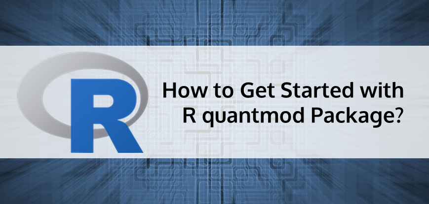

## Table of Contents

## What is the R Quantmod package and what is it used for?

The R Quantmod package is a tool used in the R programming language for quantitative financial analysis. It helps people who work with financial data to get, analyze, and show information about stocks, currencies, and other financial instruments. With Quantmod, you can easily download data from the internet, like stock prices, and then use that data to make charts and do calculations.

Quantmod is very useful for people who want to study the stock market or other financial markets. It has special functions that let you look at trends, patterns, and other important details in financial data. For example, you can use it to see how a stock's price has changed over time, or to compare different stocks. This makes it easier for people to make smart decisions about buying or selling investments.

## How do I install the Quantmod package in R?

To install the Quantmod package in R, you need to use a special command in R. Open your R program or RStudio, and type `install.packages("quantmod")` into the console. Then, press Enter. R will start downloading and installing the package from the internet. It might take a few moments, so be patient. Once it's done, you'll see a message saying the package was installed successfully.

After installing Quantmod, you need to load it into your R session to use it. To do this, type `library(quantmod)` in the console and press Enter. Now you can start using the functions and tools that come with Quantmod to work with financial data. If you ever need to use Quantmod again in a new R session, just remember to load it with the `library(quantmod)` command.

## What are the basic functions in Quantmod for retrieving financial data?

Quantmod has some basic functions that help you get financial data easily. The main function for this is `getSymbols()`. You use it by typing `getSymbols("symbol")` where "symbol" is the stock or financial instrument you want data for. For example, if you want data for Apple stock, you would type `getSymbols("AAPL")`. This function will download the data from the internet and save it in your R session. You can also tell it what kind of data you want, like daily or monthly, and where to get the data from.

Once you have the data, you can use other functions to look at it. The `chartSeries()` function is great for making charts. If you type `chartSeries(AAPL)`, it will show you a chart of Apple's stock prices. Another useful function is `addTA()`, which lets you add technical analysis to your charts. For example, `addTA(SMA(Cl(AAPL), n=50))` will add a 50-day moving average to your Apple stock chart. These functions make it easy to see and understand financial data.

## How can I use Quantmod to plot stock prices and technical indicators?

To plot stock prices using Quantmod, you first need to get the data with the `getSymbols()` function. For example, if you want to plot Apple's stock prices, you would type `getSymbols("AAPL")` in R. This will download the data and save it in your R session. Once you have the data, you can use the `chartSeries()` function to make a chart. Just type `chartSeries(AAPL)` and you'll see a chart of Apple's stock prices. It's that simple!

Adding technical indicators to your chart is also easy with Quantmod. After you've made your chart with `chartSeries()`, you can use the `addTA()` function to add things like moving averages. For example, if you want to add a 50-day moving average to your Apple stock chart, you would type `addTA(SMA(Cl(AAPL), n=50))`. This will show the moving average on your chart, helping you see trends in the stock price. With these tools, you can make detailed charts to help you understand the stock market better.

## What are some common technical indicators available in Quantmod?

Quantmod has many technical indicators that help you understand how stocks are doing. Some common ones are moving averages, which show the average price of a stock over a certain time. For example, a 50-day moving average helps you see the trend over the last 50 days. Another popular indicator is the Relative Strength Index (RSI), which tells you if a stock is overbought or oversold. If the RSI is above 70, it might mean the stock is overbought and could go down soon. If it's below 30, it might be oversold and could go up.

You can also use Bollinger Bands in Quantmod. These are lines drawn above and below the moving average of a stock's price. They help you see how much the price is moving around. If the price goes outside the bands, it might mean the stock is going to change direction soon. Another useful indicator is the Moving Average Convergence Divergence (MACD), which shows the relationship between two moving averages of a stock's price. It helps you see if the stock's trend is getting stronger or weaker. With these indicators, you can make better decisions about buying or selling stocks.

## How do I customize charts and indicators in Quantmod?

Customizing charts and indicators in Quantmod is easy and fun. You can change how your charts look by using different colors and styles. For example, if you want to make your chart's background a different color, you can use the `chartSeries()` function with the `theme` argument. Just type `chartSeries(AAPL, theme="white")` to get a white background. You can also change the colors of the lines and bars on your chart. If you want the stock price line to be red, you can use `chartSeries(AAPL, TA="addTA(Cl(AAPL), on=1, col='red')")`. This way, you can make your charts look exactly how you want them to.

Adding and customizing indicators is just as simple. You can use the `addTA()` function to put different indicators on your chart. For example, if you want to add a 50-day moving average, you can type `addTA(SMA(Cl(AAPL), n=50))`. But if you want to change the color of this moving average to blue, you can do that too. Just type `addTA(SMA(Cl(AAPL), n=50), col='blue')`. You can also add multiple indicators to the same chart. For instance, you might want to add both a 50-day and a 200-day moving average. You can do this by typing `addTA(SMA(Cl(AAPL), n=50), col='blue'); addTA(SMA(Cl(AAPL), n=200), col='green')`. This way, you can see different indicators all at once and make better decisions about your stocks.

## Can Quantmod be used for backtesting trading strategies? If so, how?

Yes, Quantmod can be used for backtesting trading strategies. Backtesting means testing a trading idea on past data to see how it would have worked. With Quantmod, you can get historical stock data using the `getSymbols()` function. Once you have the data, you can write a simple trading rule, like buying a stock when its price goes above its 50-day moving average and selling when it goes below. You can then use R's programming features to apply this rule to the historical data and see how well it would have done.

To do this, you would first load your data and calculate the indicators you need, like moving averages. Then, you can create a loop that goes through each day of the data, checking if your trading rule is met. If it is, you can simulate buying or selling the stock. At the end, you can calculate how much money you would have made or lost with this strategy. This helps you see if your trading idea is good or if it needs changes before you use it with real money.

## How does Quantmod handle different types of financial data, such as forex or futures?

Quantmod can handle different types of financial data, like forex and futures, just like it handles stock data. You use the `getSymbols()` function to get the data you need. For forex, you would type something like `getSymbols("EUR/USD")` to get the exchange rate data for the Euro against the US Dollar. For futures, you might type `getSymbols("ES")` to get data for the S&P 500 E-mini futures. Once you have the data, you can use the same functions like `chartSeries()` and `addTA()` to look at it and add indicators.

The main thing to remember is that the data sources might be different for forex and futures compared to stocks. Quantmod can connect to different places on the internet to get this data, but you might need to tell it where to look. For example, you can use the `src` argument in `getSymbols()` to specify the data source. This makes Quantmod very flexible and useful for all kinds of financial data, not just stocks.

## What are some advanced features of Quantmod for data manipulation and analysis?

Quantmod has some cool advanced features that help you work with financial data in more detailed ways. One of these is the ability to use different time frames for your data. You can change daily data into weekly or monthly data using the `to.period()` function. This is helpful if you want to see how a stock does over longer periods. Another neat feature is the `merge()` function, which lets you put data from different stocks or financial instruments together. This way, you can compare them side by side and see how they move together or differently.

Another advanced feature is the ability to do more complex technical analysis. Quantmod lets you use functions like `ROC()` to calculate the rate of change of a stock's price, which can show you how fast the price is moving. You can also use `rollapply()` to apply custom calculations to your data over a rolling window. This is great for creating your own indicators or doing more detailed analysis. With these tools, you can dig deeper into your financial data and find patterns that might not be easy to see at first glance.

## How can I integrate Quantmod with other R packages for enhanced analysis?

You can make Quantmod even better by using it with other R packages. For example, if you want to do more math on your stock data, you can use the TTR package. TTR has lots of technical indicators that you can add to your Quantmod charts. Just load both packages with `library(quantmod)` and `library(TTR)`, then you can use TTR's functions like `SMA()` or `RSI()` inside Quantmod's `addTA()` function. This way, you can see more details about how a stock is doing and make smarter choices about buying or selling.

Another cool thing is using Quantmod with the dplyr package for easier data handling. After you get your stock data with `getSymbols()`, you can use dplyr's functions like `filter()` and `mutate()` to clean and change the data. This helps you focus on the parts of the data that matter most to you. For example, you might want to look at only the data from the last year or add a new column that shows the daily return of a stock. By combining Quantmod with dplyr, you can work with your financial data in a way that's easier and more powerful.

## What are the limitations of Quantmod and how can they be overcome?

Quantmod is a great tool for looking at financial data, but it has some limits. One big limit is that it might not have all the data you need. Sometimes, the data sources it uses don't have information on every stock or financial instrument you want to study. Also, Quantmod might not be the best for very detailed or special kinds of analysis. If you need to do something very specific, you might find that Quantmod doesn't have the exact tools you need.

To get around these limits, you can use other R packages along with Quantmod. For example, if you need more data, you can use packages like `tidyquant` or `BatchGetSymbols` to get data from different places. If you need to do more detailed analysis, you can use packages like `TTR` for more technical indicators or `dplyr` for better data handling. By mixing Quantmod with these other tools, you can make your financial analysis stronger and more complete.

## How can I contribute to the development of Quantmod or report issues?

If you want to help make Quantmod better or tell the people who make it about problems you find, you can do that easily. Quantmod is on a website called GitHub, where people work together on projects. You can go to the Quantmod page on GitHub and look for a button that says "Issues." If you click on it, you can write about any problems you've found or ideas you have for making Quantmod better. The people who work on Quantmod will see what you write and might fix the problems or use your ideas.

If you know how to write code and want to help make Quantmod better, you can also do that on GitHub. You can make a copy of Quantmod, change it, and then ask the people who work on it to add your changes. This is called making a "pull request." They will look at your changes and, if they like them, add them to Quantmod. This way, everyone can help make Quantmod a better tool for looking at financial data.

## How can one download and manage data effectively?

Quantmod offers a streamlined approach to downloading and managing financial data from multiple sources, with Yahoo Finance being one of the most utilized. The central function used for acquiring historical stock price data is `getSymbols`. This function efficiently retrieves data and stores it as an `xts` time series object, which is specifically designed for handling time-indexed data in R. The `xts` structure facilitates seamless data manipulation and usage for further analysis, as users can easily subset, merge, and apply calculations across time periods.

For example, the command to download Apple's historical stock prices would be:

```r
getSymbols("AAPL", src = "yahoo")
```

This command fetches the data and creates an `xts` object named `AAPL` that contains the price and [volume](/wiki/volume-trading-strategy) information.

Efficient data analysis is achieved through several inbuilt functions within the quantmod package. Functions such as `Lag` and `Next` allow users to create lagged or leading versions of time series data, which are essential for developing [momentum](/wiki/momentum)-based strategies and evaluating predictive models. Mathematically, generating a lagged series can be represented as:

$$
X_{t-1} = X_t - 1
$$

where $X_t$ is the original time series and $X_{t-1}$ represents the lagged series.

Manipulating time series data using arithmetic and mathematical operations supports the development of complex trading strategies. For example, calculating daily returns from price data is a routine task, which can be performed using the formula:

$$
R_t = \frac{P_t - P_{t-1}}{P_{t-1}}
$$

Here, $R_t$ represents the return on day $t$, $P_t$ is the price on day $t$, and $P_{t-1}$ is the price on the previous day.

Understanding the intricacies of data retrieval and manipulation forms the foundation of robust trading strategy development. Mastering these capabilities enables traders to make informed decisions by efficiently preparing and analyzing historical financial data.

## References & Further Reading

[1]: ["Quantitative Financial Modeling Framework: An Introduction Using R and Financial Derivatives"](https://bookdown.org/compfinezbook/introcompfinr/) by Jon Danielsson

[2]: ["Quantitative Trading with R"](https://link.springer.com/book/10.1057/9781137437471) by Harry Georgakopoulos

[3]: ["R Cookbook: Proven Recipes for Data Analysis, Statistics, and Graphics"](https://www.amazon.com/Cookbook-Recipes-Analysis-Statistics-Graphics/dp/1492040681) by JD Long and Paul Teetor

[4]: ["Technical Analysis with R: A Practical Guide to Modeling Volatility in Financial Time Series"](https://faculty.washington.edu/ezivot/MFTSR.htm) by Manish Aggarwal

[5]: ["Backtesting Strategies with R"](https://timtrice.github.io/backtesting-strategies/index.html) available at Packt

[6]: ["Quantitative Financial Analytics: The Path to Investment Profits"](https://www.amazon.com/Quantitative-Financial-Analytics-Investment-Profits/dp/9813224258) by Edward E. Qian

[7]: ["Financial Risk Modelling and Portfolio Optimization with R"](https://onlinelibrary.wiley.com/doi/book/10.1002/9781119119692) by Bernhard Pfaff