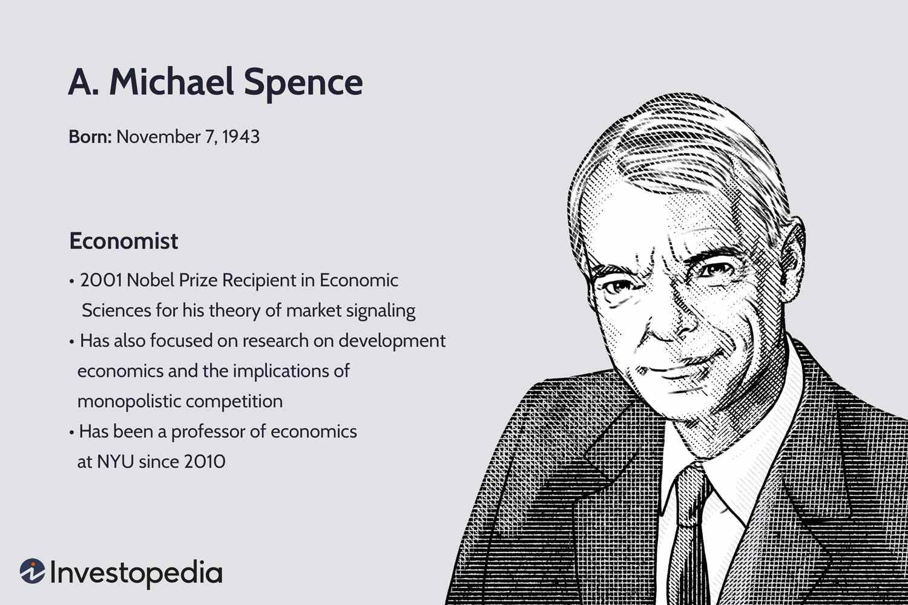

A. Michael Spence, an esteemed economist and Nobel laureate, has significantly advanced the field of economics through his pioneering work on market signaling and information asymmetry. His analytical framework provided crucial insights into how individuals and institutions communicate hidden information in markets, redefining our understanding of market behavior. This foundational theory has profoundly impacted a variety of economic domains, especially in elucidating the challenges posed by asymmetric information in determining economic outcomes. 

This article investigates into Spence's key achievements, offering an exploration of his influential theories and their application to modern economic issues. Notably, his contributions resonate well beyond traditional economics, intersecting with innovative areas like algorithmic trading. As financial markets rapidly evolve, driven by technology and data, Spence's insights offer a critical lens to assess practices such as algorithmic and high-frequency trading. These sophisticated trading strategies have sparked ongoing debates about market efficiency and stability, areas where Spence's work provides valuable perspectives.

In the course of this discussion, the article will highlight significant facets of Spence's life and scholarly career, from his academic pursuits to his pivotal role in shaping contemporary economic thought. Additionally, the examination of his views on algorithmic trading encapsulates the broader implications of his theories on the economics of information. Spence's engagement with these subjects underscores the enduring relevance of his contributions, as they continue to influence policy discussions and strategic financial decision-making.

## Table of Contents

## A. Michael Spence: Nobel Laureate and Economist

A. Michael Spence was born in 1943 in Montclair, New Jersey. He embarked on a distinguished academic journey that began at Princeton University, where he earned his Bachelor of Arts degree. Afterward, he pursued further studies and was awarded a Rhodes Scholarship to attend the University of Oxford, obtaining a Bachelor of Arts in Mathematics. Spence then advanced to Harvard University, where he earned his Ph.D. in economics. It was during his time at Harvard that he developed the theoretical framework for market signaling, a concept that would later become a cornerstone of his career.

In 2001, A. Michael Spence received the Nobel Prize in Economic Sciences, an honor he shared with economists George Akerlof and Joseph Stiglitz. This recognition was attributed to their pioneering analyses of markets characterized by asymmetric information, where one party possesses more or better information than the other. Spence’s significant contribution revolved around his theory of market signaling, which he articulated in his seminal 1973 paper "Job Market Signaling."

Spence’s signaling theory addresses the challenges inherent in markets where buyers and sellers have access to differing levels of information. Specifically, it illustrates how individuals can communicate their private information to less informed parties through signals. Within job markets, this is exemplified by job applicants who utilize educational credentials as a signal of their capabilities and potential productivity to prospective employers. The idea is that education serves as a proxy, indicating the applicant's ability to perform well in a job, even though it may not directly measure acquired skills.

The implications of Spence's research extend across various markets, including labor, finance, and insurance, offering insights into how signaling affects the dynamics of economic transactions where information asymmetry exists. His work laid the foundation for more nuanced understandings of how these informational imbalances can lead to inefficiencies and how they might be mitigated to enhance market transparency and effectiveness.

## Market Signaling and Asymmetric Information

Market signaling is a mechanism through which one party credibly communicates information to another party that lacks that information, especially within the context of job markets. Spence's seminal work on signaling has been particularly influential in demonstrating how education functions as a signal to potential employers regarding a job applicant's productivity prospects. In Spence's model, education itself may not necessarily enhance or reflect the applicant's inherent skills or abilities. Instead, it serves as a costly signal that distinguishes more capable candidates from less capable ones based on their willingness and ability to acquire educational credentials.

The model of signaling extends beyond labor markets to other sectors, including finance and insurance. In these markets, signaling helps mitigate asymmetric information challenges where one party holds more information than the other, potentially leading to adverse selection or moral hazard problems. For instance, in insurance markets, policyholders might signal their risk level through deductibles or premium payments, allowing insurers to better assess potential liabilities.

Spence's insights provide a framework for understanding the inefficiencies that arise due to asymmetric information. These inefficiencies occur because the less informed party, often making decisions with incomplete data, can result in suboptimal market outcomes. By recognizing the role of signaling, Spence's model underscores the critical need for improved transparency and communication mechanisms in reducing information gaps. This is exemplified through the signaling equilibrium, where the cost and benefit of the signal are balanced, resulting in a sorting mechanism that allows accurate information flow.

Moreover, the application of signaling extends into financial markets where information asymmetries are prevalent. Here, investors and analysts rely on company disclosures and financial reports as signals of firm performance and prospects, although these may not fully capture the company's future trajectory or value. By elucidating the intricacies of signaling, Spence's contributions have heightened awareness of the ways in which market participants can leverage signals to navigate uncertainty, ultimately leading to more informed and efficient market dynamics.

## Spence's Views on Algorithmic and High-Frequency Trading

A. Michael Spence, noted for his groundbreaking work on market signaling and information asymmetry, has been an outspoken critic of high-frequency trading ([HFT](/wiki/high-frequency-trading-strategies)). He has raised concerns about the stability of financial markets in the face of HFT's growing prevalence. These algorithms [carry](/wiki/carry-trading) out trades at remarkable speeds, often within microseconds, potentially triggering abrupt market fluctuations as witnessed during the 2010 Flash Crash. The incident, which saw the Dow Jones Industrial Average plunge and recover roughly 1,000 points within minutes, highlighted the vulnerabilities HFT can exploit, leading to severe market [volatility](/wiki/volatility-trading-strategies).

Spence argues that HFT exacerbates the consequences of information asymmetry in markets. With HFT, a select group of market participants leverages technological advancements to gain informational advantages over others. These asymmetries can create an uneven playing field wherein retail investors and even traditional institutional investors might face disadvantages, leading to questions about fairness and market integrity.

The pace of technological progress in trading platforms underscores Spence's concerns about the ethical and economic implications of [algorithmic trading](/wiki/algorithmic-trading). He has suggested that the ultra-fast execution of trades inherent to HFT strategies lacks substantive value addition and instead prioritizes speed over fundamental market functions such as price discovery and [liquidity](/wiki/liquidity-risk-premium) provision. As a result, Spence has advocated for stringent regulatory measures, possibly including outright bans on HFT, to address these issues.

Spence's stance has fueled important dialogues within the financial community and among policymakers. His views urge a reevaluation of the regulatory frameworks governing algorithmic trading to balance innovation with systemic risk management and ethical considerations. By prompting such discussions, Spence's insights challenge stakeholders to consider the broader societal impacts of technological advances in finance, thus continuing his legacy of analyzing and addressing the complexities of information asymmetry in markets.

## Connection Between Nobel Prize Insights and Algorithmic Trading

Market signaling, a concept developed by A. Michael Spence, finds intriguing applications in the domain of algorithmic trading. At the core of Spence’s theory is the idea that parties with more information can convey their private information to others through signals. This concept is crucial in algorithmic trading, where rapid decision-making is based on the dissemination of information and signals derived from market data.

Algorithmic trading exploits signals generated from complex algorithms that analyze vast datasets to execute trades at high speeds. These algorithms leverage diverse data points such as price movements, trading volumes, and market trends to assess optimal trading opportunities. The reliance on signals in algorithmic trading mirrors the signaling mechanisms outlined by Spence, emphasizing the exchange of information crucial for market strategies.

In terms of information asymmetries, algorithmic trading often results in a disparity between those with access to sophisticated technology and real-time data processing capabilities, and those without. The speed at which algorithmic traders operate can lead to a competitive edge, as they are able to capitalize on market signals much faster than human traders. This dynamic aligns with Spence's insights into asymmetric information, where the advantage gained by better-informed parties can lead to inefficiencies and disparities in market behavior.

The intersection of Spence's theories and algorithmic trading underscores the need for robust regulatory frameworks. These regulations are essential to mitigate risks associated with algorithmic trading, such as market manipulation and flash crashes, which arise from the rapid execution of trades based on imperfect or incomplete information. Ensuring market efficiency requires balancing technological advancements in trading with safeguards that protect market stability and integrity.

Spence's contributions highlight the importance of developing strategies to address potential risks associated with algorithmic trading. His insights reinforce the necessity for a regulatory environment that fosters innovation while safeguarding against the pitfalls associated with information asymmetries. By applying market signaling principles, stakeholders can better navigate the challenges posed by algorithmic trading, ensuring that financial markets operate efficiently and equitably.

## Conclusion

A. Michael Spence's theories on market signaling and asymmetric information have significantly shaped the field of economics, particularly in understanding market dynamics and the flow of information. His work elucidates how individuals and firms convey private information in markets characterized by asymmetries, helping to explain phenomena such as hiring practices and pricing strategies. These insights extend to contemporary issues surrounding algorithmic and high-frequency trading (HFT), where rapid technological advancements pose both opportunities and risks.

In today's financial markets, the ethical and practical implications of algorithmic trading continue to be a matter of vigorous debate. Spence's caution on information asymmetry aligns with concerns regarding how HFT, by leveraging speed and data processing capabilities, might lead to market disruptions or unfair competitive advantages. His contributions underscore the importance of developing regulatory frameworks that address these challenges while ensuring market efficiency and stability.

As the financial landscape evolves, integrating technological innovation with robust market integrity remains a priority. Spence's foundational theories offer a valuable framework for policymakers and financial institutions striving to balance these elements. The ongoing discussions around algorithmic trading, market transparency, and information dissemination reaffirm the enduring impact of Spence's work on economic thought and policy. His legacy continues to influence strategies aimed at fostering transparent and fair markets amidst continuous innovation.

## References & Further Reading

[1]: Spence, A. M. (1973). ["Job Market Signaling."](https://competitionandappropriation.econ.ucla.edu/wp-content/uploads/sites/95/2017/08/Spence1973.pdf) The Quarterly Journal of Economics, 87(3), 355-374.

[2]: Akerlof, G. A. (1970). ["The Market for 'Lemons': Quality Uncertainty and the Market Mechanism."](https://www.jstor.org/stable/1879431) Quarterly Journal of Economics, 84(3), 488-500.

[3]: Stiglitz, J. E. (1981). ["The Theory of ‘Screening’, Education, and the Distribution of Income."](https://www.jstor.org/stable/1804834) Oxford Economic Papers, 47, 289-320.

[4]: Harris, L. (2003). ["Trading and Exchanges: Market Microstructure for Practitioners."](https://www.amazon.com/Trading-Exchanges-Market-Microstructure-Practitioners/dp/0195144708) Oxford University Press.

[5]: MacKenzie, D. (2019). ["Trading at the Speed of Light: How Ultrafast Algorithms Are Transforming Financial Markets."](https://pup-assets.imgix.net/onix/images/9780691217796/9780691217789.pdf) Princeton University Press.