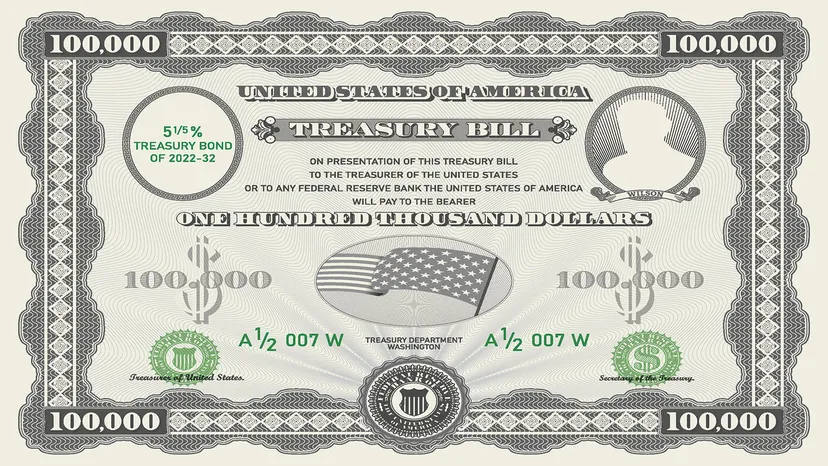

## Table of Contents

## What is an A+/A1 credit rating?

An A+/A1 credit rating is a high rating given to a company or government by credit rating agencies. It means they are considered to have a strong ability to pay back their debts. Agencies like Standard & Poor's use A+ while Moody's uses A1, but both mean the same thing. This rating is just below the highest ratings like AAA or Aaa.

Having an A+/A1 rating is important because it shows investors and lenders that the company or government is a safe bet. It can help them borrow money at lower interest rates because they are seen as less risky. This rating is trusted by many people in the financial world to make decisions about where to put their money.

## Who assigns A+/A1 credit ratings?

Credit ratings like A+/A1 are given by special companies called credit rating agencies. The two main agencies that use these ratings are Standard & Poor's and Moody's. Standard & Poor's uses the A+ rating, while Moody's uses A1. These agencies look at how well a company or government can pay back its debts and then give them a rating.

These ratings are important because they help people decide if it's safe to lend money or invest in a company or government. If a company has an A+/A1 rating, it means they are seen as very likely to pay back their debts. This can make it easier for them to borrow money at lower interest rates because they are considered less risky.

## What does an A+/A1 rating signify about a borrower's creditworthiness?

An A+/A1 rating means that a borrower, like a company or a government, is seen as very good at paying back their debts. This rating is given by credit rating agencies like Standard & Poor's and Moody's. Standard & Poor's uses A+ and Moody's uses A1, but they both mean the same thing. This rating is just a little bit below the highest ratings like AAA or Aaa, which shows that the borrower is very trustworthy when it comes to paying back what they owe.

Having an A+/A1 rating is important because it tells lenders and investors that the borrower is a safe choice. When a borrower has this rating, it's easier for them to borrow money. They can often get loans with lower interest rates because they are seen as less risky. This rating helps people in the financial world decide where to put their money, making it a key factor in financial decisions.

## How does an A+/A1 rating compare to other credit ratings?

An A+/A1 rating is a high credit rating given by agencies like Standard & Poor's and Moody's. It's just below the top ratings like AAA or Aaa, which means it's a strong sign that a company or government can pay back its debts. Ratings go from AAA (or Aaa) at the top, down to D at the bottom, which means the borrower is in big trouble and might not pay back what they owe. So, an A+/A1 rating is good but not the very best.

Compared to other ratings, an A+/A1 rating is better than ratings like BBB or Baa, which are still okay but show more risk. If a borrower has a rating lower than BBB or Baa, like BB or Ba, it's called "junk" and is seen as much riskier. So, an A+/A1 rating is in the middle of the pack - not the best, but much better than the lower ratings. This makes it easier for a borrower with an A+/A1 rating to get loans at good interest rates because they are seen as less risky.

## Can you provide examples of companies or entities with an A+/A1 rating?

Some companies and entities that have an A+/A1 rating include big banks like Bank of America and insurance companies like Allstate. These companies are seen as very good at paying back their debts. Bank of America, for example, is a huge bank that lots of people use, and its A+/A1 rating shows that it's a safe place for people to put their money. Allstate is an insurance company that helps people when they have accidents or other problems, and its high rating means it's reliable and can pay out claims without trouble.

Another example is the government of Canada, which also has an A+/A1 rating. This means that Canada is seen as very good at paying back its debts. When a country has a high rating like this, it can borrow money at lower interest rates because people trust that Canada will pay back what it owes. This rating helps Canada manage its money well and shows other countries and investors that it's a safe place to do business.

## What are the criteria used to determine an A+/A1 rating?

Credit rating agencies like Standard & Poor's and Moody's look at many things to decide if a company or government should get an A+/A1 rating. They check how much money the company or government makes, how much debt they have, and if they can pay their bills on time. They also look at the overall economy and how it might affect the borrower. If the company or government is doing well and doesn't have too much debt, it's more likely to get a high rating like A+/A1.

Another important thing the agencies consider is the history of the borrower. If a company or government has always paid back its debts on time, that's a good sign. They also think about what might happen in the future. If the company or government has plans to grow and make more money, that can help them get a better rating. All these factors together help the agencies decide if a borrower deserves an A+/A1 rating, which shows they are very good at paying back what they owe.

## How stable is an A+/A1 rating over time?

An A+/A1 rating is usually pretty stable, but it can change over time. If a company or government keeps doing well and pays its debts on time, the rating might stay the same or even get better. But if something bad happens, like the economy gets worse or the company starts losing money, the rating might go down. Credit rating agencies like Standard & Poor's and Moody's always watch how things are going and might change the rating if they see big changes.

Sometimes, a company or government might do something to make its rating more stable. For example, if they pay off some of their debt or start making more money, that can help keep the rating high. But even with these efforts, big events like a global financial crisis can still affect the rating. So, while an A+/A1 rating is a strong sign of being good at paying back debts, it's not set in stone and can change based on what happens in the future.

## What impact does an A+/A1 rating have on borrowing costs?

An A+/A1 rating helps a company or government borrow money at lower interest rates. When lenders see this rating, they know the borrower is very good at paying back what they owe. This makes the borrower look less risky, so lenders are happy to give them money without charging as much interest. It's like getting a good deal on a loan because everyone trusts that the money will be paid back.

For example, if a company with an A+/A1 rating wants to borrow money to grow its business, it can do so more cheaply than a company with a lower rating. This can save the company a lot of money over time, making it easier to invest in new projects or pay off other debts. So, having an A+/A1 rating can really help a company or government manage its money better and grow.

## How do changes in economic conditions affect A+/A1 ratings?

Changes in economic conditions can have a big impact on A+/A1 ratings. If the economy is doing well, companies and governments might make more money and pay their debts easily. This can help keep their A+/A1 rating strong or even make it better. But if the economy gets worse, like during a recession, companies might lose money and struggle to pay back what they owe. This can make credit rating agencies worried, and they might lower the rating to show that the borrower is now riskier.

Even small changes in the economy can affect A+/A1 ratings. For example, if interest rates go up, it can cost more for companies to borrow money. This might make it harder for them to pay back their debts, which could lead to a lower rating. On the other hand, if the economy is stable and growing, it can help companies and governments keep their high ratings. Credit rating agencies always watch the economy closely to decide if a borrower's rating should change.

## What are the implications of an A+/A1 rating for investors?

An A+/A1 rating means that a company or government is very good at paying back its debts. This is great news for investors because it shows that their money is safe. When a company or government has this rating, investors feel more confident about lending them money or buying their bonds. They know that the chances of getting their money back are high, which makes it a less risky investment.

Because of this high rating, investors can often get a good return without taking on too much risk. Companies and governments with an A+/A1 rating can borrow money at lower interest rates, which means they don't have to pay as much to investors. But even with these lower rates, investors are happy because the investment is seen as safe. So, an A+/A1 rating helps investors make smart choices about where to put their money, balancing safety and return.

## How do issuers maintain or improve their A+/A1 rating?

To keep or get a better A+/A1 rating, companies and governments need to make sure they are doing well financially. They should try to make more money than they spend and pay their debts on time. If they can do this, it shows credit rating agencies that they are reliable and good at managing their money. Sometimes, they might need to cut back on spending or find new ways to make money. This can help them stay strong even if the economy gets tough.

Another way to maintain or improve an A+/A1 rating is by managing their debt carefully. If a company or government can pay off some of its debt or borrow money at lower interest rates, it makes them look less risky. They should also keep an eye on what's happening in the economy and be ready to make changes if needed. By showing that they can handle their money well no matter what, they can keep their high rating or even make it better over time.

## What are the historical trends in A+/A1 ratings across different sectors?

Historically, A+/A1 ratings have shown different trends across various sectors. In the financial sector, like banks and insurance companies, A+/A1 ratings have been common because these companies often have strong financial positions and are good at managing their money. However, during big economic downturns like the 2008 financial crisis, some of these companies saw their ratings drop because they were hit hard by the economic problems. Over time, as the economy got better, many of these companies worked hard to get their ratings back up to A+/A1 by managing their debts and improving their financial health.

In the government sector, A+/A1 ratings have also been influenced by economic conditions. Countries with stable economies and good financial management, like Canada, have often kept their A+/A1 ratings even during tough times. But other countries might see their ratings go down if they have a lot of debt or if their economy is struggling. Governments can work to keep or improve their ratings by making smart financial decisions, like cutting spending or finding new ways to make money. Overall, A+/A1 ratings across different sectors show how well companies and governments can handle their money in good times and bad.

## References & Further Reading

[1]: [S&P Global Ratings Understanding Credit Ratings](https://www.spglobal.com/ratings/en/about/understanding-credit-ratings)

[2]: [Moody's Ratings Understanding Ratings](https://ratings.moodys.io/ratings)

[3]: [Investopedia A+/A1 Explanation](https://www.investopedia.com/terms/a/a-a1.asp)

[4]: [Cbonds Coca-Cola Rating](https://cbonds.com/news/2550191/)

[5]: [Cbonds Toyota Rating](https://cbonds.com/news/2226154/)

[6]: [Cbonds Merck Rating](https://cbonds.com/news/2340716/)

[7]: [S&P Credit Rating Process](https://corporatefinanceinstitute.com/resources/fixed-income/sp-standard-poors/)

[8]: [Moody's Rating Process](https://ratings.moodys.io/ratings)