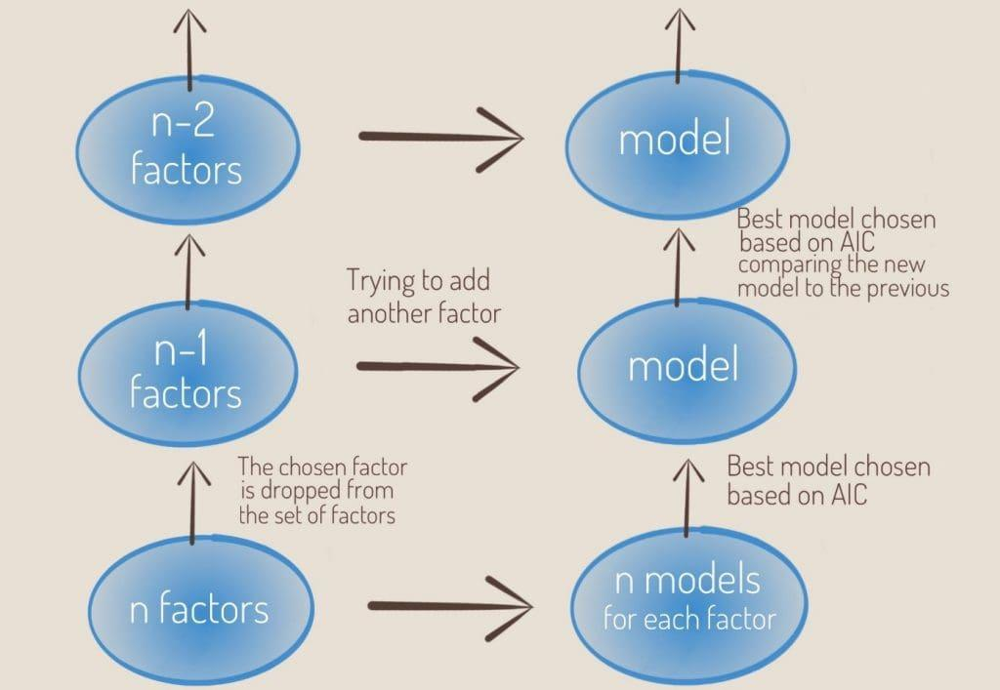

## Table of Contents

## What is multi-factor regression analysis?

Multi-factor regression analysis is a statistical method used to understand how several different factors, or variables, affect a particular outcome. Imagine you want to predict how well students will do in a test. You might think that the amount of time they study, their attendance, and their previous grades could all play a role. Multi-factor regression helps you figure out how important each of these factors is in predicting the test scores.

In this method, you collect data on all the factors you're interested in, along with the outcome you want to predict. Then, you use a mathematical formula to see how changes in each factor relate to changes in the outcome. This helps you understand which factors have the biggest impact and how they work together. For example, you might find that studying time is the most important factor for test scores, but attendance also matters a bit. Multi-factor regression gives you a clearer picture of how multiple factors influence the result you're studying.

## Why is multi-factor regression analysis important in statistical modeling?

Multi-factor regression analysis is important in statistical modeling because it helps us understand how different things affect an outcome at the same time. Imagine you're trying to figure out what makes a plant grow well. You might think that sunlight, water, and soil type all matter. Multi-factor regression lets you see how each of these things impacts plant growth, not just one at a time, but all together. This is really useful because in real life, things usually don't happen in isolation. Everything is connected, and this method helps us see those connections clearly.

Another reason multi-[factor](/wiki/factor-investing) regression is important is that it helps us make better predictions. When you know how different factors work together, you can predict outcomes more accurately. For example, if you're a business trying to predict sales, you might look at factors like advertising spend, the time of year, and the economy. By using multi-factor regression, you can see how these factors combine to affect sales, which helps you plan better and make smarter decisions. This makes it a powerful tool for anyone who needs to understand and predict complex situations.

## What are the basic assumptions of multi-factor regression analysis?

Multi-factor regression analysis relies on a few key assumptions to make sure the results are reliable. One important assumption is that the relationship between the factors and the outcome is linear. This means that if you draw a line to show how a factor affects the outcome, that line should be straight, not curved. Another assumption is that the errors, or the differences between the predicted and actual outcomes, are normally distributed. This means that if you made a graph of these errors, it would look like a bell curve, with most errors being small and fewer errors being large.

Another assumption is that the errors are independent of each other. This means that the error for one observation doesn't affect the error for another observation. For example, if you're looking at test scores for different students, the error in predicting one student's score shouldn't influence the error in predicting another student's score. Lastly, the variance of the errors should be constant across all levels of the factors. This is called homoscedasticity. It means that the spread of the errors should be the same no matter what values the factors take. If these assumptions hold true, multi-factor regression can give you a good understanding of how different factors affect the outcome you're studying.

## How do you select the right variables for a multi-factor regression model?

Choosing the right variables for a multi-factor regression model is important because it helps make your predictions more accurate. You start by thinking about what might affect the outcome you're studying. For example, if you're trying to predict house prices, you might consider factors like the size of the house, the number of bedrooms, and the location. It's a good idea to talk to experts or look at past research to see what factors others have found important. You can also use your own knowledge and common sense to come up with a list of possible variables.

Once you have a list of potential variables, you need to check if they really do affect the outcome. You can do this by looking at the data and seeing if there's a clear relationship between each variable and the outcome. Sometimes, you might find that some variables are closely related to each other, which is called multicollinearity. If this happens, you might need to choose only one of these related variables to include in your model. It's also a good idea to start with a simple model and then add more variables one at a time, checking if each new variable improves your predictions. This way, you can build a model that's both accurate and easy to understand.

## What are common methods for estimating parameters in multi-factor regression?

One common method for estimating parameters in multi-factor regression is called the Ordinary Least Squares (OLS) method. This method works by finding the line that best fits the data, making the total distance between the actual data points and the line as small as possible. Imagine you're trying to draw a line through a bunch of points on a graph. OLS helps you find the line that's closest to all the points, which means it's the best guess for how the factors affect the outcome. This method is popular because it's easy to understand and use, and it often gives good results.

Another method is called Maximum Likelihood Estimation (MLE). This method looks at how likely it is that the data came from a certain model. It tries to find the parameters that make the data most likely to happen. Think of it like trying to guess the rules of a game by watching people play. MLE helps you figure out the rules, or parameters, that make the game, or the data, most likely to happen the way it did. This method can be more complicated than OLS, but it's very useful, especially when the data doesn't fit a simple straight line.

Both OLS and MLE are important tools for estimating parameters in multi-factor regression. They help you understand how different factors affect the outcome you're studying, and they can be used in different situations depending on what kind of data you have and what you're trying to learn.

## How can multicollinearity affect multi-factor regression analysis, and how can it be addressed?

Multicollinearity happens when two or more factors in your multi-factor regression model are closely related to each other. This can cause problems because it makes it hard to figure out how each factor affects the outcome on its own. Imagine you're trying to predict how well a student will do in a test, and you're looking at both the time they spend studying and the number of practice tests they take. If these two factors are closely related, it's tough to tell if it's the studying or the practice tests that are more important for the test scores. This can make your model less accurate and harder to understand.

To deal with multicollinearity, you can start by checking if any of your factors are too closely related. You can do this by looking at something called the correlation matrix, which shows how much each factor is related to the others. If you find that some factors are too similar, you might decide to keep only one of them in your model. Another way to handle multicollinearity is to use a technique called Principal Component Analysis (PCA), which combines related factors into new ones that aren't as closely related. This can help make your model more reliable and easier to interpret.

## What are the differences between fixed effects and random effects models in multi-factor regression?

Fixed effects and random effects models are two ways to handle data where you have groups, like different schools or cities, in your multi-factor regression. In a fixed effects model, you focus on the specific groups you have in your data. You want to see how the factors affect the outcome within these groups, and you assume that these groups are the only ones you care about. For example, if you're studying test scores in different schools, a fixed effects model would help you understand how factors like class size or teacher experience affect scores in those specific schools.

On the other hand, a random effects model assumes that the groups you have in your data are just a sample of all possible groups. You're interested in making predictions for other groups that you haven't studied yet. Using the same example of schools, a random effects model would help you understand how factors like class size or teacher experience might affect test scores in any school, not just the ones in your data. This makes random effects models useful when you want to generalize your findings to a larger population.

## How do you interpret the coefficients in a multi-factor regression model?

In a multi-factor regression model, the coefficients tell you how each factor affects the outcome you're studying. Imagine you're looking at how studying time and sleep affect test scores. The coefficient for studying time shows how much the test score goes up for every extra hour of studying, while holding sleep constant. If the coefficient is 2, it means that for every extra hour of studying, the test score goes up by 2 points, assuming sleep doesn't change. The same goes for sleep: if its coefficient is 1, it means that for every extra hour of sleep, the test score goes up by 1 point, assuming studying time doesn't change.

It's important to remember that these coefficients show the effect of each factor while keeping all other factors the same. This helps you understand the unique impact of each factor on the outcome. If a coefficient is positive, it means that as the factor increases, the outcome also increases. If it's negative, it means that as the factor increases, the outcome decreases. By looking at these coefficients, you can see which factors are most important for predicting the outcome and how they work together to affect it.

## What are some advanced techniques for improving the robustness of multi-factor regression models?

One advanced technique for improving the robustness of multi-factor regression models is regularization. This method helps prevent the model from fitting too closely to the data you have, which can make it less accurate when you use it to predict new data. There are two common types of regularization: Lasso and Ridge. Lasso regularization can make some coefficients zero, which means it can remove factors that aren't very important from your model. Ridge regularization, on the other hand, shrinks all the coefficients a little bit, which helps keep the model simple and more reliable. By using regularization, you can make your model work better with new data and be more trustworthy.

Another technique is cross-validation, which helps you check how well your model will work with new data. You do this by splitting your data into different parts, using some parts to build the model and the other parts to test it. You repeat this process many times with different splits of the data. This way, you can see how well your model predicts outcomes on data it hasn't seen before. Cross-validation helps you make sure your model isn't just good at fitting the data you have, but also good at predicting new data. This makes your model more robust and reliable.

## How can you validate the results of a multi-factor regression analysis?

One way to validate the results of a multi-factor regression analysis is by using a technique called cross-validation. Imagine you have a big pile of data. You split this pile into smaller parts, use some parts to build your model, and then use the other parts to test it. You do this many times, each time using different parts of the data for building and testing. This helps you see if your model can predict well on new data it hasn't seen before. If it does, you can feel more confident that your model is good and reliable.

Another way to check your results is by looking at the residuals, which are the differences between the actual outcomes and what your model predicts. You want these residuals to be spread out evenly and not follow any patterns. If they do, it might mean your model isn't capturing something important. You can also use statistical tests to see if your model fits the data well. These tests can tell you if the factors you've chosen really do affect the outcome in a meaningful way. By using these methods, you can make sure your multi-factor regression analysis is giving you trustworthy results.

## What are the limitations of multi-factor regression analysis in complex data scenarios?

Multi-factor regression analysis can be tricky when you're dealing with really complex data. One big problem is that it assumes the relationship between the factors and the outcome is a straight line. But in real life, things can be more complicated. Sometimes, the relationship might be curved or change in ways that a straight line can't show. If you try to use multi-factor regression in these cases, your predictions might not be very accurate. Another issue is that it can be hard to include all the important factors. If you miss some key factors or if some factors are hard to measure, your model might not work well.

Another limitation is something called multicollinearity, which happens when some of your factors are too closely related to each other. This can make it hard to figure out how each factor affects the outcome on its own. It can also make your model less reliable. Plus, multi-factor regression assumes that the errors, or the differences between what you predict and what actually happens, are spread out evenly. If they're not, your model might not be as good at predicting new data. So, while multi-factor regression is a powerful tool, it's important to be aware of these limitations when you're working with complex data.

## How can machine learning techniques be integrated with multi-factor regression for enhanced predictive modeling?

Machine learning techniques can be integrated with multi-factor regression to make predictions even better. One way to do this is by using something called ensemble methods. Imagine you have a bunch of different models, like multi-factor regression, decision trees, and neural networks. Ensemble methods combine the predictions from all these models to come up with a final prediction that's often more accurate than any single model. This is like getting advice from a group of experts instead of just one. By using ensemble methods, you can take advantage of the strengths of different models and make your predictions more reliable.

Another way to enhance multi-factor regression with [machine learning](/wiki/machine-learning) is by using techniques like feature selection and dimensionality reduction. These methods help you pick the most important factors to include in your model. For example, if you're trying to predict house prices, you might have a lot of factors like the size of the house, the number of bedrooms, and the location. Feature selection can help you figure out which of these factors are most important for predicting the price. Dimensionality reduction can also help by combining related factors into new ones that are easier to work with. By using these machine learning techniques, you can make your multi-factor regression model simpler and more accurate.

## What is Multi-Factor Regression Analysis and how can it be understood?

Multi-factor regression analysis is a sophisticated analytical tool employed to assess the effects of multiple factors on the returns of a trading portfolio. This approach goes beyond simple one-variable analyses by incorporating numerous indicators, thereby providing a nuanced understanding of market dynamics and helping traders design optimized trading strategies.

### Uncovering Relationships Between Assets and External Factors

Practitioners of multi-factor regression use this technique to unravel complex relationships between various assets and external economic indicators. For instance, equities might influence bond prices through [interest rate](/wiki/interest-rate-trading-strategies) expectations and perceived economic growth. Similarly, fluctuations in commodity prices can significantly impact equity markets, particularly for sectors heavily reliant on raw materials. Understanding these interconnections is crucial as they can indicate potential leverage points or risks within a portfolio.

### Importance of Cross-Asset Relationships

Cross-asset relationships play a significant role in multi-factor analysis. The interactions between different asset classes, such as equities, bonds, and commodities, are pivotal for constructing a diversified portfolio. For example, when equities perform well, bond markets might experience declines due to shifting capital flows and changing risk assessments. Commodities, on the other hand, could show varied correlations with equities depending on economic conditions or geopolitical events. Recognizing these nuanced relationships aids in mitigating risks and optimizing asset allocation strategies across a diversified portfolio spectrum.

### Enhancing Depth of Analysis with Databases

The depth of multi-factor analysis is further enhanced by utilizing comprehensive databases containing hundreds of potential factors. These databases enable the inclusion of diverse variables such as macroeconomic indicators, sector-specific data, and technical signals, among others. By incorporating such an expansive range of factors, analysts can achieve a more detailed and robust understanding of market trends and asset behaviors.

The model generally takes the form:

$$
R_i = \alpha_i + \beta_1 F_1 + \beta_2 F_2 + \cdots + \beta_n F_n + \epsilon_i
$$

Where $R_i$ represents the return on the asset, $\alpha_i$ is the intercept, $\beta_n$ coefficients represent the sensitivity to each factor $F_n$, and $\epsilon_i$ captures the error term.

### Practical Implementation

For those coding this methodology in Python, libraries such as StatsModels can be employed to conduct multi-factor regression analysis. The following is a basic example code snippet that fits a multi-factor regression model using hypothetical data:

```python
import statsmodels.api as sm
import pandas as pd

# Loading hypothetical data
data = pd.read_csv('data.csv')
X = data[['Factor1', 'Factor2', 'Factor3']]
y = data['AssetReturn']

# Adding a constant (intercept) to the model
X = sm.add_constant(X)

# Conducting the multi-factor regression
model = sm.OLS(y, X).fit()

# Viewing the summary of the regression results
print(model.summary())
```

In summary, multi-factor regression analysis provides traders and analysts with a sophisticated tool for understanding the multitude of factors affecting asset returns, enabling more informed decision-making and robust strategy development in [algorithmic trading](/wiki/algorithmic-trading).

## What is Quantpedia’s Approach to Multi-Factor Analysis?

Quantpedia has established a distinctive approach to multi-factor analysis, setting it apart by circumventing the conventional assumptions associated with traditional statistical tests. One of the cornerstone methodologies employed by Quantpedia is the use of non-parametric [statistics](/wiki/bayesian-statistics), such as the Theil-Sen estimator. This estimator is particularly advantageous for robust analysis as it does not assume a normal distribution of residuals, making it less sensitive to outliers than ordinary least squares regression. The Theil-Sen estimator calculates the median slope among all lines through pairs of two-dimensional sample points, thus providing a more reliable central tendency measure in data analysis.

In addition to employing robust statistics, Quantpedia incorporates Akaike’s Information Criterion (AIC) for model selection. AIC is a critical tool in the identification of a set of models that best describes the characteristics of a given dataset. By evaluating models based on their goodness-of-fit and the complexity of the model (penalizing excessive parameters), AIC aids practitioners in selecting the model that balances precision and simplicity. The formula for calculating AIC is given by:

$$
\text{AIC} = 2k - 2\ln(\hat{L})
$$

where $k$ is the number of parameters in the model, and $\ln(\hat{L})$ is the log-likelihood of the model.

Furthermore, Quantpedia's methodology involves the use of stepwise regression with forward selection. This technique progressively builds the regression model by adding one variable at a time. Each added variable is assessed by its statistical significance, continuing only if it contributes meaningfully to the model's explanatory power. This incremental approach helps avoid overfitting, maintaining the model's predictive power and interpretative simplicity.

By integrating these advanced statistical techniques, Quantpedia enhances the accuracy and simplicity of factor analysis, providing traders and analysts with tools that offer insightful and actionable strategies in algorithmic trading.

## References & Further Reading

[1]: Fama, E. F., & French, K. R. (1993). ["Common risk factors in the returns on stocks and bonds."](https://people.hec.edu/rosu/wp-content/uploads/sites/43/2023/09/Fama-French-Common-risk-factors-1993.pdf) Journal of Financial Economics, 33(1), 3-56.

[2]: Black, F., Jensen, M. C., & Scholes, M. (1972). ["The Capital Asset Pricing Model: Some Empirical Tests."](https://papers.ssrn.com/sol3/papers.cfm?abstract_id=908569) Studies in the Theory of Capital Markets.

[3]: Cochrane, J. H. (2009). ["Asset Pricing (Revised Edition)."](https://www.johnhcochrane.com/research-all/asset-pricing) Princeton University Press.

[4]: Fabozzi, F. J., Focardi, S. M., & Kolm, P. N. (2010). ["Quantitative Equity Investing: Techniques and Strategies."](https://www.semanticscholar.org/paper/Quantitative-Equity-Investing%3A-Techniques-and-Fabozzi-Focardi/1c49a2a53919f7e65cb96f16691b8ff726fd3cd7) John Wiley & Sons.

[5]: Tsay, R. S. (2010). ["Analysis of Financial Time Series."](https://onlinelibrary.wiley.com/doi/book/10.1002/9780470644560) John Wiley & Sons.

[6]: Grinold, R. C., & Kahn, R. N. (2000). ["Active Portfolio Management: A Quantitative Approach for Producing Superior Returns and Controlling Risk."](https://www.amazon.com/Active-Portfolio-Management-Quantitative-Controlling/dp/0070248826) McGraw-Hill.