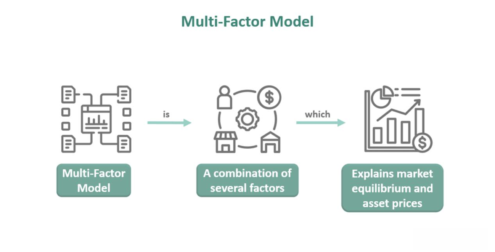

In algorithmic trading, the use of multi-factor analysis is essential for constructing effective and resilient trading strategies. As market conditions grow increasingly complex, single-factor approaches often reveal significant limitations, making multi-factor analysis a more comprehensive tool. This methodology assists traders by accounting for the multitude of variables influencing asset prices, thereby aiding in the management of diversified portfolios.

Traders are frequently challenged by the intricate nature of algorithmic trading, where the interplay of multiple variables can significantly impact strategy outcomes. In diversifying portfolios, this complexity becomes more pronounced as traders attempt to balance risk and return across different asset types. Multi-factor analysis provides the analytical framework to address these intricacies, enabling a better understanding of the variables at play.



Traditionally, asset pricing models like the Capital Asset Pricing Model (CAPM) and the Fama French Three-Factor Model have been employed to predict asset returns. CAPM, which uses the formula:

$$
E(R_i) = R_f + \beta_i (E(R_m) - R_f)
$$

where $E(R_i)$ is the expected return of the asset, $R_f$ is the risk-free rate, $\beta_i$ is the asset's beta, and $E(R_m)$ is the expected market return, provides a basic framework for understanding the relationship between risk and return. However, its simplicity often leads to inaccuracies in scenarios involving multiple complex factors.

Similarly, the Fama French model extends CAPM by including size and value factors, but even then, it may not encapsulate the entire spectrum of market influences, particularly in diverse and volatile markets.

Through multi-[factor](/wiki/factor-investing) regression analysis, traders can apply a more robust approach to dissect how various elements influence trading portfolios. This involves examining the statistical relationships between an asset's returns and multiple potential influencing factors. Such analysis not only accommodates the dynamic nature of financial markets but also helps in optimizing trading strategies by incorporating a broad range of market data.

By setting the stage for multi-factor regression analysis, this article aims to elucidate the benefits and challenges of this approach, addressing the limitations encountered with conventional models. It seeks to provide insights that will help traders develop more nuanced strategies capable of navigating the complexities of the financial markets.

## Table of Contents

## Understanding Multi-Factor Regression Analysis

Multi-factor regression analysis is a sophisticated analytical tool employed to assess the effects of multiple factors on the returns of a trading portfolio. This approach goes beyond simple one-variable analyses by incorporating numerous indicators, thereby providing a nuanced understanding of market dynamics and helping traders design optimized trading strategies.

### Uncovering Relationships Between Assets and External Factors

Practitioners of multi-factor regression use this technique to unravel complex relationships between various assets and external economic indicators. For instance, equities might influence bond prices through [interest rate](/wiki/interest-rate-trading-strategies) expectations and perceived economic growth. Similarly, fluctuations in commodity prices can significantly impact equity markets, particularly for sectors heavily reliant on raw materials. Understanding these interconnections is crucial as they can indicate potential leverage points or risks within a portfolio.

### Importance of Cross-Asset Relationships

Cross-asset relationships play a significant role in multi-factor analysis. The interactions between different asset classes, such as equities, bonds, and commodities, are pivotal for constructing a diversified portfolio. For example, when equities perform well, bond markets might experience declines due to shifting capital flows and changing risk assessments. Commodities, on the other hand, could show varied correlations with equities depending on economic conditions or geopolitical events. Recognizing these nuanced relationships aids in mitigating risks and optimizing asset allocation strategies across a diversified portfolio spectrum.

### Enhancing Depth of Analysis with Databases

The depth of multi-factor analysis is further enhanced by utilizing comprehensive databases containing hundreds of potential factors. These databases enable the inclusion of diverse variables such as macroeconomic indicators, sector-specific data, and technical signals, among others. By incorporating such an expansive range of factors, analysts can achieve a more detailed and robust understanding of market trends and asset behaviors.

The model generally takes the form:

$$
R_i = \alpha_i + \beta_1 F_1 + \beta_2 F_2 + \cdots + \beta_n F_n + \epsilon_i
$$

Where $R_i$ represents the return on the asset, $\alpha_i$ is the intercept, $\beta_n$ coefficients represent the sensitivity to each factor $F_n$, and $\epsilon_i$ captures the error term.

### Practical Implementation

For those coding this methodology in Python, libraries such as StatsModels can be employed to conduct multi-factor regression analysis. The following is a basic example code snippet that fits a multi-factor regression model using hypothetical data:

```python
import statsmodels.api as sm
import pandas as pd

# Loading hypothetical data
data = pd.read_csv('data.csv')
X = data[['Factor1', 'Factor2', 'Factor3']]
y = data['AssetReturn']

# Adding a constant (intercept) to the model
X = sm.add_constant(X)

# Conducting the multi-factor regression
model = sm.OLS(y, X).fit()

# Viewing the summary of the regression results
print(model.summary())
```

In summary, multi-factor regression analysis provides traders and analysts with a sophisticated tool for understanding the multitude of factors affecting asset returns, enabling more informed decision-making and robust strategy development in [algorithmic trading](/wiki/algorithmic-trading).

## Challenges in Multi-Factor Analysis

Multi-factor analysis in algorithmic trading presents several challenges, chief among them being model overfitting. Overfitting occurs when a model becomes too complex, capturing noise rather than the underlying signal. This is particularly problematic when the dataset contains a large number of variables, as the model may appear to perform well on historical data but fails to generalize to new data. The risk of overfitting can be mitigated by employing techniques such as cross-validation, regularization methods like Lasso or Ridge regression, and by maintaining a parsimonious approach to model selection.

Traditional regression models often face limitations that require robust strategy formulation. These models typically assume linear relationships and normal distribution of errors, which may not be the case in real-world financial markets. Additionally, these models struggle with multicollinearity, where independent variables are highly correlated. This can inflate standard errors and result in unreliable coefficient estimates. To address these limitations, more advanced models, such as Generalized Additive Models (GAM) or [machine learning](/wiki/machine-learning) techniques, can be employed to capture non-linear relationships and interactions among variables.

Determining which factors to include or omit is another critical challenge in multi-factor analysis. Factor selection is crucial because including irrelevant factors can introduce noise and increase computational complexity, while omitting relevant ones can lead to biased estimates. Various statistical criteria, such as the Akaike Information Criterion (AIC) or Bayesian Information Criterion (BIC), are commonly used to balance model complexity and goodness of fit. These criteria help in model selection by penalizing models with excessive parameters.

Understanding asset interactions and dependencies is fundamental for effective portfolio management. In financial markets, assets often exhibit complex relationships, driven by macroeconomic variables, market sentiment, or sector-specific news. Capturing these dependencies requires a thorough comprehension of the underlying economic mechanisms and the use of sophisticated modeling techniques. For example, Vector Autoregression (VAR) models or copula functions can be utilized to model the joint distribution of asset returns and capture their temporal dependencies.

In summary, multi-factor analysis necessitates a careful approach to avoid common pitfalls associated with model overfitting, factor selection, and dependency understanding. By employing advanced statistical techniques and mindful factor selection, traders can enhance their algorithmic trading strategies, yielding more reliable and robust results.

## Quantpedia’s Approach to Multi-Factor Analysis

Quantpedia has established a distinctive approach to multi-factor analysis, setting it apart by circumventing the conventional assumptions associated with traditional statistical tests. One of the cornerstone methodologies employed by Quantpedia is the use of non-parametric [statistics](/wiki/bayesian-statistics), such as the Theil-Sen estimator. This estimator is particularly advantageous for robust analysis as it does not assume a normal distribution of residuals, making it less sensitive to outliers than ordinary least squares regression. The Theil-Sen estimator calculates the median slope among all lines through pairs of two-dimensional sample points, thus providing a more reliable central tendency measure in data analysis.

In addition to employing robust statistics, Quantpedia incorporates Akaike’s Information Criterion (AIC) for model selection. AIC is a critical tool in the identification of a set of models that best describes the characteristics of a given dataset. By evaluating models based on their goodness-of-fit and the complexity of the model (penalizing excessive parameters), AIC aids practitioners in selecting the model that balances precision and simplicity. The formula for calculating AIC is given by:

$$
\text{AIC} = 2k - 2\ln(\hat{L})
$$

where $k$ is the number of parameters in the model, and $\ln(\hat{L})$ is the log-likelihood of the model.

Furthermore, Quantpedia's methodology involves the use of stepwise regression with forward selection. This technique progressively builds the regression model by adding one variable at a time. Each added variable is assessed by its statistical significance, continuing only if it contributes meaningfully to the model's explanatory power. This incremental approach helps avoid overfitting, maintaining the model's predictive power and interpretative simplicity.

By integrating these advanced statistical techniques, Quantpedia enhances the accuracy and simplicity of factor analysis, providing traders and analysts with tools that offer insightful and actionable strategies in algorithmic trading.

## Applications and Benefits in Algo Trading

Multi-factor analysis plays a pivotal role in enhancing the interpretability and predictive accuracy of algorithmic trading models. By leveraging multiple factors, traders can gain deeper insights into market dynamics, allowing for more informed decision-making. This approach extends beyond simple linear relationships, offering a comprehensive view of how various factors interact to influence asset prices.

One of the primary applications of multi-factor analysis in algorithmic trading is the ability to better diversify trading strategies. By simultaneously evaluating multiple factors, traders can identify uncorrelated profitable opportunities within their portfolios. For example, incorporating factors such as [momentum](/wiki/momentum), value, and size in a trading strategy can help mitigate risks associated with market downturns and improve the overall risk-adjusted returns. This is especially beneficial in periods of market turbulence, where traditional models might fail to capture the complexities of asset price movements.

In a systematic, rule-based trading environment, multi-factor analysis facilitates the construction of robust trading algorithms. These algorithms, designed using historical data and statistical techniques, can adapt to different market conditions and automatically adjust trading parameters. For instance, a common practice in algo trading is the use of regression models to predict future asset returns based on historical data. By employing a multi-factor approach, traders can refine these models to account for a wider array of influences, enhancing both accuracy and reliability.

Real-world applications of multi-factor analysis in algorithmic trading have shown significant benefits. Hedge funds and investment firms frequently use these techniques to develop strategies that outperform benchmark indices. For instance, by applying a factor model that incorporates macroeconomic indicators, traders can anticipate market movements and adjust positions accordingly, optimizing returns. Additionally, multi-factor models are instrumental in portfolio optimization, helping traders to allocate assets in a manner that maximizes expected returns for a given level of risk.

The systematic use of multi-factor analysis also aids in making informed investment decisions. For example, by assessing the impact of interest rate changes, market [volatility](/wiki/volatility-trading-strategies), and geopolitical events on asset prices, traders can devise strategies that are both proactive and reactive. This informed approach can lead to substantial gains, minimizing potential losses in volatile markets.

In conclusion, multi-factor analysis not only enhances the effectiveness of algorithmic trading models but also offers significant advantages in terms of strategy diversification and market interpretation. By adopting a rule-based and systematic approach, traders can uncover and capitalize on profitable opportunities, thus achieving superior investment outcomes.

## Conclusion

Throughout our exploration, the article has underscored the integral role of multi-factor regression analysis in crafting effective algorithmic trading strategies. This robust approach is indispensable for accurately capturing the complexities of financial markets, allowing for the integration and analysis of multiple factors influencing asset returns. The adoption of such models facilitates a better understanding of intricate market dynamics, offering a strategic advantage to traders seeking to optimize their diversified portfolios.

Quantpedia's innovative methodology stands out in the field, particularly its utilization of non-parametric statistics such as the Theil-Sen estimator and the application of Akaike’s Information Criterion (AIC) for model selection. This approach effectively addresses traditional model limitations, such as overfitting, by prioritizing model simplicity and predictive accuracy. The use of stepwise regression with forward selection further enhances its practicality, ensuring that the focus remains on significant factors, thereby honing the predictive power of trading strategies.

For traders eager to refine their approaches, engaging with Quantpedia's tools and other resources presents an opportunity to experiment with these advanced analytical techniques. By leveraging such methodologies, traders can improve their strategy formulation and execution, ultimately leading to more informed investment decisions.

As a call-to-action, readers are encouraged to explore these methodologies further and consider subscribing to platforms like Quantpedia that offer comprehensive tools and resources. Such engagement not only enhances understanding and strategy development but also facilitates the building of more resilient and successful trading models.

## References & Further Reading

[1]: Fama, E. F., & French, K. R. (1993). ["Common risk factors in the returns on stocks and bonds."](https://people.hec.edu/rosu/wp-content/uploads/sites/43/2023/09/Fama-French-Common-risk-factors-1993.pdf) Journal of Financial Economics, 33(1), 3-56.

[2]: Black, F., Jensen, M. C., & Scholes, M. (1972). ["The Capital Asset Pricing Model: Some Empirical Tests."](https://papers.ssrn.com/sol3/papers.cfm?abstract_id=908569) Studies in the Theory of Capital Markets.

[3]: Cochrane, J. H. (2009). ["Asset Pricing (Revised Edition)."](https://www.johnhcochrane.com/research-all/asset-pricing) Princeton University Press.

[4]: Fabozzi, F. J., Focardi, S. M., & Kolm, P. N. (2010). ["Quantitative Equity Investing: Techniques and Strategies."](https://www.semanticscholar.org/paper/Quantitative-Equity-Investing%3A-Techniques-and-Fabozzi-Focardi/1c49a2a53919f7e65cb96f16691b8ff726fd3cd7) John Wiley & Sons.

[5]: Tsay, R. S. (2010). ["Analysis of Financial Time Series."](https://onlinelibrary.wiley.com/doi/book/10.1002/9780470644560) John Wiley & Sons.

[6]: Grinold, R. C., & Kahn, R. N. (2000). ["Active Portfolio Management: A Quantitative Approach for Producing Superior Returns and Controlling Risk."](https://www.amazon.com/Active-Portfolio-Management-Quantitative-Controlling/dp/0070248826) McGraw-Hill.