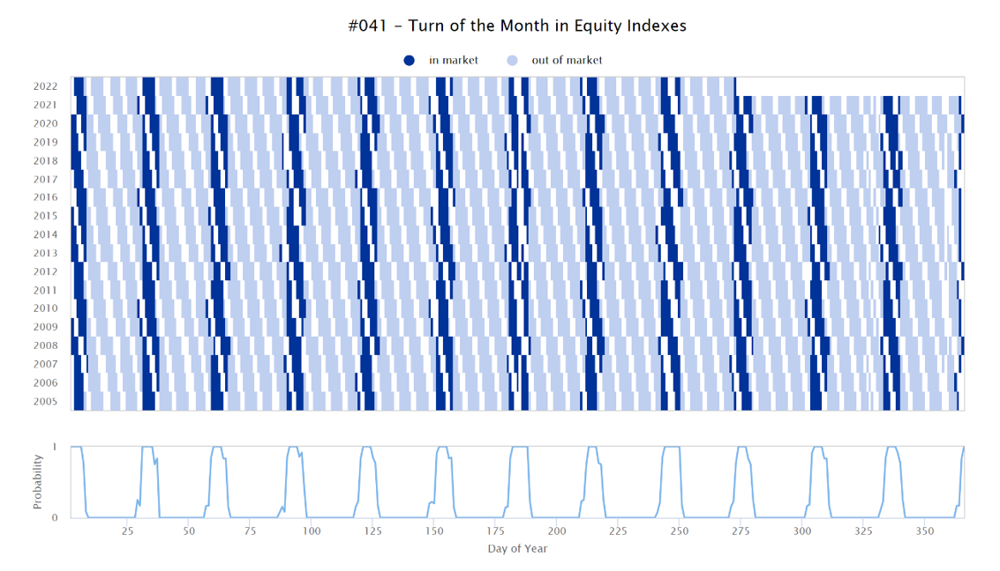

## Table of Contents

## What is market-timing strategy?

A market-timing strategy is when investors try to guess the best times to buy and sell investments. They look at things like stock prices, economic news, and other signs to decide when to make their moves. The goal is to buy low and sell high, making more money than if they just held onto their investments.

However, market-timing is very hard to do well. It's like trying to predict the weather far into the future. Even experts often get it wrong. Because of this, many people think it's better to invest for the long term, without trying to time the market. They believe that staying invested over time usually leads to better results than trying to jump in and out at the right moments.

## Why is replicating market-timing strategies important for investors?

Trying to copy market-timing strategies can be important for investors because it helps them understand how these strategies work. By seeing if they can do the same thing as the pros, investors learn about the ups and downs of trying to guess the market's next move. This hands-on experience can show them how hard it is to get the timing right and why many people end up losing money when they try.

Also, by trying to replicate these strategies, investors can see if they can beat the market or at least keep up with it. If they find they're not doing well, it might push them to look for simpler, less risky ways to invest, like putting money into funds that follow the whole market. This way, they can still grow their money without the stress of trying to time everything perfectly.

## What are the basic principles behind a simple market-timing strategy?

A simple market-timing strategy is all about trying to buy investments when they are cheap and sell them when they are expensive. The main idea is to look at things like stock prices, economic news, and other signs to guess when the market might go up or down. For example, if the stock market has been going down for a while, some people might think it's a good time to buy because prices are low. On the other hand, if the market has been going up a lot, they might decide to sell because they think prices might soon go down.

However, this strategy is not easy to get right. It's like trying to predict the weather; you might get it right sometimes, but often you'll be wrong. Because of this, many people end up losing money when they try to time the market. That's why a lot of experts suggest that instead of trying to guess the market's next move, it's better to invest for the long term. By staying invested over time, you might not make as much money in the short term, but you're more likely to see your investments grow steadily over the years.

## How can historical data be used to develop a market-timing strategy?

Historical data can help people make a market-timing strategy by showing them how the market has moved in the past. By looking at old stock prices, economic reports, and other information, investors can try to find patterns. For example, they might see that the market often goes up after a big drop, or that certain times of the year are better for investing. Using this information, they can try to guess when the market might go up or down next.

However, using historical data to time the market is tricky. Just because something happened before doesn't mean it will happen again. The market can be unpredictable, and what worked in the past might not work in the future. So, while historical data can give investors some ideas, it's important not to rely on it too much. Many experts suggest that instead of trying to time the market, it's better to invest for the long term and not worry too much about short-term changes.

## What are the common indicators used in market-timing strategies?

Common indicators used in market-timing strategies include moving averages, which help investors see the overall direction of the market by smoothing out short-term changes in stock prices. For example, if a stock's price is above its 50-day moving average, it might be a good time to buy because the stock is doing well. Another popular indicator is the Relative Strength Index (RSI), which measures how fast a stock's price is going up or down. If the RSI is over 70, it might mean the stock is overbought and could soon go down, so it might be a good time to sell.

Other indicators include economic reports like unemployment rates and GDP growth, which can give clues about the overall health of the economy. If these reports are good, it might mean the market will go up, so it could be a good time to buy. Technical indicators like Bollinger Bands also help by showing how much a stock's price is moving around its average. If the price is near the top of the Bollinger Band, it might be overbought, suggesting a possible sell signal.

While these indicators can be useful, they are not perfect. The market can be unpredictable, and what these indicators suggest might not always happen. That's why many experts suggest that instead of trying to time the market using these indicators, it's often better to invest for the long term and not worry too much about short-term changes.

## How does one implement a simple market-timing strategy using moving averages?

A simple way to use moving averages for market timing is by looking at two different moving averages, like the 50-day and the 200-day moving averages. The 50-day moving average shows the average price of a stock over the last 50 days, and the 200-day moving average shows the average price over the last 200 days. When the 50-day moving average goes above the 200-day moving average, it's called a "golden cross," and it might be a good time to buy because it suggests the stock's price is going up. On the other hand, when the 50-day moving average goes below the 200-day moving average, it's called a "death cross," and it might be a good time to sell because it suggests the stock's price is going down.

However, using moving averages to time the market is not always easy or reliable. The market can be unpredictable, and what worked in the past might not work in the future. Sometimes, the golden cross or death cross signals can be late, meaning you might buy or sell at the wrong time. Because of this, many people think it's better to invest for the long term instead of trying to time the market. By staying invested over time, you might not make as much money in the short term, but you're more likely to see your investments grow steadily over the years.

## What are the potential risks and limitations of using a simple market-timing strategy?

Using a simple market-timing strategy can be risky because it's hard to guess when the market will go up or down. Even if you use tools like moving averages, you might still get it wrong. For example, if you buy a stock because the 50-day moving average just went above the 200-day moving average, the stock might not keep going up. It could go down instead, and you could lose money. Also, if you sell a stock because the 50-day moving average went below the 200-day moving average, the stock might start going up again right after you sell, and you could miss out on making more money.

Another limitation is that market-timing strategies can lead to a lot of buying and selling, which can cost you more money in fees and taxes. Every time you buy or sell, you might have to pay a fee to your broker, and if you make a profit, you might have to pay taxes on it. These costs can add up and eat into your profits. Plus, trying to time the market can be stressful and time-consuming. You have to keep watching the market and making decisions, which can be exhausting. Many people find it easier and less stressful to just invest for the long term and not worry about trying to time the market perfectly.

## How can one evaluate the performance of a market-timing strategy?

To evaluate the performance of a market-timing strategy, you need to look at how well it does compared to just holding onto your investments without trying to time the market. One way to do this is by checking the returns you get from your strategy over time. If your strategy makes more money than if you had just kept your money in the market without trying to time it, then it might be working well. But if your strategy makes less money or even loses money, then it might not be a good strategy. You can also compare your strategy to a simple index fund, like one that follows the S&P 500, to see if you're doing better or worse than the overall market.

Another important thing to look at is how much risk you're taking with your market-timing strategy. If your strategy is making more money but it's also much riskier, you might not be happy with it. You can measure risk by looking at how much your returns go up and down over time. If your strategy causes your money to swing wildly, it might be too risky for you. Also, think about the costs of your strategy, like fees for buying and selling and taxes on your profits. If these costs are high, they can eat into your profits and make your strategy less effective. By looking at both the returns and the risks, you can get a good idea of whether your market-timing strategy is working well for you.

## What advanced techniques can be used to enhance a simple market-timing strategy?

To make a simple market-timing strategy better, you can use something called technical analysis. This means looking at charts and using special tools to try to guess where the market might go next. For example, you can use something called the Relative Strength Index (RSI) to see if a stock is overbought or oversold. If the RSI is over 70, it might mean the stock is too expensive and could go down soon, so you might want to sell. If it's under 30, it might mean the stock is a good deal and could go up, so you might want to buy. Another tool is Bollinger Bands, which show how much a stock's price is moving around its average. If the price is near the top of the band, it might be a good time to sell, and if it's near the bottom, it might be a good time to buy.

Another way to improve your market-timing strategy is by using something called [fundamental analysis](/wiki/fundamental-analysis). This means looking at a company's financial health, like its earnings, debts, and how much money it's making. If a company is doing well and its stock price is low, it might be a good time to buy because the stock could go up. On the other hand, if a company is not doing well and its stock price is high, it might be a good time to sell because the stock could go down. You can also use economic indicators, like unemployment rates and GDP growth, to guess where the market might go. If the economy is doing well, the market might go up, so it could be a good time to buy. If the economy is doing badly, the market might go down, so it might be a good time to sell. By combining these advanced techniques with your simple market-timing strategy, you might be able to make better guesses about when to buy and sell.

## How do machine learning algorithms improve market-timing strategy replication?

Machine learning algorithms can make market-timing strategies better by looking at a lot of data and finding patterns that people might miss. These algorithms can learn from past market data, like stock prices and economic reports, to guess what might happen next. For example, they can look at how the market has moved in the past and use that information to decide when to buy or sell. This can help investors make better decisions because the algorithms can find small details in the data that are hard for people to see.

However, using [machine learning](/wiki/machine-learning) for market timing is not perfect. The market can be unpredictable, and what worked in the past might not work in the future. Sometimes, the algorithms might make mistakes or give signals that are too late. Also, machine learning needs a lot of good data to work well, and if the data is not right, the algorithms might not give good advice. So, while machine learning can help improve market-timing strategies, it's important to use it carefully and not rely on it too much.

## What are the regulatory and ethical considerations when replicating market-timing strategies?

When people try to copy market-timing strategies, they need to think about the rules and what is right and wrong. There are laws that say you can't use secret information to make money in the stock market. This is called insider trading, and it's against the law. If you're using a market-timing strategy, you have to make sure you're not using any secret information that other people don't know about. Also, some countries have rules about how often you can buy and sell stocks. If you're trading too much, you might break these rules and get in trouble.

There are also ethical things to think about. It's important to be honest and fair when you're investing. If you're copying someone else's strategy, you should give them credit and not pretend it's your own idea. Also, you should think about how your actions might affect other people. If a lot of people start buying and selling based on the same strategy, it could make the market go up and down a lot, which might hurt other investors. So, it's good to think about the bigger picture and try to do what's right for everyone, not just yourself.

## How can one continuously optimize and adapt a market-timing strategy to changing market conditions?

To keep a market-timing strategy working well, you need to keep an eye on the market and be ready to change your plan. The market is always changing, so what worked last year might not work this year. You can do this by regularly checking how your strategy is doing. If it's not making as much money as before, or if it's losing money, you might need to change something. You can also look at new information, like new economic reports or changes in the stock market, and use that to decide if you should buy or sell.

Another way to make your strategy better is by learning from what other people are doing. You can read about new ideas and techniques that other investors are using and see if they might work for you. Sometimes, you might need to try out different things to see what works best. It's also a good idea to talk to other investors or even a financial advisor to get their advice. By staying flexible and always trying to learn more, you can keep your market-timing strategy working well even when the market changes.

## What is the Methodology Overview?

Our approach to replicating market-timing strategies is dedicated to portfolio replication, finely tuned to incorporate market timing. The foundation of this methodology centers on calculating the probability of the strategy being in-market, driven by historical patterns. This calculation is pivotal as it enables the adaptation of standard portfolio replication techniques to accommodate temporal market signals not typically captured by static models.

The first step involves identifying flat periods—market intervals where there is negligible movement in asset prices. Excluding these periods from regression analyses ensures that only meaningful price variations are factored into our model, enhancing precision. To achieve this, we employ simple rule-based approaches that filter out these flat periods, thereby streamlining the market data for analysis.

Furthermore, our methodology integrates a day-of-year categorization. This involves grouping data based on the calendar day in which it occurs, thereby identifying and leveraging recurring seasonal patterns within market data. By recognizing these patterns, the model can better accommodate effects such as market seasonality, which are often pivotal in timing strategies.

Moreover, probabilities are meticulously assigned to daily data points, a strategy that refines the detection of market timing effects within the analysis. This practice involves calculating likelihoods based on historical occurrences of in-market presence, thus assigning higher weights to days with a higher probability of active market engagement by the strategy.

Mathematically, for a given day $d$, the probability $P_d$ of the strategy being in the market can be defined as:

$$
P_d = \frac{\text{Number of in-market days in historical data on day } d}{\text{Total number of historical observations on day } d}
$$

This calculated probability $P_d$ is then used to weight the data points within the regression analysis, effectively emphasizing data where the market-timing strategy is likely to be operative. This integration of probability weights allows our model to not only replicate the general market patterns but also to capture the subtle nuances introduced by market timing strategies. Thus, the approach effectively amalgamates historical market behavior and temporal strategies to enhance the robustness of portfolio replication algorithms.

## What are the implementation steps?

To replicate market-timing strategies using a simplified algorithmic approach, the implementation involves several key steps, ensuring that the outcomes closely align with actual market-timing patterns.

### Filtering Out Flat Periods

The first step involves filtering out flat periods in portfolio performance using a rule-based approach. Flat periods typically indicate timeframes where market indicators do not signal clear buy or sell decisions, leading to negligible investment returns. By eliminating these periods from analysis, one can enhance the accuracy of subsequent calculations and the efficacy of market-timing detection. A simple rule can be applied: exclude any period where the change in portfolio value remains within a predefined range of, say, ±0.5%. This allows the algorithm to focus on periods of significant market movement, thereby refining the detection of timing signals.

### Day-of-Year Categorization

Next, the presence of the strategy in the market is analyzed through day-of-year categorization. Market-timing strategies often exploit recurring patterns that manifest annually. These can include seasonal effects, such as the tendency for certain stocks to perform better at specific times of the year. Categorizing historical market data by the day of the year allows for the identification of these repeating patterns. For example, in Python, this can be done using:

```python
import pandas as pd

# Assume df is a DataFrame with historical data
df['day_of_year'] = df['date'].dt.dayofyear
```

By examining these categorizations, one can determine the probability of a market-timing strategy being in or out of the market on any given day.

### Weighting Daily Data Points

Incorporating calculated probabilities, weights are applied to daily data points representing the in-market presence. This step involves assigning higher weights to dates with a higher probability of the strategy being effective. Weighted calculations refine the accuracy of portfolio simulations against recognized market-timing effects:

$$
\text{Weighted Value} = \sum P(d_i) \cdot V(d_i)
$$

where $P(d_i)$ is the probability of the strategy being effective on day $i$, and $V(d_i)$ is the portfolio value on that day.

### Utilizing Historical Factor Data

The final step leverages historical [factor](/wiki/factor-investing) data for long-term portfolio replication. Historical data serves as a benchmark to gauge how different market conditions have influenced asset performances over time. Factors such as interest rates, inflation rates, and other economic indicators are integral to the thorough examination of market trends and can improve predictive accuracy when incorporated into replicated strategies.

Aggregating this data with probability-weighted yields, one can simulate portfolio outcomes that closely replicate market-timing strategies over an extended period, illustrating the tangible benefits of this approach.

## References & Further Reading

[1]: Bergstra, J., Bardenet, R., Bengio, Y., & Kégl, B. (2011). ["Algorithms for Hyper-Parameter Optimization."](https://papers.nips.cc/paper/4443-algorithms-for-hyper-parameter-optimization) Advances in Neural Information Processing Systems 24.

[2]: ["Advances in Financial Machine Learning"](https://www.amazon.com/Advances-Financial-Machine-Learning-Marcos/dp/1119482089) by Marcos Lopez de Prado

[3]: ["Evidence-Based Technical Analysis: Applying the Scientific Method and Statistical Inference to Trading Signals"](https://www.amazon.com/Evidence-Based-Technical-Analysis-Scientific-Statistical/dp/0470008741) by David Aronson

[4]: ["Machine Learning for Algorithmic Trading"](https://github.com/stefan-jansen/machine-learning-for-trading) by Stefan Jansen

[5]: ["Quantitative Trading: How to Build Your Own Algorithmic Trading Business"](https://books.google.com/books/about/Quantitative_Trading.html?id=j70yEAAAQBAJ) by Ernest P. Chan