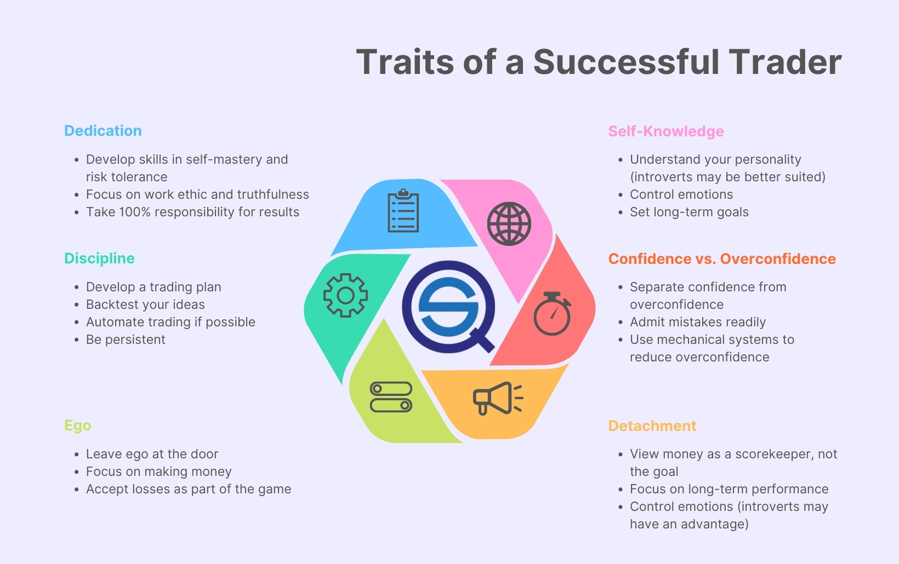

## Table of Contents

## What is a trader's mindset and why is it important?

A trader's mindset is a way of thinking that helps people make good choices when they buy and sell things like stocks or cryptocurrencies. It includes being patient, disciplined, and able to handle risks. Traders need to stay calm even when the market goes up and down a lot. They also need to learn from their mistakes and keep trying to get better.

Having a trader's mindset is important because it helps traders make smart decisions instead of acting on feelings like fear or excitement. Without the right mindset, traders might make quick choices that lose them money. A good mindset helps traders stick to their plans and strategies, which can lead to better results over time. It also helps them stay in the game longer and not give up when things get tough.

## How does a beginner trader develop the right mindset?

A beginner trader can start developing the right mindset by first understanding that trading involves both wins and losses. It's important to accept that not every trade will be successful, and this helps build resilience. They should set clear goals and stick to a trading plan, which means deciding ahead of time what they will buy or sell, and when. This helps them avoid making quick decisions based on emotions like fear or excitement. Practicing with a demo account can also be helpful because it allows them to trade without risking real money, giving them a safe space to learn and make mistakes.

Another way to develop the right mindset is by learning from experienced traders. Beginners can read [books](/wiki/algo-trading-books), watch videos, or join trading communities where they can ask questions and get advice. It's also useful to keep a trading journal where they write down what they did, why they did it, and what they learned from each trade. This helps them see patterns in their behavior and improve over time. Lastly, staying patient and disciplined is key. Trading is not about getting rich quickly; it's about making steady progress and learning to manage risks wisely.

## What are common psychological barriers for new traders?

One common psychological barrier for new traders is fear. They might be scared of losing money, which can stop them from making any trades at all. This fear can also make them sell too soon when the market goes down a little, even if they had a good plan. Another barrier is greed. New traders might want to make a lot of money fast, so they take big risks. This often leads to big losses because they don't stick to their plan and make quick, emotional decisions.

Another barrier is overconfidence. After a few good trades, new traders might think they know everything and start taking bigger risks. This can lead to big mistakes because they stop being careful. Lastly, there's the problem of not being able to handle losing trades. When new traders lose money, they might feel bad and blame themselves too much. This can make them give up on trading instead of learning from their mistakes and trying again.

## How can traders manage fear and greed effectively?

To manage fear, traders need to remember that losing some money is part of trading. They should stick to their plan and not let fear make them sell too soon. One good way to handle fear is by setting stop-loss orders. These orders automatically sell a stock if it goes down to a certain price, so traders don't have to make quick decisions when they're scared. It's also helpful to practice with a demo account. This lets traders get used to the ups and downs of the market without losing real money, helping them stay calm when they start trading for real.

To manage greed, traders need to set clear goals and stick to them. They should not try to make a lot of money in a short time because this often leads to big losses. Instead, they should follow their trading plan and be happy with small, steady gains. Keeping a trading journal can also help. By writing down their trades and the reasons behind them, traders can see if greed is making them take too many risks. Over time, this helps them make better decisions and avoid chasing big profits that could lead to big losses.

## What role does discipline play in trading success?

Discipline is really important for traders to do well. It means sticking to a plan and not letting feelings like fear or greed make you do something different. When traders are disciplined, they follow the rules they set for themselves, like when to buy or sell, and how much money to risk. This helps them make smart choices instead of quick ones that might lose them money. Being disciplined also means being patient and waiting for the right time to trade, instead of jumping in because you want to make money fast.

Discipline also helps traders learn from their mistakes. If a trade doesn't go well, a disciplined trader will look at what happened and try to do better next time. They won't give up or blame themselves too much. Instead, they'll keep working on their skills and getting better. Over time, this discipline can lead to more successful trades and help traders reach their goals. Without discipline, traders might make a lot of mistakes and lose money because they're not sticking to a good plan.

## How can a trader maintain emotional balance during market fluctuations?

Keeping your emotions in check during big ups and downs in the market is important for traders. One way to do this is by having a solid trading plan and sticking to it. When you know what you're going to do before the market moves, it's easier to stay calm. You can use stop-loss orders to limit your losses without having to make quick decisions when you're feeling scared. Also, taking breaks from watching the market all the time can help. If you're always looking at the screen, it's easy to get stressed out. Stepping away for a bit can give you a clearer mind.

Another way to keep your emotions balanced is by practicing mindfulness and staying aware of your feelings. When you notice you're feeling scared or greedy, take a moment to breathe and think about why you feel that way. Talking to other traders or joining a trading community can also help. Sharing your experiences and hearing from others who've been through the same ups and downs can make you feel less alone and more in control. Remember, it's okay to feel emotions, but the key is to not let them control your trading decisions.

## What strategies can experienced traders use to enhance their decision-making process?

Experienced traders can improve their decision-making by using a few key strategies. One important strategy is to keep learning and stay up-to-date with market news and trends. By reading books, watching videos, and joining trading communities, they can learn new ideas and get different points of view. Another strategy is to use [backtesting](/wiki/backtesting), where they test their trading strategies on past market data. This helps them see if their plan works well and what they might need to change. They can also use tools like technical analysis to look at charts and patterns, which can help them make smarter choices.

Another way experienced traders can make better decisions is by managing their emotions well. They should keep a trading journal to write down their thoughts and feelings about each trade. This helps them see if emotions like fear or greed are affecting their decisions. They can also practice mindfulness to stay calm and focused, which helps them stick to their plan instead of making quick choices based on feelings. By combining these strategies, experienced traders can make more thoughtful and effective decisions, leading to better trading results over time.

## How important is risk management in shaping a trader's mindset?

Risk management is super important for shaping a trader's mindset. It helps traders think about what can go wrong before they make a trade. When traders know how much they might lose, they can make smarter choices and not take too many risks. This makes them feel more in control and less scared of losing money. Good risk management means setting stop-loss orders and not putting all their money into one trade. This way, even if a trade goes bad, they won't lose everything.

Having a good risk management plan also helps traders stay calm during market ups and downs. They know they've thought about the risks and have a plan to handle them. This helps them stick to their trading plan and not make quick decisions based on fear or greed. Over time, this builds confidence and discipline, which are key parts of a strong trader's mindset. By managing risk well, traders can focus on making steady gains instead of trying to get rich fast, which leads to more success in the long run.

## Can you explain the impact of overconfidence on trading decisions?

Overconfidence can really mess up a trader's decisions. When traders start feeling too sure of themselves, they might think they know everything about the market. This can make them take bigger risks than they should. They might not stick to their trading plan and instead try to make quick trades to get a lot of money fast. This often leads to big losses because they're not being careful enough. They might also ignore warning signs in the market because they believe they can't be wrong.

This kind of thinking can also make traders stop learning and improving. Instead of trying to get better, they might think they're already the best. This means they miss out on new ideas and strategies that could help them trade better. Over time, overconfidence can lead to a lot of mistakes and even make traders lose all their money. It's important for traders to stay humble and keep learning, so they can make smart decisions and do well in the long run.

## What are advanced techniques for maintaining focus and concentration during trading?

Keeping your mind on trading and not getting distracted is really important. One way to do this is by setting up a good trading space. This means having a quiet place where you won't be bothered by other things. You can also use tools like timers to take short breaks and come back to trading with a fresh mind. Another technique is to practice mindfulness. This means paying attention to what you're doing right now and not letting your mind wander. When you feel your focus slipping, take a few deep breaths and bring your attention back to your trading plan.

Another advanced technique is to use technology to help you stay focused. You can use apps that block distracting websites or notifications on your phone. Some traders also use software that helps them keep track of their trades and stay organized. It's also helpful to set specific goals for each trading session. Knowing what you want to achieve can keep you motivated and on track. By combining these techniques, you can stay focused and make better trading decisions.

## How do expert traders adapt their mindset to different market conditions?

Expert traders know that the market can change a lot, and they change their mindset to fit these changes. They always keep learning and watching the market to see what's happening. When the market is going up, they might be more willing to take risks and look for good chances to make money. But when the market is going down, they become more careful. They use their trading plan to help them stay calm and make smart choices, no matter what the market is doing. This way, they can handle different situations without letting fear or greed take over.

They also know that it's important to be flexible. If their usual way of trading isn't working because the market has changed, they're ready to try something different. They might change how much risk they're willing to take or start using new tools to help them trade better. By staying open to new ideas and being ready to change, expert traders can keep doing well even when the market is hard to predict. This kind of thinking helps them stay successful over time, no matter what the market does.

## What ongoing practices should traders employ to continuously improve their mindset?

Traders should keep a trading journal to write down what they do and how they feel about each trade. This helps them see if they're making choices based on fear or greed, and learn from their mistakes. By looking back at their journal, they can see what works and what doesn't, and keep getting better. It's also important to keep learning. Traders can read books, watch videos, and talk to other traders to get new ideas and stay up-to-date with the market. This helps them stay humble and open to new ways of thinking.

Another good practice is to practice mindfulness and stay aware of their emotions. When traders notice they're feeling scared or greedy, they can take a moment to breathe and think about why they feel that way. This helps them make better decisions and not let their feelings control their trading. They should also take breaks and step away from the market sometimes. This helps them come back with a clear mind and not get too stressed out. By doing these things regularly, traders can keep improving their mindset and do better in trading over time.

## References & Further Reading

[1]: Bergstra, J., Bardenet, R., Bengio, Y., & Kégl, B. (2011). ["Algorithms for Hyper-Parameter Optimization."](https://dl.acm.org/doi/10.5555/2986459.2986743) Advances in Neural Information Processing Systems 24.

[2]: ["Advances in Financial Machine Learning"](https://www.amazon.com/Advances-Financial-Machine-Learning-Marcos/dp/1119482089) by Marcos Lopez de Prado

[3]: ["Evidence-Based Technical Analysis: Applying the Scientific Method and Statistical Inference to Trading Signals"](https://www.amazon.com/Evidence-Based-Technical-Analysis-Scientific-Statistical/dp/0470008741) by David Aronson

[4]: ["Machine Learning for Algorithmic Trading"](https://github.com/stefan-jansen/machine-learning-for-trading) by Stefan Jansen

[5]: ["Quantitative Trading: How to Build Your Own Algorithmic Trading Business"](https://books.google.com/books/about/Quantitative_Trading.html?id=j70yEAAAQBAJ) by Ernest P. Chan