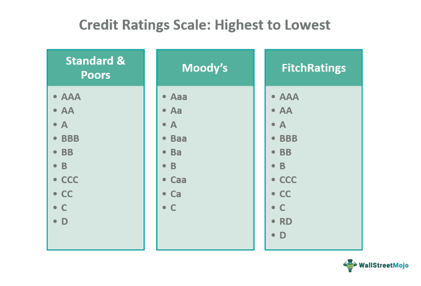

## Table of Contents

## What is a credit rating?

A credit rating is a score given to a person or a company to show how likely they are to pay back money they borrow. It's like a report card for borrowing money. Banks and other lenders use these ratings to decide if they should lend money and how much interest to charge. A high credit rating means you are seen as reliable and likely to pay back what you owe, which can help you get loans with lower interest rates.

Credit ratings are figured out by looking at things like your payment history, how much debt you have, and how long you've been borrowing money. Companies called credit bureaus collect this information and give you a score. In the United States, common credit scores range from 300 to 850. A score above 700 is usually considered good. Keeping a good credit rating can help you in many ways, like getting better deals on loans and even affecting things like renting an apartment or getting a job.

## What does the Aa2 credit rating specifically mean?

The Aa2 credit rating is given by Moody's, which is one of the big companies that rate how safe it is to lend money to people or businesses. An Aa2 rating means the person or company is very trustworthy and likely to pay back what they borrow. It's a high rating, but not the highest. It's like getting a B+ in school - really good, but there's still a tiny bit of risk.

When a company or a country gets an Aa2 rating, it tells lenders that they're pretty safe to lend money to. This can help them get loans with lower interest rates because lenders feel more confident they'll get their money back. But, it's still important to keep an eye on things because even with a good rating like Aa2, things can change and affect how safe the loan is.

## Who assigns the Aa2 credit rating?

The Aa2 credit rating is assigned by Moody's, which is a company that looks at how safe it is to lend money to people or businesses. Moody's checks a lot of things like how much money a company makes, how much debt they have, and how well they pay back what they owe. If everything looks good, they give a high rating like Aa2.

An Aa2 rating means that Moody's thinks the person or company is very likely to pay back what they borrow. It's a good rating, but not the best one. It's like getting a B+ in school - it shows you're doing well, but there's still a little bit of risk. Lenders like banks use this rating to decide if they should lend money and how much interest to charge.

## How does the Aa2 rating compare to other ratings?

The Aa2 rating is given by Moody's, a company that rates how safe it is to lend money. It's a pretty good rating, just below the highest ones like Aaa. If a company or a country gets an Aa2 rating, it means they are seen as very reliable and likely to pay back what they borrow. It's not the top rating, but it's close, kind of like getting a B+ in school - really good, but not perfect.

Compared to other ratings, Aa2 is better than ratings like A1, A2, or Baa1, which show a bit more risk. For example, an A1 rating means there's a little more chance that the borrower might not pay back the money. On the other hand, ratings below Baa1, like Ba1 or lower, show even more risk and are considered "junk" ratings. So, an Aa2 rating is strong and shows that lenders can feel pretty safe lending money, but they still need to keep an eye on things because nothing is guaranteed.

## What are the benefits of having an Aa2 credit rating?

Having an Aa2 credit rating is great because it shows that you're very reliable when it comes to paying back money you borrow. Lenders, like banks, see this rating and feel more comfortable lending you money. This can lead to better loan deals, with lower interest rates, because the lenders think you're less likely to have trouble paying them back. It's like getting a good grade in school - it opens up more opportunities and makes things easier for you.

Also, an Aa2 rating can help in other ways too. For example, if you're a company, it can make investors more interested in buying your bonds or stocks because they see you as a safe bet. This can help your business grow and attract more money. Even if you're a country, having this rating can make it easier to borrow money from other countries or international organizations, which can be used to improve things like schools or hospitals. So, an Aa2 rating is really helpful and can make a big difference in how easy it is to get and use money.

## What are the criteria used to determine an Aa2 rating?

Moody's looks at a lot of things to decide if someone or a company should get an Aa2 rating. They check how much money the company makes, how much debt they have, and if they've been good at paying back what they owe in the past. They also look at the company's plans for the future and how the economy is doing. All these things help Moody's figure out if the company is likely to keep paying back what they borrow.

An Aa2 rating means that Moody's thinks the company is very reliable, but not the most reliable. It's like getting a B+ in school - it's a really good grade, but there's still a little bit of risk. Moody's keeps an eye on everything and might change the rating if something big happens, like if the company starts making less money or if the economy gets worse. So, even with a good rating like Aa2, it's important for the company to keep doing well.

## How is the Aa2 rating affected by economic conditions?

The Aa2 rating can change because of how the economy is doing. If the economy is doing well, with lots of people buying things and companies making money, Moody's might feel more confident about giving or keeping an Aa2 rating. But if the economy starts to struggle, like if people stop buying as much or if companies start losing money, Moody's might worry that the company won't be able to pay back what they owe. This could make them lower the rating to something like A1 or even lower.

Moody's looks at things like how much money a company is making and how much debt they have. If the economy gets worse and the company's money goes down, or if they have to borrow more money, their Aa2 rating could go down too. But if the economy gets better and the company starts making more money, their rating might stay the same or even go up. So, the Aa2 rating can change a lot depending on what's happening in the economy.

## Can the Aa2 rating change, and if so, how?

Yes, the Aa2 rating can change. Moody's, the company that gives out the Aa2 rating, keeps watching how well a company or a country is doing. If things start to go badly, like if they start losing money or have more debt, Moody's might decide to lower the rating. It's like getting a lower grade in school if you start doing worse on your homework and tests.

On the other hand, if the company or country starts doing better, like making more money or paying off more of their debt, Moody's might decide to raise the rating. It could go up to Aaa, which is the best rating, or stay the same if things just stay steady. So, the Aa2 rating isn't set in stone and can go up or down depending on how things are going.

## What industries or types of entities typically receive an Aa2 rating?

Companies in industries like utilities, finance, and big businesses often get an Aa2 rating. These companies usually have steady income and are good at paying back what they owe. Utilities, like power and water companies, are seen as safe because people always need their services. Big banks and financial companies might get this rating too because they handle a lot of money and are watched closely by the government. Large businesses that make things people always need, like food or medicine, can also get an Aa2 rating because they are less likely to lose money.

Sometimes, countries can get an Aa2 rating too. These are usually countries that have strong economies and good ways of paying back what they borrow. They might have a lot of money coming in from taxes or from selling things like oil or other resources. Countries with stable governments and good plans for the future are more likely to get this rating. So, both companies and countries can get an Aa2 rating if they show they are reliable and likely to keep paying back what they owe.

## How does an Aa2 rating impact borrowing costs?

An Aa2 rating means that a company or country is seen as very reliable and likely to pay back what they borrow. Because of this, lenders like banks feel more comfortable lending them money. When lenders feel safe, they usually charge less interest on the loans. So, a company or country with an Aa2 rating can borrow money at lower interest rates than those with lower ratings. This can save them a lot of money over time because they don't have to pay as much extra on top of what they borrowed.

For example, if a company with an Aa2 rating wants to borrow money to build a new factory, they might get a loan with a 3% [interest rate](/wiki/interest-rate-trading-strategies). But if another company with a lower rating, like A1, wants to do the same thing, they might have to pay a higher interest rate, like 5%. Over time, that 2% difference can add up to a lot of money. So, having an Aa2 rating can make borrowing cheaper and help a company or country save money and grow more easily.

## What are the historical trends of Aa2 ratings?

Over the years, the Aa2 rating has been given to many different companies and countries. It's like a good grade that shows they are reliable and likely to pay back what they borrow. In good economic times, more companies and countries might get an Aa2 rating because everyone is doing well and making money. But when the economy is not doing so great, like during a recession, fewer might get this rating because there's more risk that they won't be able to pay back what they owe.

Historically, industries like utilities and big banks have often gotten Aa2 ratings because they have steady income and are seen as safe bets. For example, power companies always have people needing their services, so they are less likely to lose money. Countries with strong economies and good financial plans also tend to get Aa2 ratings. But these ratings can change over time. If a company or country starts doing worse, their rating might go down. And if they start doing better, their rating might go up. So, the Aa2 rating is always changing based on how well everyone is doing.

## What are the advanced analytical methods used in assessing Aa2 ratings?

When Moody's decides on an Aa2 rating, they use a lot of smart ways to look at things. They don't just look at how much money a company makes right now. They also use special math and computer tools to guess how the company might do in the future. They look at things like how much the company owes, how good they are at paying back what they borrow, and even how the whole economy is doing. They also check out the company's plans and see if they make sense. All these pieces of information help Moody's figure out if the company is likely to keep being reliable and pay back what they owe.

Moody's also uses big data and fancy computer programs to look at a lot of information at once. This helps them see patterns and understand how different things might affect the company's ability to pay back money. For example, they might use something called a "stress test" to see how the company would do if something bad happened, like if the economy got worse or if interest rates went up. By using these advanced tools, Moody's can make a better guess about whether a company should get an Aa2 rating or if it should be higher or lower.

## References & Further Reading

[1]: ["Moody's Rating System & Definitions"](https://www.moodys.com/researchdocumentcontentpage.aspx?docid=PBC_79004) by Moody's Investor Service

[2]: Hu, Y., Kiesel, R., & Perraudin, W. (2002). ["The estimation of transition matrices for sovereign credit ratings."](https://papers.ssrn.com/sol3/papers.cfm?abstract_id=1961038) Journal of Banking & Finance.

[3]: ["Algorithmic Trading: Winning Strategies and Their Rationale"](https://github.com/prabakar2610/TradingBooks/blob/master/Algorithmic%20Trading%20-%20Winning%20Strategies%20and%20Their%20Rationale%202013.pdf) by Ernie P. Chan

[4]: Dutta, P., & Basu, A.K. (2020). ["Credit Ratings and Credit Risk: An Overview in the Context of Global Financial Crisis."](https://papers.ssrn.com/sol3/papers.cfm?abstract_id=3514069) Procedia Computer Science.

[5]: Bluhm, C., Overbeck, L., & Wagner, C. (2016). ["Introduction to Credit Risk Modeling"](https://www.taylorfrancis.com/books/mono/10.1201/9781584889939/introduction-credit-risk-modeling-ludger-overbeck-christoph-wagner-christian-bluhm) by Chapman and Hall/CRC

[6]: ["Quantitative Financial Risk Management: Theory and Practice"](https://onlinelibrary.wiley.com/doi/book/10.1002/9781119080305) by Constantin Zopounidis & Lina Papathanasiou