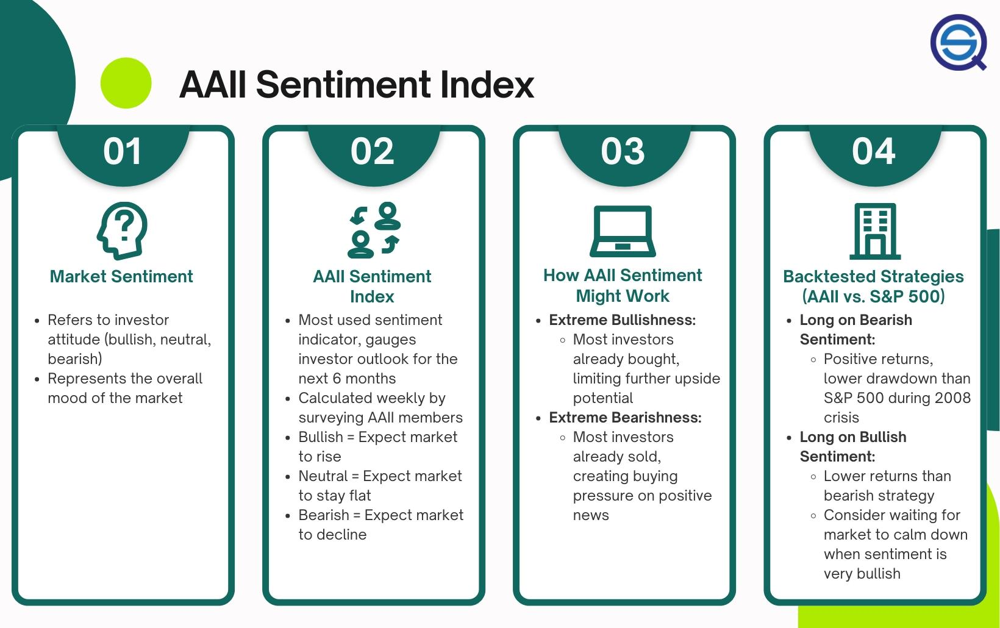

## Table of Contents

## What is AAII and what is its primary function?

AAII stands for the American Association of Individual Investors. It is a nonprofit organization that helps people who invest their own money. AAII was started in 1978 and has been helping people learn about investing ever since.

The main job of AAII is to give its members the tools and information they need to make smart choices about their investments. They do this by offering classes, webinars, and a magazine called the AAII Journal. They also have a website where members can find stock ideas, model portfolios, and other resources to help them invest better.

## How does AAII collect data for its market sentiment indicators?

AAII collects data for its market sentiment indicators by asking its members what they think about the stock market. Every week, they send out a survey to their members. In the survey, they ask if members think the stock market will go up, stay the same, or go down in the next six months. Members can choose one of these options, and AAII uses the answers to figure out how people feel about the market.

Once AAII gets all the answers, they count them up and see what most people think. They then share this information with everyone, not just their members, so people can see if others are feeling positive or negative about the stock market. This helps investors understand the general mood and make better decisions about their investments.

## What are the different types of market sentiment indicators provided by AAII?

AAII provides a few different types of market sentiment indicators to help people understand how others feel about the stock market. One of the main indicators is the AAII Sentiment Survey. This survey asks members if they think the stock market will go up, stay the same, or go down in the next six months. By looking at the answers, AAII can tell if people are feeling bullish, meaning they think the market will go up, or bearish, meaning they think it will go down.

Another important indicator is the AAII Asset Allocation Survey. This survey asks members how they are dividing their money between stocks, bonds, and cash. It helps show if investors are feeling more or less confident about the market. If more people are putting their money into stocks, it might mean they are feeling good about the market's future. If they are putting more into cash or bonds, it might mean they are worried about a downturn.

AAII also offers the AAII Investor Sentiment Cycle, which looks at how sentiment changes over time. This can help investors see if the current mood is part of a bigger pattern. By understanding these different indicators, people can get a better sense of the overall mood in the market and make smarter choices about their investments.

## How can beginners use AAII's sentiment indicators to make investment decisions?

Beginners can use AAII's sentiment indicators to get a feel for what other investors are thinking about the stock market. The AAII Sentiment Survey tells you if most people think the market will go up, stay the same, or go down in the next six months. If a lot of people are feeling bullish, it might be a good time to invest in stocks because others are confident. But if many are feeling bearish, it might be wise to be careful or wait before putting money into the market. By looking at these surveys, beginners can see if their own feelings about the market match what others are thinking.

Another useful tool for beginners is the AAII Asset Allocation Survey. This survey shows how other investors are dividing their money between stocks, bonds, and cash. If you see that many people are putting more money into stocks, it might mean they feel good about the market's future. On the other hand, if more people are moving their money into cash or bonds, it could be a sign that they are worried about a market downturn. Beginners can use this information to decide how to spread their own money, maybe following the crowd or doing the opposite if they think the market might change direction soon.

## What is the AAII Sentiment Survey and how is it conducted?

The AAII Sentiment Survey is a weekly poll that the American Association of Individual Investors sends to its members. They ask members a simple question: "Do you think the stock market will go up, stay the same, or go down in the next six months?" Members can pick one of these three options. This survey helps AAII figure out how people feel about the stock market, whether they are feeling positive (bullish), negative (bearish), or neutral.

AAII collects the answers from the survey and counts them up. They then share the results with everyone, not just their members. The results show the percentage of people who think the market will go up, stay the same, or go down. This information is useful because it gives a snapshot of what other investors are thinking. Beginners and experienced investors alike can use this data to see if their own feelings about the market match what others are thinking, helping them make smarter investment choices.

## How does the AAII Investor Sentiment Survey differ from other sentiment indicators?

The AAII Investor Sentiment Survey is different from other sentiment indicators because it focuses on what individual investors think about the stock market. Many other sentiment indicators might look at what big investors or professional traders are doing, or they might use data from stock market activity to guess how people feel. But the AAII survey asks regular people, its members, a simple question about where they think the market is headed in the next six months. This gives a direct look at the feelings of everyday investors, which can be different from what the pros think.

Another way the AAII survey stands out is that it's very easy to understand. The results are shared as percentages of people who think the market will go up, stay the same, or go down. This makes it simple for anyone, even beginners, to see the overall mood of the market. Other sentiment indicators might use more complicated data or methods, like looking at the number of stocks going up versus down, or analyzing options trading. The AAII survey, on the other hand, gives a clear and straightforward picture of investor sentiment.

## What historical data is available from AAII and how can it be used for analysis?

AAII keeps a lot of old information that you can use to look at how people felt about the stock market in the past. They have records of their Sentiment Survey going back to 1987. This means you can see what people thought about the market during big events like the dot-com bubble, the 2008 financial crisis, and the recent times with the COVID-19 pandemic. They also have data from their Asset Allocation Survey, which shows how people were dividing their money between stocks, bonds, and cash over the years.

You can use this old information to learn about how people's feelings about the market can change over time. By looking at the data, you might see patterns that can help you guess what might happen next. For example, if you see that people were very bullish before a big market drop, you might be more careful when you see the same thing happening now. This can help you make better choices about when to buy or sell stocks, and how to spread your money around to be safer.

## How can AAII's sentiment indicators be integrated into a more advanced investment strategy?

AAII's sentiment indicators can be a helpful part of a more advanced investment strategy by giving you a sense of what other people are thinking about the market. For example, if the AAII Sentiment Survey shows that a lot of people are feeling very bullish, it might mean the market is getting too excited and could be due for a drop. On the other hand, if many people are feeling bearish, it might be a good time to buy stocks because the market could be about to go up. By watching these indicators, you can use what other people think to help decide when to buy or sell. This can be especially useful if you combine it with other tools like technical analysis, which looks at stock price patterns, or [fundamental analysis](/wiki/fundamental-analysis), which looks at a company's financial health.

Another way to use AAII's sentiment indicators in a more advanced strategy is by looking at the Asset Allocation Survey. This survey shows how people are dividing their money between stocks, bonds, and cash. If you see that many people are moving their money into stocks, it might mean they feel good about the market's future. But if more people are putting their money into cash or bonds, it could be a sign that they are worried about a market downturn. By understanding these shifts, you can adjust your own investments to either follow the crowd or go against it if you think the market might change direction soon. This can help you manage risk and maybe even find good buying opportunities when others are scared.

## What are the limitations and potential biases of AAII's sentiment indicators?

AAII's sentiment indicators can be very helpful, but they have some limits and possible biases. One big limit is that the surveys only ask AAII members, who might not be like all investors. AAII members might be more interested in investing or have more money to invest than the average person. This means their feelings about the market might not match what everyone else thinks. Also, the surveys are based on what people say they think, not what they actually do with their money. Sometimes, people might say they feel one way but do something different with their investments.

Another thing to think about is that sentiment indicators can be affected by what's happening in the news or the economy at the time. If there's a big event, like a financial crisis or a big company going bankrupt, it can make people feel more scared or excited than usual. This can make the sentiment indicators swing a lot, which might not always be a good guide for what will happen next in the market. It's also important to remember that just because a lot of people feel a certain way about the market, it doesn't mean they're right. Sometimes, going against what everyone else thinks can be a smart move if you have good reasons to do so.

## How do expert investors interpret shifts in AAII sentiment data?

Expert investors often look at shifts in AAII sentiment data to get a sense of what other people are thinking about the market. If they see that a lot of people are feeling very positive, or bullish, they might think the market is getting too excited and could be due for a drop. On the other hand, if many people are feeling negative, or bearish, they might see it as a good time to buy stocks because the market could be about to go up. By watching these shifts, expert investors can use what other people think to help decide when to buy or sell. They know that sentiment can be a good sign of what might happen next, but they also know it's not perfect and should be used with other tools.

Expert investors also understand that AAII sentiment data can be affected by what's happening in the news or the economy. Big events like financial crises or big company bankruptcies can make people feel more scared or excited than usual, which can make the sentiment data swing a lot. They know that just because a lot of people feel a certain way about the market, it doesn't mean they're right. Sometimes, going against what everyone else thinks can be a smart move if you have good reasons to do so. So, they use the sentiment data as one part of a bigger picture, combining it with other information like stock price patterns and company financials to make their investment choices.

## Can AAII sentiment indicators predict market movements, and if so, how accurately?

AAII sentiment indicators can give you a hint about what might happen in the stock market, but they can't predict it perfectly. When a lot of people feel very positive about the market, it might mean the market is getting too excited and could go down soon. On the other hand, if many people feel negative, it might be a good time to buy because the market could go up. But, these indicators are not always right because they only show what people think, not what they actually do with their money. Also, big events like financial crises or news stories can make people's feelings change a lot, which can make the indicators less reliable.

Expert investors know that AAII sentiment indicators are just one piece of the puzzle. They use these indicators along with other tools like looking at stock price patterns and company financials to make their investment choices. They understand that just because a lot of people feel a certain way about the market, it doesn't mean they're right. Sometimes, going against what everyone else thinks can be a smart move if you have good reasons to do so. So, while AAII sentiment indicators can be helpful, they should be used carefully and with other information to make the best guesses about what the market might do next.

## What advanced statistical methods can be applied to AAII data for deeper market insights?

Advanced statistical methods can help you get a deeper understanding of the AAII data. One way to do this is by using time series analysis. This method looks at how the sentiment data changes over time and can help you find patterns or trends. For example, you might see that when the sentiment gets very high, the market often goes down a few weeks later. Another useful method is regression analysis, which can help you see if there's a link between the sentiment data and actual market movements. By using regression, you can figure out how much the sentiment might affect the market and use that information to make better guesses about what might happen next.

Another advanced method is [machine learning](/wiki/machine-learning), which can help you find more complex patterns in the data that might be hard to see otherwise. Machine learning algorithms can look at a lot of different pieces of information at once, like sentiment data, stock prices, and economic news, to make predictions about the market. This can be really helpful because it can find connections that you might not notice just by looking at the data yourself. By using these advanced methods, you can get a better idea of how sentiment might affect the market and make smarter investment choices.

## What is the AAII Sentiment Index?

The AAII Sentiment Index is a prominent sentiment indicator derived from a weekly survey conducted by the American Association of Individual Investors (AAII). This index serves as a barometer for gauging the collective sentiment of individual investors in the stock market, offering insights into how they perceive market conditions over the subsequent six months.

The survey methodology involves polling AAII members, who are asked about their expectations for the stock market: whether they feel bullish, neutral, or bearish. These responses are crucial in forming the sentiment index. Specifically, the survey asks participants to categorize their outlook as follows:

1. **Bullish**: Investors believing the stock market will rise over the next six months.
2. **Neutral**: Investors expecting no significant change in the market within six months.
3. **Bearish**: Investors anticipating a decline in the market over the same period.

Once the responses are collected, the AAII computes the percentage of responses in each category. A critical aspect of this index is the calculation of the bull-bear spread, which is the difference between the percentage of bullish responses and bearish responses. Mathematically, this can be expressed as:

$$
\text{Bull-Bear Spread} = \text{Percentage of Bullish Responses} - \text{Percentage of Bearish Responses}
$$

The bull-bear spread is instrumental in understanding the overall market sentiment. A positive spread indicates a prevalence of bullish sentiment, suggesting optimism among investors. Conversely, a negative spread reflects a bearish outlook, implying skepticism or pessimism about future market performance.

The AAII Sentiment Index is widely regarded as a contrarian indicator. Historically, extreme readings, either overwhelmingly bullish or bearish, can signal potential market turning points. This sentiment data is leveraged by traders and analysts to forecast market trends and inform trading and investment strategies.

## Have you backtested the AAII Sentiment Strategy?

Backtesting the AAII Sentiment Strategy involves a careful evaluation of historical data to assess the utility of the sentiment index in developing profitable trading strategies. The American Association of Individual Investors (AAII) Sentiment Survey provides weekly insights reflecting the short-term market sentiments of individual investors—whether they are bullish, bearish, or neutral about the stock market's prospects over the next six months. Traders using the AAII Sentiment Index often design strategies that capitalize on the contrarian nature of market sentiment.

### Performance of Sentiment-Based Strategies

A common sentiment-based strategy involves buying stocks when the sentiment is predominantly bearish, indicating potentially oversold conditions, and selling when the sentiment is bullish, suggesting overbought conditions. This contrarian perspective hinges on the belief that the majority investor sentiment often leads rather than lags market reversals.

**Risk-Adjusted Returns:** To evaluate these strategies effectively, it is essential to consider risk-adjusted returns. The Sharpe ratio is a widely-used measure for scrutinizing the performance of sentiment-based strategies. It is calculated as follows:

$$
\text{Sharpe Ratio} = \frac{R_p - R_f}{\sigma_p}
$$

Where:
- $R_p$ is the return of the portfolio.
- $R_f$ is the risk-free rate of return.
- $\sigma_p$ is the standard deviation of the portfolio's excess return.

An above-average Sharpe ratio indicates that the strategy compensates well for the risk taken, which is crucial in sentiment-driven approaches.

### Strengths and Drawbacks in Synthetic Environments

**Strengths:**
1. **Understanding Market Psychology:** Sentiment indicators provide a window into investor psychology. By interpreting these signals, traders may anticipate changes in market trends.
2. **Contrarian Opportunities:** By betting against prevailing sentiments, especially extremes, traders can exploit corrections or swings in market prices, potentially enhancing returns.
3. **Integration with Machine Learning:** Incorporating sentiment data into algorithmic models often yields a richer dataset that can improve the prediction accuracy of machine learning algorithms.

**Drawbacks:**
1. **Noise in Sentiment Data:** Sentiments represent opinions and may not always correlate directly with market fundamentals, introducing noise.
2. **Timing Complexity:** While the sentiment may eventually indicate a reversal, the timing can remain elusive, causing potential early-entry issues.
3. **Reaction Lag:** Not all sentiment moves translate into immediate market reactions, leading to potential periods of drawdowns.

### Results from Synthetic Backtesting Environments

In testing environments, using historical sentiment data aids in examining how such strategies would have performed over time, taking into consideration hypothetical trades placed based on sentiment signals. Such [backtesting](/wiki/backtesting) generally involves:
- **Data Preparation:** Historical sentiment scores alongside corresponding market data are organized to simulate real-world trading scenarios.
- **Strategy Execution:** Trading algorithms buy when sentiment achieves bearish extreme scores and sell when bullish sentiments peak. The decision thresholds are often set based on historical benchmarks.
- **Performance Evaluation:** Key performance indicators, such as cumulative returns, maximum drawdowns, and the previously mentioned Sharpe ratio, are computed to gauge the strategy's viability.

Despite the challenges, sentiment-driven strategies demonstrate potential, particularly when supplemented by other technical indicators or market signals, presenting a layered approach to market analysis.

## References & Further Reading

[1]: Gallup, R., & Pump, J. (2019). ["Sentiment Analysis for Financial Markets."](https://www.gallup.com/workplace/245786/gallup-reports-share-leaders-2019.aspx) arXiv preprint arXiv:1805.10106.

[2]: ["The Complete Guide to Market Breadth Indicators"](https://www.amazon.com/Complete-Guide-Market-Breadth-Indicators/dp/0071444432) by Gregory L. Morris

[3]: Baker, M., & Wurgler, J. (2007). ["Investor Sentiment in the Stock Market"](https://www.aeaweb.org/articles?id=10.1257/jep.21.2.129). The Journal of Economic Perspectives, 21(2), 129–151.

[4]: Sra, S., Nowozin, S., & Wright, S. J. (Eds.). (2012). ["Optimization for Machine Learning"](https://direct.mit.edu/books/edited-volume/2929/Optimization-for-Machine-Learning). MIT Press.

[5]: Tetlock, P. C. (2007). ["Giving Content to Investor Sentiment: The Role of Media in the Stock Market"](https://onlinelibrary.wiley.com/doi/abs/10.1111/j.1540-6261.2007.01232.x). The Journal of Finance, 62(3), 1139-1168.