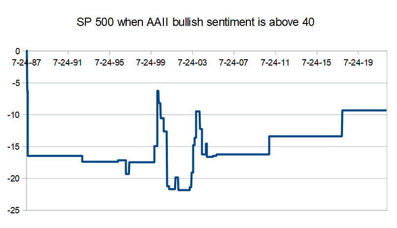

In algorithmic trading, sentiment indicators are increasingly employed to gauge investor attitudes and improve trading strategies. One significant tool in this domain is the AAII Investor Sentiment Index, which serves as a barometer for individual investor sentiments regarding stock market directions. By measuring the balance of bullish and bearish sentiments, this index provides a nuanced understanding of investor psychology, thereby allowing traders to strategize more effectively.

Understanding and making use of the AAII Sentiment Index within algorithmic frameworks can potentially augment trading approaches. Sentiment data aids traders in anticipating market shifts, contributing to more informed decisions and enhanced timing of trades. Leveraging such data involves evaluating its calculation, observing its backtesting results, and determining its predictive role in market behavior. This article aims to illuminate the incorporation of the AAII investor sentiment in algorithmic trading, thus underscoring its valuable role in predicting market trends and refining trading strategies.



## Table of Contents

## Understanding Market Sentiment and Indicators

Market sentiment represents the collective outlook and emotional stance of investors and traders within the financial markets. It encapsulates the prevailing attitudes and expectations regarding future price movements, thus influencing buying and selling behaviors. An essential aspect of market sentiment is its ability to drive market behavior, often leading to price fluctuations that deviate from underlying fundamentals.

Sentiment indicators play a crucial role in quantifying these psychological trends. The AAII (American Association of Individual Investors) Sentiment Index is a prominent example of such an indicator, utilizing surveys to assess investors' perspectives on market directions over a short to medium-term horizon, typically about six months.

These indicators are designed to anticipate shifts in investor moods and potential resultant market moves. For instance, a predominantly bullish sentiment may suggest growing investor confidence, potentially leading to price increases as more investors buy into the market. Conversely, a bearish sentiment typically signals caution or pessimism, prompting sell-offs and resulting in price declines.

Traders harness sentiment indicators to gauge market psychology effectively. By understanding the collective sentiment, they can make informed decisions, especially in identifying periods of extreme market optimism or pessimism that might precede significant market reversals. 

Sentiment indicators like the AAII are particularly beneficial when used alongside other analytical tools to form a comprehensive trading strategy. They help traders anticipate market dynamics that purely technical or [fundamental analysis](/wiki/fundamental-analysis) may not fully capture, thereby enhancing their ability to react to and predict market trends accurately.

## What is the AAII Sentiment Index?

The AAII Sentiment Index is a prominent sentiment indicator derived from a weekly survey conducted by the American Association of Individual Investors (AAII). This index serves as a barometer for gauging the collective sentiment of individual investors in the stock market, offering insights into how they perceive market conditions over the subsequent six months.

The survey methodology involves polling AAII members, who are asked about their expectations for the stock market: whether they feel bullish, neutral, or bearish. These responses are crucial in forming the sentiment index. Specifically, the survey asks participants to categorize their outlook as follows:

1. **Bullish**: Investors believing the stock market will rise over the next six months.
2. **Neutral**: Investors expecting no significant change in the market within six months.
3. **Bearish**: Investors anticipating a decline in the market over the same period.

Once the responses are collected, the AAII computes the percentage of responses in each category. A critical aspect of this index is the calculation of the bull-bear spread, which is the difference between the percentage of bullish responses and bearish responses. Mathematically, this can be expressed as:

$$
\text{Bull-Bear Spread} = \text{Percentage of Bullish Responses} - \text{Percentage of Bearish Responses}
$$

The bull-bear spread is instrumental in understanding the overall market sentiment. A positive spread indicates a prevalence of bullish sentiment, suggesting optimism among investors. Conversely, a negative spread reflects a bearish outlook, implying skepticism or pessimism about future market performance.

The AAII Sentiment Index is widely regarded as a contrarian indicator. Historically, extreme readings, either overwhelmingly bullish or bearish, can signal potential market turning points. This sentiment data is leveraged by traders and analysts to forecast market trends and inform trading and investment strategies.

## Why AAII Sentiment Matters in Algo Trading

In [algorithmic trading](/wiki/algorithmic-trading), the integration of sentiment data such as the AAII Sentiment Index can significantly enhance decision-making processes, primarily through its ability to identify potential market reversals. Sentiment data serves as a valuable tool for algorithms to recognize moments when the market may be overbought or oversold, which can be pivotal for optimizing trade timing.

The AAII Sentiment Index, by reflecting the bullish, neutral, or bearish inclinations of individual investors, offers insights into crowd psychology—a critical aspect of financial markets that often precedes substantial market shifts. By analyzing this index, algorithmic traders can gauge the collective mood and sentiments of the market participants. This understanding allows algorithms to adapt their trading strategies, anticipating shifts in market conditions that might not be evident through traditional technical analysis alone.

In practice, algorithms equipped with sentiment analysis components can alter their operation based on the detected sentiment trend. For example:

```python
def decide_trade(aaii_sentiment):
    if aaii_sentiment > 0.5:  # Bullish sentiment threshold
        return "Sell"  # Market potentially overbought
    elif aaii_sentiment < -0.5:  # Bearish sentiment threshold
        return "Buy"  # Market potentially oversold
    else:
        return "Hold"

current_aaii_sentiment = get_current_aaii_sentiment_data()
trade_decision = decide_trade(current_aaii_sentiment)
```

In this simple Python example, a basic threshold mechanism is used to decide whether to buy, sell, or hold. This logic harnesses the potential of the sentiment index to detect market conditions that might not be apparent through price action or [volume](/wiki/volume-trading-strategy) alone.

Ultimately, the AAII Sentiment Index provides a lens into investor behavior and market psychology. This perspective can significantly influence algorithmic trade outcomes by aligning algorithmic actions with prevailing investor sentiments, which often correlate with impending market movements. As a result, the integration of sentiment data like AAII into algorithmic trading systems can yield a more nuanced and responsive trading approach, potentially improving overall trading performance.

## Backtesting the AAII Sentiment Strategy

Backtesting the AAII Sentiment Strategy involves a careful evaluation of historical data to assess the utility of the sentiment index in developing profitable trading strategies. The American Association of Individual Investors (AAII) Sentiment Survey provides weekly insights reflecting the short-term market sentiments of individual investors—whether they are bullish, bearish, or neutral about the stock market's prospects over the next six months. Traders using the AAII Sentiment Index often design strategies that capitalize on the contrarian nature of market sentiment.

### Performance of Sentiment-Based Strategies

A common sentiment-based strategy involves buying stocks when the sentiment is predominantly bearish, indicating potentially oversold conditions, and selling when the sentiment is bullish, suggesting overbought conditions. This contrarian perspective hinges on the belief that the majority investor sentiment often leads rather than lags market reversals.

**Risk-Adjusted Returns:** To evaluate these strategies effectively, it is essential to consider risk-adjusted returns. The Sharpe ratio is a widely-used measure for scrutinizing the performance of sentiment-based strategies. It is calculated as follows:

$$
\text{Sharpe Ratio} = \frac{R_p - R_f}{\sigma_p}
$$

Where:
- $R_p$ is the return of the portfolio.
- $R_f$ is the risk-free rate of return.
- $\sigma_p$ is the standard deviation of the portfolio's excess return.

An above-average Sharpe ratio indicates that the strategy compensates well for the risk taken, which is crucial in sentiment-driven approaches.

### Strengths and Drawbacks in Synthetic Environments

**Strengths:**
1. **Understanding Market Psychology:** Sentiment indicators provide a window into investor psychology. By interpreting these signals, traders may anticipate changes in market trends.
2. **Contrarian Opportunities:** By betting against prevailing sentiments, especially extremes, traders can exploit corrections or swings in market prices, potentially enhancing returns.
3. **Integration with Machine Learning:** Incorporating sentiment data into algorithmic models often yields a richer dataset that can improve the prediction accuracy of machine learning algorithms.

**Drawbacks:**
1. **Noise in Sentiment Data:** Sentiments represent opinions and may not always correlate directly with market fundamentals, introducing noise.
2. **Timing Complexity:** While the sentiment may eventually indicate a reversal, the timing can remain elusive, causing potential early-entry issues.
3. **Reaction Lag:** Not all sentiment moves translate into immediate market reactions, leading to potential periods of drawdowns.

### Results from Synthetic Backtesting Environments

In testing environments, using historical sentiment data aids in examining how such strategies would have performed over time, taking into consideration hypothetical trades placed based on sentiment signals. Such [backtesting](/wiki/backtesting) generally involves:
- **Data Preparation:** Historical sentiment scores alongside corresponding market data are organized to simulate real-world trading scenarios.
- **Strategy Execution:** Trading algorithms buy when sentiment achieves bearish extreme scores and sell when bullish sentiments peak. The decision thresholds are often set based on historical benchmarks.
- **Performance Evaluation:** Key performance indicators, such as cumulative returns, maximum drawdowns, and the previously mentioned Sharpe ratio, are computed to gauge the strategy's viability.

Despite the challenges, sentiment-driven strategies demonstrate potential, particularly when supplemented by other technical indicators or market signals, presenting a layered approach to market analysis.

## Integrating AAII Sentiment with Algorithmic Trading Models

Integrating the AAII sentiment index into algorithmic trading models involves leveraging the investor sentiment data to enhance [machine learning](/wiki/machine-learning) models and improve predictive accuracy. By understanding and incorporating shifts in sentiment, traders can design more adaptive algorithms that react to changes in investor psychology. This capability allows for the anticipation of potential market movements, providing a strategic advantage in trading.

A key aspect of integrating sentiment analysis is combining it with traditional technical indicators to develop a multi-layered trading strategy. Technical indicators, such as moving averages, RSI (Relative Strength Index), and MACD (Moving Average Convergence Divergence), offer insights into price trends and market [momentum](/wiki/momentum). Adding sentiment indicators, like the AAII index, complements these by offering insights into the psychological aspects of market dynamics.

For example, a trader could develop an algorithm that triggers buy or sell signals based on the convergence of technical indicators and sentiment shifts. Suppose the AAII sentiment index shows a persistent bearish sentiment while technical indicators suggest an oversold condition. In that case, the algorithm might signal a buying opportunity, anticipating a reversal based on historical patterns of crowd psychology leading to market shifts.

The integration process can be implemented using Python's machine learning libraries such as scikit-learn or TensorFlow. A basic framework might include:

```python
import pandas as pd
from sklearn.model_selection import train_test_split
from sklearn.ensemble import RandomForestClassifier
from sklearn.metrics import accuracy_score

# Sample data loading (sentiment and technical indicators)
data = pd.read_csv('trading_data.csv')  # This dataset should contain technical indicators and sentiment scores

# Assuming sentiment index and indicators are pre-processed
X = data[['technical_indicator1', 'technical_indicator2', 'sentiment_score']]
y = data['market_movement']  # Target variable indicating upward or downward movement

# Split the data
X_train, X_test, y_train, y_test = train_test_split(X, y, test_size=0.2, random_state=42)

# Model training
model = RandomForestClassifier()
model.fit(X_train, y_train)

# Predictions
predictions = model.predict(X_test)

# Evaluate model performance
accuracy = accuracy_score(y_test, predictions)
print(f'Model Accuracy: {accuracy:.2f}')
```

Such a model employs both sentiment data and technical analysis to predict market movements. The multidimensionality of this approach enables the handling of complex market scenarios, potentially uncovering trading opportunities that might remain undetected using a single data source.

In sum, integrating AAII sentiment data into algorithmic trading models enriches the accuracy and responsiveness of trading strategies by providing nuanced insights into both technical trends and investor psychology. As the complexity of financial markets continues to grow, the ability to synthesize diverse data types will likely become even more critical for successful algorithmic trading.

## Conclusion: The Future of Sentiment in Algo Trading

The AAII sentiment index provides algorithmic traders with vital insights into investor outlooks, fundamentally enhancing trading strategies. By integrating sentiment data, algorithms gain the ability to project investor behavior and market momentum, offering a more comprehensive understanding of potential market movements. Despite the complexities involved in interpreting and applying sentiment indicators, their inclusion into trading models serves to refine prediction capabilities and improve response accuracy.

Future developments in sentiment analysis and algorithmic trading hold promise for even greater integration and efficacy. Innovations in natural language processing and machine learning may enhance the ability to interpret unstructured data from diverse sources, such as social media and news articles, leading to a more nuanced understanding of market sentiment. Additionally, the continuous improvement of computational power and data processing techniques supports the incorporation of these complex datasets without sacrificing performance.

As sentiment analysis techniques become more sophisticated, they are likely to be seamlessly integrated with technical analysis to form robust, multifaceted trading strategies. This synthesis could minimize the gap between understanding market psychology and executing precise technical strategies, ultimately driving more informed and strategic trading decisions. Thus, the AAII sentiment index will remain a pivotal component of advanced algorithmic trading models, marking a trending evolution towards data-driven market analysis.

## Frequently Asked Questions (FAQ)

### Frequently Asked Questions (FAQ)

**How does the AAII sentiment index impact trading strategies?**

The AAII Sentiment Index influences trading strategies by offering insights into the prevailing market sentiment among individual investors. When the index indicates a predominantly bullish sentiment, traders might anticipate potential market rallies due to widespread optimistic expectations. Conversely, a bearish sentiment can signal a cautious or declining market, guiding traders towards more conservative strategies. By integrating the AAII sentiment index, traders aim to identify sentiment-driven market trends and adjust entry and [exit](/wiki/exit-strategy) points to optimize returns and mitigate risks.

**What are the key takeaways from backtesting AAII sentiment-based trading systems?**

Backtesting AAII sentiment-based trading systems reveals several insights:

1. **Trend Identification**: Historical analysis often shows that extreme sentiment readings (either very high bullishness or bearishness) can precede trend reversals. Trading strategies aligned with such patterns can capitalize on subsequent market movements.

2. **Risk Management**: By examining historical data, traders can assess the volatility associated with sentiment-driven trades, allowing for better risk management strategies such as position sizing and stop-loss placements.

3. **Performance Metrics**: Backtests typically evaluate metrics like the Sharpe ratio and maximum drawdown to determine the risk-adjusted return of sentiment-based strategies. A successful strategy often demonstrates a favorable balance between risk and return.

4. **Limitations**: While backtesting provides valuable insights, past performance is not always indicative of future results. Market conditions, sentiment dynamics, and other factors may evolve, affecting strategy effectiveness.

**Can sentiment indicators like the AAII reliably predict market movements?**

Sentiment indicators like the AAII offer a lens into investor psychology, which can forecast potential market movements. However, their predictive power is not absolute. While extreme sentiment levels may herald upcoming reversals or continuations, relying solely on sentiment can be misleading if not corroborated with other market data. Sentiment indicators are best utilized as part of a comprehensive trading strategy that includes technical and fundamental analyses to increase predictive reliability.

**What challenges arise when integrating sentiment analysis into algo trading models?**

Integrating sentiment analysis into algo trading models presents several challenges:

1. **Data Quality**: Sentiment data, often derived from surveys or social media, can be noisy or subject to biases. Ensuring data accuracy and reliability is crucial for effective model integration.

2. **Latency**: In fast-moving markets, the lag between sentiment data collection and its application can reduce the effectiveness of sentiment-based signals.

3. **Complexity**: Capturing nuanced sentiment shifts requires sophisticated natural language processing and machine learning techniques, which can increase model complexity and computational costs.

4. **Overfitting**: There's a risk that models may be overfitted to historical sentiment data, leading to suboptimal performance in real-time trading conditions.

These challenges highlight the necessity for robust model validation, continuous monitoring, and adaptive strategies to successfully integrate sentiment analysis into algorithmic trading.

## References & Further Reading

[1]: Gallup, R., & Pump, J. (2019). ["Sentiment Analysis for Financial Markets."](https://www.gallup.com/workplace/245786/gallup-reports-share-leaders-2019.aspx) arXiv preprint arXiv:1805.10106.

[2]: ["The Complete Guide to Market Breadth Indicators"](https://www.amazon.com/Complete-Guide-Market-Breadth-Indicators/dp/0071444432) by Gregory L. Morris

[3]: Baker, M., & Wurgler, J. (2007). ["Investor Sentiment in the Stock Market"](https://www.aeaweb.org/articles?id=10.1257/jep.21.2.129). The Journal of Economic Perspectives, 21(2), 129–151.

[4]: Sra, S., Nowozin, S., & Wright, S. J. (Eds.). (2012). ["Optimization for Machine Learning"](https://direct.mit.edu/books/edited-volume/2929/Optimization-for-Machine-Learning). MIT Press.

[5]: Tetlock, P. C. (2007). ["Giving Content to Investor Sentiment: The Role of Media in the Stock Market"](https://onlinelibrary.wiley.com/doi/abs/10.1111/j.1540-6261.2007.01232.x). The Journal of Finance, 62(3), 1139-1168.