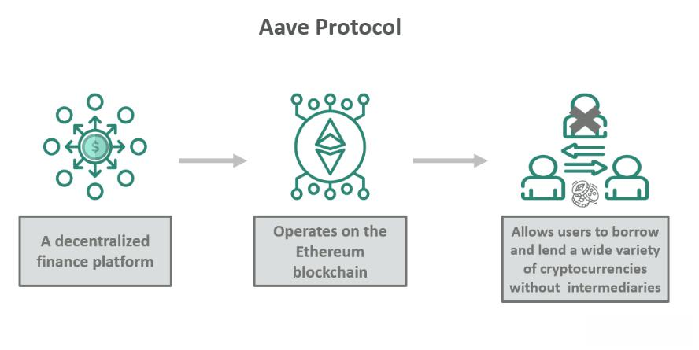

Decentralized Finance (DeFi) is reshaping traditional financial structures by utilizing blockchain technology to create open and permissionless financial systems. This transformation offers new investment avenues that are not only innovative but also accessible to a broader audience. DeFi platforms operate without intermediaries, reducing costs and friction in financial transactions. One of the prominent players in this burgeoning space is Aave, a decentralized platform known for its novel crypto lending and borrowing services. Aave leverages smart contracts to automate and manage these transactions transparently and securely, thereby eliminating the need for traditional financial intermediaries.

Aave's significance in the DeFi ecosystem is underscored by its unique features, such as Flash Loans and overcollateralized loans. Flash Loans, in particular, have gained attention for enabling instant, unsecured borrowing, provided the loan is repaid within the same transaction. This feature is invaluable for arbitrage, refinancing, and other advanced DeFi strategies, setting Aave apart as an innovative force in decentralized finance.



Concurrently, the cryptocurrency market is witnessing substantial growth in algorithmic trading, reflecting a trend that has long been a staple in traditional financial markets. Algorithmic trading utilizes computer programs to execute trading strategies at speeds and frequencies beyond human capabilities. By deploying algorithms, traders can automate decision-making processes based on pre-defined criteria such as price movements, thereby increasing the efficiency and precision of trades.

The integration of these technologies presents a compelling proposition. As Aave continues to expand its capabilities within the DeFi landscape, the confluence of its offerings with algorithmic trading tools provides investors with the opportunity to optimize their trading strategies and maximize yield generation. This synergy not only enhances the efficiency of trading activities but also positions Aave as a pioneering entity in the future of finance, where traditional and decentralized systems increasingly intersect.

This article will examine Aave's pivotal role in the evolving DeFi landscape, as well as its potential to enhance algorithmic trading practices, offering a comprehensive guide to the opportunities and challenges within these cutting-edge financial technologies.

## Table of Contents

## Understanding Aave: A DeFi Giant

Aave is a prominent decentralized finance (DeFi) platform that operates on the Ethereum blockchain, specializing in facilitating crypto lending and borrowing. As a decentralized protocol, Aave removes traditional intermediaries such as banks or brokers from financial transactions. Instead, it uses smart contracts—self-executing contracts with the terms of the agreement directly written into code—to ensure transparency and security. This structure not only bolsters trust among users but also reduces transaction costs associated with conventional financial systems.

One of Aave's standout features is its system of overcollateralized loans, which requires borrowers to deposit assets worth more than the loan they intend to take. This mechanism acts as a safeguard, protecting lenders from the risk of borrower default. For example, if a borrower wants to take a loan in the form of a stablecoin, they would first have to deposit a more volatile asset like Ethereum (ETH) that exceeds the loan's value. In this way, should the borrower fail to repay the loan, the collateral can be liquidated to cover the outstanding amount.

In addition to traditional lending, Aave has pioneered the concept of Flash Loans, a groundbreaking innovation in decentralized finance. A Flash Loan is a type of unsecured loan that must be borrowed and repaid within a single blockchain transaction, offering unprecedented speed and flexibility for traders. This feature is particularly useful for [arbitrage](/wiki/arbitrage), collateral swapping, and refinancing of debts. The repayment condition ensures that either the transaction is executed entirely, or it is rolled back, maintaining the protocol’s security.

Aave has managed to accumulate substantial [liquidity](/wiki/liquidity-risk-premium), which underpins its position as a leading choice for flexible, decentralized financial operations. This robust liquidity is essential for supporting large-scale lending and borrowing activities on the platform. The liquidity pools, funded by users who deposit their assets to earn interest, provide the necessary resources for borrowers. As of now, Aave offers a diverse range of assets for lending and borrowing, including major cryptocurrencies and stablecoins, making it a versatile tool for DeFi participants.

The platform’s success and resilience in the competitive DeFi landscape can be attributed to its continuous innovations and its emphasis on security and user experience. By leveraging smart contract technology, Aave continues to push the boundaries of what decentralized finance can achieve, providing both individual and institutional investors with efficient and reliable financial solutions.

## Aave's Unique Crypto Lending System

Aave is a prominent player in the DeFi space, known for its innovative approach to crypto lending through its unique overcollateralized loan system. By requiring borrowers to provide collateral exceeding the value of the loan, Aave ensures that lenders are protected from default risks. This system mitigates the [volatility](/wiki/volatility-trading-strategies) associated with cryptocurrencies, as the collateral serves as a buffer against potential losses. For example, if a borrower wishes to take a loan of 100 DAI (a stablecoin), they might be required to provide collateral worth 150 USDC, another stablecoin, effectively preserving the lender's position even in tumultuous market conditions.

## Staking AAVE Tokens

Aave enables users to stake AAVE tokens, the platform's native [cryptocurrency](/wiki/cryptocurrency), as a method to earn interest and enhance liquidity. Staking involves locking up AAVE tokens in the platform's smart contracts, which contributes to the security and stability of the protocol. In return, participants receive staking rewards, which are generally paid out from the protocol's revenue or inflationary mechanisms. This system incentivizes users to commit their assets long-term, which increases the overall liquidity available for lending and borrowing activities.

Staking is also a critical part of Aave's governance model. Token holders have the power to vote on key protocol changes and decisions, ensuring that the platform evolves in a way that aligns with the community's interests.

```python
total_reward = (staked_aave * annual_percentage_rate) / 100
```
The formula above calculates the total reward for staking AAVE tokens, where `staked_aave` is the number of tokens staked and `annual_percentage_rate` is the annual return offered.

## Decentralized Nature and User Responsibility

Aave operates without intermediaries, relying on smart contracts to automate processes such as loan issuance and liquidation. This decentralized nature provides users with greater autonomy but also requires them to manage their own risks. Users must monitor the health of their positions actively, ensuring their collateral does not fall below the required threshold due to market fluctuations.

In the event of a collateral shortfall, Aave's protocol automatically triggers a liquidation process. The user's assets are sold off to cover the loan, ensuring the lending pool remains solvent. Consequently, leveraging such a decentralized platform necessitates a comprehensive understanding of market dynamics and proactive risk management strategies.

In summary, Aave's overcollateralized loans, coupled with AAVE token staking, offer a robust framework for maintaining lender security and promoting platform liquidity. However, the responsibility of managing risks and understanding the intricacies of the DeFi landscape lies with the users, necessitating an informed and cautious approach to participation.

## Algorithmic Trading and Aave

Algorithmic trading in the cryptocurrency market utilizes technology to execute trades based on predefined strategies. This approach to trading is particularly advantageous in environments with high volatility and liquidity, such as those offered by decentralized finance (DeFi) platforms like Aave. By automating trading strategies, investors can optimize yield generation and manage risks more effectively.

Aave, as a prominent DeFi protocol, presents a valuable opportunity for algorithmic traders. Through its decentralized structure and smart contract capabilities, Aave allows users to lend and borrow cryptocurrencies with unique features like Flash Loans. These loans can be obtained without collateral and repaid within a single transaction, providing a mechanism for traders to exploit arbitrage opportunities and rebalance portfolios efficiently.

Automated trading strategies typically rely on a set of algorithms to analyze market data and execute trades with minimal human intervention. This process involves the use of statistical models to predict price movements and develop trading rules. For example, a simple algorithmic strategy might use moving averages to signal buy or sell decisions:

```python
def moving_average_strategy(prices, short_window, long_window):
    signals = pd.DataFrame(index=prices.index)
    signals['price'] = prices['close']
    signals['short_mavg'] = prices['close'].rolling(window=short_window, min_periods=1, center=False).mean()
    signals['long_mavg'] = prices['close'].rolling(window=long_window, min_periods=1, center=False).mean()
    signals['signal'] = 0.0
    signals['signal'][short_window:] = np.where(signals['short_mavg'][short_window:] > signals['long_mavg'][short_window:], 1.0, 0.0)
    signals['positions'] = signals['signal'].diff()
    return signals
```

By integrating Aave into such automated strategies, traders can optimize yield generation through efficient capital utilization. Flash Loans enable rapid execution of complex strategies without locking assets in long-term positions, maximizing returns on investment. 

Moreover, automated strategies provide distinct benefits in terms of risk management and execution speed. By predefining rules, traders can mitigate emotional decision-making, leading to more consistent and disciplined management of investment portfolios. Speed is a crucial [factor](/wiki/factor-investing); in the fast-paced crypto markets, algorithms can execute trades within fractions of a second, capitalizing on fleeting opportunities that human traders might miss.

However, it's important to recognize the complexity involved in implementing these strategies. Traders must continuously monitor and adjust their algorithms to respond to market changes, ensuring their strategies remain effective over time. Additionally, the decentralized and open-source nature of protocols like Aave necessitates robust risk management practices to safeguard against potential vulnerabilities inherent in smart contract technology. 

By leveraging Aave's innovative platform features within automated trading systems, traders can enhance their ability to generate yields, manage risks, and maintain a competitive edge in the cryptocurrency market.

## Risks and Challenges in Aave and Algo Trading

Decentralized Finance (DeFi) platforms like Aave present significant opportunities but also [carry](/wiki/carry-trading) inherent risks. A primary risk associated with Aave is the volatility of cryptocurrencies. The values of collateral provided by borrowers can fluctuate dramatically, potentially leading to under-collateralization if a borrower's collateral falls below the required threshold. In such cases, the platform might execute automatic liquidations to maintain the network's stability, creating losses for users.

Another significant risk is the lack of insurance or protection against smart contract vulnerabilities or platform failures. While Aave's smart contracts are audited, they are not immune to bugs or exploits, which can result in financial losses. Users must also consider the platform's operational risk, including possible downtime or malfunctions that could impact trading activities.

Algorithmic trading introduces additional technical challenges, particularly in volatile crypto markets. Market fluctuations can disrupt algorithms designed to execute trades based on predefined rules. Algorithms might not react as intended to rapid price swings, potentially leading to unanticipated losses. Moreover, the complexity of developing, testing, and maintaining robust algorithms requires sophisticated expertise in quantitative finance and programming, posing a barrier for some investors.

To manage these risks, traders and investors can adopt several strategies:

1. **Diversification**: Spread collateral across different assets to reduce exposure to the volatility of any single cryptocurrency.

2. **Stop-Loss Orders**: Implement stop-loss mechanisms within trading algorithms to automatically sell assets if the price drops to a certain level, minimizing potential losses.

3. **Periodic Rebalancing**: Adjust portfolio allocations regularly to align with current market conditions, thereby reducing the impact of market volatility.

4. **Backtesting Algorithms**: Test trading strategies against historical data to ensure they perform well under various market conditions before deployment in live markets.

5. **Risk Management Protocols**: Establish comprehensive risk management protocols that include position sizing, capital allocation limits, and continuous monitoring of market conditions.

Incorporating these best practices can enhance the security and effectiveness of using Aave in [algorithmic trading](/wiki/algorithmic-trading) scenarios, potentially yielding balanced risk-reward profiles. As the DeFi landscape evolves, staying informed and adaptable is crucial for leveraging Aave in a way that maximizes opportunities while mitigating inherent risks.

## Leveraging Aave for Future Crypto Investments

Aave's innovative features offer significant opportunities for integration into broader investment strategies, particularly in the dynamic and rapidly evolving landscape of decentralized finance (DeFi). One of Aave's core advantages is its decentralized and transparent nature, which aligns with the ethos of reducing reliance on traditional financial intermediaries. This allows investors to incorporate Aave's products into diverse portfolios that prioritize autonomy, security, and potential returns.

Aave's platform features, such as variable and stable interest rates, enable investors to tailor their strategies to different market conditions. By choosing stable rates, risk-averse investors can secure predictable returns despite market volatility. Meanwhile, those willing to navigate fluctuating interest rates might opt for variable rates, potentially enhancing yields during favorable conditions.

In expanding beyond lending and borrowing, Aave's Flash Loans represent a groundbreaking tool that can be used within more complex trading strategies. Flash Loans, executed within a single Ethereum transaction without collateral, allow arbitrage opportunities, refinancing debt, or engaging in collateral swaps—capabilities that could be central to sophisticated algorithmic trading systems. By leveraging smart contracts, investors can automate these processes, ensuring executions that are both swift and efficient.

Governance and community play pivotal roles in the growth and stability of the Aave platform. The decentralized governance model empowers AAVE token holders to vote on protocol updates, risk parameters, and new feature deployments. This collective decision-making process ensures that the platform adapts to user needs while maintaining security and reliability. A robust governance framework not only fosters community trust but also ensures that Aave evolves in line with the rapidly changing DeFi landscape.

Looking ahead, future trends in DeFi and algorithmic trading highlight the potential for increased merging of these technologies. The rise of layer 2 scaling solutions and interoperability protocols could enhance Aave's capabilities, reducing transaction costs and expanding its reach across different blockchain networks. Additionally, advancements in [artificial intelligence](/wiki/ai-artificial-intelligence) and [machine learning](/wiki/machine-learning) could further refine algorithmic trading strategies, optimizing returns through improved data analysis and predictive modeling.

For investors, staying attuned to these developments is crucial for anticipating market shifts and opportunities. As DeFi continues to mature, tools like Aave, when integrated with cutting-edge algorithmic strategies, can offer a balanced approach to crypto investments that emphasizes both innovation and risk management.

## Conclusion

Aave has firmly established itself as a transformative force within Decentralized Finance (DeFi), significantly influencing the crypto lending market. By providing a decentralized platform for crypto lending and borrowing, Aave eliminates the need for traditional financial intermediaries, offering greater transparency and accessibility. The protocol's innovative features, such as overcollateralized loans and Flash Loans, facilitate rapid trade execution and have attracted substantial liquidity, making Aave a cornerstone of DeFi.

Algorithmic trading plays a crucial role in improving efficiency within cryptocurrency markets. By automating trading strategies through predefined rules, algorithmic trading increases the speed of execution and optimizes risk management, thus providing a competitive edge to traders. When combined with Aave's flexible lending system, algorithmic trading can enhance yield generation by taking advantage of automated, real-time market opportunities.

The integration of Aave and algorithmic trading holds significant potential for generating lucrative, risk-managed crypto investments. As technology continues to advance, the intersection of DeFi platforms like Aave and sophisticated trading algorithms places investors in a strong position to capitalize on market volatility while mitigating associated risks. Consequently, Aave and algorithmic trading are poised to become integral components of strategic crypto investment portfolios, offering a blend of innovation and security in a constantly evolving financial landscape.

## References & Further Reading

[1]: Kuo Chuen, D.L., & Guo, L. (2017). ["Cryptocurrency and Blockchain: Technology, Economics, and Regulation."](https://en.wikipedia.org/wiki/Guo_Moruo) Academic Press.

[2]: Schär, F. (2021). ["Decentralized Finance: On Blockchain- and Smart Contract-based Financial Markets."](https://www.stlouisfed.org/publications/review/2021/02/05/decentralized-finance-on-blockchain-and-smart-contract-based-financial-markets) Journal of Economic Perspectives, 35(3), 233-248.

[3]: Antonopoulos, A. M., & Wood, G. (2018). ["Mastering Ethereum: Building Smart Contracts and DApps."](https://www.amazon.com/Mastering-Ethereum-Building-Smart-Contracts/dp/1491971940) O'Reilly Media.

[4]: Gans, J., Gandal, N., & Neil, G. (2018). ["A Short Introduction to the Economics of Blockchain Technology."](https://www.nber.org/system/files/working_papers/w26534/w26534.pdf) NBER Working Paper No. 25045.

[5]: Bornholdt, S., & Sneppen, K. (2014). ["Do Bitcoins make the world go round? On the dynamics of competing crypto-currencies."](https://arxiv.org/abs/1403.6378) The European Physical Journal B, 87(10).