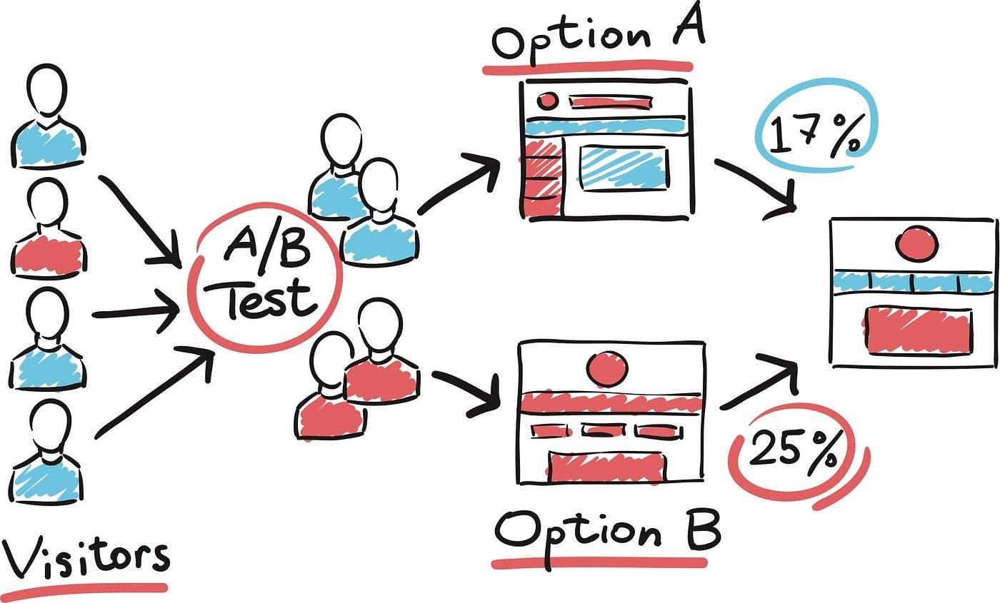

## Table of Contents

## What is A/B testing in the context of machine learning?

A/B testing in machine learning is a way to compare two versions of something to see which one works better. Imagine you have two different ways to show a webpage or two different algorithms for recommending products. You want to know which one makes more people click or buy. So, you split your users into two groups: Group A sees the first version, and Group B sees the second version. Then, you collect data on how each group behaves and use statistics to decide which version is better.

The key to A/B testing is making sure the test is fair and the results are clear. You need enough people in each group so the results are reliable. You also need to make sure that the only difference between the groups is the version they see. If Group A and Group B are different in other ways, like age or location, it might affect the results. After running the test for a while, you use a statistical test to see if the difference in behavior between the groups is big enough to say one version is better than the other. This helps you make better decisions based on real data.

## Why is A/B testing important for machine learning models?

A/B testing is important for machine learning models because it helps us figure out which model works better in the real world. When we build a new model, we want to know if it's better than the old one. By using A/B testing, we can show the new model to some people and the old model to others. Then, we can see which group does better. This way, we can make sure that any changes we make to our models actually help and don't hurt.

It also helps us make sure our models are doing what we want them to do. Sometimes, a model might look good on paper or in a test environment, but it might not work as well with real people. A/B testing lets us see how our models perform in the real world, with real users. This is important because it helps us keep improving our models based on actual results, not just guesses.

## How does A/B testing differ from traditional statistical hypothesis testing?

A/B testing and traditional statistical hypothesis testing share a common goal of comparing groups to see if there's a significant difference. In A/B testing, we often focus on comparing two versions of something, like a website or a [machine learning](/wiki/machine-learning) model, to see which one performs better in a real-world setting. We split our audience into two groups, show each group a different version, and then analyze the results to see if one version leads to better outcomes. The focus is on practical decision-making, often in a business or product development context.

Traditional statistical hypothesis testing, on the other hand, is more about testing a specific hypothesis about a population. For example, we might want to test if a new drug works better than a placebo. We would set up a null hypothesis, like $$H_0: \mu_1 = \mu_2$$, which says there's no difference between the groups, and an alternative hypothesis, like $$H_1: \mu_1 \neq \mu_2$$, which says there is a difference. We then collect data, calculate a test statistic, and use a p-value to decide if we can reject the null hypothesis. The focus here is more on scientific inquiry and understanding the underlying population parameters.

While both methods use statistical tools, A/B testing is more applied and focused on direct comparison in real-world scenarios. Traditional hypothesis testing is often more formal and used in academic or scientific settings to draw broader conclusions about populations. Both approaches are valuable, but they serve slightly different purposes and are used in different contexts.

## What are the key steps involved in setting up an A/B test for a machine learning model?

To set up an A/B test for a machine learning model, you start by clearly defining what you want to measure. This could be click-through rates, conversion rates, or any other performance metric that matters to you. Next, you need to prepare two versions of your model: the current one (let's call it model A) and the new one you want to test (model B). Make sure everything else stays the same so that the only difference between the two groups is which model they're using. Then, you split your users into two groups randomly. Group A will use model A, and Group B will use model B. It's important to make sure the groups are similar in size and characteristics to get fair results.

After setting up the test, you run it for a set period of time to collect data on how each group performs. You need enough data to make your results reliable, so you might need to wait until you have a good number of users in each group. Once you have the data, you analyze it to see if there's a significant difference between the two groups. You can use a statistical test, like a t-test, to check if the difference is big enough to say that one model is better than the other. If the p-value from your test is below a certain threshold, usually 0.05, you can conclude that the difference is statistically significant. Based on this, you decide whether to keep using the current model or switch to the new one.

## How do you determine the sample size needed for an A/B test in machine learning?

To determine the sample size needed for an A/B test in machine learning, you need to think about how big a difference you want to be able to detect between the two models. This is called the effect size. You also need to decide how sure you want to be that the difference you see is real, not just by chance. This is called the power of the test, usually set at 80% or 90%. Another thing to consider is how much risk you're willing to take that you might say there's a difference when there really isn't one. This is called the significance level, often set at 5%, which means a p-value of 0.05.

Once you have these values, you can use a sample size calculator or a formula to figure out how many people you need in each group. A common formula for calculating sample size for a two-sample t-test is $$ n = \frac{(Z_{\alpha/2} + Z_{\beta})^2 \cdot (2\sigma^2)}{\delta^2} $$, where $$ n $$ is the sample size per group, $$ Z_{\alpha/2} $$ is the Z-score for the significance level, $$ Z_{\beta} $$ is the Z-score for the power, $$ \sigma $$ is the standard deviation of the outcome variable, and $$ \delta $$ is the effect size you want to detect. This formula helps you make sure your test has enough people to give you reliable results, so you can trust the outcome of your A/B test.

## What metrics should be used to evaluate the performance of machine learning models in A/B testing?

When evaluating the performance of machine learning models in A/B testing, you should focus on metrics that show how well the model is doing in the real world. For example, if you're testing a recommendation system, you might look at the click-through rate (CTR), which tells you how often people click on the recommendations made by each model. Another important metric could be the conversion rate, which shows how often a click leads to a purchase or some other desired action. These metrics help you see if the new model (model B) is better at getting people to engage with your product compared to the old model (model A).

You might also want to look at other metrics depending on what your model is trying to do. For instance, if your model is predicting something, you could use accuracy, which tells you how often the model's predictions are correct. Or you might use the F1 score, which balances precision and recall, especially if you're dealing with imbalanced data. The key is to pick metrics that really show how well the model is working for your specific goals. By comparing these metrics between the two groups in your A/B test, you can decide if the new model is worth switching to.

## How can you ensure the validity of an A/B test when testing machine learning algorithms?

To ensure the validity of an A/B test when testing machine learning algorithms, it's important to start with a clear plan. This means defining what you want to measure and making sure the two groups in your test are similar in every way except for which model they use. Randomly assign users to either Group A or Group B, ensuring that the sample size in each group is large enough to detect the difference you're looking for. You can calculate the needed sample size using a formula like $$ n = \frac{(Z_{\alpha/2} + Z_{\beta})^2 \cdot (2\sigma^2)}{\delta^2} $$, where $$ n $$ is the sample size per group, $$ Z_{\alpha/2} $$ and $$ Z_{\beta} $$ are Z-scores for your chosen significance level and power, $$ \sigma $$ is the standard deviation of your outcome variable, and $$ \delta $$ is the effect size you want to detect. This helps you make sure your test results are reliable.

Once your test is running, keep an eye on it to make sure nothing else is changing that could affect the results. After collecting enough data, analyze it carefully. Use statistical tests, like a t-test, to see if the difference between the two groups is big enough to say one model is better than the other. If the p-value is below your chosen significance level (usually 0.05), you can conclude that the difference is statistically significant. It's also important to check for any biases or errors in how you collected or analyzed the data. By following these steps, you can trust that your A/B test results are valid and that you're making a good decision about which model to use.

## What are common pitfalls to avoid when conducting A/B tests on machine learning models?

One common pitfall when conducting A/B tests on machine learning models is not having a big enough sample size. If you don't have enough people in each group, your results might not be reliable. You can use a formula like $$ n = \frac{(Z_{\alpha/2} + Z_{\beta})^2 \cdot (2\sigma^2)}{\delta^2} $$ to figure out how many people you need. Another mistake is not keeping everything else the same for both groups. If something else changes, like the time of day or the type of users, it can mess up your results. Make sure the only difference between the groups is which model they use.

Another issue is running the test for too short a time. You need enough time to collect good data. If you stop the test too early, you might miss important trends or make a wrong decision. Also, be careful not to look at the data too often while the test is running. If you keep checking the results and stop the test as soon as you see a difference, you might think there's a difference when there really isn't one. This is called "peeking" and can lead to false positives. So, plan your test carefully and stick to your plan to make sure your results are valid.

## How can multi-armed bandit algorithms be used to optimize A/B testing in machine learning?

Multi-armed bandit algorithms can help make A/B testing in machine learning better by figuring out the best model faster. In a regular A/B test, you split your users evenly between two models and wait until the end to see which one is better. But with a multi-armed bandit, you start by trying out both models. As you get results, the algorithm learns which model works better and starts sending more users to that model. This way, you can find the best model quicker and start using it for more people, instead of waiting until the end of the test.

For example, if you're testing two recommendation algorithms, the multi-armed bandit might start by showing each algorithm to half of your users. If Algorithm A starts getting better results, the bandit will send more new users to Algorithm A. This keeps going until you're sure which algorithm is better. The key formula for deciding how to allocate users is often based on something called the "upper confidence bound" (UCB), which is calculated as $$ UCB_i = \bar{x}_i + \sqrt{\frac{2 \ln n}{n_i}} $$. Here, $$ \bar{x}_i $$ is the average reward for model i, n is the total number of trials, and $$ n_i $$ is the number of times model i has been tried. By using this, you can balance exploring new models and exploiting the one that seems to work best so far.

## What advanced statistical techniques can enhance the analysis of A/B testing results in machine learning?

One advanced statistical technique that can enhance the analysis of A/B testing results in machine learning is the use of Bayesian methods. Instead of just saying if one model is better than another with a yes or no answer, Bayesian methods let you update your beliefs about which model is better as you get more data. This is helpful because it gives you a more detailed picture of how sure you are about your results. For example, you can use a formula like $$ P(\text{model A is better} | \text{data}) = \frac{P(\text{data} | \text{model A is better}) \cdot P(\text{model A is better})}{P(\text{data})} $$ to figure out how likely it is that model A is better than model B given the data you've collected. This can help you make better decisions, especially when you don't have a lot of data yet.

Another technique is using regression models to look at A/B test results. Instead of just comparing average outcomes, regression can help you see how different factors, like user age or time of day, affect the results. This can give you a deeper understanding of why one model might be doing better than another. For example, you could use a linear regression model to see if the effect of using model A versus model B changes depending on user characteristics. By including these factors in your analysis, you can make your A/B test results more accurate and useful for making decisions about which model to use.

## How do you handle the ethical considerations of A/B testing in machine learning applications?

When conducting A/B tests in machine learning, it's important to think about the ethical side of things. One key issue is making sure that users know they are part of a test. This is called informed consent. You should tell users that you are testing different versions of your model and get their okay before starting. Also, think about fairness. Make sure that the test doesn't treat some groups of people differently in a way that could harm them. For example, if you're testing a new way to recommend jobs, make sure it doesn't unfairly leave out certain groups of people.

Another ethical consideration is privacy. When you run an A/B test, you collect data on how users interact with your models. It's important to keep this data safe and use it only for the test. Don't share personal information without permission. Also, think about the impact of the test on users. If one version of the model is much worse than the other, it could harm the users who get that version. Try to make sure that both versions are good enough that users won't be hurt by being in the test. By considering these ethical points, you can make sure your A/B tests are fair and respectful to the people using your machine learning models.

## What are the latest trends and future directions in A/B testing for machine learning?

One of the latest trends in A/B testing for machine learning is the integration of more sophisticated statistical techniques, such as Bayesian methods. These methods allow for a more nuanced understanding of test results by providing probabilities of one model being better than another, rather than just a binary decision. For example, using a formula like $$ P(\text{model A is better} | \text{data}) = \frac{P(\text{data} | \text{model A is better}) \cdot P(\text{model A is better})}{P(\text{data})} $$, you can continuously update your beliefs about the models as more data comes in. This can be particularly useful in dynamic environments where quick decisions are needed. Another trend is the use of multi-armed bandit algorithms to optimize the testing process. Instead of splitting users evenly between models, these algorithms dynamically allocate more users to the model that seems to be performing better, allowing for faster identification of the best model.

Looking to the future, A/B testing in machine learning is likely to become even more personalized and adaptive. With advancements in technology, it will be possible to tailor tests to individual users or specific subgroups, enhancing the relevance and effectiveness of the results. Ethical considerations will also play a larger role, with an increased focus on ensuring fairness and transparency in testing practices. For instance, ensuring that A/B tests do not inadvertently discriminate against certain groups will be crucial. Additionally, the integration of A/B testing with other machine learning techniques, such as [reinforcement learning](/wiki/reinforcement-learning), could lead to more robust and efficient ways to optimize models in real-time, making the process of improving machine learning models even more dynamic and responsive to user needs.