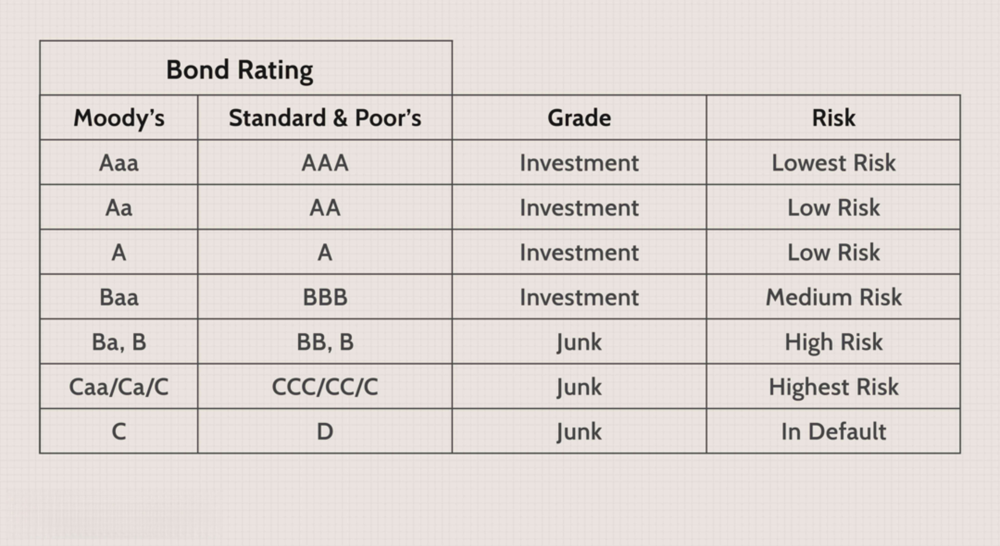

Financial indexes serve as critical indicators in the global economy, providing a barometer for evaluating the performance of various financial markets or sectors. These indexes are composed of a selection of related securities whose aggregate performance is tracked and reported. They facilitate an understanding of market trends and are fundamental in the assessment of investment performance, forming benchmarks against which the performance of individual portfolios or securities can be measured. A well-known example would be the S&P 500 Index, which represents the performance of 500 of the largest companies listed on US stock exchanges.

A specific type of financial index, the banking index, is particularly designed to track the performance of the banking sector. It provides insights into the financial health and stability of banks, reflecting factors such as health of loans, interest income, and overall market conditions affecting banking institutions. Major global banking indexes include the KBW Bank Index and the STOXX Europe 600 Banks Index. These indexes are instrumental for analysts and investors as they provide a focused view of the banking landscape, aiding in the assessment of sector-specific trends and investment prospects.



In modern financial markets, algorithmic trading, often abbreviated as algo trading, has revolutionized the way transactions are executed. This approach employs sets of rules or algorithms to automatically execute trades at optimal speeds and efficiencies. Algorithms are typically designed to take advantage of small price discrepancies and execute transactions based on pre-set instructions related to timing, price, or quantity. The increased role of algo trading is driven by its advantages, such as speed, precision, and the ability to process and analyze vast amounts of market data in real-time.

The objective of this article is to explore the intricate relationship between financial indexes, banking indexes, and algorithmic trading (ABA). By closely examining these interconnections, investors and traders can gain a comprehensive understanding of how these elements influence financial markets and the opportunities they present for optimizing investment strategies. The insights derived from this exploration are crucial for informed decision-making and for navigating the increasingly sophisticated landscape of global financial markets. As financial markets continue to evolve and technology advances, understanding the dynamics of financial indexes and algo trading becomes indispensable, marking their growing importance in shaping investment strategies.

## Table of Contents

## Understanding Financial Indexes

A financial index serves as a representative measurement of the performance of a specific section of the financial market. This tool aggregates selected financial instruments, enabling investors, economists, and policymakers to gauge market trends, benchmark investment returns, and perform economic forecasts.

Various types of financial indexes exist, each tailored to different market sectors. Stock market indexes, such as the S&P 500 or FTSE 100, compile a selected group of stocks to represent the broader equity market's movements. Bond indexes track the performance of certain types of bonds, providing insights into the fixed-income market. For commodities, indexes like the Bloomberg Commodity Index reflect the prices of raw materials and other commodities, informing stakeholders about trends in the market for physical goods.

The components of a financial index typically include a selection of securities or assets chosen based on specific criteria, such as market capitalization, industry sector, or geographic location. The structure of an index is dependent on its weighting methodology. Commonly used methods include price-weighted, market capitalization-weighted, and equal-weighted approaches. In a price-weighted index, such as the Dow Jones Industrial Average, higher-priced stocks have a more significant impact on the index value. Alternatively, a market capitalization-weighted index, like the S&P 500, assigns more weight to companies with larger market values. Equal-weighted indexes treat all components equally, regardless of their market size or price.

The calculation of an index often involves a formula that aggregates the individual component values according to the chosen weighting scheme. For instance, a market-cap weighted index value $I$ might be computed using:

$$
I = \frac{\sum_{i=1}^{n} (P_i \times Q_i)}{D}
$$

where $P_i$ is the price of stock $i$, $Q_i$ is the quantity of shares outstanding for stock $i$, and $D$ is the divisor, adjusted for stock splits and dividends.

Financial indexes are invaluable for investors because they provide benchmarks for assessing the performance of an individual investment or portfolio. By comparing their portfolio returns against a relevant index, investors can determine whether they are outperforming or underperforming the market. Additionally, indexes facilitate passive investment strategies, such as index funds or exchange-traded funds (ETFs), allowing investors to replicate the performance of an index and benefit from broad market trends with relatively low costs.

## Exploring the Banking Index

A banking index is a financial metric that aggregates the performance of a selection of banking stocks within a specific market or region. It serves as an indicator for the overall health and economic condition of the banking sector. By tracking the stock prices of a group of banks, a banking index provides insights into the financial stability and growth prospects of these institutions, reflecting broader trends within the sector.

Banking indexes are utilized by analysts and investors as a means of gauging sector performance. By observing changes in a banking index, stakeholders can infer the collective market sentiment towards the banking industry, comparing it against other sectors or overall market movements. These indexes are critical tools for identifying trends, evaluating risk, and making informed decisions about banking stocks. For example, a rising banking index might suggest increased investor confidence and potential profitability, whereas a declining index could indicate challenges or downturns within the sector.

Several prominent banking indexes are recognized globally. The KBW Bank Index is a widely acknowledged benchmark representing the performance of leading national money center banks and regional institutions in the United States. The index comprises 24 banks and is part of the broader financial sector indexes. Another significant index is the STOXX Europe 600 Banks Index, covering major European banking stocks, which is particularly useful for evaluating the European banking industry's performance in response to regional economic developments.

Factors influencing the performance of banking indexes are multifaceted. Regulatory changes play a crucial role; policies affecting capital requirements, lending practices, and compliance can substantially impact banks' operational capabilities and profitability. Economic conditions are another major determinant; [interest rate](/wiki/interest-rate-trading-strategies) fluctuations, inflation rates, and economic growth influence banks' revenue generation and cost structures. Crises, such as financial downturns, can lead to increased default rates which negatively affect bank valuations and, consequently, the index.

In summary, banking indexes are vital for tracking and predicting the banking sector's trajectory, enabling stakeholders to make better-informed investment decisions. Understanding the dynamics of these indexes and the factors that influence them is essential for navigating the complex landscape of financial markets.

## The Rise of Algorithmic Trading (ABA)

Algorithmic trading, commonly referred to as algo trading, employs computerized algorithms to perform trades at speeds and frequencies that are beyond the capability of human traders. These algorithms are sets of rules and instructions coded to execute trading strategies, such as deciding on the timing, pricing, and quantity of orders based on predefined criteria. The advent of high-frequency trading ([HFT](/wiki/high-frequency-trading-strategies)), a subset of [algorithmic trading](/wiki/algorithmic-trading), further accelerates this process, enabling transactions to occur in fractions of a second.

The evolution of algorithmic trading began in the late 20th century with the advancement of computer technology and electronic trading platforms. Initially, algorithms focused on executing large stock orders with minimal market impact, a practice known as "program trading." Over time, the use of algorithmic strategies expanded to exploit a myriad of market opportunities, such as [arbitrage](/wiki/arbitrage), trend-following, and [market making](/wiki/market-making).

A significant milestone in the growth of algo trading was the decimalization of U.S. stock prices in 2001, which reduced the minimum price movement (tick size) from 1/16 of a dollar to $0.01, creating new opportunities for high-frequency strategies. By 2010, algorithmic trading accounted for approximately 60-73% of all U.S. equity trading volumes, driven by the remarkable increase in speed and efficiency provided by technological advancements.

Advantages of algorithmic trading include enhanced efficiency, as algorithms can process vast amounts of data and execute trades much faster than humans. The precision of algorithms helps minimize human errors, which are prevalent in manual trading. Furthermore, algorithmic trading enables the [backtesting](/wiki/backtesting) of strategies using historical data to predict their performance in live markets, thus facilitating the optimization of trading outcomes.

Despite these advantages, algorithmic trading faces several criticisms and challenges. A primary concern is the potential for increased market [volatility](/wiki/volatility-trading-strategies). High-frequency trading strategies can exacerbate price movements due to their rapid execution of large volumes of trades, sometimes resulting in "flash crashes," where asset prices plummet before quickly recovering. One notable flash crash occurred on May 6, 2010, when the U.S. stock market rapidly lost nearly $1 trillion in value within minutes, partially attributed to automated trading systems.

Moreover, the rise of algorithmic trading has sparked concerns about market manipulation, as some market participants may engage in strategies like "quote stuffing," flooding the market with a large number of orders to create confusion or delay, and "spoofing," placing fake orders to deceive other traders about supply and demand dynamics.

In conclusion, while algorithmic trading offers considerable benefits in terms of speed, efficiency, and accuracy, it also introduces significant challenges that require ongoing oversight and regulation. As algorithmic techniques and their applications continue to evolve, understanding their impact on financial markets remains essential for regulators, investors, and traders alike.

## Interconnection: Financial Indexes, Banking Indexes, and Algo Trading

Financial and banking indexes are crucial indicators of market performance, mirroring a multitude of economic activities across various sectors. Algorithmic trading has become a significant force capable of influencing these indexes. This section explores how algorithmic trading, which uses automated systems and advanced algorithms for executing trades, intersects with financial and banking indexes, affecting their dynamics in multiple ways.

Algorithmic trading strategies heavily impact market [liquidity](/wiki/liquidity-risk-premium) and index performance. By executing trades at high speeds, these algorithms can enhance liquidity by adding more buy and sell orders to the market. This increased liquidity generally results in narrower bid-ask spreads, which can reduce transaction costs for investors. However, during periods of market stress or high volatility, algorithmic trading can exacerbate price swings, affecting index stability. For instance, high-frequency trading (HFT), a subset of algorithmic trading, might contribute to "flash crashes" where rapid selling results in significant short-term price drops.

Specific cases have demonstrated how algorithmic trading influences the value of banking indexes. On May 6, 2010, the "Flash Crash" saw the Dow Jones Industrial Average drastically plunge and recover within minutes, largely attributed to algorithmic trading. Although this event impacted broader financial indexes, banking stocks were notably affected due to their significant market representation and sensitivity to broad economic sentiment. The volatility altered the market's perception of risk within the banking sector, temporarily skewing banking index values.

Technology and data analysis play central roles in bridging indexes and algorithmic trading. Modern trading platforms deploy sophisticated algorithms fed by vast datasets to dynamically adjust portfolios in real-time. For example, many financial institutions use [machine learning](/wiki/machine-learning) models to parse historical data, predict market trends, and execute trades based on those predictions. Python has become a preferred language for developing these models due to its extensive libraries such as NumPy, pandas, and scikit-learn. These tools allow traders to efficiently handle and analyze large datasets, enabling more effective decision-making based on index movements.

```python
import pandas as pd
import numpy as np
from sklearn.linear_model import LinearRegression

# Example: Predicting Index Movements with Machine Learning
# Load financial data (this is a placeholder, replace with actual data source)
data = pd.read_csv('financial_data.csv')  

# Assume 'index_value' is the target variable and other columns feature variables
X = data.drop('index_value', axis=1)
y = data['index_value']

# Linear Regression Model
model = LinearRegression()
model.fit(X, y)

# Predict future index values
predicted_values = model.predict(X)
```
By leveraging these technologies, algorithmic trading can better adapt to rapid market changes, ensuring swift responsiveness to fluctuations in banking and broader financial indexes. This integration of data analysis and trading methodologies underscores the complexity and interdependency of modern financial markets. Understanding these connections between algorithmic trading and market indexes is essential for investors aiming to navigate today's financial landscape effectively.

## Implications for Investors and Traders

Individual investors and traders can significantly enhance their decision-making by utilizing financial and banking indexes. These indexes provide a comprehensive overview of market trends and sector performance, acting as benchmarks for evaluating investment outcomes. Financial indexes, such as stock market indexes, offer insights into the broader economic environment and help investors make informed choices regarding asset allocation and diversification. Banking indexes specifically focus on the financial health and performance of the banking sector, offering critical insights for those interested in financial stocks.

### Leveraging Financial and Banking Indexes

When investors track financial and banking indexes, they gain access to aggregated data that reflects market sentiment and sector-specific trends. For example, the performance of a banking index might reflect regulatory changes, interest rate movements, and economic health, all critical factors for investment strategies in financial stocks. By comparing personal portfolio performances against these benchmarks, investors can evaluate their strategies' effectiveness and make necessary adjustments.

### Integrating Algorithmic Trading into Portfolio Management

Algorithmic trading (algo trading) strategies can be seamlessly integrated into portfolio management, providing investors with tools to execute trades with precision and efficiency. Algorithms leverage financial and banking indexes to identify patterns and predict future movements. Investors can use algorithms to automate buy-and-sell decisions, thereby optimizing their portfolio based on real-time market data.

```python
import numpy as np

# Example: Simplified moving average crossover strategy using index price data
def moving_average(prices, window):
    return np.convolve(prices, np.ones(window), 'valid') / window

# Prices of a financial index
index_prices = np.array([100, 101, 102, 103, 102, 104, 106, 105, 107])

short_window = 3
long_window = 5

short_ma = moving_average(index_prices, short_window)
long_ma = moving_average(index_prices, long_window)

# Decision strategy
buy_signals = short_ma > long_ma[:len(short_ma)]
sell_signals = short_ma < long_ma[:len(short_ma)]

print("Buy signals:", buy_signals)
print("Sell signals:", sell_signals)
```

### Risks and Opportunities

While indexes offer valuable data and algo trading provides speed and efficiency, their interaction can introduce risks such as increased volatility driven by rapid, high-[volume](/wiki/volume-trading-strategy) trades. However, they also offer opportunities to capitalize on short-term market movements and arbitrage possibilities. Understanding the implications of algorithm-induced volatility on indexes can help investors avoid potential pitfalls and exploit beneficial conditions.

### Staying Informed

To successfully navigate these dynamic markets, investors must stay informed about changes within financial indexes, banking indexes, and advancements in algorithmic trading. This will enable them to anticipate market shifts and adjust strategies accordingly. Continuous education through financial news, market analysis, and participation in investment forums is essential for maintaining a competitive edge.

In conclusion, utilizing financial and banking indexes, coupled with algorithmic trading, can empower investors to make well-informed decisions. Awareness of the confluence of these elements and ongoing learning are crucial for optimizing investment strategies and achieving long-term financial goals.

## Conclusion

Financial indexes, including banking indexes, serve as vital indicators of market health and performance, providing investors with valuable benchmarks for assessing investment outcomes. These tools are especially crucial in tracking the dynamics of sectors like banking, where specific indexes such as the KBW Bank Index give insights into the broader financial stability and sectoral performance. In contrast, algorithmic trading (algo trading) has revolutionized the financial markets by introducing speed, efficiency, and data-driven precision into trading activities. This method utilizes complex algorithms for executing trades at high speeds, thereby reducing human error and increasing trading efficiency.

Understanding how algo trading interacts with financial and banking indexes is essential, as it can significantly influence market liquidity and index performance. The marriage of these technologies not only reflects the complexity and dynamism of modern financial markets but also underscores the importance of technological adaptation in financial operations. Investors and traders must grasp the nuances of these interactions to navigate today's financial landscape effectively.

The future trajectory of financial indexes and algorithmic trading promises even more significant integration. As technology advances, the interplay between these elements will likely intensify, offering new opportunities and challenges in global markets. Automation, [artificial intelligence](/wiki/ai-artificial-intelligence), and machine learning may play increasingly prominent roles, potentially reshaping trading strategies and market behaviors.

To optimize investment strategies, it is imperative for traders and investors to stay informed about ongoing developments in these fields. Continuous education and adaptation will be key to capitalizing on opportunities while mitigating potential risks. By understanding and leveraging the dynamics between financial indexes, banking indexes, and algorithmic trading, investors can better position themselves for success in the ever-evolving financial markets. The future of these elements holds potential for profound impacts on global economies, making it more important than ever for stakeholders to be proactive and informed.

## References & Further Reading

[1]: ["S&P 500 Index – S&P Dow Jones Indices"](https://www.spglobal.com/spdji/en/indices/equity/sp-500/)

[2]: ["Introduction to Algorithmic Trading Strategies Lecture Notes"](https://www.investopedia.com/articles/active-trading/101014/basics-algorithmic-trading-concepts-and-examples.asp) by NYU

[3]: Gomber, P., Arndt, B., Lutat, M., & Uhle, T. (2011). ["High-Frequency Trading."](https://www.semanticscholar.org/paper/High-Frequency-Trading-Gomber-Arndt/3d0ba8179934e0a45e85a184d1ec526616e2e213) SSRN Electronic Journal.

[4]: Harris, L. (2003). ["Trading and Exchanges: Market Microstructure for Practitioners."](https://books.google.com/books/about/Trading_and_Exchanges.html?id=xNfnCwAAQBAJ) Oxford University Press.

[5]: Aldridge, I. (2013). ["High-Frequency Trading: A Practical Guide to Algorithmic Strategies and Trading Systems."](https://books.google.com/books/about/High_Frequency_Trading.html?id=8QpIsVUMhmEC) Wiley Finance.

[6]: ["International Handbook of Banking and Finance"](https://books.google.com/books/about/Handbook_of_International_Banking.html?id=HIy3AAAAIAAJ) by Stuart I. Greenbaum, Anjan V. Thakor

[7]: López de Prado, M. (2018). ["Advances in Financial Machine Learning."](https://books.google.com/books/about/Advances_in_Financial_Machine_Learning.html?id=oU9KDwAAQBAJ) Wiley.