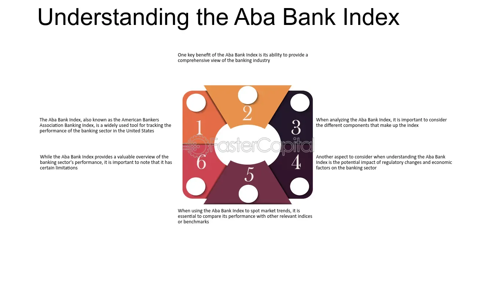

## Table of Contents

## What is the ABA Banking Index?

The ABA Banking Index is a tool that tracks how well banks in the United States are doing. It looks at the stock prices of a group of big banks to see if they are going up or down. This helps people understand how healthy the banking industry is at any given time.

People who invest money or work in the banking industry use the ABA Banking Index to make decisions. If the index goes up, it usually means that banks are doing well and making more money. If it goes down, it might mean that banks are having a tough time. This index is important because it gives a quick snapshot of the overall performance of the banking sector.

## Who created the ABA Banking Index?

The ABA Banking Index was created by the American Bankers Association (ABA). The ABA is a group that helps banks in the United States work together and do better. They started the index to give people a way to see how banks are doing overall.

The index looks at the stock prices of a bunch of big banks. By watching these prices, the ABA can tell if banks are making more money or if they are having problems. This helps people who invest money or work in banks make smart choices.

## What does the ABA Banking Index measure?

The ABA Banking Index measures how well banks in the United States are doing by looking at the stock prices of a group of big banks. It shows if the banks' stock prices are going up or down. This helps people see if the banking industry is healthy or not.

People who invest money or work in the banking industry use the ABA Banking Index to make decisions. If the index goes up, it means that banks are doing well and making more money. If it goes down, it might mean that banks are having a tough time. This index is important because it gives a quick and easy way to check the overall performance of the banking sector.

## How is the ABA Banking Index calculated?

The ABA Banking Index is calculated by looking at the stock prices of a group of big banks in the United States. Each bank's stock price is important, but the index takes the average of all these prices to show how the whole group is doing. If most of the banks' stock prices go up, the index goes up. If most of them go down, the index goes down too.

This way of calculating helps give a clear picture of the banking industry's health. The index doesn't just look at one bank; it looks at many, so it shows the overall trend. People who want to know if banks are doing well or not can check the ABA Banking Index to get a quick answer.

## What types of banks are included in the ABA Banking Index?

The ABA Banking Index includes big banks in the United States. These are usually the banks that people know well and that have a lot of money. They are the kind of banks that have branches all over the country and offer many different services to people and businesses.

The index does not include smaller banks or credit unions. It focuses on the big banks because their stock prices can show how the whole banking industry is doing. By looking at these big banks, the ABA Banking Index gives a good idea of whether the banking sector is healthy or not.

## How often is the ABA Banking Index updated?

The ABA Banking Index is updated every day. This means that people can check it every day to see how the big banks in the United States are doing. The index looks at the stock prices of these banks and shows if they are going up or down.

By updating every day, the ABA Banking Index gives a fresh look at the health of the banking industry. People who invest money or work in banks can use this daily update to make smart choices about what to do next.

## What is the historical performance of the ABA Banking Index?

The ABA Banking Index has had its ups and downs over the years. It goes up when the big banks in the United States are doing well, and it goes down when they are not. For example, during good economic times, like in the late 1990s and mid-2000s, the index often went up because banks were making a lot of money. But during tough times, like the 2008 financial crisis, the index dropped a lot because many banks were losing money and struggling.

Looking at the long-term trends, the ABA Banking Index has generally followed the overall health of the economy. When the economy is strong, the index tends to be high, showing that banks are doing well. When the economy is weak, the index is usually lower, reflecting the challenges banks face. Over the years, the index has been a useful tool for people to understand how the banking industry is doing and to make decisions based on that information.

## How does the ABA Banking Index compare to other financial indices?

The ABA Banking Index is different from other financial indices because it only looks at big banks in the United States. Other indices, like the S&P 500, include many different kinds of companies, not just banks. The S&P 500 shows how the whole stock market is doing, while the ABA Banking Index focuses just on the banking industry. This makes the ABA Banking Index a good tool for people who want to know about banks but not about other businesses.

Another index that people might compare to the ABA Banking Index is the KBW Bank Index. The KBW Bank Index also looks at banks, but it includes a different group of banks, some of which might be smaller than those in the ABA Banking Index. Both indices help people understand the banking industry, but they might give slightly different pictures because they look at different banks. The ABA Banking Index is useful for seeing how the biggest banks are doing, while the KBW Bank Index gives a broader view of the banking sector.

## What are the key factors that influence the ABA Banking Index?

The ABA Banking Index is influenced by many things, but the most important are the overall health of the economy and how well the big banks are doing. When the economy is doing well, people and businesses have more money to spend and invest. This means more people are borrowing from banks, and banks can make more money from loans and other services. If the economy is not doing well, fewer people want to borrow money, and banks might struggle to make profits. This can cause the stock prices of banks to go down, which makes the ABA Banking Index go down too.

Another big [factor](/wiki/factor-investing) is interest rates. When interest rates are low, it's easier for people to borrow money, and banks can make more loans. This usually helps the banks make more money, and their stock prices go up, pushing the ABA Banking Index higher. But when interest rates are high, borrowing becomes more expensive, and fewer people might want to take out loans. This can hurt the banks' profits and cause their stock prices to drop, which would lower the ABA Banking Index.

## How can investors use the ABA Banking Index to make informed decisions?

Investors can use the ABA Banking Index to see how the big banks in the United States are doing. If the index is going up, it means that the banks are doing well and making more money. This might be a good time for investors to buy stocks in these banks because their value could keep going up. On the other hand, if the index is going down, it might mean that the banks are having a tough time. Investors might want to be careful and think about selling their bank stocks or not buying new ones until the index starts to go up again.

The ABA Banking Index can also help investors understand the overall health of the economy. When the index is high, it often means that the economy is strong and people are borrowing more money from banks. This can be a good sign for investors to put money into other parts of the economy too. But if the index is low, it might mean that the economy is weak, and investors might want to be more careful with their money. By watching the ABA Banking Index, investors can make smarter choices about when to buy or sell bank stocks and how to plan their investments overall.

## What are the limitations of the ABA Banking Index?

The ABA Banking Index only looks at big banks in the United States. This means it does not show how smaller banks or credit unions are doing. If you want to know about the whole banking industry, including smaller banks, the ABA Banking Index might not give you the full picture. Also, the index focuses on stock prices, which can go up and down a lot because of things that have nothing to do with how well the banks are actually doing, like news or rumors.

Another limitation is that the ABA Banking Index does not tell you about other parts of the economy. It only shows how big banks are doing, but the economy has many other parts like manufacturing, technology, and retail. If you want to understand the whole economy, you need to look at other indices too. Also, the index can be affected by things like interest rates and government rules, which can change quickly and make the index go up or down even if the banks are doing okay.

## What future trends might affect the ABA Banking Index?

Future trends like technology and new rules could change the ABA Banking Index a lot. More people are using online banking and apps to do their banking. This means big banks need to spend money on new technology to keep up. If they do it well, their stock prices might go up, making the index go up too. But if they don't, their stock prices could go down, and the index would go down. Also, new rules from the government about how banks can lend money or what they need to do to stay safe could make banks spend more money or change how they work. This could affect their profits and the index.

Another big thing that could affect the ABA Banking Index is the economy. If the economy grows, more people will want to borrow money from banks, and banks will make more money. This would make the index go up. But if the economy has problems, like a recession, fewer people will want to borrow, and banks might lose money. This would make the index go down. Interest rates are also important. If they go up, borrowing money becomes more expensive, and banks might make less money from loans. If they go down, more people might borrow, and banks could make more money. All these things together will shape the future of the ABA Banking Index.

## What is the understanding of Financial Indexes?

A financial index serves as a representative measurement of the performance of a specific section of the financial market. This tool aggregates selected financial instruments, enabling investors, economists, and policymakers to gauge market trends, benchmark investment returns, and perform economic forecasts.

Various types of financial indexes exist, each tailored to different market sectors. Stock market indexes, such as the S&P 500 or FTSE 100, compile a selected group of stocks to represent the broader equity market's movements. Bond indexes track the performance of certain types of bonds, providing insights into the fixed-income market. For commodities, indexes like the Bloomberg Commodity Index reflect the prices of raw materials and other commodities, informing stakeholders about trends in the market for physical goods.

The components of a financial index typically include a selection of securities or assets chosen based on specific criteria, such as market capitalization, industry sector, or geographic location. The structure of an index is dependent on its weighting methodology. Commonly used methods include price-weighted, market capitalization-weighted, and equal-weighted approaches. In a price-weighted index, such as the Dow Jones Industrial Average, higher-priced stocks have a more significant impact on the index value. Alternatively, a market capitalization-weighted index, like the S&P 500, assigns more weight to companies with larger market values. Equal-weighted indexes treat all components equally, regardless of their market size or price.

The calculation of an index often involves a formula that aggregates the individual component values according to the chosen weighting scheme. For instance, a market-cap weighted index value $I$ might be computed using:

$$
I = \frac{\sum_{i=1}^{n} (P_i \times Q_i)}{D}
$$

where $P_i$ is the price of stock $i$, $Q_i$ is the quantity of shares outstanding for stock $i$, and $D$ is the divisor, adjusted for stock splits and dividends.

Financial indexes are invaluable for investors because they provide benchmarks for assessing the performance of an individual investment or portfolio. By comparing their portfolio returns against a relevant index, investors can determine whether they are outperforming or underperforming the market. Additionally, indexes facilitate passive investment strategies, such as index funds or exchange-traded funds (ETFs), allowing investors to replicate the performance of an index and benefit from broad market trends with relatively low costs.

## References & Further Reading

[1]: ["S&P 500 Index – S&P Dow Jones Indices"](https://www.spglobal.com/spdji/en/indices/equity/sp-500/)

[2]: ["Introduction to Algorithmic Trading Strategies Lecture Notes"](https://www.investopedia.com/articles/active-trading/101014/basics-algorithmic-trading-concepts-and-examples.asp) by NYU

[3]: Gomber, P., Arndt, B., Lutat, M., & Uhle, T. (2011). ["High-Frequency Trading."](https://www.semanticscholar.org/paper/High-Frequency-Trading-Gomber-Arndt/3d0ba8179934e0a45e85a184d1ec526616e2e213) SSRN Electronic Journal.

[4]: Harris, L. (2003). ["Trading and Exchanges: Market Microstructure for Practitioners."](https://books.google.com/books/about/Trading_and_Exchanges.html?id=xNfnCwAAQBAJ) Oxford University Press.

[5]: Aldridge, I. (2013). ["High-Frequency Trading: A Practical Guide to Algorithmic Strategies and Trading Systems."](https://books.google.com/books/about/High_Frequency_Trading.html?id=8QpIsVUMhmEC) Wiley Finance.

[6]: ["International Handbook of Banking and Finance"](https://books.google.com/books/about/Handbook_of_International_Banking.html?id=HIy3AAAAIAAJ) by Stuart I. Greenbaum, Anjan V. Thakor

[7]: López de Prado, M. (2018). ["Advances in Financial Machine Learning."](https://books.google.com/books/about/Advances_in_Financial_Machine_Learning.html?id=oU9KDwAAQBAJ) Wiley.