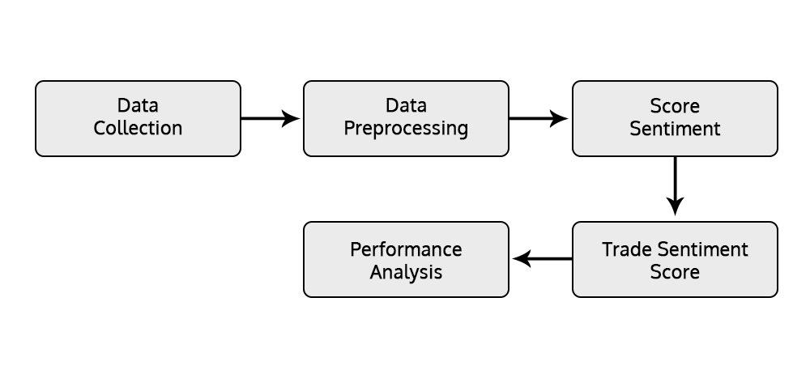

The abacus is a historical counting tool that, despite its ancient origins, maintains its relevance even today due to its simplicity and tactile nature. Developed over 2,000 years ago, the abacus consists of beads that slide on rods, allowing users to perform basic arithmetic operations such as addition, subtraction, multiplication, and division. Its enduring presence in educational settings illustrates its effectiveness in enhancing mathematical skills and cognitive development. This is particularly evident in its use for teaching arithmetic to young students and for individuals with visual impairments who rely on its tactile feedback for calculations. Furthermore, its utility is recognized in regions where electronic devices are impractical due to lack of infrastructure, underscoring its adaptability.

In contrast to the manual nature of the abacus, algorithmic trading, often referred to as algo trading, leverages advanced software to execute trades in financial markets based on pre-set conditions. This form of trading has revolutionized the finance industry by significantly reducing human error and eliminating emotional influences, offering unparalleled speed and efficiency. By using complex mathematical models and statistical analysis, algo trading enables traders to monitor markets and execute trades around the clock, thus optimizing their financial strategies and outcomes.



This article examines the intriguing connection between the abacus and algo trading, exploring how these seemingly disparate methods share a common goal: enhancing financial calculations and strategies. By considering the evolution from the abacus’s basic bead manipulations to the sophisticated algorithms that drive modern trading platforms, we gain insight into how ancient tools inform contemporary practices, showcasing the harmony between tradition and innovation in the pursuit of financial acumen.

## Table of Contents

## Modern Uses of the Abacus

The abacus has maintained its relevance in modern times, particularly within educational frameworks. Despite its ancient origins, it is a powerful tool for teaching arithmetic and enhancing mathematical skills, benefiting learners across various age groups. Its tactile nature provides a concrete understanding of numerical concepts, aiding in fundamental math education. The physical movement of beads aids in reinforcing basic arithmetic operations, such as addition, subtraction, multiplication, and division, offering a distinct advantage in visualizing mathematical processes.

Moreover, the abacus serves as a crucial tool for individuals with visual impairments. The bead-based system allows users to perform calculations through touch, making it an accessible and reliable method for those who might find digital interfaces challenging. By using the abacus, individuals can effectively engage in mathematical exercises independently, thereby facilitating inclusivity in educational and practical scenarios.

In certain contexts, the abacus proves indispensable where electronic devices may not be viable. Remote, underdeveloped regions often lack reliable access to electricity or advanced technology, making traditional tools more suitable. The abacus offers a durable and low-cost alternative, ensuring that even in resource-limited environments, effective arithmetic education and execution of calculations can be maintained.

As a testament to its continued importance, the abacus exemplifies how analog tools can coexist with digital advancements, providing a versatile platform to address diverse educational and practical challenges worldwide.

 to Algorithmic Trading

Algorithmic trading leverages sophisticated software to execute trading orders at speeds and with precision unattainable by human traders. This computerized trading mechanism utilizes predefined instructions based on factors such as timing, price, and [volume](/wiki/volume-trading-strategy), allowing for the systematic execution of trades. The efficiency of algo trading is underscored by its ability to process trades at optimal prices, significantly reducing market noise and enhancing trading efficiency. 

At the core of [algorithmic trading](/wiki/algorithmic-trading) are mathematical models and statistical analyses, which provide a robust framework for identifying profitable trading opportunities. These models consider a myriad of variables, such as historical price data, market trends, and [volatility](/wiki/volatility-trading-strategies) indicators. Traders use algorithms to apply strategies like mean reversion, [momentum](/wiki/momentum)-based trading, and [arbitrage](/wiki/arbitrage) by systematically exploiting price discrepancies and patterns.

A simple representation of an algorithm could be a moving average crossover system, one of the foundational strategies used in algo trading. This involves using two moving averages—a short-term average and a long-term average—to generate buy or sell signals. In Python, the implementation might resemble:

```python
import pandas as pd

# Load historical data
data = pd.read_csv('stock_data.csv')
short_window = 20
long_window = 50

# Calculate moving averages
data['Short_MA'] = data['Close'].rolling(window=short_window, min_periods=1).mean()
data['Long_MA'] = data['Close'].rolling(window=long_window, min_periods=1).mean()

# Generate buy/sell signals
data['Signal'] = 0
data['Signal'][short_window:] = np.where(data['Short_MA'][short_window:] > data['Long_MA'][short_window:], 1, -1)

# Export signals for execution
signals = data[['Date', 'Signal']]
signals.to_csv('trading_signals.csv', index=False)
```

Algorithmic trading systems operate autonomously, executing trades based on the data-driven insights provided by these complex algorithms. The automation allows traders to exploit opportunities round the clock without being hindered by human limitations such as fatigue and emotional bias. By continuously analyzing vast datasets and applying predefined criteria within nanoseconds, these algorithms significantly improve the speed and outcome of trading actions, catering to the high-frequency nature of modern financial markets.

## The Role of Calculation Tools in Algo Trading

Both the abacus and algorithmic trading exemplify the application of calculation tools designed to enhance financial outcomes. The abacus, an age-old device credited with aiding arithmetic operations, performs calculations based on the movement of beads governed by fixed rules. Likewise, algorithmic trading utilizes complex algorithms to execute trades where predetermined parameters and conditions dictate decisions.

Algorithmic trading systems leverage algorithms that are not unlike the operations of an abacus. In algorithmic trading, just as beads are shifted to denote numerical values and perform computations, data inputs and variables determine trading actions. This similarity underscores a shared dependency on pre-established rules to achieve desired results. Algorithms, typically constructed with numerous lines of code in languages like Python, C++, or Java, evaluate market indicators to decide when to buy or sell assets. Here's a simplified example in Python demonstrating a basic moving average algorithm used in trading decisions:

```python
def moving_average(prices, window):
    return [sum(prices[i:i+window])/window for i in range(len(prices)-window+1)]

prices = [120, 125, 130, 128, 135]
window_size = 3
average = moving_average(prices, window_size)
print(average)
```

This code computes the moving average of asset prices, a common technical indicator used by traders to smooth out price data, helping identify trends over time.

The evolution from manual calculations conducted by an abacus to sophisticated algorithm-driven trading systems represents a paradigmatic shift in capital markets' strategies and operations. This transition illustrates the journey from tangible manipulation of physical objects to intangible, automated decision-making processes executed at unprecedented speeds. Algorithmic trading has not only accelerated the execution and efficiency of trades but also extended market access to participants engaging across global exchanges around the clock.

Such a progression has deepened the understanding of markets, engendering analytical approaches that would be impossible with manual mechanisms alone. By harnessing the computational capacity of contemporary technology, modern traders can analyze vast datasets, backtest against historical market conditions, and optimize strategies for improved financial gain. Therefore, as with the manual dexterity required of abacus users, algorithmic trading demands precision in crafting algorithms that can effectively navigate complex markets to achieve optimal outputs.

## Algorithmic Trading Strategies

Algorithmic trading strategies leverage computational power to execute trading actions swiftly and precisely. Among the most prevalent strategies are arbitrage and trend-following.

Arbitrage strategies exploit price differences of identical or similar financial instruments in different markets or forms. For instance, an algorithm could be programmed to detect a price variance between a stock on the New York Stock Exchange and the same stock on the London Stock Exchange. The algorithm would then automatically execute trades to profit from this discrepancy. The essence of arbitrage lies in its ability to minimize risk by capitalizing on these price inefficiencies almost instantaneously, something only achievable through algorithmic precision.

Trend-following strategies, on the other hand, involve observing the historical price movements of financial assets to predict future trajectories. These algorithms are designed to identify and follow trends, making trades that align with the perceived direction of the market. For instance, if the algorithm detects an upward trend in a particular stock, it can trigger a buying action. Conversely, a downward trend may initiate a sell-off. The goal is to ride the trend until the algorithms detect a reversal or predefined conditions imply a trend's conclusion.

Successful development of algorithmic trading strategies demands rigorous [backtesting](/wiki/backtesting). Backtesting involves running the strategy through historical market data to gauge its effectiveness and refine its parameters. This process highlights potential weaknesses and helps fine-tune the strategy. Trillions of data points can be evaluated in minutes, allowing traders to adjust their algorithms to better fit the anticipated trading environment.

A significant advantage of algorithmic trading is its ability to diminish emotional involvement in trading decisions. Human traders are often prone to emotional biases, such as fear and greed, which can cloud judgment and lead to suboptimal decision-making. Algorithms, however, rely solely on data and predefined conditions, ensuring that trades are executed without emotional interference. This objectivity facilitates consistent execution of strategies, adhering strictly to the programmed rules irrespective of market turbulence.

The reduction of emotion, coupled with the precision and speed of algorithmic systems, marks a transformative shift in trading methodologies, enabling participants to exploit market opportunities continually and with enhanced accuracy. As a result, algorithmic trading has become an integral part of modern financial markets, offering the potential for higher efficiency and profitability.

## Technological and Educational Synergies

The integration of traditional calculation tools like the abacus with advanced algorithmic trading platforms highlights unique educational synergies. The abacus, an ancient tool, is instrumental in developing cognitive skills. It requires users to engage in tactile interactions, which aids in the internalization of arithmetic principles and enhances memory and concentration. This hands-on approach to learning mathematics provides a strong foundation in understanding numerical processes, fostering a deep sense of number comprehension and mental arithmetic.

On the other hand, algorithmic trading platforms represent the pinnacle of modern computation. They offer an interactive environment where individuals can observe how complex algorithms optimize trading strategies and adapt to dynamic market conditions. These platforms provide insights into the mechanics of algorithm design, from the formulation of conditional statements to the application of statistical models. For those unfamiliar with algorithmic principles, exploring these platforms can serve as an introduction to key concepts in software programming and quantitative analysis.

The juxtaposition of the abacus and algorithmic systems exemplifies the evolution of computational methods—from tangible manual interactions to intricate automated solutions. The educational value of this integration lies in demonstrating the continuity of mathematical reasoning, despite the shift in tools and methodologies. For instance, an abacus uses the physical manipulation of beads to represent simple arithmetic operations like addition and subtraction. Similarly, algorithmic trading employs conditional logic and decision-making processes to execute trades, often defined by rules akin to "if-then" statements in programming:

```python
# Example of a simple trading strategy in Python
def simple_moving_average(prices, window_size):
    moving_averages = []
    for i in range(len(prices) - window_size + 1):
        window = prices[i:i + window_size]
        window_average = sum(window) / window_size
        moving_averages.append(window_average)
    return moving_averages

# Usage of the function
prices = [100, 102, 104, 106, 108]
window_size = 3
print(simple_moving_average(prices, window_size))
```

In this context, education systems can benefit from utilizing the abacus to instill foundational skills while simultaneously introducing students to algorithmic logic. Educational institutions adopting both tools can prepare learners for a future where understanding both primitive and advanced computation is crucial. This fusion of old and new methodologies not only enriches the learning experience but also equips individuals with a comprehensive skill set, bridging the gap between historical techniques and cutting-edge technology.

## Challenges and Considerations

Transitioning from traditional tools like the abacus to digital systems such as algorithmic trading requires a comprehensive understanding of each system's mechanics and objectives. The abacus, with its tactile approach and manual calculations, provides a practical foundation for arithmetic, emphasizing the user's cognitive and motor skills. Its role in education and as an aid for the visually impaired highlights its enduring utility despite technological advancements. However, embracing innovation does not come without challenges. Those who utilize the abacus in educational settings must find a balance between preserving its historical significance and integrating modern methods that can enhance learning experiences. 

In modern finance, algorithmic trading exemplifies a sophisticated application of digital tools where predefined algorithms execute trades with precision and speed. Despite its advantages, algo trading is not without risks. Technical failures, such as software glitches, hardware malfunctions, or connectivity issues, can lead to significant financial repercussions. Traders must ensure robust systems are in place, incorporating fail-safes and redundancies to mitigate these risks. Moreover, the opacity of algorithmic decision-making processes can pose challenges for oversight and compliance, necessitating a thorough understanding and transparency in the design of these algorithms.

When designing algorithmic trading systems, it's crucial to consider the balance between speed and complexity. Algorithms must be tested extensively in various market conditions to identify any potential vulnerabilities. Backtesting, a method used to evaluate the effectiveness of a trading strategy using historical data, is fundamental. This involves running systematic simulations to ensure that the algorithm performs well under different scenarios, thus minimizing the likelihood of unexpected behaviors in live markets.

For educational purposes, combining traditional methods like the abacus with modern technological advancements can provide unique benefits. While the abacus fosters basic mathematical understanding and dexterity, digital tools illustrate the power of automation and algorithmic thinking. The challenge lies in crafting curricula that integrate these tools to enhance students' computational thinking skills while respecting the abacus's historical context.

The transition from the abacus to digital platforms like algorithmic trading encapsulates a broader narrative of technological evolution, highlighting the importance of both historical context and innovation in shaping modern computation and finance strategies. Maintaining a balance between the two ensures that as we move forward, we do so with a comprehensive appreciation of both past wisdom and modern advancements.

## Conclusion

The juxtaposition of the abacus and algorithmic trading portrays a fascinating journey from ancient calculation methods to the cutting-edge digital strategies employed today. This evolution highlights the enduring importance of calculation proficiency in making informed financial decisions and achieving economic goals. Whether one considers the tactile manipulation of beads on an abacus or the precise execution of trades through algorithms, both tools reflect the essential human endeavor to process numeric information efficiently.

While the abacus has historically served as a fundamental educational tool, fostering numerical insight and manual dexterity, algorithmic trading systems capitalize on this same foundational knowledge by applying complex algorithms and statistical models to execute trades. This shift from manual calculations to high-speed, automated processes marks a significant paradigm change in financial markets, yet the underlying goal remains the same: to optimize financial outcomes through careful analysis and execution.

Looking ahead, the integration of these historical practices with contemporary technologies promises substantial advancements in our financial capabilities. As traditional wisdom meets modern innovation, we are equipped to harness improved computational tools across various sectors, enhancing both accuracy and efficiency in data processing. This synergy not only underscores the timeless relevance of sound mathematical principles but also opens new avenues for growth and exploration in both educational and technological domains.

## References & Further Reading

[1]: Bergstra, J., Bardenet, R., Bengio, Y., & Kégl, B. (2011). ["Algorithms for Hyper-Parameter Optimization."](https://papers.nips.cc/paper/4443-algorithms-for-hyper-parameter-optimization) Advances in Neural Information Processing Systems 24.

[2]: ["Advances in Financial Machine Learning"](https://www.amazon.com/Advances-Financial-Machine-Learning-Marcos/dp/1119482089) by Marcos Lopez de Prado

[3]: ["Evidence-Based Technical Analysis: Applying the Scientific Method and Statistical Inference to Trading Signals"](https://www.amazon.com/Evidence-Based-Technical-Analysis-Scientific-Statistical/dp/0470008741) by David Aronson

[4]: ["Machine Learning for Algorithmic Trading"](https://github.com/stefan-jansen/machine-learning-for-trading) by Stefan Jansen

[5]: ["Quantitative Trading: How to Build Your Own Algorithmic Trading Business"](https://books.google.com/books/about/Quantitative_Trading.html?id=j70yEAAAQBAJ) by Ernest P. Chan