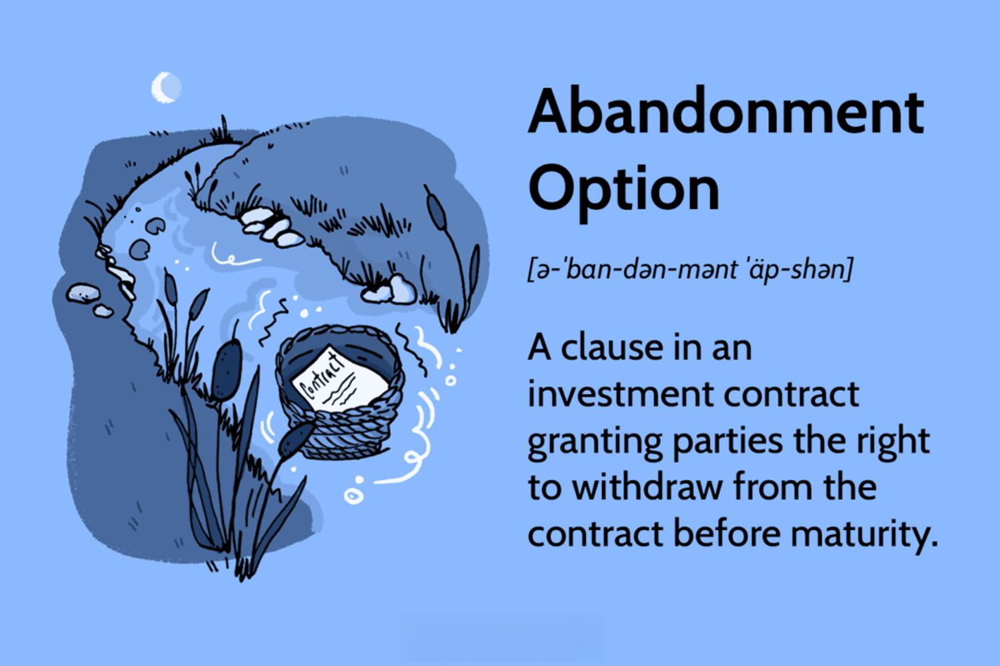

In the complex world of finance and investing, understanding key concepts such as abandonment mechanisms is crucial. Algorithmic trading, a method that uses algorithms to automate trading decisions, has become increasingly prevalent in financial markets. Within this context, abandonment mechanisms are critical components designed to handle situations where continuation in a particular trading strategy or investment becomes undesirable due to changing market conditions.

Abandonment mechanisms can be thought of as fail-safes within trading algorithms. They are programmed decisions that allow traders to exit positions or stop following a certain strategy when predefined criteria indicate that continuing could result in losses. This protective function is vital for traders and investors who need to swiftly adapt to market fluctuations, ensuring that their capital is shielded from adverse events.



The significance of abandonment mechanisms lies in their ability to mitigate risks, a fundamental consideration in algorithmic trading. These mechanisms act as a counterbalance to the speed and efficiency of trading algorithms. While algorithms execute trades faster and more precisely than humans, rapid market changes can sometimes turn a potentially profitable trade into a loss-making situation. Abandonment mechanisms address this by providing a way to halt or reverse a course of action, thereby enhancing the robustness of investment strategies.

Furthermore, incorporating abandonment mechanisms into trading algorithms equips traders with a powerful tool to refine and optimize their strategies. By preemptively planning for scenarios that may necessitate withdrawal, traders can better manage uncertainty and volatility. This article aims to provide readers with a comprehensive understanding of abandonment mechanisms, enabling them to navigate the complexities of algorithmic trading with greater confidence and competence.

## Table of Contents

## Understanding Abandonment Mechanisms

Abandonment in finance generally pertains to the conscious decision to exit an investment or contract due to changing conditions. In the context of algorithmic trading, abandonment mechanisms serve as essential protective tools, enabling algorithms to terminate specific trading actions when market conditions become unfavorable.

Abandonment mechanisms in trading algorithms are defined by predefined criteria and triggers. A primary characteristic of these mechanisms is their ability to assess market conditions and decide on the cessation of a trade. Common criteria that activate these mechanisms could include significant price drops, extreme volatility levels, or when a trade falls outside the risk parameters established by the trader.

Triggers for abandonment are typically built into the algorithm's decision-making process. These triggers can be based on quantitative metrics such as moving averages, stop-loss limits, or [volatility](/wiki/volatility-trading-strategies) indices. For instance, a moving average crossover, where a shorter moving average crosses below a longer one, might signal a downturn prompting an abandonment mechanism to activate and liquidate a position.

Algorithmic trading often features scenarios where abandonment mechanisms are critical. In highly volatile markets, for example, algorithms must be able to react promptly to sudden price movements to prevent significant losses. Another scenario could involve strategies that depend on maintaining a position only under certain market conditions, and should these conditions fail, the position is abandoned.

Overall, abandonment mechanisms integrate systematically within trading algorithms to manage risks and protect investments, ensuring that trades remain aligned with strategic goals and risk tolerance levels. Understanding the specifics of these mechanisms allows traders to develop more robust and adaptable [algorithmic trading](/wiki/algorithmic-trading) systems.

## The Importance of Abandonment in Algorithmic Trading

Algorithmic trading utilizes sophisticated algorithms to execute trading strategies with remarkable speed and accuracy, characteristics that outperform any human trader. As markets exhibit rapid changes, some trades may quickly become unprofitable, leading to potential financial losses. Here, abandonment mechanisms play a critical role in ensuring traders can efficiently withdraw from disadvantageous positions, thus mitigating risks.

The primary purpose of abandonment mechanisms in algorithmic trading is to provide a predefined [exit](/wiki/exit-strategy) strategy when market conditions shift unfavorably. These mechanisms are integral to risk management frameworks within trading algorithms, as they define the specific criteria under which a trade should be terminated. For instance, an algorithm can be programmed to abandon a trade when asset prices drop below a certain threshold or when volatility reaches unprecedented levels. This ensures prompt responses to market dynamics, minimizing potential losses long before they escalate.

By enabling automated decisions on position exits, abandonment mechanisms enhance the strategic capacity of trading algorithms. Traders are thereby equipped with the ability to abandon positions without delay, a capability crucial during periods of heightened market volatility. This not only protects investments but also enables the reallocation of resources to more promising opportunities, thereby optimizing the overall trading strategy.

Moreover, effective use of abandonment mechanisms allows traders to maintain [liquidity](/wiki/liquidity-risk-premium) and stability within their portfolios. By exiting losing positions early, traders can prevent capital from being locked in non-performing assets, thus keeping their trading activities agile and responsive to market conditions.

In conclusion, the strategic value of abandonment mechanisms within algorithmic trading lies in their capacity to safeguard investments and fortify risk management processes. By implementing these mechanisms, traders can better navigate the complexities of dynamic markets, reducing downside risk while capitalizing on profitable trades. This ensures sustained trading success and financial resilience in an ever-evolving trading landscape.

## Real-World Applications and Case Studies

Abandonment mechanisms have transitioned from theoretical ideals to practical tools employed in real-world trading scenarios. Their implementation can be observed in various situations, significantly contributing to improved trading outcomes and risk mitigation.

### Real-World Applications

One practical application of abandonment mechanisms is in high-frequency trading ([HFT](/wiki/high-frequency-trading-strategies)) environments, where rapid market changes can lead to volatile trading conditions. In such scenarios, algorithms are programmed to abandon positions if predefined risk metrics, such as maximum drawdown or volatility thresholds, are breached. For instance, an HFT firm might use a volatility index like the VIX to continually assess market conditions and trigger abandonment if volatility rises beyond an acceptable level.

### Case Studies

#### Case Study 1: Safeguarding Investments

A notable case involved a [quantitative trading](/wiki/quantitative-trading) firm that implemented abandonment mechanisms during a period of geopolitical uncertainty which led to increased market volatility. The firm’s technology monitored geopolitical news feeds using natural language processing to detect sentiment changes that could impact asset prices. Upon detecting negative sentiment, the algorithms promptly exited positions that were susceptible, successfully safeguarding the firm’s portfolio from potential losses. This proactive approach highlights the role of abandonment strategies in responding to exogenous shocks.

#### Case Study 2: Enhancing Trading Strategies

In another example, a [hedge fund](/wiki/hedge-fund-trading-strategies) adopted abandonment mechanisms to enhance its [momentum](/wiki/momentum)-based trading strategy. The firm incorporated a stop-loss abandonment feature that was dynamically adjusted based on intraday price fluctuations and liquidity conditions. By doing so, the strategy was able to limit drawdowns during sudden market reversals, leading to a more stable equity curve and improved Sharpe ratio.

### Impact During Market Volatility

Market volatility often presents significant challenges for traders, making abandonment mechanisms especially valuable. During the 2008 financial crisis, for example, many algorithmic trading systems that lacked effective abandonment protocols faced substantial losses. Conversely, those equipped with well-designed abandonment strategies were able to curtail their exposure and minimize financial damage. This resilience underscores the importance of integrating robust risk management tools in volatile environments.

### Lessons Learned

From these cases, several lessons emerge for optimizing algorithmic strategies. First, the integration of abandonment mechanisms should be aligned with a firm’s overall risk management framework. It's essential to custom-tailor these mechanisms to specific market conditions and trading objectives. Additionally, constant refinement and [backtesting](/wiki/backtesting) of abandonment criteria can help maintain their effectiveness in responding to evolving market dynamics. Finally, leveraging technological advancements such as [machine learning](/wiki/machine-learning) can further enhance the precision of abandonment triggers, ensuring more adaptive and responsive trading systems.

In summary, abandonment mechanisms are essential in modern trading practices, providing traders with the means to navigate uncertain and volatile markets effectively. By learning from real-world applications and case studies, traders can refine their strategies and improve the robustness of their trading operations.

## Challenges and Considerations

Implementing abandonment mechanisms in algorithmic trading algorithms entails several challenges. These challenges often arise from the inherent complexity and dynamic nature of financial markets. To design effective abandonment mechanisms, traders and developers must consider both technical and strategic aspects.

A primary technical consideration is the need for robust algorithms capable of assessing market conditions in real-time. Abandonment mechanisms rely on precise triggers to decide when to exit a position. These triggers often include key metrics such as price thresholds, volatility levels, or predefined loss limits. Ensuring accurate and timely data inputs is essential for the proper functioning of these mechanisms. An example implementation in Python may involve setting price thresholds:

```python
def should_abandon_trade(current_price, stop_loss):
    return current_price <= stop_loss

current_price = 95.0  # Example current market price
stop_loss = 100.0     # Example predefined stop-loss threshold

if should_abandon_trade(current_price, stop_loss):
    print("Abandon trade now to minimize losses")
```

Strategically, the design of abandonment mechanisms must align with the overall trading strategy and risk appetite of the investor. An overly sensitive mechanism may trigger frequent abandonment, leading to missed opportunities, while an overly lenient approach may result in significant losses. Balancing these opposing needs requires careful calibration of abandonment parameters.

Common pitfalls when setting up abandonment parameters include over-reliance on historical data without accounting for current market trends, and ignoring the impact of transaction costs on the profitability of exiting positions. Additionally, traders may inadvertently introduce biases into their algorithms by selecting parameters that fit past market conditions but are not adaptable to future changes.

Continuous monitoring and adjustments are critical to keep abandonment mechanisms effective. Market conditions are not static, and what constitutes a favorable exit strategy today may not hold tomorrow. Therefore, traders should regularly review and adjust their abandonment triggers and thresholds to reflect the latest market trends and their evolving trading objectives.

In conclusion, implementing abandonment mechanisms in algorithmic trading is fraught with complexities. Traders and developers must be diligent in addressing both technical and strategic considerations, avoiding common pitfalls, and ensuring continuous adjustments to adapt to ever-changing market dynamics. By overcoming these challenges, they can effectively leverage abandonment mechanisms to enhance trading outcomes and manage risks efficiently.

## Conclusion: Enhancing Trading Success

In conclusion, abandonment mechanisms are a crucial component of successful algorithmic trading strategies. These mechanisms empower traders to navigate the often volatile and unpredictable nature of financial markets with greater confidence. By understanding and appropriately implementing these tools, traders can manage risks more effectively, thereby improving trade profitability and stability.

Throughout this article, we discussed the definition of abandonment mechanisms and their critical role in algorithmic trading. These mechanisms provide traders with the ability to withdraw from trades that are no longer favorable, acting as a safeguard against sudden market shifts. Their importance extends to risk management, where they help mitigate potential losses, allowing traders to maintain a strategic advantage in dynamic environments.

The real-world applications and case studies examined demonstrate the practical impact of abandonment mechanisms. These examples illustrate how such mechanisms have successfully safeguarded investments and enhanced trading strategies, particularly during periods of market volatility. The lessons learned from these instances highlight the strategic value of incorporating abandonment mechanisms into trading algorithms.

However, the implementation of these mechanisms comes with its own set of challenges and considerations. Designing effective abandonment parameters requires careful thought and ongoing monitoring to ensure they remain relevant in ever-changing market conditions. Traders and developers must remain vigilant to avoid common pitfalls and continuously adjust their strategies as needed.

Readers are encouraged to apply these insights to their own trading systems and strategies. The effective use of abandonment mechanisms will not only enhance trading success but also contribute to greater financial stability. By integrating these tools into their algorithmic frameworks, traders can achieve more consistent returns and reduced exposure to unfavorable market conditions. Ultimately, abandonment mechanisms are invaluable in fostering a robust and adaptable trading strategy that can thrive in today's complex financial landscape.

## References & Further Reading

[1]: Bergstra, J., Bardenet, R., Bengio, Y., & Kégl, B. (2011). ["Algorithms for Hyper-Parameter Optimization."](https://proceedings.neurips.cc/paper/2011/file/86e8f7ab32cfd12577bc2619bc635690-Paper.pdf) Advances in Neural Information Processing Systems 24.

[2]: ["Advances in Financial Machine Learning"](https://www.amazon.com/Advances-Financial-Machine-Learning-Marcos/dp/1119482089) by Marcos Lopez de Prado

[3]: ["Evidence-Based Technical Analysis: Applying the Scientific Method and Statistical Inference to Trading Signals"](https://www.amazon.com/Evidence-Based-Technical-Analysis-Scientific-Statistical/dp/0470008741) by David Aronson

[4]: ["Machine Learning for Algorithmic Trading"](https://github.com/stefan-jansen/machine-learning-for-trading) by Stefan Jansen

[5]: ["Quantitative Trading: How to Build Your Own Algorithmic Trading Business"](https://www.amazon.com/Quantitative-Trading-Build-Algorithmic-Business/dp/1119800064) by Ernest P. Chan