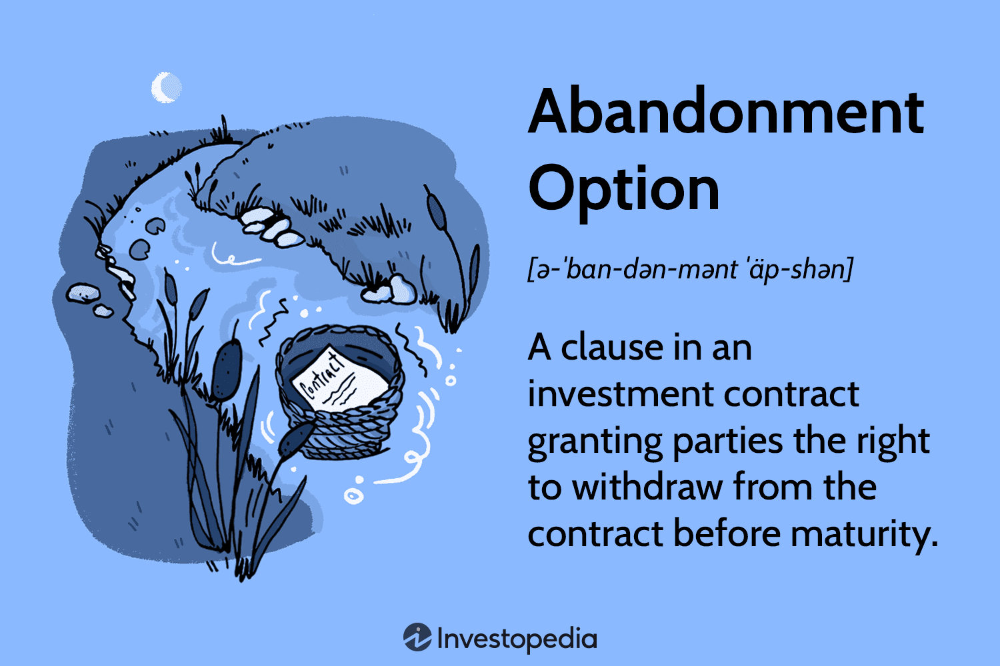

## Table of Contents

## What is an abandonment option in finance?

An abandonment option in finance is a type of real option that gives a company the right, but not the obligation, to stop a project or investment if it turns out to be unprofitable. Think of it like a safety net. If a company starts a new project and it doesn't go as planned, they can choose to abandon it without losing everything they've invested.

This option is valuable because it helps companies manage risk. Instead of being stuck with a failing project, they can cut their losses and move on. It's like having an escape plan. Companies often consider the value of this option when deciding whether to start a new project, as it can make a risky investment seem less daunting.

## How does an abandonment option differ from other types of options?

An abandonment option is different from other types of options because it's all about stopping something that's not working. Most options, like call options or put options, are about buying or selling something at a certain price. But an abandonment option is about deciding to stop a project or investment if it's not making money. It's like having a backup plan to walk away if things go south.

Other options, like call options, give you the right to buy something at a set price, which can be good if the price goes up. Put options let you sell something at a set price, which is helpful if the price goes down. These options are about making money from price changes. But an abandonment option is more about cutting losses. It's not about making a profit from price movements, but about saving money by stopping a bad investment. This makes it a unique tool for managing risk in business projects.

## Can you provide a simple example of when an abandonment option might be used?

Imagine a company decides to build a new factory. They think it will make them a lot of money, but there's a chance it might not work out. So, they include an abandonment option in their plan. This means if the factory isn't making money after a year, they can choose to stop the project and sell the factory.

After a year, the factory isn't doing well. It's not making the money they hoped for. Because they have the abandonment option, the company decides to stop the project. They sell the factory and get back some of the money they spent. Without the abandonment option, they would have to keep the factory running and lose even more money.

## What are the key factors that influence the decision to exercise an abandonment option?

The decision to exercise an abandonment option depends on a few important things. First, the company looks at how much money the project is making. If it's losing money or not making enough, they might think about stopping it. They also think about how much they can get back if they sell what they've built or bought. If they can sell it for a good price, it might make sense to stop the project.

Another thing they consider is what else they could do with the money and time they're using on the project. If there's a better opportunity out there, it might be smart to stop the current project and start something new. They also think about how sure they are about their guesses. If they're not sure if things will get better, they might decide to stop the project to be safe.

## How is the value of an abandonment option calculated?

The value of an abandonment option is figured out by comparing what you could get if you stop the project versus what you might lose if you keep going. Imagine you have a project that's not doing well. If you stop it, you might be able to sell what you've built and get some money back. You compare that money to how much more you might lose if you keep the project going. If stopping the project and selling what you have gives you more money than sticking with it, then the abandonment option is worth something.

To calculate this, people often use a model called the Black-Scholes model or a similar one. These models help figure out the value of different options, including abandonment options. They take into account things like how much money you can get back if you stop the project, how much money you might lose if you keep going, and how sure you are about your guesses. By putting all these pieces together, you can find out if it's worth it to stop the project or if you should keep trying.

## What role do abandonment options play in capital budgeting?

In capital budgeting, abandonment options help companies make smarter choices about big projects. When a company thinks about starting a new project, they look at how much it will cost and how much money it might make. But things don't always go as planned. An abandonment option gives the company a way out if the project starts losing money. It's like having a safety net. If the project isn't working, the company can stop it and get back some of the money they spent. This makes the company feel safer about trying new things because they know they can stop if it's not working.

Abandonment options also help companies decide which projects to start. When they're looking at different ideas, they think about how much they might lose if things go wrong. If they have an abandonment option, they might be more willing to try a risky project because they know they can stop it if it doesn't work out. This can help them find new opportunities and grow their business. By thinking about abandonment options, companies can make better decisions and manage their money more wisely.

## How do real options and abandonment options relate to each other?

Real options and abandonment options are closely related because an abandonment option is actually a type of real option. Real options are choices a company has about future business decisions, like starting a new project, expanding an existing one, or waiting to see how things go. An abandonment option is a specific kind of real option that lets a company stop a project if it's not making money. So, real options are the bigger category, and abandonment options are one of the choices within that category.

When a company is thinking about a new project, they consider all their real options, including the possibility of abandoning the project if it doesn't work out. This helps them manage risk better because they know they have a way out if things go wrong. By having an abandonment option, the company can feel more confident about trying new things, knowing they can stop and cut their losses if needed. So, abandonment options are an important part of the broader set of real options that help companies make smart decisions about their investments.

## What are the potential risks associated with exercising an abandonment option?

Exercising an abandonment option means stopping a project that's not doing well. One big risk is that you might stop too soon. Sometimes, a project can take a while to start making money. If you stop it too early, you might miss out on future profits. Also, stopping a project can be hard on the people working on it. They might lose their jobs or feel bad about the project failing. This can hurt the company's reputation and make it harder to start new projects in the future.

Another risk is that you might not get as much money back as you hoped when you sell what you've built. The market might change, and you might not find a buyer willing to pay what you need. This can leave you with less money than you expected, making the abandonment option less valuable. It's also important to think about what else you could do with the money and time you're using on the project. If you stop the project and the new opportunity doesn't work out, you could end up worse off than if you had kept going with the original project.

## Can you discuss a case study where an abandonment option significantly impacted a company's financial strategy?

A good example of how an abandonment option can impact a company's financial strategy is the case of a pharmaceutical company that decided to develop a new drug. The company invested a lot of money in research and development, hoping the drug would be a big success. However, after several years, the clinical trials showed that the drug was not as effective as they had hoped. The company had an abandonment option in place, which allowed them to stop the project if it wasn't working out. They decided to exercise this option and stop the development of the drug. By doing this, they were able to cut their losses and use the remaining resources to invest in other promising projects.

This decision to abandon the drug project was crucial for the company's financial health. Without the abandonment option, the company would have had to keep spending money on a drug that wasn't going to be successful. This could have led to big financial losses and might have even put the company in a tough spot. By stopping the project, the company saved money and was able to focus on other drugs that had a better chance of success. This helped them manage their risk and keep their business strong. The abandonment option played a key role in their strategy, allowing them to make a smart decision when things weren't going as planned.

## How do tax considerations affect the decision to exercise an abandonment option?

Tax considerations can play a big role in deciding whether to stop a project using an abandonment option. If a company stops a project, they might be able to write off the losses on their taxes. This means they could get some money back from the government, which could make stopping the project more attractive. On the other hand, if the company keeps the project going, they might be able to use tax benefits like depreciation or research and development credits. These can help lower their tax bill, making it less appealing to stop the project.

In the end, it's all about comparing what the company could gain or lose from a tax perspective. If stopping the project means they can get a big tax write-off, it might make sense to use the abandonment option. But if keeping the project going means they can save a lot on taxes, they might want to keep trying. Companies need to look at all these tax details carefully to make the best decision for their financial health.

## What advanced valuation models are used for pricing abandonment options?

Advanced valuation models for pricing abandonment options often use the Black-Scholes model or its variations, like the binomial model. These models help figure out how much an abandonment option is worth by looking at things like the value of the project if you keep it going, what you could get if you stop it, and how sure you are about your guesses. They use math to calculate the best time to stop a project and how much money you could save by doing so. These models are important because they help companies make smart decisions about when to cut their losses and move on.

Another model used is the real options approach, which treats the decision to stop a project like a financial option. This model looks at the flexibility a company has and how it can change its plans based on new information. It helps companies see the value of being able to stop a project if it's not working out. By using these advanced models, companies can better understand the risks and rewards of their projects and make better choices about when to use their abandonment options.

## How can the concept of abandonment options be integrated into strategic financial planning at an expert level?

At an expert level, integrating abandonment options into strategic financial planning involves understanding the flexibility they offer and using it to manage risk and optimize resource allocation. Companies need to think about abandonment options right from the start of a project. They should include them in their financial models and decision-making processes. This means using advanced valuation models like the Black-Scholes or binomial models to figure out how much an abandonment option is worth. By doing this, companies can see how much they could save by stopping a project that's not working out, and this helps them decide if it's worth starting the project in the first place.

Experts also need to consider how abandonment options fit into the bigger picture of the company's strategy. This means looking at how stopping one project could free up money and resources for other opportunities. It's about balancing the potential losses from stopping a project with the potential gains from starting something new. Tax considerations are also important because stopping a project might mean getting a tax write-off, which could make the abandonment option more valuable. By carefully thinking about all these factors, companies can use abandonment options to make smarter financial decisions and keep their business strong and flexible.

## References & Further Reading

[1]: Brennan, M. J., & Schwartz, E. S. (1985). ["Evaluating Natural Resource Investments."](https://www.jstor.org/stable/2352967) The Journal of Business, 58(2), 135-157.

[2]: Black, F., & Scholes, M. (1973). ["The Pricing of Options and Corporate Liabilities."](https://www.cs.princeton.edu/courses/archive/fall09/cos323/papers/black_scholes73.pdf) Journal of Political Economy, 81(3), 637-654.

[3]: Trigeorgis, L. (1996). ["Real Options: Managerial Flexibility and Strategy in Resource Allocation."](https://books.google.com/books/about/Real_Options.html?id=Z8o20TmBiLcC) MIT Press.

[4]: Mijnhardt, A., Pienaar, L. V., & Haasbroek, N. (2016). ["The Impact of Algorithmic Trading on Markets."](https://www.mdpi.com/1911-8074/12/2/68) Journal of Applied Business Research, 32(2), 447-464.

[5]: Dixit, A. K., & Pindyck, R. S. (1994). ["Investment Under Uncertainty."](https://msuweb.montclair.edu/~lebelp/DixitPindyck1994.pdf) Princeton University Press.