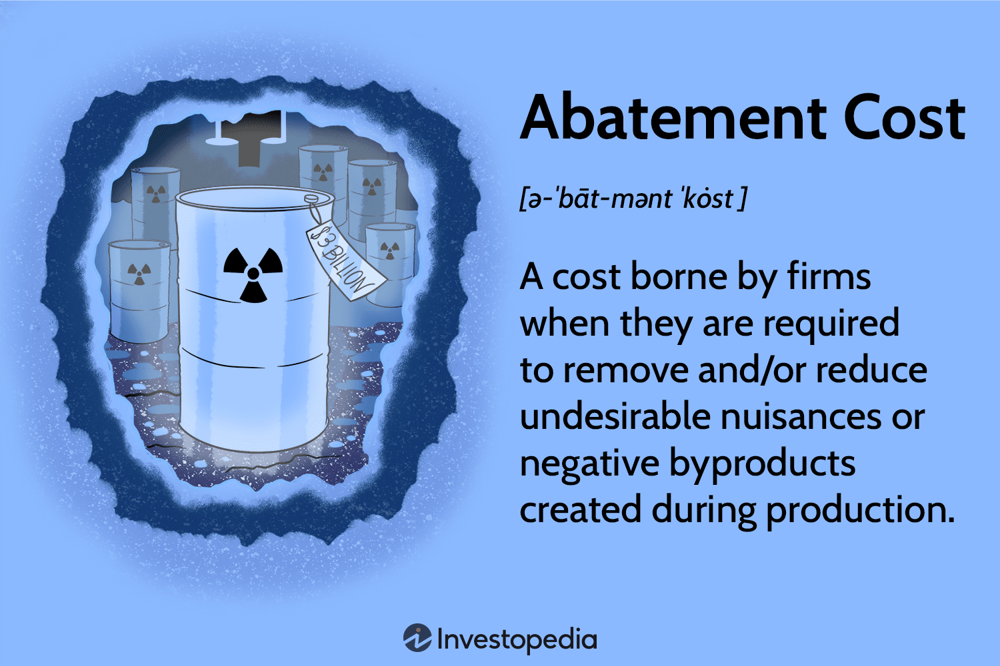

In the intersection of environmental economics and technology, abatement costs emerge as a critical consideration for businesses and policymakers. Abatement costs represent the investments or expenditures required to reduce negative externalities, such as pollution, associated with industrial processes. These costs are not only fundamental in guiding corporate environmental strategies but also serve as a vital tool for policymakers aiming to implement impactful regulations.

Traditionally, businesses have viewed abatement costs as necessary expenses to comply with environmental regulations. However, in today's technologically advanced landscape, these costs can also offer strategic advantages. Understanding abatement costs involves examining how they influence production decisions, resource allocation, and ultimately, a firm's financial health. They are a key metric for companies striving to meet Environmental, Social, and Governance (ESG) criteria, as they reflect a firm's commitment to reducing its environmental footprint.

The integration of algorithmic trading techniques into cost analysis represents an innovative approach to managing abatement costs. By leveraging big data and advanced analytics, businesses can optimize these expenses, identifying not only potential savings but also opportunities for sustainable investment. Algorithmic trading provides a framework for modeling and predicting future compliance costs, enabling firms to adapt dynamically to evolving regulations.

As the need for sustainable business practices grows, the interplay between financial metrics and environmental sustainability becomes increasingly important. Developing robust models of abatement costs and incorporating technology-driven solutions can lead to more efficient policy design and implementation, fostering a sustainable economic future. Understanding these elements is pivotal for policymakers and businesses seeking to balance economic growth with ecological preservation.

## Table of Contents

## Understanding Abatement Costs

Abatement costs refer to the financial outlays associated with reducing harmful emissions or pollutants resulting from industrial activities. These expenditures are crucial for businesses seeking to minimize their environmental footprint and play a significant role in contemporary economic and environmental strategies.

These costs function as economic levers, incentivizing companies to adopt cleaner technologies and more efficient processes to mitigate the negative impact of their operations on the environment. This is often achieved through investments in pollution control equipment, adoption of renewable energy sources, or improvements in process efficiency that lower emissions and resource usage. For example, a manufacturing plant might install scrubbers or filters to reduce airborne contaminants, or a power plant may switch to cleaner fuels to limit carbon emissions.

The consideration of abatement costs is increasingly intertwined with regulatory frameworks set by government agencies like the Environmental Protection Agency (EPA) in the United States or similar bodies globally. Such regulations mandate specific emission reduction targets and often require firms to report their pollution levels, pushing them to integrate these costs into their overall operational budget. Failure to comply can result in significant penalties, further emphasizing the importance of abatement costs as a compliance mechanism.

In practice, abatement costs manifest in various industrial contexts. For instance, a chemical company might incur expenses in developing non-toxic alternatives to hazardous materials, while a logistics firm may invest in electric vehicles to reduce its carbon footprint. These investments, though costly initially, can drive long-term benefits both in terms of cost savings from enhanced efficiency and corporate reputation improvements.

A case study exemplifying the management of abatement costs is the strategy employed by a global automotive manufacturer. To align with stringent emissions standards, the company invested extensively in research and development to produce more fuel-efficient engines and electric vehicles, thereby reducing its total emissions significantly. This initiative not only helped the company comply with regulatory requirements but also positioned it as an industry leader in sustainable practices, illustrating how proactive management of abatement costs can lead to competitive advantages.

Overall, understanding and effectively managing abatement costs is essential for businesses committed to environmental sustainability. By aligning economic incentives with regulatory requirements and societal expectations, companies can contribute to a more sustainable future while maintaining economic viability.

## Environmental Economics: The Role of Abatement Costs

Environmental economics studies the intersection of economic activity and environmental impact, with abatement costs being a significant element within this discipline. Abatement costs are the expenses that firms incur to reduce or prevent pollution and other negative ecological impacts stemming from their activities. These costs have direct implications for how resources are allocated across production methods and influence investment decisions related to green technologies.

From an economic perspective, abatement costs serve as a crucial financial signal in the market, guiding firms towards more sustainable practices. When companies assess abatement costs, they often face decisions regarding the allocation of resources. For instance, an industry might need to choose between investing in cleaner production technology or paying higher fees for emissions permits. This allocation decision is directly influenced by the level of abatement cost associated with each option.

Furthermore, analyzing abatement costs helps shape more effective environmental regulations and policies. By understanding the cost implications of various environmental policies, regulators can design measures that incentivize companies to innovate and adopt eco-efficient practices. Such regulations might include tax incentives for companies that invest in clean technologies or stricter emissions standards that necessitate investment in abatement solutions.

Abatement costs also play a role in driving innovation in environmental practices. As these costs reflect the financial burden of pollution control, they provide a clear economic rationale for investing in research and development to find less costly abatement technologies or processes. This dynamic is evident in industries such as energy, where high abatement costs have spurred investment in renewable energy and carbon capture and storage.

The integration of abatement costs into economic models assists in effectively quantifying and assessing environmental impacts. Economists use these models to predict the outcomes of different policy scenarios, providing insights into the balance between economic growth and environmental sustainability. For instance, a model may analyze the trade-offs between economic output and pollution levels, illustrating the cost-effectiveness of various environmental policies.

Mathematically, abatement cost functions can be expressed as relationships between the level of pollution control achieved and the corresponding costs. For example, if $C(a)$ represents the abatement cost function where $a$ is the amount of pollution abated, the function's derivative, $C'(a)$, indicates the marginal cost of abatement. This marginal cost is crucial for understanding how incremental changes in pollution control efforts relate to economic expenditure.

In conclusion, abatement costs are pivotal within environmental economics for shaping resource allocation, guiding policy formation, and fostering innovation. They serve not only as necessary expenditures for compliance and sustainability but also as catalysts for sustainable technological and methodological advancements. By factoring these costs into economic models, policymakers can better assess and formulate strategies that strike an optimal balance between economic activities and environmental responsibilities.

## Algorithmic Trading in Cost Analysis

Algorithmic trading, known for its transformative impact on financial markets, is increasingly being utilized to optimize cost structures across various industrial sectors, including those related to environmental compliance and abatement costs. These advanced algorithms are designed to process large datasets, identify cost-efficiency opportunities, and allocate resources effectively. The application of [algorithmic trading](/wiki/algorithmic-trading) in cost analysis represents a strategic shift for businesses as they adapt to evolving environmental regulations while maintaining profitability.

The premise of algorithmic trading in cost analysis involves leveraging complex computational models to streamline expenses by predicting market trends and regulatory changes. For instance, [machine learning](/wiki/machine-learning) algorithms can be deployed to identify patterns in environmental compliance costs, enabling firms to adjust their operations proactively. These algorithms are equipped to process real-time data, offering predictive insights that help businesses anticipate regulatory shifts and environmental policy changes.

Incorporating algorithmic trading allows companies to dynamically adjust their strategies, ensuring compliance with environmental standards without incurring unnecessary costs. The predictive capabilities of algorithms facilitate risk mitigation by forecasting potential spikes in compliance costs due to regulatory amendments. This anticipatory approach is crucial for maintaining financial stability in volatile regulatory environments.

Furthermore, algorithmic systems enhance the precision of cost analysis by integrating quantitative environmental data, such as emission levels and resource utilization metrics, into financial models. By optimizing decision-making processes, these systems ensure that environmental considerations are factored into financial planning, ultimately supporting sustainable business practices. The integration of big data analytics provides a structured framework for evaluating the environmental impact of corporate operations.

The future of cost analysis and management is expected to be heavily influenced by technological advancements in [artificial intelligence](/wiki/ai-artificial-intelligence) and machine learning. As algorithmic trading systems become more sophisticated, their ability to simulate various regulatory scenarios and optimize for environmental compliance will expand. Businesses are likely to invest in these technologies, recognizing the dual benefits of cost reduction and environmental stewardship.

In conclusion, the leveraging of algorithmic trading in cost analysis marks a significant evolution in both financial and environmental management strategies. By adopting these technologies, companies can achieve a competitive edge through enhanced efficiency, reduced costs, and a strengthened commitment to sustainable practices. Embracing algorithmic cost analysis not only supports compliance with current environmental legislation but also prepares organizations for future regulatory landscapes.

## Case Studies: Environmental Economics and Algo Trading

Analyzing real-world scenarios where companies have successfully integrated environmental and economic strategies illuminates the effective management of abatement costs. These case studies highlight the adoption of algorithmic trading techniques across various industries, such as manufacturing and energy, and showcase the innovative approaches that have benefited both the environment and businesses.

### Case Study 1: Manufacturing Industry

In the manufacturing sector, firms have increasingly turned to algorithmic trading tools to optimize their resource allocation and minimize abatement costs. For instance, a leading automotive manufacturer implemented a data-driven approach to reduce emissions across its production line. By utilizing machine learning algorithms, the company was able to predict emission outputs based on production variables and adjust its processes in real-time to minimize waste and emissions.

The implementation involved developing a predictive model using historical emission and production data. By training this model, the company could identify optimal production schedules that align with regulatory emission standards while also reducing costs associated with excess emissions. This not only resulted in financial savings but also significantly improved the company's environmental footprint.

### Case Study 2: Energy Sector

In the energy sector, companies face substantial challenges in balancing energy production with environmental sustainability. An energy firm specializing in renewable energy used algorithmic trading to enhance its energy production strategies. By constructing a sophisticated algorithm, the firm optimized its energy output to match real-time market demand, thereby reducing the reliance on fossil fuels and cutting emissions.

The algorithm incorporated variables such as weather patterns, energy prices, and grid demand to forecast energy needs accurately. This allowed the firm to adjust its production mix dynamically, favoring renewable sources when conditions were optimal. As a result, the firm decreased its carbon footprint while maintaining profitability.

### Technology's Role in Sustainable Economic Practices

The role of technology in driving sustainable economic practices is exemplified by these case studies. Advanced analytics and algorithmic trading provide companies with tools to respond to dynamic market and environmental conditions effectively. Through the integration of data analytics, businesses can not only comply with environmental regulations but also recognize cost-saving opportunities that traditional approaches may overlook.

### Conclusion of Case Studies

These case studies serve as a model for businesses seeking to enhance their environmental responsibility while maintaining profitability. Companies are encouraged to embrace technological solutions that provide insights into resource management and cost optimization. As the environmental regulations become increasingly stringent, the ability to adapt through innovative technologies will be crucial for businesses aiming to lead in sustainability.

## Conclusion and Future Perspectives

The synergy between abatement costs, environmental economics, and algorithmic trading is pivotal in advancing sustainable business models. As environmental challenges become more prominent, businesses are encouraged to innovate in cost analysis and integrate technologies supporting global sustainability objectives. These advancements are vital not only for complying with emerging regulations but also for aligning corporate operations with environmental, social, and governance ([ESG](/wiki/esg-investing)) criteria.

The regulatory landscape is continuously evolving, necessitating businesses to adopt adaptive strategies that leverage advanced analytics and mitigation techniques. These strategies involve acute data-driven insights that allow for preemptive adjustments and optimized resource allocation in light of new environmental regulations. Algorithmic trading, with its ability to process vast datasets and identify cost-saving opportunities, plays a central role in this adaptation, further enhancing financial performance while reducing ecological footprints.

Future research and development will likely focus on refining data-driven decision-making frameworks, emphasizing the integration of machine learning models and artificial intelligence in environmental economic strategies. This focus will be essential in developing tools that not only predict future compliance costs but also offer real-time solutions to mitigate environmental impacts. For instance, employing predictive analytics can enable organizations to foresee regulatory changes and adjust their strategies proactively, ensuring compliance and sustainability.

As we conclude, it is imperative that the commitment to reducing environmental impacts remains a top priority in corporate agendas and policy development. This commitment ensures that businesses contribute to ecological preservation while achieving economic growth. Companies are encouraged to invest in technologies that drive these efforts forward, thereby playing a significant role in the transition to sustainable economies. With continuous innovation and strategic investment in technology, businesses can navigate the complexities of abatement costs and environmental regulations, promoting a balance between profitability and sustainability.

## References & Further Reading

[1]: Tietenberg, T., & Lewis, L. (2018). "Environmental and Natural Resource Economics". Routledge. Provides an in-depth exploration of the economic principles related to environmental sustainability, including abatement costs.

[2]: Stavins, R. N. (1999). ["The Costs of Carbon Sequestration: A Revealed-Preference Approach."](https://scholar.harvard.edu/files/stavins/files/cost_of_carbon_sequestration.pdf) American Economic Review, 89(4), 994-1009. This paper elaborates on estimating abatement costs in the context of carbon management.

[3]: Goulder, L. H., & Parry, I. W. H. (2008). ["Instrument Choice in Environmental Policy."](https://web.stanford.edu/~goulder/Papers/Published%20Papers/Goulder-Parry%20Instrument%20Choice%20(REEP)%20Paper%20-%20Final.pdf) Review of Environmental Economics and Policy, 2(2), 152-174. Discusses the role of economics in environmental policy design.

[4]: Pindyck, R. S. (2007). ["Uncertainty in Environmental Economics."](https://web.mit.edu/rpindyck/www/Papers/UncertEnvironEconPrinted_version.pdf) Review of Environmental Economics and Policy, 1(1), 45-65. Explores the economic assessment of environmental risks and uncertainties.

[5]: Ehrhardt, M. C., & Brigham, E. F. (2016). "Corporate Finance: A Focused Approach". Cengage Learning. Offers insights into how financial metrics can drive corporate strategies, including abatement cost considerations.

[6]: Goodfellow, I., Bengio, Y., & Courville, A. (2016). ["Deep Learning."](https://www.deeplearningbook.org/) MIT Press. Discusses machine learning techniques applicable to algorithmic trading and cost analysis.

[7]: Kauffmann, C., Tébar Less, C., & Teichmann, D. (2012). ["Corporate Greenhouse Gas Emission Reporting: A Stocktaking of Government Schemes."](https://www.semanticscholar.org/paper/Corporate-Greenhouse-Gas-Emission-Reporting%3A-A-of-Kauffmann-Less/946e4ad70d7c8bd3e928f0b378c62a189ebae5f3) OECD Working Papers. Reviews regulatory frameworks impacting abatement costs.