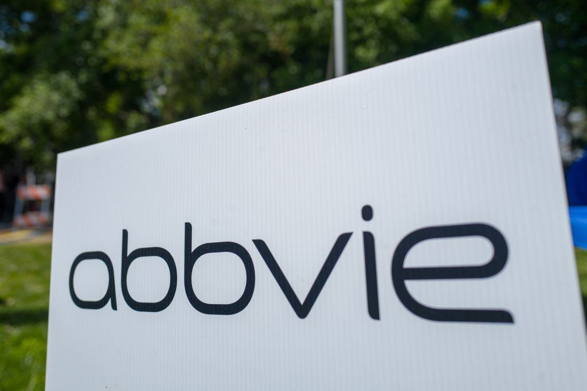

AbbVie Inc., a leading entity in the pharmaceutical industry, has marked its presence with remarkable financial performance and strategic initiatives. A critical factor contributing to AbbVie's status is its diverse revenue streams, particularly from blockbuster drugs. The company's ability to innovate and expand its product offerings has enabled it to maintain a competitive edge and sustain growth.

In recent years, the practice of algorithmic trading has become a significant force influencing investment decisions in the pharmaceutical sector. Algorithmic trading, which involves using algorithms to execute trading strategies, leverages massive datasets to optimize decision-making. As a result, fluctuations in pharmaceutical companies' revenues and market dynamics have become closely monitored by investors employing these advanced techniques. This integration of technology into financial markets underscores the importance of understanding the intricacies of revenue models, patent lifecycles, and market strategies.



This article examines AbbVie's robust revenue model, the challenges the company faces due to expiring patents, and how these factors impact trading in the stock market. Through this exploration, it provides insights into the complexities of the pharmaceutical industry and highlights the importance of strategic innovation and investment.

## Table of Contents

## AbbVie's Revenue Streams

AbbVie Inc. has developed a robust revenue model primarily through its diverse product portfolio, with key contributions from industry-leading drugs and strategic acquisitions. One of the cornerstones of AbbVie's financial success has been Humira, a monoclonal antibody used to treat a variety of autoimmune conditions. Humira has consistently been a blockbuster drug, generating billions in revenue each year. Its significant contribution is evident from the fact that it has been one of the best-selling drugs worldwide for several years.

In addition to Humira, AbbVie has successfully launched other therapies that are solidifying its presence in the pharmaceutical market. Skyrizi (risankizumab), a treatment for plaque psoriasis, and Rinvoq (upadacitinib), indicated for rheumatoid arthritis and other inflammatory conditions, have shown promising sales growth. These drugs are strategically positioned to offset some of the revenue risks posed by impending patent expirations on Humira, capturing market share in their respective therapeutic areas.

The acquisition of Allergan in 2020 was a significant strategic move that further broadened AbbVie's revenue channels and market reach. With this acquisition, AbbVie inherited a portfolio of well-established products, most notably including Botox, which has applications in both aesthetics and therapeutic treatments. The integration of Allergan's products into AbbVie's portfolio not only diversified its offerings but also provided a new impetus to revenue streams across different market segments.

Overall, AbbVie's ability to capitalize on its extensive product portfolio and acquisitions underscores its strategic foresight in sustaining and enhancing its financial performance.

## Patent Challenges and Market Dynamics

Patents expiring on blockbuster drugs, such as Humira, pose significant challenges for AbbVie. Humira, which has been one of the world's best-selling pharmaceuticals, has faced substantial market share and revenue declines due to the emergence of biosimilars. These biosimilars are essentially identical copies of originally patented drugs, and they offer similar therapeutic benefits at lower costs, thus attracting both healthcare providers and patients.

In response to these challenges, AbbVie has strategically invested in the development of new drugs while actively seeking Food and Drug Administration (FDA) approvals. This strategy is part of a broader attempt to diversify its product portfolio and ensure stable revenue streams. By securing patents for new, innovative therapies before existing ones expire, AbbVie aims to mitigate potential declines in revenue.

Moreover, understanding the intricacies of patent challenges and market dynamics is crucial for investors and stakeholders within the pharmaceutical market. Competitive pressures from biosimilar introductions require companies like AbbVie to innovate continually while also managing regulatory challenges. AbbVie's ongoing efforts illustrate the complexities and competitive nature of the pharmaceutical industry, where maintaining market leader status is contingent upon continuous innovation and effective patent management strategies.

## Algorithmic Trading in Pharmaceuticals

Algorithmic trading, often referred to as 'algo trading,' has become an increasingly prominent force in the pharmaceutical stock markets, revolutionizing traditional investment strategies. This sophisticated approach leverages advanced algorithms to parse through vast amounts of market data, providing critical insights into stock performance and aiding in optimizing trading strategies. These algorithms are designed to execute trades at high speeds and with precision, which is crucial in markets characterized by [volatility](/wiki/volatility-trading-strategies), such as pharmaceuticals.

In the context of companies like AbbVie Inc., [algorithmic trading](/wiki/algorithmic-trading) models benefit greatly from insights into the company's revenue fluctuations. For instance, substantial revenue streams from drugs like Humira can be analyzed to predict market movements. Algorithms can incorporate diverse data points such as quarterly earnings reports, shifts in market demand, and regulatory announcements, which together form a comprehensive picture of AbbVie's financial health and stock behavior.

One of the primary advantages offered by algorithmic trading is speed, allowing investors to capitalize on fleeting market opportunities that may arise from sudden pharmaceutical developments or news. Efficiency is another critical benefit, as algorithms can handle massive datasets far beyond human capacities, enabling data-driven decisions that are informed by meticulous analysis.

Furthermore, data-driven investment decisions, a hallmark of algorithmic trading, are achieved by employing predictive models that might include elements such as regression analysis, [machine learning](/wiki/machine-learning) algorithms, or complex stochastic models. These models can continuously adapt as new data becomes available, ensuring that the trading strategies remain relevant in the face of market fluctuations.

For example, a simple Python algorithm to evaluate changes in AbbVie's stock price might involve:

```python
import pandas as pd
from sklearn.linear_model import LinearRegression

# Load historical stock data for AbbVie
data = pd.read_csv('abbvie_stock_data.csv')
X = data[['quarterly_revenue']]  # Feature: Quarterly revenue
y = data['stock_price']          # Target: Stock price

# Train a linear regression model
model = LinearRegression()
model.fit(X, y)

# Predict stock price based on recent revenue data
recent_revenue = [[10000]]  # Example revenue in millions
predicted_price = model.predict(recent_revenue)

print(f"Predicted stock price: {predicted_price[0]}")
```

In conclusion, algorithmic trading's ability to analyze complex datasets and rapidly execute trades provides a significant strategic advantage. It's an essential tool for investors seeking to navigate the nuanced pharmaceutical market efficiently. As the field continues to develop, the integration of algorithmic trading in financial strategies will likely become even more crucial, offering an edge that leverages technological innovation to maximize investment returns.

## AbbVie's Future Outlook

AbbVie Inc.'s future growth prospects remain promising despite various industry challenges. A key driver of this optimism is the anticipated growth in sales of Skyrizi and Rinvoq. Skyrizi, an interleukin-23 (IL-23) inhibitor, and Rinvoq, a Janus kinase (JAK) inhibitor, have shown significant promise in treating autoimmune conditions. Continued expansion into global markets and additional approvals for these drugs in various indications are expected to bolster AbbVie's revenue trajectory.

Innovation is at the core of AbbVie's strategy for sustained success. The company invests significantly in research and development to advance its drug pipeline and bring novel therapies to market. Strategic acquisitions further complement these efforts, allowing AbbVie to diversify its portfolio and strengthen its position in competitive markets. The acquisition of Allergan, for instance, not only broadened AbbVie's product offerings but also enhanced its capabilities in key therapeutic areas.

Investors have shown confidence in AbbVie's ability to navigate market dynamics owing to the company’s resilient drug pipeline and adaptability. With a focus on high-growth therapeutic areas, AbbVie is well-positioned to harness opportunities in emerging markets and leverage its existing strengths. Market analysts forecast a positive outlook for AbbVie, driven by potential regulatory approvals, expansion of product indications, and sustained commercial execution.

In summary, AbbVie's strategic emphasis on innovation, coupled with a proactive acquisition strategy, aligns with the company's long-term vision of maintaining industry leadership. This, in turn, fosters an environment conducive to steady growth and investment potential.

## Conclusion

AbbVie's revenue streams and strategic adaptations demonstrate its resilience within the pharmaceutical industry. The company's ability to navigate patent challenges underscores the necessity for continuous innovation and strategic product development. As patents on blockbuster drugs, such as Humira, expire, AbbVie has strategically invested in developing new therapies and securing FDA approvals to offset potential revenue losses. This approach not only mitigates the immediate impacts of biosimilar competition but also positions the company for sustained growth through a diversified product portfolio.

Algorithmic trading is increasingly shaping the investment landscape of the pharmaceutical sector. By utilizing advanced algorithms, investors are able to analyze market data more efficiently, enabling them to make more informed and timely trading decisions. Insights into AbbVie’s financial performance, particularly in relation to fluctuations in revenue from key drugs, can enhance these algorithmic models, offering predictions on stock movements that are critical for gaining competitive advantage. 

For savvy investors, understanding these dynamic elements—AbbVie's adaptation strategies in the face of patent expirations, and the influence of algorithmic trading—offers a clearer perspective on potential investment opportunities. The confluence of these factors highlights the importance of agility and foresight in navigating the complexities of the pharmaceutical market. Consequently, AbbVie’s strategies not only reflect its robust capabilities in maintaining industry relevance but also provide a template for leveraging innovation and data-driven insights in achieving investment success.

## References & Further Reading

[1]: ["AbbVie Reports Full-Year and Fourth-Quarter 2022 Financial Results"](https://investors.abbvie.com/news-releases/news-release-details/abbvie-reports-full-year-and-fourth-quarter-2022-financial) - AbbVie Inc.

[2]: ["Inside the Race to Replace Humira: AbbVie Bets Big on New Drugs"](https://www.npr.org/sections/health-shots/2023/01/31/1152513058/abbvies-blockbuster-drug-humira-finally-loses-its-20-year-200-billion-monopoly) - Reuters

[3]: ["The Impact of Biosimilars on Innovation in the Pharmaceutical Industry"](https://www.hilarispublisher.com/open-access/exploring-the-impact-of-biosimilars-on-biopharmaceutical-markets-trends-and-future-directions.pdf) - Health Affairs

[4]: ["Algorithmic and High-Frequency Trading: An Overview"](https://github.com/LucindaYa/quant-resources/blob/master/Algorithmic%20and%20High-frequency%20trading-%20an%20overview.pdf) - ResearchGate

[5]: ["Advances in Financial Machine Learning"](https://www.amazon.com/Advances-Financial-Machine-Learning-Marcos/dp/1119482089) by Marcos Lopez de Prado

[6]: ["Machine Learning for Asset Managers"](https://www.cambridge.org/core/books/machine-learning-for-asset-managers/6D9211305EA2E425D33A9F38D0AE3545) by Marcos Lopez de Prado

[7]: ["Strategic Alliances and Acquisitions: A Bibliometric Study"](https://www.researchgate.net/publication/276896750_The_Extant_Research_on_Strategic_Alliances_A_Bibliometric_Study_of_the_Past_Two_Decades) - International Small Business Journal