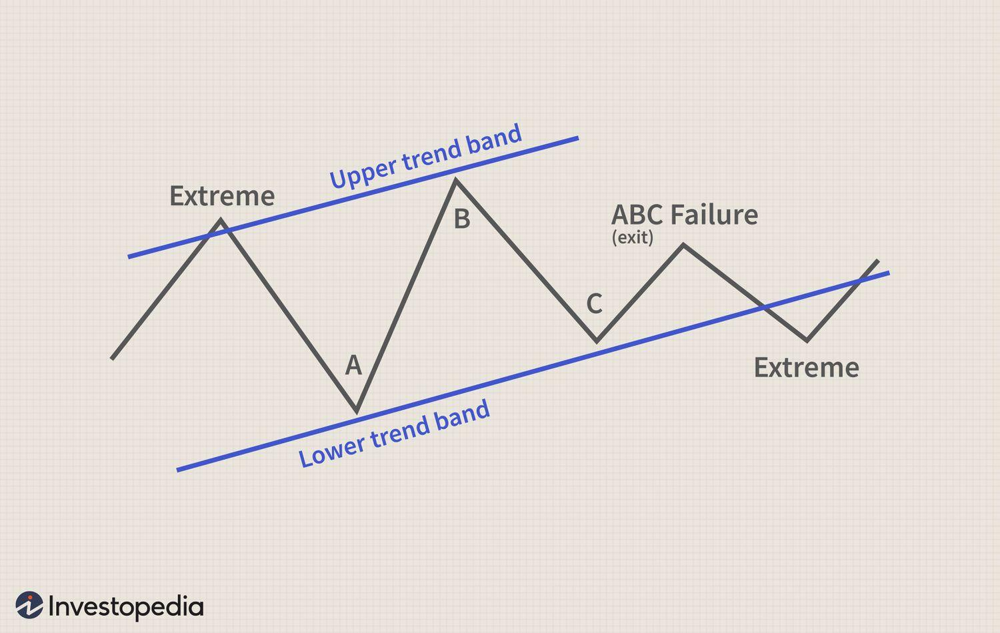

## Table of Contents

## What is the ABC Trading Strategy?

The ABC Trading Strategy is a simple way to trade in the stock market. It uses three main points, called A, B, and C, to find good times to buy and sell stocks. The strategy looks at how the price of a stock moves between these points. If the price goes up from point A to B and then drops to C, it might be a good time to buy at point C. If the price goes down from A to B and then up to C, it might be a good time to sell at point C.

This strategy helps traders make decisions based on clear patterns in the stock's price movement. It is easy to understand and can be used by people who are new to trading. However, like all trading strategies, it is not perfect and does not guarantee success. Traders should use the ABC Trading Strategy along with other tools and always be careful with their money.

## Who developed the ABC Trading Strategy?

The ABC Trading Strategy was developed by a trader named Larry Connors. He is known for creating simple trading strategies that many people can use. Larry wanted to make trading easier for everyone, so he came up with the ABC Trading Strategy.

This strategy is based on the idea that stock prices move in patterns. Larry noticed that if you can spot these patterns, you can make better decisions about when to buy and sell stocks. He called these patterns A, B, and C, which is why the strategy got its name.

## What are the basic principles behind the ABC Trading Strategy?

The ABC Trading Strategy is all about looking at how the price of a stock moves in a simple pattern. The pattern has three points: A, B, and C. If the price goes up from point A to B and then drops to C, it might be a good time to buy at point C. This is because the price might go back up after hitting point C. On the other hand, if the price goes down from A to B and then up to C, it might be a good time to sell at point C. This is because the price might go back down after hitting point C.

The main idea behind this strategy is to spot these patterns and use them to make smart choices about buying and selling stocks. It's a simple way to trade that anyone can understand, even if they are new to the stock market. However, it's important to remember that no strategy works perfectly all the time. Traders should use the ABC Trading Strategy along with other tools and always be careful with their money.

## How does the ABC Trading Strategy differ from other trading strategies?

The ABC Trading Strategy is different from other trading strategies because it is very simple and easy to understand. Many other strategies can be complicated and use a lot of math or special tools. But the ABC Trading Strategy just looks at how the price of a stock moves between three points: A, B, and C. This makes it easier for people who are new to trading to use it. They don't need to learn a lot of complicated things to start trading with this strategy.

Another way the ABC Trading Strategy is different is that it focuses on short-term patterns in the stock's price. Some other strategies might look at long-term trends or use a lot of different indicators to make decisions. But the ABC Trading Strategy is all about spotting quick ups and downs in the price and using those to decide when to buy or sell. This can be good for people who want to make quick trades, but it also means they need to watch the market closely and be ready to act fast.

## What are the key components of the ABC Trading Strategy?

The ABC Trading Strategy is all about looking at how the price of a stock moves between three points: A, B, and C. If the price goes up from point A to B and then drops to C, it might be a good time to buy at point C. This is because the price might go back up after hitting point C. On the other hand, if the price goes down from A to B and then up to C, it might be a good time to sell at point C. This is because the price might go back down after hitting point C. The key is to spot these patterns and use them to make smart choices about buying and selling stocks.

The strategy is simple and easy to understand, which makes it good for people who are new to trading. You don't need to learn a lot of complicated things to start using it. It focuses on short-term patterns in the stock's price, so you need to watch the market closely and be ready to act fast. But remember, no strategy works perfectly all the time. It's important to use the ABC Trading Strategy along with other tools and always be careful with your money.

## Can you explain the ABC pattern in trading?

The ABC pattern in trading is a simple way to look at how the price of a stock moves. It uses three points: A, B, and C. If the price goes up from point A to B and then drops to C, it might be a good time to buy at point C. This is because the price might go back up after hitting point C. On the other hand, if the price goes down from A to B and then up to C, it might be a good time to sell at point C. This is because the price might go back down after hitting point C.

The ABC pattern is easy to understand and can be used by people who are new to trading. It focuses on short-term changes in the stock's price, so you need to watch the market closely and be ready to act fast. But remember, no pattern works perfectly all the time. It's important to use the ABC pattern along with other tools and always be careful with your money.

## What are the steps to implement the ABC Trading Strategy?

To implement the ABC Trading Strategy, first, you need to watch the price of a stock and find the three points: A, B, and C. Point A is the starting price, point B is where the price goes up or down from A, and point C is where the price changes direction again. If the price goes up from A to B and then drops to C, you should think about buying the stock at point C. This is because the price might go back up after hitting point C. If the price goes down from A to B and then up to C, you should think about selling the stock at point C. This is because the price might go back down after hitting point C.

Once you spot the ABC pattern, you need to act quickly. Make sure to set a stop-loss order to limit your risk. A stop-loss order is like a safety net that tells your broker to sell the stock if it drops to a certain price. This helps you avoid losing too much money if the price doesn't move the way you expect. Remember, the ABC Trading Strategy is simple but not perfect. It's important to use it along with other tools and always be careful with your money.

## What technical indicators are commonly used with the ABC Trading Strategy?

When using the ABC Trading Strategy, traders often use a few simple technical indicators to help them make better decisions. One common indicator is the moving average, which helps smooth out the price data over time. By looking at the moving average, traders can see if the stock's price is trending up or down. Another useful indicator is the Relative Strength Index (RSI), which measures how fast the price is moving and if it's overbought or oversold. If the RSI is high, it might mean the price is too high and could drop soon. If it's low, it might mean the price is too low and could go up soon.

These indicators can help traders confirm the ABC pattern. For example, if the price goes up from A to B and then drops to C, a trader might look at the moving average to see if it's also going up. If it is, that could be a good sign to buy at point C. They might also check the RSI to see if it's low at point C, which could mean the stock is a good buy. By using these indicators along with the ABC pattern, traders can make more informed decisions and hopefully increase their chances of success.

## How can the ABC Trading Strategy be optimized for different market conditions?

The ABC Trading Strategy can be optimized for different market conditions by adjusting the time frame you use to spot the ABC pattern. In a fast-moving market, you might want to look at shorter time frames, like minutes or hours, to catch quick ups and downs in the stock's price. This can help you make trades faster and take advantage of short-term changes. In a slower market, you might want to look at longer time frames, like days or weeks, to see bigger trends and make trades that last longer. By changing the time frame, you can make the ABC Trading Strategy work better in different market conditions.

Another way to optimize the ABC Trading Strategy is by using different technical indicators depending on the market's behavior. In a volatile market, where prices are moving a lot, you might want to use the Relative Strength Index (RSI) to see if the stock is overbought or oversold. This can help you decide if it's a good time to buy or sell at point C. In a more stable market, you might want to use moving averages to see the overall trend of the stock's price. By choosing the right indicators for the market conditions, you can make the ABC Trading Strategy more effective and increase your chances of making good trades.

## What are some common mistakes to avoid when using the ABC Trading Strategy?

When using the ABC Trading Strategy, one common mistake is not watching the market closely enough. The ABC pattern is all about spotting quick ups and downs in the stock's price, so you need to be ready to act fast. If you miss the right time to buy or sell at point C, you might lose money. Another mistake is not using a stop-loss order. A stop-loss order helps you limit your risk by telling your broker to sell the stock if it drops to a certain price. Without it, you could lose a lot of money if the price doesn't move the way you expect.

Another mistake to avoid is relying too much on the ABC Trading Strategy alone. No strategy works perfectly all the time, so it's important to use other tools and indicators to confirm your decisions. For example, you might use moving averages or the Relative Strength Index (RSI) to see if the stock's price is trending up or down, or if it's overbought or oversold. By using these along with the ABC pattern, you can make better choices and increase your chances of success.

## Can you provide a case study or example of the ABC Trading Strategy in action?

Imagine you're watching the price of a stock called XYZ. You see that the price starts at $50, which is point A. Then, the price goes up to $55, which is point B. After that, the price drops back down to $52, which is point C. You notice that the price went up from A to B and then dropped to C, so you decide to buy the stock at point C, which is $52. You think the price might go back up after hitting point C. A few days later, the price does go back up to $56, so you sell the stock and make a profit of $4 per share.

In another example, let's say you're looking at a stock called ABC. The price starts at $100, which is point A. Then, the price drops to $95, which is point B. After that, the price goes back up to $98, which is point C. You see that the price went down from A to B and then up to C, so you decide to sell the stock at point C, which is $98. You think the price might go back down after hitting point C. A few days later, the price does drop to $93, so you're glad you sold the stock at $98 and avoided a bigger loss.

## How can traders measure the effectiveness of the ABC Trading Strategy?

Traders can measure the effectiveness of the ABC Trading Strategy by looking at how much money they make or lose over time. They can keep track of all their trades and see if they are making more money than they are losing. If they are making more money, then the strategy is working well for them. They can also compare their results to other trading strategies to see if the ABC Trading Strategy is better or worse.

Another way to measure the effectiveness is by looking at how often the ABC pattern works. Traders can count how many times they see the pattern and how many times it leads to a good trade. If the pattern works most of the time, then the strategy is effective. But if it doesn't work often, then traders might need to change how they use the strategy or try something different.

## How is risk management handled in ABC Trading?

In algorithmic trading, especially when employing strategies like the ABC pattern, effective risk management is paramount to preserving capital and optimizing profitability. Utilizing stop-loss orders and proper position sizing are foundational strategies to manage risk in ABC trading. A stop-loss order helps traders limit potential losses by selling a security once its price falls to a predetermined level. This order type acts as a safety net, preventing the trader from incurring larger-than-expected losses during market [volatility](/wiki/volatility-trading-strategies) or unforeseen price movements.

Position sizing is another critical risk management tool, which entails adjusting the number of units to trade based on the risk tolerance of the trader and the volatility of the asset. A commonly used formula to determine position size is:

$$
\text{Position Size} = \frac{\text{Account Risk \%} \times \text{Account Balance}}{\text{Trade Risk (Pips or Dollars)}}
$$

Where:
- **Account Risk %** represents the percentage of the account balance the trader is willing to risk on a single trade.
- **Account Balance** is the total capital in the trading account.
- **Trade Risk** refers to the difference between the entry price and the stop-loss price per unit.

Diversification of trades across various markets and timeframes is also essential in mitigating risk. By spreading investments across different asset classes such as stocks, forex, and commodities, traders can reduce their exposure to the adverse movements in a single market. Variability in timeframes allows traders to capitalize on both short-term and long-term market trends while spreading risk across different trading horizons.

Moreover, employing volatility metrics and tools such as the Average True Range (ATR) can aid traders in adjusting stop-loss levels dynamically, ensuring they are consistent with current market conditions. This approach helps in maintaining a balance between risk exposure and potential rewards.

In summary, integrating stop-loss orders, prudent position sizing, and diversification across markets and timeframes forms the cornerstone of robust risk management in executing the ABC strategy in algorithmic trading. Such measures create a disciplined trading environment, helping traders navigate the markets with greater confidence and lower risk.

## References & Further Reading

[1]: Bergstra, J., Bardenet, R., Bengio, Y., & Kégl, B. (2011). ["Algorithms for Hyper-Parameter Optimization."](https://proceedings.neurips.cc/paper/2011/file/86e8f7ab32cfd12577bc2619bc635690-Paper.pdf) Advances in Neural Information Processing Systems 24.

[2]: ["Advances in Financial Machine Learning"](https://www.amazon.com/Advances-Financial-Machine-Learning-Marcos/dp/1119482089) by Marcos Lopez de Prado

[3]: ["Evidence-Based Technical Analysis: Applying the Scientific Method and Statistical Inference to Trading Signals"](https://www.amazon.com/Evidence-Based-Technical-Analysis-Scientific-Statistical/dp/0470008741) by David Aronson

[4]: ["Machine Learning for Algorithmic Trading"](https://github.com/stefan-jansen/machine-learning-for-trading) by Stefan Jansen

[5]: ["Quantitative Trading: How to Build Your Own Algorithmic Trading Business"](https://books.google.com/books/about/Quantitative_Trading.html?id=j70yEAAAQBAJ) by Ernest P. Chan