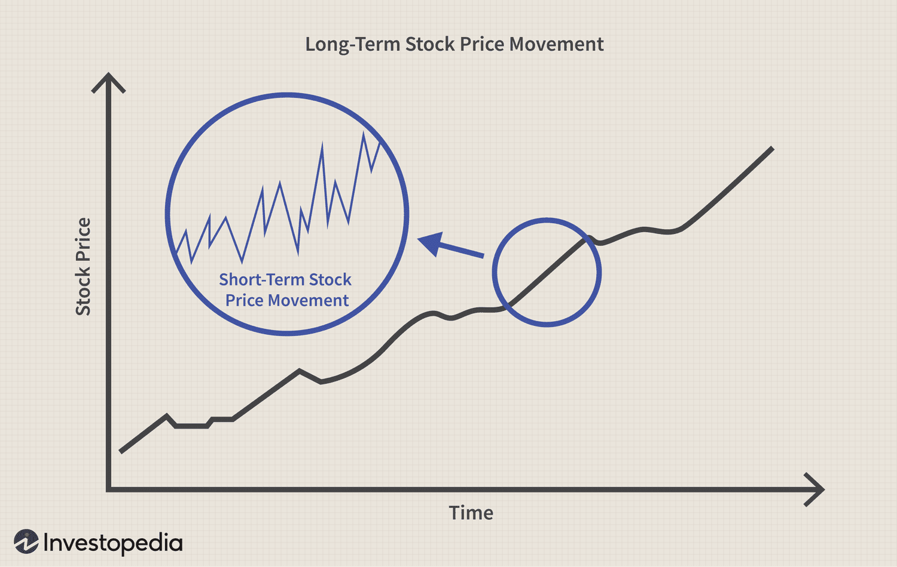

## Table of Contents

## What does it mean to outperform the market?

To outperform the market means that an investment or a portfolio of investments is doing better than the overall market. For example, if the stock market goes up by 10% in a year, but your investments go up by 15%, you are outperforming the market. This is often measured against a benchmark like the S&P 500, which represents a broad section of the market.

People often try to outperform the market by picking individual stocks or using different investment strategies. However, it can be hard to do this consistently over time because the market can be unpredictable. Many experts believe that trying to beat the market is risky, and instead, they suggest investing in a diversified portfolio that matches the market's performance.

## Who is considered an individual investor?

An individual investor is a person who invests their own money in different things like stocks, bonds, or mutual funds. They are not big companies or professional money managers. They usually invest to grow their savings or to prepare for the future, like retirement.

These investors often use online platforms or apps to buy and sell investments. They might get advice from financial advisors or do their own research to decide where to put their money. Individual investors can be anyone from a young person just starting to invest to an older person planning for their retirement.

## What are common investment strategies used by individual investors?

Individual investors often use a strategy called "buy and hold." This means they pick good investments and keep them for a long time, like many years. They believe that over time, the value of their investments will grow. This strategy works well if they choose solid companies or funds that do well over the long run. It's a simple way to invest without having to watch the market every day.

Another common strategy is "dollar-cost averaging." With this, investors put a fixed amount of money into their investments at regular times, like every month. This helps them buy more shares when prices are low and fewer when prices are high, which can lead to a lower average cost per share over time. It's a good way to invest without trying to guess the best times to buy or sell.

Some investors also try "active trading," where they buy and sell investments more often, trying to make money from short-term changes in prices. This can be riskier and takes more time and knowledge. They need to watch the market closely and make quick decisions. While it can lead to big gains, it can also lead to big losses if they're not careful.

## How can individual investors measure their performance against the market?

Individual investors can measure their performance against the market by comparing their investment returns to a common benchmark, like the S&P 500. The S&P 500 is a group of 500 big companies in the U.S., and it's often used to show how the overall market is doing. If an investor's portfolio grows more than the S&P 500 over the same time, they are doing better than the market. If it grows less, they are doing worse.

To do this, investors need to calculate the percentage change in their portfolio's value over a certain period, like a year. Then, they compare this percentage to the percentage change in the S&P 500 over the same time. For example, if an investor's portfolio goes up by 12% in a year and the S&P 500 goes up by 10%, the investor has outperformed the market. This comparison helps investors see if their investment choices are working well or if they need to make changes.

## What are the historical trends of individual investor performance?

Historically, many individual investors have found it hard to beat the market. Studies show that over long periods, most individual investors do not do better than the market averages like the S&P 500. This is because the market can be unpredictable, and picking the right stocks or timing the market is tough. Many people end up buying high and selling low because they let their emotions guide their decisions. This can lead to lower returns compared to just investing in a broad market index.

However, some individual investors do manage to outperform the market. These investors often have a solid plan and stick to it. They might focus on long-term investing, picking good companies and holding onto them for many years. Or they might use strategies like dollar-cost averaging to smooth out the ups and downs of the market. The key for these successful investors is usually patience and discipline, rather than trying to time the market or chase after the latest hot stocks.

## What psychological factors affect individual investors' decision-making?

Emotions play a big role in how individual investors make choices. One common emotion is fear. When the market goes down, investors might panic and sell their investments, even if it's not a good time to do so. This can lead to selling low and missing out on future gains. On the other hand, greed can make investors buy stocks when prices are high, hoping to make quick money. This often leads to buying high and then seeing the value drop.

Another psychological factor is overconfidence. Some investors think they know more than they actually do and make risky choices. They might trade too often, thinking they can predict the market, but this often leads to lower returns. Herd mentality is also common, where investors follow what everyone else is doing without doing their own research. This can lead to buying or selling at the wrong times, just because others are doing it.

Lastly, loss aversion can affect decision-making. Investors feel the pain of losing money more than the joy of gaining it. This can make them hold onto losing investments too long, hoping they'll recover, instead of cutting their losses and moving on. Understanding these psychological factors can help investors make better choices and avoid common mistakes.

## How does access to information impact an individual investor's ability to outperform the market?

Having more information can help individual investors make better choices. With the internet, investors can find lots of data about companies, market trends, and financial news. This can help them pick good stocks or decide when to buy and sell. But, having too much information can also be a problem. It can be hard to know which information is important and which is not. Sometimes, investors might feel overwhelmed and make bad decisions because they are trying to use too much information at once.

Even with all this information, it's still hard to beat the market. Big investors, like professional money managers, have tools and resources that individual investors don't have. They can use complex computer programs to analyze data and find patterns that are hard for regular people to see. So, while more information can help, it's not a guarantee that an individual investor will do better than the market. It's important for investors to use the information wisely and not let it lead them to make risky choices.

## What role do trading costs and fees play in the performance of individual investors?

Trading costs and fees can make a big difference in how well individual investors do. Every time an investor buys or sells a stock, they have to pay a fee. These fees can add up, especially if the investor trades a lot. If the fees are high, they can eat into the profits the investor makes. For example, if an investor makes a small profit on a trade but has to pay a big fee, they might end up losing money overall. So, it's important for investors to look for low-cost ways to trade and invest.

Fees also come from other places, like mutual funds or exchange-traded funds (ETFs). These funds charge what's called an expense ratio, which is a yearly fee based on how much money is in the fund. A high expense ratio can lower the returns an investor gets over time. That's why many investors choose funds with low expense ratios. By keeping trading costs and fees low, individual investors can keep more of their money and have a better chance of doing well in the market.

## How do market efficiency theories relate to individual investors' ability to outperform?

Market efficiency theories say that it's hard for anyone to beat the market because all the important information about stocks is already in their prices. This means that no matter how much research an individual investor does, they won't find any secret information that will help them do better than the market. According to these theories, the market is like a big puzzle that's always complete, so there's no way to find a missing piece that will give an investor an advantage.

Even though these theories make it seem tough for individual investors to outperform the market, some people still try. They might use different strategies, like picking stocks they think will do well or trading often to take advantage of small price changes. But, the theories suggest that most of the time, these efforts won't lead to better results than just investing in a broad market index. So, many experts recommend that individual investors focus on long-term investing and keeping their costs low, rather than trying to beat the market.

## What advanced tools and technologies can individual investors use to enhance their performance?

Individual investors can use many advanced tools and technologies to help them make better investment choices. One popular tool is a stock screener, which helps investors find stocks that meet certain criteria, like price or earnings growth. Another useful technology is a robo-advisor, which uses computer algorithms to manage an investor's money and pick investments based on their goals and how much risk they want to take. These tools can save time and help investors make more informed decisions.

Other advanced technologies include trading platforms with real-time data and charts, which let investors see what's happening in the market as it happens. Some platforms also have tools for technical analysis, which help investors predict future price movements based on past patterns. Additionally, there are apps and software that use artificial intelligence (AI) to analyze big amounts of data and find investment opportunities that might be hard for a person to see. By using these tools, individual investors can get a better understanding of the market and possibly improve their performance.

## How do professional investors' strategies differ from those of individual investors, and what can be learned from them?

Professional investors, like those who work for big investment firms, often use different strategies than individual investors. They have more resources and tools, which lets them do things like detailed research and complex analysis. For example, they might use big computer programs to look at lots of data and find patterns that help them pick stocks. They also trade a lot more often than individual investors, trying to make money from small changes in prices. This is called active trading, and it needs a lot of time and knowledge. Professional investors also spread their money across many different investments to lower their risk, a strategy called diversification.

Individual investors can learn a lot from how professionals do things. One big lesson is the importance of doing research before making investment choices. Even if individual investors can't use the same fancy tools, they can still look at company reports and news to make better decisions. Another thing to learn is the value of diversification. By spreading their money around, individual investors can lower their risk, just like the pros do. Finally, individual investors should think about their own goals and how much risk they can handle, instead of trying to copy the fast-paced trading of professionals. By taking these lessons to heart, individual investors can improve their chances of doing well in the market.

## What case studies or empirical research exist that analyze the ability of individual investors to outperform the market?

There have been many studies looking at whether individual investors can do better than the market. One famous study by Barber and Odean in 2000 looked at the trading records of over 66,000 households at a big brokerage firm. They found that most individual investors did not beat the market. In fact, the more they traded, the worse they did. This was because trading a lot meant paying more in fees and taxes, which ate into their profits. The study showed that overconfidence often led investors to trade too much, thinking they could predict the market, but this usually hurt their performance.

Another important piece of research came from Dalbar, a financial services firm. Their yearly study, called the "Quantitative Analysis of Investor Behavior," looks at how well individual investors do compared to the market. They found that over long periods, like 20 or 30 years, the average investor's returns were much lower than the market's. This was mainly because investors often bought high and sold low, driven by emotions like fear and greed. The study suggests that sticking to a long-term plan and not trying to time the market could help individual investors do better.

## References & Further Reading

[1]: Chan, E. P. (2009). ["Quantitative Trading: How to Build Your Own Algorithmic Trading Business"](https://github.com/ftvision/quant_trading_echan_book). John Wiley & Sons.

[2]: Aronson, D. R. (2006). ["Evidence-Based Technical Analysis: Applying the Scientific Method and Statistical Inference to Trading Signals"](https://www.amazon.com/Evidence-Based-Technical-Analysis-Scientific-Statistical/dp/0470008741). John Wiley & Sons.

[3]: Lopez de Prado, M. (2018). ["Advances in Financial Machine Learning"](https://www.amazon.com/Advances-Financial-Machine-Learning-Marcos/dp/1119482089). Wiley.

[4]: Jansen, S. (2020). ["Machine Learning for Algorithmic Trading"](https://github.com/stefan-jansen/machine-learning-for-trading). Packt Publishing.

[5]: Bergstra, J., Bardenet, R., Bengio, Y., & Kégl, B. (2011). ["Algorithms for Hyper-Parameter Optimization."](https://dl.acm.org/doi/10.5555/2986459.2986743) Advances in Neural Information Processing Systems 24.