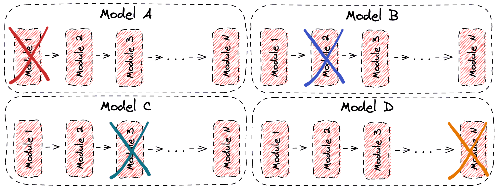

## Table of Contents

## What is ablation in the context of machine learning?

Ablation in machine learning is a method used to understand how different parts of a model affect its performance. Imagine you have a big puzzle, and you want to know which pieces are the most important. In ablation, you remove or change one part of the model at a time and see how it impacts the results. This helps researchers figure out which components are essential and which ones can be improved or removed.

For example, if you have a neural network with several layers, you might remove one layer to see how the network's accuracy changes. By doing this, you can learn which layers are crucial for the model's success. Ablation studies are very useful for making models simpler and more efficient, as they help pinpoint the most effective parts of a complex system.

## Why is ablation important in machine learning models?

Ablation is important in machine learning because it helps us understand which parts of a model are really doing the work. Imagine you're trying to bake a cake, and you want to know if the baking powder is necessary. You can make the cake without it and see if it still rises. In machine learning, we do something similar by removing or changing parts of the model to see how it affects the results. This helps us figure out which parts are essential and which ones we can do without, making our models simpler and more efficient.

By using ablation, researchers can also improve their models. If a certain part of the model isn't helping much, they might decide to change it or remove it altogether. This can lead to better performance and faster training times. For example, if a neural network has many layers, an ablation study might show that some layers aren't needed, so they can be taken out to make the network simpler and quicker. This process of refining models through ablation is crucial for developing effective and efficient machine learning systems.

## How does an ablation study help in understanding model performance?

An ablation study helps us understand model performance by taking away parts of the model one at a time and seeing how it changes the results. Imagine you're playing with a Lego set, and you want to know which pieces are most important for keeping the structure strong. You take out one piece at a time and see if the structure falls apart. In [machine learning](/wiki/machine-learning), we do something similar by removing or changing parts of the model to see how it affects the accuracy or other performance metrics. This helps us figure out which parts are really important and which ones we can do without.

By doing an ablation study, we can also find ways to make our models better. If a certain part of the model isn't helping much, we might decide to change it or remove it altogether. This can lead to better performance and faster training times. For example, if a [neural network](/wiki/neural-network) has many layers, an ablation study might show that some layers aren't needed, so they can be taken out to make the network simpler and quicker. This process of refining models through ablation is crucial for developing effective and efficient machine learning systems.

## What are the steps to conduct an ablation study?

To conduct an ablation study, you first need to identify the components of your model that you want to test. These could be layers in a neural network, features in a dataset, or any other parts that you think might affect the model's performance. Once you've decided on these components, you start by creating a baseline model, which is the original model with all its parts intact. You then run this baseline model on your dataset to get a performance metric, like accuracy or error rate, which you'll use as a reference point.

Next, you begin the ablation process by removing or modifying one component at a time from the baseline model. For each modification, you run the modified model on the same dataset and compare its performance to the baseline. If the performance drops significantly when a component is removed, it suggests that the component is important. If the performance stays the same or improves, it might mean that the component isn't necessary or could be optimized. You repeat this process for each component you're testing, keeping track of the changes in performance to understand the impact of each part.

Finally, after you've tested all the components, you analyze the results to draw conclusions about which parts of the model are crucial and which ones can be improved or removed. This analysis can guide you in refining the model to make it more efficient and effective. By understanding the role of each component, you can make informed decisions about how to simplify the model or enhance its performance, leading to better overall results.

## Can you explain the difference between feature ablation and layer ablation?

Feature ablation and layer ablation are two different ways to study a machine learning model. In feature ablation, you focus on the input data. You remove or change one feature at a time to see how it affects the model's performance. For example, if you're predicting house prices and you have features like the number of rooms, the size of the house, and the location, you might remove the 'number of rooms' feature and see how the model's predictions change. This helps you understand which features are most important for making accurate predictions.

In layer ablation, you look at the structure of the model itself, especially if it's a neural network. Here, you remove or change one layer at a time to see how it impacts the model's performance. For instance, if your neural network has five layers, you might remove the third layer and run the model again to see if the accuracy changes. This helps you figure out which layers are essential for the model to work well and which ones might be unnecessary or could be improved. Both types of ablation help in understanding and improving the model, but they focus on different parts: feature ablation looks at the data, while layer ablation looks at the model's structure.

## What are some common metrics used to evaluate the results of an ablation study?

When you do an ablation study, you need to check how well your model is doing after you change it. Some common ways to measure this are accuracy, which tells you how often the model gets the right answer, and error rate, which tells you how often it gets it wrong. You might also look at precision and recall if you're dealing with a classification problem. Precision tells you how many of the positive predictions were correct, and recall tells you how many of the actual positive cases were caught by the model. Another useful metric is the F1 score, which is the harmonic mean of precision and recall, giving you a single number to compare different models. You can calculate it with this formula: $$ F1 = 2 \times \frac{\text{precision} \times \text{recall}}{\text{precision} + \text{recall}} $$.

For tasks like regression, you might use the Mean Squared Error (MSE) or the Root Mean Squared Error (RMSE) to see how far off your predictions are from the real values. MSE is the average of the squares of the errors, and RMSE is the square root of MSE, which makes it easier to understand because it's in the same units as your data. Sometimes, you might also look at the R-squared value, which tells you how well your model fits the data. A higher R-squared means your model explains more of the variation in the data. By using these metrics, you can see which parts of your model are important and how changing them affects how well it works.

## How can ablation studies be used to optimize neural network architectures?

Ablation studies help optimize neural network architectures by figuring out which parts of the network are really important. Imagine you have a big puzzle, and you want to know which pieces are the most important. In an ablation study, you take away one part of the neural network at a time, like a layer, and see how it affects the network's performance. If the performance drops a lot when you remove a layer, it means that layer is important. But if the performance stays the same or even gets better, that layer might not be needed or could be changed to make the network work better.

By doing this, you can make the neural network simpler and more efficient. For example, if you find that some layers aren't helping much, you can take them out. This can make the network run faster and use less computer power. Ablation studies also help you understand how different parts of the network work together. By knowing which layers are crucial, you can focus on improving those parts to make the whole network better. This way, ablation studies are a key tool for making neural networks as effective and efficient as possible.

## What challenges might one face when performing an ablation study?

Performing an ablation study can be challenging because it takes a lot of time and computer power. When you remove or change parts of a model one by one, you have to run the model many times to see how each change affects the results. This can be slow, especially if the model is big and complex. Also, you need to be careful to make sure you're changing only one thing at a time, or you might not know what caused the change in performance. If you're not careful, you could end up with results that are hard to understand or that don't help you improve your model.

Another challenge is deciding which parts of the model to test. In a big neural network, there might be many layers, and you need to figure out which ones are important to look at. If you test too many parts, the study can take too long, but if you don't test enough, you might miss important information. Sometimes, the results can be hard to interpret too. For example, if removing a layer makes the model perform worse, you need to figure out why that happened. It could be because the layer was important, or it could be because removing it changed how the other layers work together. Understanding these results can be tricky and requires a good understanding of how the model works.

## How do ablation studies contribute to feature selection in machine learning?

Ablation studies help with feature selection by figuring out which pieces of information are most important for the model to work well. Imagine you're making a recipe and you want to know which ingredients you really need. In an ablation study, you take away one feature at a time and see how it changes the model's performance. If the model does worse without a certain feature, it means that feature is important. But if the model does the same or even better without it, you might not need that feature at all. This helps you make your model simpler and faster because you only keep the features that matter.

By using ablation studies, you can also find out if some features are working together in ways you didn't expect. Sometimes, removing one feature can make other features more important or less important. This can help you understand how different pieces of information are connected and how they help the model make decisions. For example, if you're predicting house prices and you remove the 'number of rooms' feature, you might find that 'house size' becomes more important. This kind of insight can guide you in choosing the best set of features to use, making your model more effective and easier to understand.

## Can you provide an example of how ablation has been used to improve a specific machine learning model?

In a study to improve a [convolutional neural network](/wiki/convolutional-neural-network) (CNN) for image classification, researchers used ablation to figure out which layers were most important. They started with a CNN that had several layers, including convolutional layers, pooling layers, and fully connected layers. They ran the original model on a dataset of images and recorded its accuracy. Then, they removed one layer at a time and ran the model again to see how the accuracy changed. They found that removing certain convolutional layers made the accuracy drop a lot, showing that these layers were crucial for recognizing patterns in the images. However, removing some of the fully connected layers didn't affect the accuracy much, so they were able to simplify the model by taking those layers out.

By doing this ablation study, the researchers made the CNN simpler and faster without losing much accuracy. The simplified model was easier to train and used less computer power, making it more practical for real-world use. This example shows how ablation can help improve machine learning models by figuring out which parts are really doing the work and which ones can be removed or changed to make the model better.

## What advanced techniques can be applied during an ablation study to gain deeper insights?

To gain deeper insights during an ablation study, you can use advanced techniques like sensitivity analysis. This method helps you understand how small changes in a model's parts affect its performance. For example, instead of just removing a layer completely, you might change its parameters a little bit at a time and see how the model's accuracy changes. This can show you not just if a layer is important, but how sensitive the model is to changes in that layer. By doing this, you can find the best settings for each part of the model to make it work as well as possible.

Another technique is to use statistical tests to see if the changes in performance are really meaningful. When you remove or change a part of the model, the performance might go up or down a little bit, but you need to know if that change is big enough to matter. You can use tests like the t-test to see if the difference in performance is statistically significant. For example, if you remove a feature and the model's accuracy drops from 90% to 89%, you might think it's not a big deal. But if the t-test shows that this drop is significant, it means the feature really is important. This helps you make sure you're not just seeing random changes, but real effects on the model's performance.

## How do ablation studies in machine learning compare to those in other fields like neuroscience?

Ablation studies in machine learning and neuroscience both aim to understand how different parts of a system contribute to its overall function. In machine learning, ablation involves removing or changing parts of a model, like layers in a neural network or features in a dataset, to see how it affects the model's performance. Researchers might take out one layer at a time and measure changes in accuracy or error rates. This helps them figure out which parts are essential and how to make the model simpler and more efficient. For example, if removing a certain layer causes the model's accuracy to drop significantly, it shows that the layer is important for the model's success.

In neuroscience, ablation studies are used to understand brain function by removing or damaging specific parts of the brain and observing the effects on behavior or other brain functions. Scientists might lesion a part of an animal's brain and then study how it affects the animal's ability to perform certain tasks. This helps them learn which areas of the brain are responsible for different functions. Just like in machine learning, the goal is to understand the importance of different components, but in neuroscience, the focus is on biological systems rather than computational models. Both fields use ablation to gain insights into complex systems, but the methods and applications differ based on the nature of what is being studied.