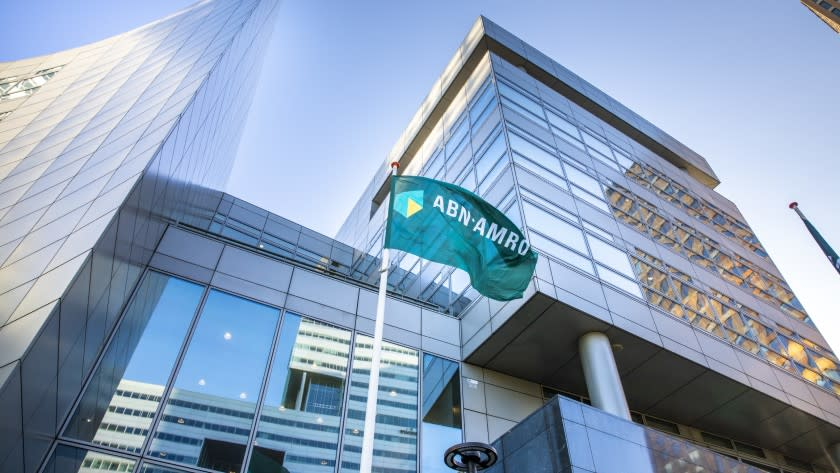

ABN AMRO is one of the largest banking institutions in the Netherlands, offering a diverse portfolio of financial services. Its historical roots trace back to the 1700s, with its growth significantly shaped by a series of strategic mergers and acquisitions. ABN AMRO's formation in 1991 was the result of several banks coming together, helping it establish a strong presence in the European financial scene. In 2007, the bank was part of a major acquisition that marked an unprecedented move in European banking history.

The financial crisis of 2008 had a considerable impact on the banking sector worldwide. During this period, the Dutch government intervened to stabilize ABN AMRO by acquiring a substantial stake in the bank. This intervention transformed ABN AMRO into a consumer-focused lender, emphasizing digital transformation and consumer-centric financial solutions. 



In recent years, algorithmic trading, often referred to as algo trading, has become increasingly popular within financial institutions. ABN AMRO has embraced this trend, integrating sophisticated algorithms to automate and enhance trading decisions. By leveraging advanced technology, the bank aims to improve trading efficiency, reduce costs, and offer personalized financial solutions. This article will provide an overview of ABN AMRO's adoption of algorithmic trading and its implications for enhancing the bank's financial services.

## Table of Contents

## History of ABN AMRO

ABN AMRO originated from a series of consolidations that culminated in its formal establishment in 1991. It was formed through the merger of Algemene Bank Nederland (ABN) and Amsterdam-Rotterdam Bank (Amro), each with strong historical roots in Dutch banking. This merger created a robust entity that significantly enhanced its presence in the European financial markets.

In 2007, ABN AMRO was involved in a monumental acquisition deal, considered one of the largest in European banking history. The bank was acquired by a consortium of three prominent European banks: Royal Bank of Scotland, Fortis, and Banco Santander. This acquisition highlighted ABN AMRO’s significant value and strategic importance in the global financial sector.

During the 2008 global financial crisis, ABN AMRO faced substantial challenges that prompted intervention by the Dutch government. To prevent the bank from collapsing and to stabilize the Dutch financial system, the government acquired a major stake in the bank. This intervention was crucial in safeguarding the bank’s operations and maintaining customer confidence.

Following the crisis, ABN AMRO embarked on a strategic transformation, focusing on consumer lending and embracing digital innovation. The bank recognized the necessity to adapt to changing market dynamics and consumer demands, which led to a streamlined approach in its operations. Digital transformation became a cornerstone of ABN AMRO’s strategy, allowing it to remain competitive while offering innovative and accessible financial services to its clients.

ABN AMRO’s history of strategic mergers and acquisitions has solidified its status as a key player in the international banking landscape. The institution's adaptive strategies, particularly after the crisis, underscore its commitment to resilient growth and enhanced customer service through digital means.

## ABN AMRO's Algorithmic Trading

Algorithmic trading refers to the utilization of complex computational algorithms to automate trading decisions in financial markets. ABN AMRO has strategically integrated advanced technology and robust data analysis into its trading operations to capitalize on this transformative approach. By automating trades, the bank significantly enhances its trading efficiency and reduces transaction costs, offering a streamlined service to its clientele.

ABN AMRO's [algorithmic trading](/wiki/algorithmic-trading) platform is designed to support a broad spectrum of investment products, which equips the bank to deploy sophisticated trading strategies. This capability is vital in enabling the bank to maintain competitiveness in the fast-paced trading environment. The algorithms employed can process vast amounts of market data and execute trades at speeds beyond the capacity of human traders, thereby optimizing financial performance and precision.

The bank's venture into algorithmic trading reflects its steadfast commitment to innovation and customer satisfaction. By leveraging technological advancements, ABN AMRO ensures that its trading services are not only efficient but also aligned with contemporary financial practices. This approach allows clients to benefit from cutting-edge trading solutions that minimize costs while maximizing potential returns. The integration of algorithmic trading within ABN AMRO’s operations underscores the bank’s dedication to maintaining its stature as a forward-thinking entity in the financial industry.

## Benefits of Algorithmic Trading at ABN AMRO

Algorithmic trading at ABN AMRO offers numerous advantages that significantly enhance their financial services. One of the primary benefits is increased trading efficiency. Automation allows transactions to be executed in fractions of a second, effectively eliminating the delays associated with manual trading. This speed not only allows for greater market responsiveness but also reduces the incidence of human error. As algorithms handle the bulk of the trading process, the need for human intervention is minimized, leading to cost effectiveness. The streamlined operations mean lower operational costs, as fewer personnel are required to manage trades, and the algorithms can execute large volumes of trades with precision.

Enhanced market analysis is another critical benefit of algorithmic trading. Advanced algorithms are capable of processing vast amounts of market data in real time, providing deeper insights into market trends and behaviors. This capability is crucial for making informed trading decisions. These algorithms can use data analytics to predict market movements, offering a competitive edge by allowing ABN AMRO to act swiftly in favorable or adverse market conditions.

In terms of risk management, algorithmic trading provides better risk assessment capabilities. Through continuous monitoring and data analysis, algorithms can evaluate risk exposures in real time and adjust strategies accordingly. This constant vigilance helps to mitigate potential losses and ensures that trading activities align with set risk parameters.

Moreover, algorithmic trading at ABN AMRO supports customizable strategies for clients. The use of sophisticated algorithms enables the creation of tailored trading plans that align with individual investment objectives. Clients can specify parameters such as risk tolerance, investment horizon, and asset preferences. This personalization ensures that trading strategies are not only efficient but also aligned with specific client goals, maximizing the potential for returns.

Overall, these benefits underscore ABN AMRO’s commitment to enhancing their financial services through advanced technological solutions, making them a frontrunner in the domain of algorithmic trading.

## Technological Advancements Supporting ABN AMRO’s Algo Trading

ABN AMRO leverages technological advancements to enhance its algorithmic trading operations, focusing on scalability, reliability, and security. The bank's investment in a robust technology infrastructure is critical for managing the high-speed and data-intensive nature of algorithmic trading. 

Artificial intelligence (AI) and [machine learning](/wiki/machine-learning) (ML) are integral to ABN AMRO's trading strategies, enabling sophisticated predictive analytics. These technologies analyze vast datasets to identify patterns and forecast market trends, enhancing decision-making processes. Machine learning models, such as decision trees and neural networks, are deployed to gain insights into market [volatility](/wiki/volatility-trading-strategies) and potential [arbitrage](/wiki/arbitrage) opportunities.

Cloud-based solutions are pivotal in providing the flexibility and scalability required for algorithmic trading. By utilizing cloud platforms, ABN AMRO can efficiently manage trading demands and adapt to market fluctuations. This technological approach ensures that computational resources are optimized, reducing latency and improving transaction throughput.

Cybersecurity is a top priority for ABN AMRO, as it is vital to protect client data and maintain the integrity of trading operations. The bank employs advanced encryption technologies and multi-layered security protocols to safeguard against cyber threats. Continuous monitoring and threat detection systems are employed to mitigate potential risks, ensuring the secure execution of trades.

Collaborations with fintech companies further enhance ABN AMRO's technological capabilities. Such partnerships allow the bank to integrate cutting-edge innovations into their trading platforms, fostering agility and responsiveness to market changes. By working with fintech startups, ABN AMRO stays ahead in the competitive financial technology landscape and continuously improves its trading offerings.

Overall, ABN AMRO's commitment to technology ensures robust and efficient algorithmic trading solutions, aligning with its strategic objectives of innovation and customer satisfaction.

## Challenges and the Future of Algorithmic Trading

The financial industry, including institutions like ABN AMRO, encounters various regulatory challenges in the implementation of algorithmic trading. Regulatory bodies globally emphasize the necessity of maintaining transparency and upholding ethical standards in automated trading processes. This necessity is driven by the potential for market manipulation and other illicit activities that may arise from opaque trading algorithms. Therefore, financial institutions are tasked with ensuring that their algorithmic trading systems are auditable and operate within the legal frameworks set by regulators such as the European Securities and Markets Authority (ESMA) and the Financial Conduct Authority (FCA).

Simultaneously, the rapid advancement of technology continues to create new opportunities and competitive pressures within the financial sector. Algorithmic trading firms, including ABN AMRO, are increasingly adopting AI and machine learning to enhance the efficacy of trading strategies. These technologies facilitate superior predictive analytics, offering deeper insights into market trends and behaviors. For example, machine learning models can process large volumes of data to identify patterns that human traders might overlook. A basic example in Python might involve using the popular machine learning library scikit-learn to predict stock price movements:

```python
from sklearn.ensemble import RandomForestRegressor
import numpy as np

# Example data (features and labels)
X = np.array([[1, 2], [2, 3], [3, 4], [4, 5]])
y = np.array([0.1, 0.15, 0.2, 0.25])

# Model instantiation and training
model = RandomForestRegressor(n_estimators=100)
model.fit(X, y)

# Predict future price
future_data = np.array([[5, 6]])
predicted_price = model.predict(future_data)
print(predicted_price)
```

The future of algorithmic trading at ABN AMRO thus hinges on its capacity to integrate cutting-edge technologies while adhering to regulatory and ethical standards. As the bank seeks to leverage AI and machine learning for more refined trading solutions, it is also committed to innovation and sustainable growth in its trading practices. ABN AMRO aims to maintain a strategic balance between harnessing technological advancements and managing the associated risks. By doing so, it ensures a forward-looking approach to algorithmic trading, enhancing both its market position and client services in an evolving digital landscape.

## Conclusion

ABN AMRO's adoption of algorithmic trading signifies a strategic positioning within the evolving financial sector. The bank's focus on integrating advanced technology into its operations is clearly reflected in the development of sophisticated trading strategies. By implementing algorithmic trading, ABN AMRO not only optimizes trading efficiency but also achieves significant cost reductions, thereby enhancing client satisfaction. This approach showcases the bank's dedication to providing innovative and effective trading solutions, positioning it as a competitive player in digital banking.

As the regulatory landscape for financial institutions continues to evolve, ABN AMRO remains agile, adapting its trading capabilities to meet new legal and ethical standards. This adaptability is crucial to maintaining transparency and trust with clients and regulators alike. The bank's commitment to harnessing technological advancements ensures that it remains at the forefront of financial innovation.

Looking ahead, ABN AMRO is poised to leverage emerging technologies such as [artificial intelligence](/wiki/ai-artificial-intelligence) and machine learning, further refining its trading solutions and processes. This forward-thinking vision emphasizes the bank's role as a leader in digital banking, committed to sustainable growth and continuous improvement in its financial services offerings.

## References & Further Reading

[1]: Bergstra, J., Bardenet, R., Bengio, Y., & Kégl, B. (2011). ["Algorithms for Hyper-Parameter Optimization."](https://dl.acm.org/doi/10.5555/2986459.2986743) Advances in Neural Information Processing Systems 24.

[2]: ["Advances in Financial Machine Learning"](https://www.amazon.com/Advances-Financial-Machine-Learning-Marcos/dp/1119482089) by Marcos Lopez de Prado

[3]: ["Evidence-Based Technical Analysis: Applying the Scientific Method and Statistical Inference to Trading Signals"](https://www.amazon.com/Evidence-Based-Technical-Analysis-Scientific-Statistical/dp/0470008741) by David Aronson

[4]: ["Machine Learning for Algorithmic Trading"](https://github.com/stefan-jansen/machine-learning-for-trading) by Stefan Jansen

[5]: ["Quantitative Trading: How to Build Your Own Algorithmic Trading Business"](https://www.amazon.com/Quantitative-Trading-Build-Algorithmic-Business/dp/1119800064) by Ernest P. Chan