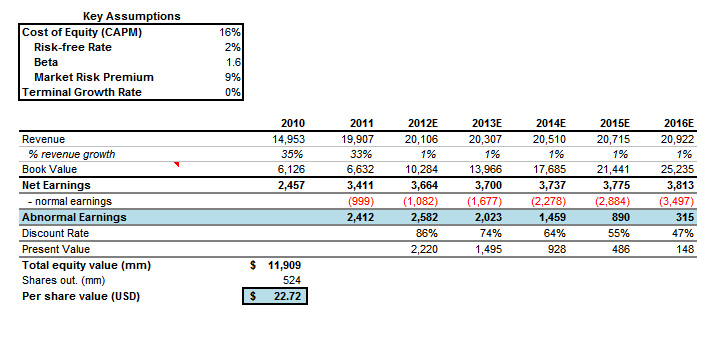

## Table of Contents

## What is the Abnormal Earnings Valuation Model?

The Abnormal Earnings Valuation Model, also known as the Residual Income Model, is a way to figure out how much a company is worth. It looks at the earnings a company makes above what it should make if it just invested its money in something safe, like government bonds. This extra money is called "abnormal earnings" or "residual income." The idea is that if a company can make more money than it would from a safe investment, it's doing something special and that should add to its value.

To use this model, you start with the book value of the company's equity, which is what the company is worth according to its balance sheet. Then, you add up all the abnormal earnings the company is expected to make in the future. You discount these future earnings back to today's dollars using a discount rate, which is usually the cost of equity. The sum of the book value and the present value of the abnormal earnings gives you the total value of the company. This model is useful because it focuses on the company's ability to generate profits beyond what's expected, which can be a good sign of a strong business.

## How does the Abnormal Earnings Valuation Model differ from other valuation models?

The Abnormal Earnings Valuation Model, or Residual Income Model, is different from other valuation models because it focuses on the extra earnings a company makes. Other models, like the Discounted Cash Flow (DCF) model, look at all the cash a company is expected to make in the future. The DCF model adds up all future cash flows and discounts them back to today's value. In contrast, the Abnormal Earnings Model only cares about the earnings that are above what the company would earn from a safe investment. This means it's looking at how well the company uses its money to make more than the minimum expected return.

Another way the Abnormal Earnings Model differs is in how it starts the valuation process. While models like the DCF start from zero and build up value based on all future cash flows, the Abnormal Earnings Model starts with the book value of the company's equity. It then adds the present value of the abnormal earnings. This approach can be useful because it gives a clearer picture of how much value the company's management is adding beyond what's already accounted for in the balance sheet. It's like saying, "We know the company is worth this much on paper, but how much more value can it create?"

In summary, the Abnormal Earnings Valuation Model stands out because it zeroes in on the company's ability to generate profits beyond a basic level, and it uses the book value as a starting point. This makes it a unique tool for investors who want to understand not just the total value of a company, but specifically how much value is being created by the company's operations and management.

## What are the key components of the Abnormal Earnings Valuation Model?

The Abnormal Earnings Valuation Model has a few main parts that help figure out a company's value. The first part is the book value of the company's equity. This is like the starting point, showing what the company is worth according to its balance sheet. The second part is the abnormal earnings, which are the extra profits the company makes above what it would earn from a safe investment, like government bonds. These abnormal earnings show how well the company is doing compared to just putting money in a safe place.

The third part is the discount rate, which is usually the cost of equity. This rate is used to figure out what the future abnormal earnings are worth today. By adding the book value to the present value of the abnormal earnings, you get the total value of the company. This model is useful because it focuses on the company's ability to make more money than expected, which can show how good the company's management is at creating value.

## How is the cost of equity calculated in the Abnormal Earnings Valuation Model?

In the Abnormal Earnings Valuation Model, the cost of equity is a key part because it's used to figure out what the future abnormal earnings are worth today. The cost of equity is like the rate of return that investors expect to get for putting their money into the company's stock. There are different ways to calculate it, but one common method is the Capital Asset Pricing Model (CAPM). The CAPM says that the cost of equity is made up of a few things: the risk-free rate, which is what you'd get from a safe investment like government bonds, plus a bit extra to account for the risk of investing in the stock market, called the equity risk premium. Then, you add another bit that depends on how risky the company's stock is compared to the market, called the beta.

To use the CAPM, you start with the risk-free rate, which you can find from the yield on government bonds. Then, you add the equity risk premium, which is usually around 5-6% but can change based on what's happening in the market. Finally, you multiply the equity risk premium by the company's beta, which shows how much the company's stock moves with the market. If the company's stock is more risky than the market, the beta will be higher than 1, and if it's less risky, the beta will be lower than 1. So, the cost of equity is the risk-free rate plus the equity risk premium times the beta. This gives you a number that shows what return investors expect, and you use this number to discount the future abnormal earnings back to today's value.

## What is the formula for calculating abnormal earnings?

Abnormal earnings, also called residual income, are the extra profits a company makes above what it would earn from a safe investment. To calculate abnormal earnings, you start with the company's net income, which is the profit after all expenses. Then, you subtract the equity charge, which is what the company would have earned if it had invested its equity in a safe place like government bonds. The equity charge is found by multiplying the company's equity by the cost of equity. So, the formula for abnormal earnings is: Abnormal Earnings = Net Income - (Equity × Cost of Equity).

This formula helps show how well a company is doing compared to just putting money in a safe place. If the abnormal earnings are positive, it means the company is making more money than it would from a safe investment, which is a good sign. If the abnormal earnings are negative, it means the company isn't making enough to cover what it could have earned from a safe investment. By looking at abnormal earnings, investors can see if the company's management is doing a good job at creating extra value.

## How do you forecast future abnormal earnings?

To forecast future abnormal earnings, you start by looking at the company's past financial performance. You need to see how much net income the company made in the past and what its equity was. Then, you use this information to make a guess about what the company's net income and equity will be in the future. You also need to think about things that might change, like the economy, the company's industry, or new products the company might sell. By putting all this together, you can make a prediction about the company's future net income.

Once you have a guess about future net income, you need to figure out the future equity charge. This means you need to predict what the company's equity will be and what the cost of equity will be in the future. The cost of equity can change based on things like interest rates and how risky the company's stock is. After you have these numbers, you can use the formula for abnormal earnings: Abnormal Earnings = Net Income - (Equity × Cost of Equity). By doing this for each future year, you can forecast the abnormal earnings the company will make.

## What role does the terminal value play in the Abnormal Earnings Valuation Model?

The terminal value is a big part of the Abnormal Earnings Valuation Model. It's like a guess about how much the company will be worth way into the future, after you've looked at the abnormal earnings for a few years. Since you can't keep guessing the abnormal earnings forever, you use the terminal value to add up all the value the company will make after the years you've already looked at. This helps you get a full picture of the company's worth.

To find the terminal value, you usually use a simple formula that says the company will keep making the same amount of abnormal earnings every year into the future. You then figure out what that steady stream of earnings is worth today by using the cost of equity to discount it back. Adding this terminal value to the abnormal earnings you've already figured out for the first few years gives you the total value of the company. This way, you don't miss out on the value the company might make in the long run.

## How can the Abnormal Earnings Valuation Model be used to estimate a company's intrinsic value?

The Abnormal Earnings Valuation Model helps figure out a company's intrinsic value by looking at the extra money it makes. You start with the book value of the company's equity, which is what the company is worth on paper. Then, you add up all the abnormal earnings the company is expected to make in the future. Abnormal earnings are the profits the company makes above what it would earn from a safe investment like government bonds. You guess what these earnings will be for a few years and then use a discount rate, usually the cost of equity, to figure out what those future earnings are worth today. The cost of equity is what investors expect to earn from the company's stock.

After you've added up the present value of the abnormal earnings for the first few years, you need to think about the long-term value of the company. This is where the terminal value comes in. The terminal value is a guess about what the company will be worth way into the future, after the years you've already looked at. You use a simple formula to say the company will keep making the same amount of abnormal earnings every year into the future, and then you discount that back to today's value using the cost of equity. By adding the terminal value to the abnormal earnings you've already figured out, you get the total intrinsic value of the company. This way, you get a full picture of what the company is really worth, not just what it's worth on paper.

## What are the common challenges and limitations of using the Abnormal Earnings Valuation Model?

Using the Abnormal Earnings Valuation Model can be tricky because it depends a lot on guessing what will happen in the future. You need to predict the company's net income and equity for years ahead, which is hard because things like the economy, the company's industry, and new products can change a lot. You also have to guess the cost of equity, which can change based on interest rates and how risky the company's stock is. If your guesses are wrong, the value you come up with for the company might be way off. This makes the model sensitive to errors in your predictions.

Another challenge is figuring out the terminal value, which is what the company will be worth way into the future. You have to guess that the company will keep making the same amount of abnormal earnings every year, which might not be true. If the company's growth changes a lot, the terminal value could be way off. Also, the model starts with the book value of the company's equity, which might not always be a good measure of what the company is really worth. These challenges mean that while the Abnormal Earnings Valuation Model can be useful, it's important to use it carefully and think about other ways to check the company's value too.

## How does the accuracy of the Abnormal Earnings Valuation Model depend on the quality of earnings forecasts?

The accuracy of the Abnormal Earnings Valuation Model really depends on how good your guesses about future earnings are. If you can predict the company's net income and equity well, then the model will give you a good idea of what the company is worth. But if your guesses are off, the value you come up with might be way wrong. This is because the model uses these guesses to figure out the abnormal earnings, which are the extra profits the company makes. So, if your predictions about the future are not good, the whole model's results can be messed up.

Another thing to think about is that the model also needs a good guess about the cost of equity, which is what investors expect to earn from the company's stock. If this guess is wrong, it can mess up how you figure out the present value of the future abnormal earnings. The terminal value, which is what the company will be worth way into the future, also depends on these guesses. If you think the company will keep making the same amount of abnormal earnings every year, but it doesn't, the terminal value will be off. So, the quality of your earnings forecasts is super important for the Abnormal Earnings Valuation Model to work right.

## Can you provide a case study where the Abnormal Earnings Valuation Model was effectively applied?

A good example of using the Abnormal Earnings Valuation Model happened with a company called XYZ Corp. Analysts wanted to figure out how much XYZ Corp was really worth. They started by looking at the book value of XYZ Corp's equity, which was what the company was worth on paper. Then, they guessed what the company's net income would be for the next five years. They also figured out the cost of equity, which was what investors expected to earn from the company's stock. By using the formula for abnormal earnings, which is the extra profit the company makes above what it would earn from a safe investment, they found out how much extra money XYZ Corp was making each year. They discounted these future abnormal earnings back to today's value using the cost of equity. After adding up these values for the first five years, they used a simple formula to guess the terminal value, which is what the company would be worth way into the future. By adding the terminal value to the abnormal earnings they had already figured out, they got a good idea of XYZ Corp's intrinsic value.

In this case, the analysts found that XYZ Corp was making a lot of abnormal earnings, which meant the company was doing a great job at creating extra value. The model showed that XYZ Corp was worth more than what was shown on its balance sheet. This helped investors see that the company's management was doing a good job and that the company had a bright future. The Abnormal Earnings Valuation Model was really useful here because it focused on the extra profits the company was making, which gave a clear picture of how well the company was doing compared to just putting money in a safe place. By using this model, investors could make better decisions about whether to buy or sell XYZ Corp's stock.

## How can the Abnormal Earnings Valuation Model be adjusted for industries with unique financial characteristics?

The Abnormal Earnings Valuation Model can be adjusted for industries with unique financial characteristics by changing how you guess future earnings and the cost of equity. For example, in industries like tech, where companies might not make a lot of profit right away but are expected to grow a lot in the future, you might need to guess higher growth rates for net income. You might also need to use a different cost of equity because tech companies can be riskier than other companies. By making these changes, you can make the model fit better with what's going on in the tech industry.

In industries like utilities, where companies have steady but slow growth, you might guess lower growth rates for net income. Utilities are usually less risky, so you might use a lower cost of equity. You might also need to think about how regulations affect the company's earnings. By adjusting the model this way, you can get a better idea of what a utility company is really worth. No matter the industry, the key is to make the model fit the unique financial characteristics of the companies you're looking at.

## What is the Understanding of the Abnormal Earnings Valuation Model?

The Abnormal Earnings Valuation Model (AEVM), also known as the Residual Income Model, offers a nuanced approach to equity valuation by integrating a company’s book value with its future earnings potential. In contrast to traditional valuation methods, the AEVM emphasizes the difference between projected and actual earnings as a measure of a company's management efficacy.

At its core, the model assesses the excess earnings over a required return on equity, reflecting the notion that a company's true worth extends beyond mere accounting figures to encompass management's ability to create value. This approach is particularly useful in evaluating whether a stock is under or overvalued relative to its intrinsic value.

In the AEVM, the valuation is calculated by focusing on residual income. Residual income can be represented by the formula:

$$
\text{RI} = \text{NI} - (r \times \text{BV})
$$

where:
- $\text{RI}$ is the residual income
- $\text{NI}$ is the net income
- $r$ is the cost of equity
- $\text{BV}$ is the book value of equity

Residual income is the net income remaining after subtracting the equity charge, which is the product of the book value and the cost of equity. Thus, this model provides a basis for assessing the efficiency of a company’s management in generating returns above the firm's required return on equity.

By incorporating both current book value and expected future residual earnings, the model helps identify discrepancies between market price and intrinsic value. Companies consistently generating positive residual income indicate successful management strategies capable of surpassing expected returns, suggesting potential undervaluation by the market. Conversely, a negative residual income could imply that the company is overvalued, as management is not efficiently utilizing resources to surpass the expected return on equity.

This model's emphasis on the difference between projected and actual earnings highlights the importance of managerial decisions in creating shareholder value, offering insights into how effectively a company employs its resources to achieve economic profitability.

## What are the core principles and calculations?

The Abnormal Earnings Valuation Model centers on assessing a company's economic profit rather than its accounting profit. This model emphasizes management's capacity to generate returns exceeding the cost of equity. The core idea is that, while accounting profit provides a snapshot of earnings, economic profit accounts for the opportunity cost of capital, offering a deeper insight into management's effectiveness.

A fundamental concept in this approach is residual income, which signifies the actual economic profit remaining after deducting the equity charge from net income. Residual income is the amount by which a company's net income exceeds the minimum rate of return required by its investors. Essentially, it captures the value created over and above the expected returns on equity capital.

The calculation of abnormal earnings can be expressed through the following formula:

$$
\text{Abnormal Earnings} = \text{Net Income} - ( \text{Equity Capital} \times \text{Cost of Equity} )
$$

In this equation:
- **Net Income** is the profit of the company as reported on the income statement.
- **Equity Capital** represents the total amount of equity invested in the company.
- **Cost of Equity** signifies the rate of return required by equity investors. It reflects the risk associated with the investment in the company.

By comparing net income with the expected earnings (calculated as equity capital multiplied by the cost of equity), the model identifies whether the management has created additional value for shareholders. Positive abnormal earnings indicate that a firm's profit exceeds the expected return on equity, suggesting efficient resource utilization by management. Conversely, negative abnormal earnings imply that the company fails to meet the required return, potentially flagging inefficiencies or strategic concerns.

This model is particularly advantageous as it allows investors and analysts to assess the intrinsic value creation by the management, going beyond book values and standard earnings reports. It provides a more holistic view of a company's value by incorporating both current profitability and future growth potential.

## What are the special considerations in forecasting?

The Abnormal Earnings Valuation Model's effectiveness is optimized in environments where dividend payments are either nonexistent or consistently stable. This condition provides a reliable platform for assessing residual incomes, a crucial element in this valuation method. The absence of dividends or their constancy reduces the variability in income evaluations, enhancing the model's precision.

In forecasting residual incomes and determining intrinsic company value, several factors must be thoroughly analyzed. Macroeconomic indicators, such as GDP growth rates, inflation, and interest rates, play a significant role by illustrating the potential external influences on a company's earnings capacity. Industry trends also warrant careful consideration, as evolving competitive landscapes, technological advancements, and regulatory changes may affect future profitability.

In addition to external factors, internal strategic initiatives such as product development, market expansion, and cost management strategies are fundamental to forecasting future residual incomes. These initiatives reflect a company's proactive measures to enhance its competitive stance and are indicative of management's long-term vision and operational effectiveness.

Another critical aspect of accurately forecasting sustainable earnings is the adjustment for non-recurring items in historical financial data. Non-recurring items, such as restructuring costs, asset sales, and exceptional legal settlements, can distort actual economic performance when projecting future earnings. By isolating these irregularities, analysts can achieve a truer representation of a company's operational earnings potential.

Mathematically, the adjustment for non-recurring items could be expressed in a simplified manner as follows:

$$
\text{Adjusted Net Income} = \text{Reported Net Income} - \text{One-time Gains/Losses}
$$

This adjustment ensures the focus remains on sustainable earnings, which are essential for reliable forecasts in the Abnormal Earnings Valuation Model. The commitment to recognizing these elements underscores the diligence necessary for validating the model's outputs, ensuring that investment decisions are made based on a comprehensive understanding of a company's ongoing economic health.

## How does this model compare with other valuation models?

The Abnormal Earnings Valuation Model provides insights that differentiate it from traditional valuation approaches, such as the Discounted Cash Flow (DCF) model and the Price-to-Earnings (P/E) ratio. Each of these models employs distinct methodologies to appraise a company's intrinsic value, with the Abnormal Earnings Model offering a unique perspective on residual earnings.

The Discounted Cash Flow (DCF) model bases its valuation on projecting a company's future cash flows. It calculates the present value of expected cash flows, which are discounted at the company's weighted average cost of capital (WACC). This method relies heavily on the accuracy of future cash flow projections and the chosen discount rate. While DCF is valuable for assessing a company's profitability over time, it primarily focuses on cash flow generation and may not adequately capture the economic profit arising from management's ability to exceed the cost of equity.

In contrast, the Abnormal Earnings Valuation Model addresses these shortcomings by integrating both book value and potential excess earnings over the cost of equity. It assesses economic profit directly, making it particularly useful for understanding how effectively management is utilizing capital beyond traditional accounting profits. The formula for calculating abnormal earnings is:

$$
\text{Abnormal Earnings} = \text{Net Income} - (\text{Equity Capital} \times \text{Cost of Equity})
$$

This approach allows investors to observe whether a company's management is generating economic profit beyond mere accounting indicators, offering a more nuanced picture of its value generation capacity.

Furthermore, unlike the Price-to-Earnings (P/E) ratio, which provides a snapshot of a company's earnings relative to its stock price, the Abnormal Earnings Model incorporates the cost of equity and potential growth factors. The P/E ratio can often overlook these elements, leading to an incomplete assessment of a company's valuation, particularly in scenarios involving varying equity costs and future growth opportunities. While the P/E ratio is straightforward and widely used for quick comparisons between companies, it lacks the depth needed for long-term investment evaluations.

The Abnormal Earnings Model complements traditional metrics like DCF and P/E by providing a supplementary view based on residual income. This broadened perspective helps investors understand a company's value by considering both accounting and economic profits, leading to more informed investment decisions. Thus, incorporating the Abnormal Earnings Model into an analytical toolkit enhances the overall appraisal of a company's intrinsic value, providing a robust foundation for long-term investment strategies.

## References & Further Reading

[1]: Ohlson, J. A. (1995). ["Earnings, book values, and dividends in equity valuation."](https://onlinelibrary.wiley.com/doi/abs/10.1111/j.1911-3846.1995.tb00461.x) Contemporary Accounting Research, 11(2), 661-687.

[2]: Penman, S. H. (1998). ["Combining earnings and book value in equity valuation."](https://onlinelibrary.wiley.com/doi/10.1111/j.1911-3846.1998.tb00562.x) Contemporary Accounting Research, 15(3), 291-324.

[3]: Feltham, G. A., & Ohlson, J. A. (1995). ["Valuation and clean surplus accounting for operating and financial activities."](https://onlinelibrary.wiley.com/doi/abs/10.1111/j.1911-3846.1995.tb00462.x) Contemporary Accounting Research, 11(2), 689-731.

[4]: ["Equity Valuation and Analysis with EVal"](https://www.amazon.com/Equity-Valuation-Analysis-w-eVal/dp/0073526894) by Russell Lundholm and Richard Sloan

[5]: Damodaran, A. ["Valuation: Approaches and Metrics."](https://people.stern.nyu.edu/adamodar/pdfiles/papers/valuesurvey.pdf) Stern School of Business, New York University.

[6]: ["Equity Asset Valuation"](https://www.wiley.com/en-us/Equity+Asset+Valuation%2C+4th+Edition-p-9781119628194) by Jerald E. Pinto, Elaine Henry, Thomas R. Robinson, and John D. Stowe.