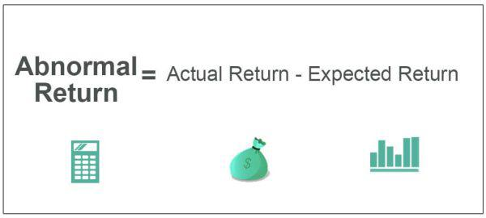

## Table of Contents

## What is an abnormal return?

An abnormal return is the difference between the actual return of an investment and the expected return. The expected return is what investors think the investment should earn, based on how the market or similar investments are doing. If an investment does better than expected, it has a positive abnormal return. If it does worse, it has a negative abnormal return.

People use abnormal returns to see if something special happened to affect an investment's performance. For example, if a company announces good news and its stock price goes up more than expected, that extra increase is the abnormal return. This helps investors and researchers understand how events like news announcements or economic changes impact investments.

## How is abnormal return calculated?

To calculate an abnormal return, you first need to know the actual return of the investment and the expected return. The actual return is how much the investment's value changed over a certain time. The expected return is what you think the investment should have earned, often based on how the overall market or similar investments performed during the same time.

You find the abnormal return by subtracting the expected return from the actual return. If the actual return is higher than the expected return, the abnormal return is positive, meaning the investment did better than expected. If the actual return is lower, the abnormal return is negative, showing the investment did worse than expected. This simple calculation helps investors see if something unusual affected the investment's performance.

## What are the common causes of abnormal returns?

Abnormal returns often happen because of new information that changes how people see a company or an investment. For example, if a company announces it made more money than people thought, its stock price might go up a lot. This is because investors think the company is doing better than expected, so they want to buy more of its stock. Other news, like a new product launch or a big merger, can also cause abnormal returns. These events make investors change their minds about the company's future, which can make the stock price move a lot.

Sometimes, abnormal returns come from things that affect the whole market or economy. For example, if the government changes interest rates, it can make all stocks go up or down more than expected. Big world events, like a financial crisis or a war, can also cause abnormal returns. These events make investors worried or excited, which can lead to big changes in stock prices. Understanding these causes helps investors and researchers see why investments sometimes do much better or worse than expected.

## Can you explain the difference between abnormal return and expected return?

The expected return is what people think an investment should earn. It's like a guess based on how the market or similar investments are doing. For example, if the stock market goes up by 10%, people might expect a certain stock to go up by about the same amount. The expected return helps investors plan and make decisions about where to put their money.

An abnormal return is different because it shows how much an investment did better or worse than expected. If a stock goes up by 15% when people only expected it to go up by 10%, the abnormal return is the extra 5%. This extra return can happen because of new news or events that change how people see the investment. Abnormal returns help investors understand what made the investment perform differently than expected.

## What role do market events play in causing abnormal returns?

Market events can cause abnormal returns by changing how people feel about their investments. When something big happens, like a change in interest rates or a new law, it can make the whole market go up or down more than expected. For example, if the government says interest rates will go down, people might think borrowing money will be cheaper, so they buy more stocks. This can make stock prices go up a lot, causing positive abnormal returns.

Sometimes, big world events like a financial crisis or a war can also lead to abnormal returns. These events can make investors worried or excited, which can lead to big changes in stock prices. If a war starts, people might sell their stocks because they're scared, causing stock prices to drop more than expected. This would lead to negative abnormal returns. Understanding how these market events affect investments helps investors see why their investments might do better or worse than they thought.

## How do company-specific announcements affect abnormal returns?

Company-specific announcements can cause abnormal returns by changing what people think about a company. If a company says it made more money than people thought, its stock price might go up a lot. This is because investors think the company is doing better than expected, so they want to buy more of its stock. For example, if a company announces a new product that everyone wants, the stock price can go up more than expected, leading to a positive abnormal return.

On the other hand, bad news can also cause abnormal returns. If a company says it lost money or has a problem, its stock price might go down a lot. This is because investors think the company is doing worse than expected, so they want to sell their stock. For example, if a company says it has to recall a product because it's not safe, the stock price can drop more than expected, leading to a negative abnormal return. These announcements help investors understand why a company's stock might do better or worse than they thought.

## What are some examples of abnormal returns in the stock market?

A company called XYZ Corp announced that it made a lot more money than people thought it would. Before the announcement, people expected XYZ's stock to go up by 5%. But after the news, the stock went up by 15%. This extra 10% is the abnormal return. It happened because the good news made investors want to buy more of XYZ's stock, pushing the price up more than expected.

Another example is when a company called ABC Inc. had to recall one of its products because it was not safe. Before the recall, people expected ABC's stock to stay about the same. But after the news, the stock dropped by 8%. This drop was more than expected, so it caused a negative abnormal return. The bad news made investors worried, so they sold their stock, which made the price go down more than they thought it would.

## How can investors use abnormal returns to make investment decisions?

Investors can use abnormal returns to understand how news or events affect a company's stock price. If a company announces good news and its stock goes up more than expected, that extra increase is the abnormal return. By looking at these abnormal returns, investors can see if the market thinks the news is really good or if it's overreacting. This helps them decide if they should buy more of the stock because they think the price will keep going up, or if they should sell because they think the price might go back down.

On the other hand, if a company announces bad news and its stock goes down more than expected, that extra drop is also an abnormal return. Investors can use this information to decide if they should sell their stock to avoid losing more money, or if they should buy more because they think the stock price will go back up once the bad news is over. By paying attention to abnormal returns, investors can make smarter choices about when to buy or sell stocks based on how the market reacts to new information.

## What statistical methods are used to identify abnormal returns?

To find abnormal returns, people often use a method called the event study. This method looks at how a stock's price changes around the time of a big event, like a company announcement. First, they figure out what the stock's return should have been without the event, using a model like the market model or the Capital Asset Pricing Model (CAPM). These models use past data to guess what the stock's return would be if nothing special happened. Then, they compare this expected return to the actual return after the event. The difference between these two is the abnormal return. If the actual return is higher than expected, the abnormal return is positive. If it's lower, the abnormal return is negative.

Another way to find abnormal returns is by using statistical tests. These tests help see if the abnormal returns are big enough to matter or if they might just be random chance. One common test is the t-test, which checks if the average abnormal return across many events is different from zero. If the t-test shows a big difference, it means the abnormal returns are likely real and not just by chance. Another test is the regression analysis, which can look at how different factors affect abnormal returns. By using these statistical methods, investors and researchers can better understand how events impact stock prices and make more informed decisions.

## How do regulatory changes impact abnormal returns?

Regulatory changes can cause abnormal returns by changing how people see a company or the whole market. If the government makes a new rule that helps a company, like giving it a tax break, the company's stock might go up more than expected. This is because investors think the company will make more money because of the new rule. For example, if a new law makes it easier for a company to sell its products, the stock price might go up a lot, causing a positive abnormal return. Investors see the new rule as good news, so they want to buy more of the company's stock.

On the other hand, if the government makes a new rule that hurts a company, like making it pay more taxes, the company's stock might go down more than expected. This is because investors think the company will make less money because of the new rule. For example, if a new law makes it harder for a company to do business, the stock price might drop a lot, causing a negative abnormal return. Investors see the new rule as bad news, so they want to sell their stock. By understanding how regulatory changes affect stock prices, investors can make better decisions about when to buy or sell stocks.

## What are the limitations of using abnormal returns as a performance measure?

Using abnormal returns to measure how well an investment is doing has some problems. One big problem is that it's hard to know what the expected return should be. People use different ways to guess the expected return, like looking at the whole market or using special models. But these guesses can be wrong, which means the abnormal return might not be right either. Also, abnormal returns can be affected by things that have nothing to do with the company, like big world events or changes in the economy. This makes it hard to know if the abnormal return is really because of the company or something else.

Another problem is that abnormal returns can be hard to understand because they can be caused by many different things. For example, if a company's stock goes up a lot after good news, it might be because the news was really good, or it might be because people got too excited and the stock price went up too much. It's hard to tell which one it is. Also, looking at abnormal returns over a short time might not show the whole picture. A stock might have a big abnormal return one day but then go back to normal the next day. So, using abnormal returns to judge how well an investment is doing can be tricky and might not always give a clear answer.

## How do different financial models account for abnormal returns in their predictions?

Different financial models try to guess what an investment's return should be, and then they look at the difference between that guess and what actually happens to find abnormal returns. The market model is one way to do this. It looks at how the whole market is doing and uses that to guess what a stock should do. If the stock does better or worse than the market, that difference is the abnormal return. Another model is the Capital Asset Pricing Model (CAPM), which uses the risk of the stock and the expected return of the market to make its guess. If the stock's actual return is different from what CAPM says it should be, that's the abnormal return.

These models help investors see if something special happened to affect a stock's price. But they have their problems. For example, the guesses these models make can be wrong because they're based on past data, and the future might be different. Also, things like big world events or changes in the economy can mess up the guesses. So, while these models can help find abnormal returns, they're not perfect and investors need to be careful when using them to make decisions.

## What is Understanding Abnormal Returns?

Abnormal returns are a key concept in finance, representing the difference between the actual return of an investment and the return that would be expected based on the asset's risk and market conditions. These returns provide insights beyond what traditional financial models might predict.

**Definition and Differentiation from Expected Returns**

The expected return of an asset is typically calculated using models like the Capital Asset Pricing Model (CAPM), which takes into account the asset's sensitivity to market movements, often represented by beta, and expected market return. The formula for the expected return $E(R_i)$ using CAPM is:

$$
E(R_i) = R_f + \beta_i (E(R_m) - R_f)
$$

where $R_f$ is the risk-free rate, $\beta_i$ is the beta of the investment, and $E(R_m)$ is the expected market return.

Abnormal returns are calculated as:

$$
\text{Abnormal Return} = \text{Actual Return} - E(R_i)
$$

**Key Metrics: Excess Returns, Alpha, and Risk-Adjusted Performance**

- **Excess Returns:** These are the returns earned by an investment over the risk-free rate. It's a straightforward calculation:

  \[ \text{Excess Return} = \text{Actual Return} - R_f
$$

- **Alpha:** A measure of performance on a risk-adjusted basis, alpha represents the value that a portfolio manager adds to or subtracts from a fund's return. A positive alpha indicates outperformance compared to the benchmark.

- **Risk-Adjusted Performance:** This involves adjusting the returns of an investment based on the risk taken, often using metrics such as the Sharpe Ratio or the Treynor Ratio. These metrics help in understanding if the abnormal returns are achieved through disproportionate risk-taking.

**Factors Leading to Abnormal Returns**

Abnormal returns can arise from several sources:

- **Market Anomalies:** These are inefficiencies in the market that can be exploited, such as momentum effects or small-cap stocks outperforming.

- **Fraud:** Companies that engage in deceptive practices might show short-term abnormal returns that eventually correct when the fraud is revealed.

- **External Economic Events:** Unanticipated events such as geopolitical tensions or natural disasters can lead to market reactions not captured by existing financial models, resulting in abnormal returns.

**Role in Evaluating Investment Performance and Market Efficiency**

Abnormal returns are crucial for assessing investment performance and testing market efficiency. In an efficient market, it is challenging to achieve abnormal returns consistently as prices reflect all available information. Therefore, analyzing abnormal returns can help distinguish skilled investment managers from those merely riding market trends.

Understanding abnormal returns is a foundational aspect of financial analysis and portfolio management, providing insights into both the skill of the investment manager and the efficiency of the market in processing information.

## How do you calculate abnormal returns?

Abnormal returns are a critical concept in evaluating the performance of financial assets. The Capital Asset Pricing Model (CAPM) provides a standardized method to determine expected returns, which are then compared against actual returns to ascertain abnormal returns. CAPM estimates the expected return of an asset based on its systematic risk, which is quantified by beta (β). The formula for CAPM is:

$$

E(R_i) = R_f + \beta_i (E(R_m) - R_f)
$$

where:  
- $E(R_i)$ is the expected return of the investment.
- $R_f$ is the risk-free rate.
- $\beta_i$ is the beta of the investment, indicating its sensitivity to market movements.
- $E(R_m)$ is the expected return of the market.

### Step-by-Step Guide to Calculate Abnormal Returns

1. **Determine the Expected Return**: Utilize CAPM to estimate the expected return for an asset over a given period.

2. **Compute the Actual Return**: Obtain the actual return of the asset during the same period from historical data.

3. **Calculate Abnormal Return**: Subtract the expected return calculated through CAPM from the actual return:

$$

\text{Abnormal Return} = R_i - E(R_i)
$$

### Cumulative Abnormal Return (CAR)

Cumulative Abnormal Return (CAR) is a measure used to evaluate the impact of specific events on an asset's price over time. It is the sum of abnormal returns over a defined event window. Mathematically, it is represented as:

$$

CAR(t_1, t_2) = \sum_{t=t_1}^{t_2} AR_t
$$

where $AR_t$ denotes the abnormal return on day $t$. Evaluating corporate events like earnings announcements, mergers, or product launches commonly uses CAR to assess their effect on stock prices.

### Practical Example

Let's assume we're evaluating a stock with the following parameters:
- Risk-free rate ($R_f$): 3%
- Stock beta ($\beta_i$): 1.2
- Market return ($E(R_m)$): 10%

**1. Calculate Expected Return using CAPM:**

$$

E(R_i) = 0.03 + 1.2 \times (0.10 - 0.03) = 0.114 \text{ or } 11.4\%
$$

**2. Compute Actual Return:**  
If the actual return over the period is 15%, then:

**3. Abnormal Return Calculation:**

$$

\text{Abnormal Return} = 0.15 - 0.114 = 0.036 \text{ or } 3.6\%
$$

In a scenario of a corporate event, we might evaluate the returns over multiple periods. For example, if the abnormal returns over a 3-day event window are 2%, 3%, and 1%, then;

**4. Calculate CAR:**

$$

CAR(1, 3) = 2\% + 3\% + 1\% = 6\%
$$

This cumulative measure indicates the total impact of the corporate event over the considered window.

### Python Code Example

The following Python snippet demonstrates how to calculate abnormal returns using CAPM:

```python
def calculate_expected_return(risk_free_rate, beta, market_return):
    return risk_free_rate + beta * (market_return - risk_free_rate)

def calculate_abnormal_return(actual_return, expected_return):
    return actual_return - expected_return

# Parameters
risk_free_rate = 0.03
beta = 1.2
market_return = 0.10
actual_return = 0.15

# Calculations
expected_return = calculate_expected_return(risk_free_rate, beta, market_return)
abnormal_return = calculate_abnormal_return(actual_return, expected_return)

print(f"Expected Return: {expected_return:.2%}")
print(f"Abnormal Return: {abnormal_return:.2%}")
```

This example succinctly demonstrates calculating abnormal returns for a security and can be extended to portfolio-level analysis. Understanding and accurately computing abnormal returns is essential for making informed investment decisions and evaluating the impact of market events.

## References & Further Reading

[1]: Fama, E. F. (1970). ["Efficient Capital Markets: A Review of Theory and Empirical Work."](https://www.jstor.org/stable/2325486) *The Journal of Finance*, 25(2), 383-417.

[2]: Jensen, M. C. (1968). ["The Performance of Mutual Funds in the Period 1945–1964."](https://onlinelibrary.wiley.com/doi/full/10.1111/j.1540-6261.1968.tb00815.x) *The Journal of Finance*, 23(2), 389-416.

[3]: Jegadeesh, N., & Titman, S. (1993). ["Returns to Buying Winners and Selling Losers: Implications for Stock Market Efficiency."](https://www.bauer.uh.edu/rsusmel/phd/jegadeesh-titman93.pdf) *The Journal of Finance*, 48(1), 65-91.

[4]: Campbell, J. Y., Lo, A. W., & MacKinlay, A. C. (1997). *The Econometrics of Financial Markets*. Princeton University Press.

[5]: ["Quantitative Trading: How to Build Your Own Algorithmic Trading Business"](https://www.amazon.com/Quantitative-Trading-Build-Algorithmic-Business/dp/1119800064) by Ernest P. Chan

[6]: Khandani, A. E., & Lo, A. W. (2007). ["What Happened to the Quants in August 2007? Evidence from Factors and Transactions Data."](https://www.nber.org/papers/w14465) *The Journal of Financial Markets*.

[7]: ["Advances in Financial Machine Learning"](https://www.amazon.com/Advances-Financial-Machine-Learning-Marcos/dp/1119482089) by Marcos Lopez de Prado

[8]: Hasbrouck, J. (2007). *Empirical Market Microstructure: The Institutions, Economics, and Econometrics of Securities Trading*. Oxford University Press.

[9]: Investopedia on Algorithmic Trading: [Link](https://www.investopedia.com/articles/active-trading/101014/basics-algorithmic-trading-concepts-and-examples.asp)

[10]: Investopedia on Risk Management: [Link](https://www.investopedia.com/terms/r/riskmanagement.asp)

[11]: Major financial publications - The Wall Street Journal: [Link](https://www.wsj.com/)

[12]: Major financial publications - Financial Times: [Link](https://www.ft.com/)