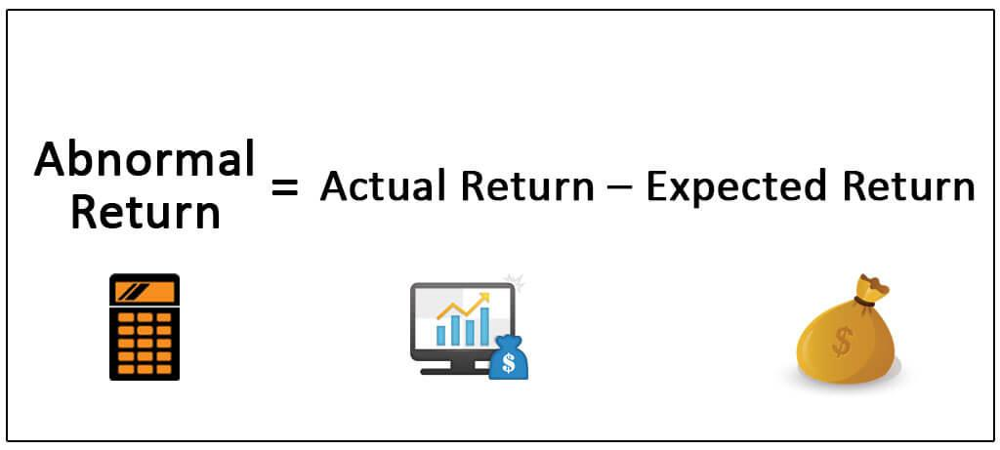

In the fast-evolving world of finance, algorithmic trading has emerged as a powerful tool for achieving abnormal returns. An abnormal return refers to a profit level that surpasses the expected return when considering the risk and market conditions involved. Traditional investment models, such as the Capital Asset Pricing Model (CAPM), establish a baseline for expected returns by correlating an asset’s risk with its potential reward. When actual returns exceed these expectations, they are termed as abnormal.

Algorithmic trading utilizes computer algorithms to execute trades autonomously and at high speeds, allowing traders to achieve these enhanced returns. The technological capabilities embedded in algorithmic trading systems enable the simultaneous analysis of large volumes of market data, identifying patterns and anomalies that might not be evident to human traders. By executing trades based on these insights, algorithms can potentially capture opportunities that lead to better-than-expected market performance. This article will explore the concept of abnormal returns achieved through algorithmic trading and how such technology continues to reshape investment strategies.



## Table of Contents

## Understanding Abnormal Returns

Abnormal returns represent the deviation between an investment's actual return and its expected return, which is typically predicted based on the asset's risk profile. This concept serves as a pivotal performance measure in finance, encapsulating the intersection between achieved profits and potential risks. The Capital Asset Pricing Model (CAPM) is frequently employed to quantify abnormal returns. According to CAPM, the expected return of an asset is determined by its sensitivity to market risk, expressed in the equation:

$$
E(R_i) = R_f + \beta_i (E(R_m) - R_f)
$$

Here, $E(R_i)$ denotes the expected return on investment, $R_f$ is the risk-free rate, $\beta_i$ represents the asset's beta or its [volatility](/wiki/volatility-trading-strategies) compared to the market, and $E(R_m)$ is the expected return of the market. The abnormal return is then calculated by subtracting the expected return from the actual return:

$$
\text{Abnormal Return} = R_i - E(R_i)
$$

where $R_i$ is the actual return on the investment. 

In [algorithmic trading](/wiki/algorithmic-trading), abnormal returns can indicate the success or failure of a trading strategy. A consistently positive abnormal return suggests that the algorithm is effectively identifying and exploiting market inefficiencies, surpassing the expected outcomes predicted by traditional risk models. Hence, the ability of an algorithm to secure abnormal returns points to its potential robustness and adaptability in changing market conditions.

Models such as CAPM are instrumental in evaluating performance relative to risk and are utilized as benchmarks in algorithmic strategies to ascertain if these strategies are delivering value beyond typical market expectations. The quest for abnormal returns drives continuous refinement of algorithms, emphasizing the need for strategies capable of adjusting to the ever-evolving financial landscape.

## Algorithmic Trading Explained

Algorithmic trading, commonly known as 'algo trading,' represents a transformative approach to financial markets by automating the process of trading using computer algorithms. These algorithms are designed to make decisions about buying or selling financial securities on an exchange, based on complex calculations and preset strategies.

Key to algorithmic trading is its ability to execute trades with remarkable speed and frequency, often in fractions of a second. Human traders, limited by psychological biases and slower reaction times, cannot compete with the efficiency and precision of these algorithms. The core advantage of algorithmic trading lies in its capacity to handle vast datasets, identifying and acting upon patterns that would be nearly impossible for human traders to detect in real-time.

Advanced algorithms utilize a variety of data sources, ranging from market prices, trading volumes, and economic indicators to more unconventional types such as sentiment analysis from news articles and social media. By incorporating [machine learning](/wiki/machine-learning) techniques, these systems can adapt and refine strategies based on new data inputs, further enhancing their decision-making processes. A typical algorithm might use statistical models, including regression analysis and time series analysis, to predict future market movements and optimize trades accordingly.

For example, a simple algorithm might be based on moving averages, where trades are executed when short-term averages cross long-term averages. More sophisticated strategies could involve multiple layers of analysis and decision paths, leveraging various indicators and external datasets.

Python has become a popular programming language for implementing algorithmic trading strategies due to its rich ecosystem of libraries such as NumPy, pandas, and scikit-learn, which are tailored for data analysis and machine learning applications. An example of a basic algorithm in Python could look like this:

```python
import pandas as pd

# Sample function to calculate moving averages
def calculate_moving_averages(data, short_window, long_window):
    data['Short_MA'] = data['Price'].rolling(window=short_window, min_periods=1).mean()
    data['Long_MA'] = data['Price'].rolling(window=long_window, min_periods=1).mean()
    return data

# Trading signal based on moving averages crossover
def generate_signals(data):
    signals = pd.DataFrame(index=data.index)
    signals['Signal'] = 0.0
    signals['Signal'][short_window:] = np.where(data['Short_MA'][short_window:] > data['Long_MA'][short_window:], 1.0, 0.0)
    signals['Positions'] = signals['Signal'].diff()
    return signals

# Example usage
historical_data = pd.DataFrame({'Price': [/* price dataset here */]})
short_window = 40
long_window = 100
data_with_ma = calculate_moving_averages(historical_data, short_window, long_window)
trading_signals = generate_signals(data_with_ma)
```

This hypothetical implementation demonstrates the basic mechanics of how algorithms operate within financial markets, offering systematic, quantitative approaches to trading that minimize human error and emotion. By utilizing advanced data analysis techniques and technological infrastructure, algorithmic trading seeks to enhance the efficiency and success rate of trades, aiming ultimately for higher financial returns.

## The Role of Data in Generating Abnormal Returns

Data is the lifeblood of algorithmic trading, serving as the foundational element that determines the effectiveness and efficiency of trading algorithms. The scope and quality of data directly impact the ability of algorithms to generate abnormal returns—profits that exceed the norm predicted by the asset's risk profile and prevailing market conditions. Comprehensive and timely data inputs enable algorithms to make informed decisions and execute trades at optimal moments, thereby capitalizing on even the smallest price discrepancies.

To predict market movements or detect anomalies in historical price trends, various algorithmic trading strategies employ machine learning models alongside statistical and computational methods. These models systematically analyze vast datasets to identify patterns, correlations, and emerging trends that may not be immediately visible to the human eye. Techniques such as regression analysis, support vector machines, and neural networks are often utilized to derive insights and set predictive frameworks. By synthesizing both historical and real-time data, algorithms become proficient at forecasting price movements, thereby positioning themselves to exploit potential market inefficiencies as they arise.

High-frequency trading ([HFT](/wiki/high-frequency-trading-strategies)) exemplifies the critical role of data in executing strategies swiftly. The high-speed computational capabilities of modern systems allow algorithms to process and act on high-frequency data streams with unprecedented speed and precision. This rapid data processing is essential for capturing fleeting market opportunities that present themselves for mere milliseconds. For instance, executing a trade based on a specific [arbitrage](/wiki/arbitrage) opportunity requires not just identifying the price anomaly but also completing the transaction before the market corrects itself. 

The synthesis of high-quality data and advanced computational techniques directly enhances an algorithm's capability to achieve abnormal returns. High-frequency data ensures that algorithms have a constant stream of fresh information to drive their decision-making processes, effectively minimizing latency—the delay between data reception, processing, and action—which is vital for maintaining competitive edge in fast-paced financial markets.

In summary, data's role is crucial, serving as both the backbone and the fuel of algorithmic trading systems targeting abnormal returns. By leveraging comprehensive datasets and employing machine learning models, algorithms can foresee market dynamics and capitalize on transient market conditions. This fusion of data and technology enhances trading precision, enabling the pursuit of superior financial outcomes.

## Strategies for Achieving Abnormal Returns

Statistical arbitrage, event-driven strategies, and market-making are prominent strategies in algorithmic trading designed to achieve abnormal returns. Each strategy relies on detailed quantitative analysis to exploit pricing inefficiencies or foresee market reactions.

Statistical arbitrage involves examining statistical discrepancies between correlated financial instruments. By identifying price spreads that deviate from their historical relationships, traders can execute trades intending to profit when these spreads revert to their mean. This approach often employs machine learning models and time series analysis, allowing for the formulation of predictions regarding asset price reversion. For instance, the pairs trading strategy identifies two historically correlated stocks; when their price ratio deviates from the norm, trades are executed assuming eventual convergence. The success of such strategies hinges on robust data analysis and the ability to adapt to changing market dynamics [1].

Event-driven strategies capitalize on inefficiencies that arise from corporate actions such as mergers, earnings announcements, or regulatory changes. These strategies analyze the potential impact of such events on the asset's price and incorporate tools like natural language processing to gauge sentiment and potential market reactions. Quants use event studies and econometric models to project the effects of specific events, formulating trades to take advantage of anticipated price movements.

Market-making involves providing [liquidity](/wiki/liquidity-risk-premium) by simultaneously offering to buy and sell financial securities. Algorithmic market-makers use high-frequency data to adjust their bid-ask spreads in real-time, capitalizing on the difference while minimizing inventory risk. This strategy requires sophisticated algorithms capable of dynamic pricing and risk management to adapt quickly to market conditions. Key to this strategy is the development of algorithms that can manage exposure and maintain optimal inventory levels amidst market fluctuations.

Quantitative professionals, known as quants, are critical in designing and refining these strategies. With expertise in mathematics, [statistics](/wiki/bayesian-statistics), and computer science, quants craft algorithms that exploit market inefficiencies. They continually refine these strategies through [backtesting](/wiki/backtesting) and real-time performance monitoring, ensuring they remain effective in diverse market environments.

In summary, strategies for achieving abnormal returns in algorithmic trading are rooted in advanced quantitative techniques and the ability to exploit market inefficiencies through precise and timely execution. These strategies require constant innovation and rigorous testing to maintain their effectiveness in an ever-evolving financial landscape.

---

[1] Gatev, E., Goetzmann, W. N., & Rouwenhorst, K. G. (2006). Pairs Trading: Performance of a Relative Value Arbitrage Rule. *Review of Financial Studies, 19*(3), 897-991.

## Risk Management in Algorithmic Trading

Algorithmic trading offers substantial opportunities for achieving significant returns. However, it also brings inherent risks, particularly due to the reliance on sophisticated algorithms and the unpredictable nature of financial markets. As such, effective risk management strategies are crucial to protect against market volatility and unexpected systemic changes.

One primary method of risk management in algorithmic trading is diversification, which involves spreading investment across various assets to mitigate the impact of adverse market movements on a single investment. Implementing stop-loss orders is another common approach. Stop-loss orders automatically sell a security when its price drops to a predetermined level, thereby limiting potential losses.

Another essential aspect of risk management is the use of risk-adjusted performance metrics. These metrics help traders assess whether the returns generated by an algorithm adequately compensate for the associated risks. A widely used measure is the Sharpe ratio, defined as:

$$
\text{Sharpe Ratio} = \frac{E[R_p - R_f]}{\sigma_p}
$$

where $E[R_p - R_f]$ is the expected return of the portfolio minus the risk-free rate, and $\sigma_p$ is the standard deviation of the portfolio's excess return. A higher Sharpe ratio indicates a more favorable risk-adjusted return profile.

Python code can be used to calculate the Sharpe ratio from historical return data:

```python
import numpy as np

def calculate_sharpe_ratio(returns, risk_free_rate):
    excess_returns = returns - risk_free_rate
    sharpe_ratio = np.mean(excess_returns) / np.std(excess_returns)
    return sharpe_ratio
```

Moreover, algorithmic trading systems should incorporate features such as real-time monitoring and alerts, which permit instant responses to adverse events or system failures. Machines and algorithms should be continuously tested and recalibrated to account for evolving market conditions.

Stress testing and scenario analysis are also instrumental in evaluating how an algorithmic trading strategy might perform under extreme conditions. By simulating various adverse scenarios, traders can better understand the vulnerabilities of their strategies and make necessary adjustments to minimize potential losses.

Overall, risk management in algorithmic trading involves a comprehensive approach that combines diversification, effective use of performance metrics, real-time monitoring, and robust scenario analysis. By maintaining a dynamic risk management framework, traders can better safeguard their investments while striving for abnormal returns.

## Conclusion

Algorithmic trading has significantly reshaped the investment landscape, providing a suite of tools capable of capturing unexpected gains even in the most competitive markets. This has been possible through the deployment of sophisticated trading strategies that rely heavily on data analysis and technology enhancements. The core of achieving abnormal returns through algorithmic trading lies in the robust integration of complex strategies with advanced data analytics and meticulous risk management practices.

To consistently generate abnormal returns, it is vital to employ a strategic blend of quantitative modeling, machine learning, and rigorous statistical analysis. The algorithms are designed to exploit market inefficiencies and make rapid decisions based on vast datasets—something human traders would struggle to replicate. As markets evolve, the continuous refinement of these algorithms, incorporating new data and learning from past performance, remains critical. The process of backtesting strategies against historical data provides insights that help fine-tune the algorithms for future trades.

Risk management is an indispensable component of algorithmic trading. With the potential for substantial returns comes the inherent risk of significant losses, driven by both market volatility and systemic unpredictability. Implementing effective risk controls, such as stop-loss orders and volatility filters, is essential to guard against adverse market movements. Performance metrics like Sharpe ratio and Sortino ratio are instrumental in assessing the risk-adjusted returns, ensuring that the algorithms do not pursue high returns at the expense of exposing the investor to excessive risk.

As technology continues to advance, so does the potential power and complexity of algorithmic trading systems. The integration of [artificial intelligence](/wiki/ai-artificial-intelligence) and machine learning into trading algorithms is set to increase, unlocking new levels of precision and adaptability. As these technologies mature, they promise an ongoing evolution in achieving abnormal returns, with algorithms becoming even more integral to financial markets. The landscape of investing is poised to continually transform as algorithms and the data-driven insights they provide become more sophisticated and prevalent.

## References & Further Reading

[1]: Gatev, E., Goetzmann, W. N., & Rouwenhorst, K. G. (2006). [Pairs Trading: Performance of a Relative Value Arbitrage Rule.](https://www.nber.org/papers/w7032) Review of Financial Studies, 19(3), 897-991.

[2]: ["Advances in Financial Machine Learning"](https://www.amazon.com/Advances-Financial-Machine-Learning-Marcos/dp/1119482089) by Marcos Lopez de Prado

[3]: ["Evidence-Based Technical Analysis: Applying the Scientific Method and Statistical Inference to Trading Signals"](https://www.amazon.com/Evidence-Based-Technical-Analysis-Scientific-Statistical/dp/0470008741) by David Aronson

[4]: ["Machine Learning for Algorithmic Trading"](https://github.com/stefan-jansen/machine-learning-for-trading) by Stefan Jansen

[5]: ["Quantitative Trading: How to Build Your Own Algorithmic Trading Business"](https://books.google.com/books/about/Quantitative_Trading.html?id=j70yEAAAQBAJ) by Ernest P. Chan