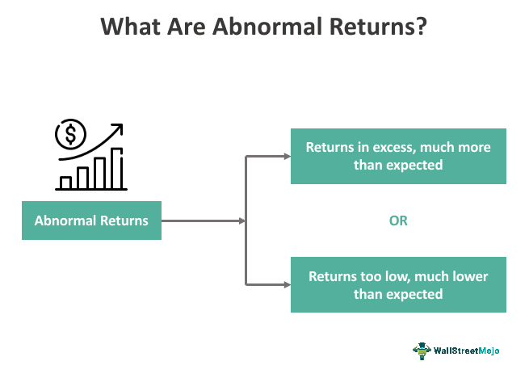

## Table of Contents

## What are abnormal returns?

Abnormal returns are the differences between the actual returns of an investment and the expected returns based on a market model or benchmark. For example, if a stock is expected to return 5% based on market conditions, but it actually returns 10%, the abnormal return would be 5%. This concept is important in finance because it helps investors and analysts understand how well an investment is performing compared to what was predicted.

Abnormal returns can be caused by many things, like new information about a company, unexpected events, or even errors in the market model used to predict returns. When a company announces good news, like higher profits than expected, the stock price might go up, leading to positive abnormal returns. On the other hand, bad news can lead to negative abnormal returns. By studying these returns, investors can make better decisions about buying or selling stocks.

## How are abnormal returns calculated?

Abnormal returns are figured out by comparing what an investment actually earns to what it was supposed to earn. The expected return is usually based on a model that looks at how the whole market is doing. For example, if a stock is expected to go up by 3% because the market is doing well, but it actually goes up by 7%, the abnormal return is 4%. This difference shows how the stock did compared to what was expected.

To calculate the expected return, people often use something called the Capital Asset Pricing Model (CAPM). This model takes into account the risk-free rate of return, like what you'd get from a government bond, and the overall market return. It also considers how risky the stock is compared to the market. Once you have the expected return, you subtract it from the actual return to find the abnormal return. This helps investors see if a stock is doing better or worse than expected, which can guide their decisions on whether to buy or sell.

## What is the difference between abnormal returns and excess returns?

Abnormal returns and excess returns are similar but they are used in different ways. Abnormal returns are the difference between what an investment actually earns and what it was expected to earn based on a model like the Capital Asset Pricing Model (CAPM). This helps investors see if a stock is doing better or worse than what was predicted. For example, if a stock was expected to go up by 2% but it actually went up by 5%, the abnormal return would be 3%.

Excess returns, on the other hand, are the difference between the return of an investment and the return of a benchmark, like a market index. This shows how much better or worse an investment is doing compared to the overall market. For instance, if a stock goes up by 6% and the market index goes up by 4%, the excess return would be 2%. While both abnormal and excess returns help investors understand performance, abnormal returns focus on comparing to a predicted return, while excess returns compare to a market benchmark.

## Why are abnormal returns important in finance?

Abnormal returns are important in finance because they help investors and analysts see how well an investment is doing compared to what was expected. If a stock does better than expected, it might mean the company is doing something right or that there's good news about the company. On the other hand, if a stock does worse than expected, it could be a sign that something is wrong or that the market didn't react well to new information. By looking at abnormal returns, investors can make smarter choices about buying or selling stocks.

These returns also help in understanding how new information affects stock prices. When a company announces something important, like higher profits or a new product, the stock price might change a lot. Abnormal returns show how much the stock price moved because of this news. This is useful for figuring out how the market reacts to different kinds of news and can help in making better predictions about future stock prices.

## What are the common benchmarks used to calculate abnormal returns?

To calculate abnormal returns, people often use a model called the Capital Asset Pricing Model (CAPM). This model helps figure out what an investment should earn based on how the whole market is doing. It takes into account the risk-free rate, which is what you'd get from a safe investment like a government bond, and the overall market return. It also looks at how risky the stock is compared to the market. By using CAPM, investors can see if a stock is doing better or worse than expected.

Another common benchmark is the market index, like the S&P 500 or the Dow Jones Industrial Average. These indexes show how the overall market is doing. If a stock goes up more than the market index, it might mean the stock is doing well compared to the market. If it goes up less, it might mean the stock is not doing as well. Using a market index helps investors see how their investments are doing compared to the whole market, which can guide their decisions on buying or selling stocks.

## How do event studies use abnormal returns?

Event studies use abnormal returns to see how news or events affect stock prices. They look at what a stock was expected to do before the event happened, and then compare that to what actually happened after the event. This helps researchers understand if the event made the stock go up or down more than it should have. For example, if a company announces a new product and the stock price jumps a lot, an event study would check if that jump was bigger than what was expected.

By studying these abnormal returns, event studies can show how the market reacts to different kinds of news. This can be useful for investors who want to know how certain events, like earnings announcements or mergers, might affect stock prices. It helps them make better guesses about what might happen to stock prices in the future based on similar events.

## What are some factors that can cause abnormal returns?

Abnormal returns can happen because of new information about a company. For example, if a company says it made more money than people thought, its stock price might go up a lot. This makes the return on the stock higher than what was expected. On the other hand, if a company says it's not doing well, the stock price might drop, leading to a lower return than expected. News like this can make investors buy or sell the stock, causing the price to change a lot.

Another reason for abnormal returns is unexpected events that affect the whole market or just one company. Things like natural disasters, changes in laws, or big economic news can make stock prices move in ways that are hard to predict. If a company is hit by a hurricane, its stock might go down because people think it will lose money. But if the government passes a new law that helps a certain industry, stocks in that industry might go up more than expected. These events can cause big changes in stock prices, leading to abnormal returns.

## Can abnormal returns be predicted?

Abnormal returns are hard to predict because they happen when something unexpected changes a stock's price. If a company announces good news, like higher profits than expected, the stock might go up a lot. But if bad news comes out, the stock might drop more than people thought it would. These surprises make it tough to guess what will happen to a stock's price.

Even though it's hard, some people try to predict abnormal returns by looking at past events and how the market reacted. They might use models like the Capital Asset Pricing Model (CAPM) to guess what a stock should do, and then see if it does better or worse. But because the future is uncertain, and new information can change everything, predicting abnormal returns is more like making a good guess than knowing for sure.

## How do abnormal returns relate to market efficiency?

Abnormal returns are important when we talk about how well the market works. If the market is efficient, it means that all the information people know is already in the stock prices. So, if a stock does better or worse than expected, it might mean the market didn't use all the information it had. This can show that the market isn't as good at using information as we thought.

But, if the market is really good at using information, abnormal returns should be hard to find. They would only happen because of new news that nobody could predict. So, if we see a lot of abnormal returns, it might mean the market isn't as efficient as we think. This helps investors and researchers understand how well the market is working and if they can find ways to make money from these unexpected changes in stock prices.

## What are the limitations of using abnormal returns in analysis?

Using abnormal returns in analysis has some problems. One big issue is that the models used to predict what a stock should do, like the Capital Asset Pricing Model (CAPM), might not be perfect. They make guesses based on past data and assumptions about how the market works. But if these guesses are wrong, the abnormal returns we calculate might not be right either. This can make it hard to trust the results and make good decisions based on them.

Another problem is that abnormal returns can be affected by things that are hard to predict, like new news or unexpected events. If something big happens, like a company announcing a new product or a natural disaster, it can change stock prices in ways that are hard to guess. This means that even if we use the best models, we might still see abnormal returns that we can't explain well. So, while abnormal returns can help us understand how stocks react to news, they also come with a lot of uncertainty.

## How do different statistical models affect the measurement of abnormal returns?

Different statistical models can change how we measure abnormal returns because they use different ways to guess what a stock should do. For example, the Capital Asset Pricing Model (CAPM) looks at the overall market and how risky a stock is compared to the market. But another model, like the Fama-French three-[factor](/wiki/factor-investing) model, adds more things to consider, like the size of the company and how the stock's price has changed over time. Each model might give a different guess for what the stock should do, so the abnormal return we calculate can be different depending on which model we use.

This can make it tricky to trust the abnormal returns we find. If two people use different models to look at the same stock, they might end up with different abnormal returns. This means that the choice of model can affect what we think about how well a stock is doing compared to what was expected. So, it's important to know that the way we measure abnormal returns can change based on the model we pick, and we should be careful when using these numbers to make decisions.

## What advanced techniques can be used to enhance the accuracy of abnormal return calculations?

To make abnormal return calculations more accurate, people can use something called the Fama-French three-factor model instead of just the Capital Asset Pricing Model (CAPM). The Fama-French model looks at more things than CAPM, like how big the company is and if its stock price has been going up or down over time. By adding these extra pieces of information, the model can make a better guess about what a stock should do. This can lead to more accurate abnormal returns because the expected return is closer to what really happens.

Another way to improve accuracy is by using event study methodology with more advanced statistical methods. For example, instead of just looking at the average abnormal return over a short time, people can use regression analysis to see how different factors affect the stock price. This can help account for things like how the whole market is doing or other events happening at the same time. By using these more detailed methods, the calculations of abnormal returns can be more precise and give a clearer picture of how news or events really affect stock prices.

## What is the understanding of abnormal returns?

Abnormal returns represent the deviation between an investment's actual return and its expected return, which is typically predicted based on the asset's risk profile. This concept serves as a pivotal performance measure in finance, encapsulating the intersection between achieved profits and potential risks. The Capital Asset Pricing Model (CAPM) is frequently employed to quantify abnormal returns. According to CAPM, the expected return of an asset is determined by its sensitivity to market risk, expressed in the equation:

$$
E(R_i) = R_f + \beta_i (E(R_m) - R_f)
$$

Here, $E(R_i)$ denotes the expected return on investment, $R_f$ is the risk-free rate, $\beta_i$ represents the asset's beta or its [volatility](/wiki/volatility-trading-strategies) compared to the market, and $E(R_m)$ is the expected return of the market. The abnormal return is then calculated by subtracting the expected return from the actual return:

$$
\text{Abnormal Return} = R_i - E(R_i)
$$

where $R_i$ is the actual return on the investment. 

In [algorithmic trading](/wiki/algorithmic-trading), abnormal returns can indicate the success or failure of a trading strategy. A consistently positive abnormal return suggests that the algorithm is effectively identifying and exploiting market inefficiencies, surpassing the expected outcomes predicted by traditional risk models. Hence, the ability of an algorithm to secure abnormal returns points to its potential robustness and adaptability in changing market conditions.

Models such as CAPM are instrumental in evaluating performance relative to risk and are utilized as benchmarks in algorithmic strategies to ascertain if these strategies are delivering value beyond typical market expectations. The quest for abnormal returns drives continuous refinement of algorithms, emphasizing the need for strategies capable of adjusting to the ever-evolving financial landscape.

## What is Risk Management in Algorithmic Trading?

Algorithmic trading offers substantial opportunities for achieving significant returns. However, it also brings inherent risks, particularly due to the reliance on sophisticated algorithms and the unpredictable nature of financial markets. As such, effective risk management strategies are crucial to protect against market volatility and unexpected systemic changes.

One primary method of risk management in algorithmic trading is diversification, which involves spreading investment across various assets to mitigate the impact of adverse market movements on a single investment. Implementing stop-loss orders is another common approach. Stop-loss orders automatically sell a security when its price drops to a predetermined level, thereby limiting potential losses.

Another essential aspect of risk management is the use of risk-adjusted performance metrics. These metrics help traders assess whether the returns generated by an algorithm adequately compensate for the associated risks. A widely used measure is the Sharpe ratio, defined as:

$$
\text{Sharpe Ratio} = \frac{E[R_p - R_f]}{\sigma_p}
$$

where $E[R_p - R_f]$ is the expected return of the portfolio minus the risk-free rate, and $\sigma_p$ is the standard deviation of the portfolio's excess return. A higher Sharpe ratio indicates a more favorable risk-adjusted return profile.

Python code can be used to calculate the Sharpe ratio from historical return data:

```python
import numpy as np

def calculate_sharpe_ratio(returns, risk_free_rate):
    excess_returns = returns - risk_free_rate
    sharpe_ratio = np.mean(excess_returns) / np.std(excess_returns)
    return sharpe_ratio
```

Moreover, algorithmic trading systems should incorporate features such as real-time monitoring and alerts, which permit instant responses to adverse events or system failures. Machines and algorithms should be continuously tested and recalibrated to account for evolving market conditions.

Stress testing and scenario analysis are also instrumental in evaluating how an algorithmic trading strategy might perform under extreme conditions. By simulating various adverse scenarios, traders can better understand the vulnerabilities of their strategies and make necessary adjustments to minimize potential losses.

Overall, risk management in algorithmic trading involves a comprehensive approach that combines diversification, effective use of performance metrics, real-time monitoring, and robust scenario analysis. By maintaining a dynamic risk management framework, traders can better safeguard their investments while striving for abnormal returns.

## References & Further Reading

[1]: Gatev, E., Goetzmann, W. N., & Rouwenhorst, K. G. (2006). [Pairs Trading: Performance of a Relative Value Arbitrage Rule.](https://www.nber.org/papers/w7032) Review of Financial Studies, 19(3), 897-991.

[2]: ["Advances in Financial Machine Learning"](https://www.amazon.com/Advances-Financial-Machine-Learning-Marcos/dp/1119482089) by Marcos Lopez de Prado

[3]: ["Evidence-Based Technical Analysis: Applying the Scientific Method and Statistical Inference to Trading Signals"](https://www.amazon.com/Evidence-Based-Technical-Analysis-Scientific-Statistical/dp/0470008741) by David Aronson

[4]: ["Machine Learning for Algorithmic Trading"](https://github.com/stefan-jansen/machine-learning-for-trading) by Stefan Jansen

[5]: ["Quantitative Trading: How to Build Your Own Algorithmic Trading Business"](https://books.google.com/books/about/Quantitative_Trading.html?id=j70yEAAAQBAJ) by Ernest P. Chan