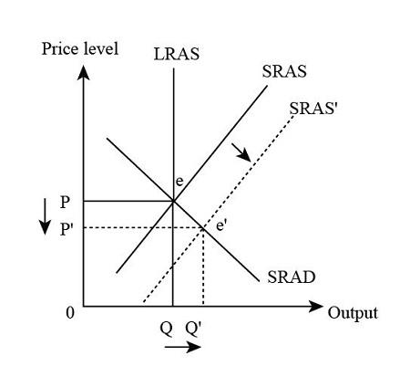

## Table of Contents

## What is meant by 'full employment' in economics?

Full employment in economics means that almost everyone who wants a job can find one. It doesn't mean that every single person is working, because there will always be some people who are between jobs or looking for the right job. Instead, full employment is when the unemployment rate is as low as it can realistically get, usually around 4-5%. At this level, the economy is using its labor resources efficiently, and most people who want to work are able to do so.

However, reaching full employment can be tricky. If the unemployment rate gets too low, it can lead to inflation because businesses have to offer higher wages to attract workers, which can increase the cost of goods and services. Economists and policymakers aim to balance the unemployment rate to keep the economy stable. They use tools like interest rates and government spending to try to keep the economy close to full employment without causing too much inflation.

## How does 'above full employment equilibrium' differ from full employment?

Above full employment equilibrium happens when more people are working than what is considered full employment. This means the unemployment rate is lower than the usual 4-5% that economists think is the lowest it can go without causing problems. When this happens, almost everyone who wants a job has one, and businesses might even struggle to find enough workers.

This situation can lead to problems like inflation. When there are not enough workers, businesses might have to pay more to attract them, which can make the cost of goods and services go up. So, while it might seem good that more people are working, above full employment equilibrium can make things more expensive and harder to manage for the economy.

## Can you explain the concept of equilibrium in the context of employment?

Equilibrium in the context of employment means a balance where the number of people who want jobs matches the number of jobs available. It's like when supply and demand for jobs are equal. At this point, the economy is stable, and the unemployment rate is at a level that economists think is normal and healthy, usually around 4-5%. This is called full employment equilibrium.

If the number of jobs and the number of people wanting jobs don't match, the economy can be out of balance. For example, if there are more jobs than people looking for work, we might have above full employment equilibrium. This can lead to higher wages and inflation because businesses have to compete for workers. On the other hand, if there are more people looking for jobs than there are jobs available, we have unemployment above the full employment level, which can slow down the economy and make it harder for people to find work.

## What are the potential causes of an economy reaching above full employment equilibrium?

One reason an economy might reach above full employment equilibrium is because of strong economic growth. When businesses are doing well, they need more workers to keep up with demand for their products or services. They might hire more people than usual, which can make the unemployment rate drop below the normal full employment level. This can happen if there's a big increase in consumer spending, or if new industries start up and create lots of new jobs.

Another cause could be government policies that encourage job creation. For example, the government might lower taxes or increase spending to boost the economy. This can lead to more jobs being available than there are people looking for work. Sometimes, unexpected events like a big technological breakthrough or a sudden increase in exports can also push the economy past full employment, as businesses scramble to meet new demands and hire more workers.

## What are the economic implications of operating above full employment equilibrium?

When an economy operates above full employment equilibrium, it means more people are working than what is considered normal. This can seem like a good thing because more people have jobs, but it can cause problems. One big problem is that businesses might have to pay higher wages to attract workers. When wages go up, businesses might raise the prices of their products to cover the extra costs. This can lead to inflation, which means the cost of living goes up and things become more expensive for everyone.

Another issue is that when the economy is above full employment, it can be hard to keep things stable. If too many people are working and there aren't enough workers left to fill new jobs, businesses might struggle to grow. This can slow down the economy in the long run. Policymakers have to be careful because they might need to raise interest rates or change other policies to cool down the economy and prevent too much inflation. Balancing the economy to stay close to full employment without going over it is a tricky job.

## How do inflation and wage pressures relate to above full employment equilibrium?

When an economy is above full employment equilibrium, it means more people are working than usual. This can cause businesses to struggle to find enough workers. To attract the workers they need, businesses might have to offer higher wages. When wages go up, businesses often raise the prices of their products to cover the extra costs. This increase in prices is called inflation. So, above full employment can lead to higher wages and more inflation, making things more expensive for everyone.

Inflation and wage pressures are closely linked to above full employment equilibrium. When there are not enough workers to go around, businesses compete for them by offering better pay. This competition pushes wages up. As wages rise, the cost of making goods and services goes up too, which means businesses have to charge more to make a profit. This cycle of higher wages and higher prices can make the economy harder to manage. Policymakers have to watch these pressures carefully to keep the economy stable and prevent too much inflation.

## What role do government policies play in managing above full employment situations?

Government policies are important for managing situations where the economy is above full employment. When too many people are working and there aren't enough workers left, the government can use different tools to help balance things out. One way is by changing interest rates. If the government raises interest rates, it can make borrowing money more expensive. This can slow down spending and business growth, which helps bring the economy back to a more normal level of employment.

Another way the government can manage above full employment is by adjusting taxes and spending. If the government raises taxes or cuts spending, it can take money out of the economy. This can help cool things down and reduce the pressure on wages and prices. By carefully using these policies, the government can try to keep the economy stable and prevent too much inflation, making sure that the number of jobs and the number of people looking for work stay in balance.

## How can above full employment equilibrium affect long-term economic growth?

When an economy is above full employment equilibrium, it can affect long-term economic growth in a few ways. At first, it might seem good because more people are working and making money. But if too many people are working, businesses might struggle to find enough workers to keep growing. This can slow down the economy over time because businesses can't expand as much as they want. Also, when there are not enough workers, businesses might have to pay higher wages to attract them. This can make the cost of making things go up, which can lead to inflation and make it harder for the economy to grow in the long run.

To manage this, the government might need to use policies to cool down the economy. They could raise interest rates to make borrowing money more expensive, which can slow down spending and business growth. Or they might raise taxes or cut spending to take money out of the economy. These actions can help bring the economy back to a more normal level of employment, which is better for long-term growth. By keeping the economy stable and preventing too much inflation, the government can help make sure that businesses can keep growing and creating jobs over time.

## What historical examples illustrate economies operating above full employment equilibrium?

One historical example of an economy operating above full employment equilibrium is the United States during World War II. During the war, the government needed a lot of workers to make things for the military. So many people got jobs that the unemployment rate dropped really low, even lower than what economists think is normal. This led to higher wages because businesses had to compete for workers. It also caused inflation because the cost of making things went up. After the war, the government had to use policies to cool down the economy and bring it back to a more normal level of employment.

Another example is the late 1990s in the United States. During this time, the economy was growing a lot because of new technology and more people buying things. So many jobs were created that the unemployment rate got very low, even lower than the usual full employment level. This led to higher wages and some inflation. The government had to be careful and use policies like raising interest rates to keep the economy from getting too hot. By doing this, they helped make sure the economy stayed stable and could keep growing in the long run.

## How do different economic theories interpret the phenomenon of above full employment equilibrium?

Different economic theories have different ways of looking at above full employment equilibrium. Keynesian economists believe that when an economy is above full employment, it can lead to too much spending and inflation. They think the government should step in with policies like raising taxes or interest rates to cool things down and keep the economy stable. They focus on demand and how it affects the economy, saying that too much demand for workers can push wages and prices up.

On the other hand, some classical and neoclassical economists might see above full employment as a sign that the economy is working well. They believe that markets can fix themselves without much help from the government. They think that if wages go up because of high demand for workers, it's just the market finding a new balance. But they also recognize that if inflation gets too high, it can cause problems, so they might support some government action to keep things in check.

Monetarist economists, like Milton Friedman, focus on the role of money supply in the economy. They believe that above full employment can lead to inflation if there's too much money chasing too few goods. They think the best way to manage this is by controlling the money supply, like by raising interest rates. They argue that if the money supply is managed well, the economy can stay stable even when it's above full employment.

## What are the challenges in measuring and identifying above full employment equilibrium?

Measuring and identifying above full employment equilibrium can be tricky because it's hard to know exactly what the "full employment" level is. Economists usually think it's around 4-5% unemployment, but this can change depending on things like the size of the workforce, how many people are looking for jobs, and even how the economy is doing in different parts of the country. Sometimes, the numbers can be confusing because some people might not be counted as unemployed if they've stopped looking for work, even though they want a job. This makes it hard to know if the economy is really above full employment or not.

Another challenge is that the economy is always changing. What might be above full employment one year could be normal the next year if the economy grows or shrinks. Also, different parts of the economy can be doing different things at the same time. For example, one industry might be hiring a lot of people while another is laying people off. This can make it hard to see the big picture and know if the whole economy is above full employment. Economists have to look at a lot of different data and use their best guesses to figure out where the economy stands.

## How might technological advancements influence the dynamics of above full employment equilibrium?

Technological advancements can change how an economy works, including when it's above full employment equilibrium. When new technology comes out, it can create new jobs and make businesses grow. This can push the economy past full employment because more people are needed to work with the new technology. For example, when computers and the internet became popular, they created a lot of new jobs in tech and other industries. This can make the unemployment rate drop really low, which is a sign of above full employment. But it can also make wages go up because businesses have to compete for workers who know how to use the new technology.

On the other hand, technology can also make some jobs go away. When machines or software can do things that people used to do, it can lead to fewer jobs in those areas. This can help bring the economy back to full employment or even below it if a lot of jobs are lost. But if the new technology creates more jobs than it takes away, the economy might still stay above full employment. It's a tricky balance, and economists have to watch how technology is changing jobs and the economy to figure out what's happening with employment levels.

## What is the Understanding of Economic Equilibrium in Labor Markets?

Economic equilibrium in labor markets is a state where the supply of labor equals the demand, resulting in stable wages and employment levels. This balance ensures that all individuals willing and able to work at prevailing wage rates do so, and all employers find the labor they need without exerting upward or downward pressure on wages. The determination of such equilibrium involves a complex interplay of various elements.

Technological advancements significantly influence labor market equilibrium by altering the demand for specific skills and occupations. Automation and [artificial intelligence](/wiki/ai-artificial-intelligence), for example, can lead to structural shifts in the labor force, creating increased demand for tech-savvy professionals while reducing the need for manual labor in certain industries [1]. The rate at which these changes occur affects how quickly the labor market can reach a new equilibrium.

Government policies, including labor laws, minimum wage regulations, and taxation, also play a critical role in shaping labor market equilibrium. Policies that incentivize employment, such as tax credits for hiring or subsidies for training programs, can increase labor demand, thereby affecting the equilibrium level of employment and wages. Conversely, restrictive policies may impede hiring processes and contribute to unemployment.

Global economic conditions further impact labor market equilibrium. In open economies, the movement of goods, services, and capital across borders influences domestic labor markets. For instance, an economic upturn in a major trade partner can lead to increased demand for exports, thereby boosting domestic employment. Conversely, global downturns can reduce demand for exports, causing shifts in labor market equilibrium.

Above full employment equilibrium is an atypical scenario wherein the actual GDP surpasses the economy's potential output, often resulting in inflationary pressures. This situation can occur during periods of robust economic growth when demand for goods and services exceeds supply, driving up prices and wages as firms compete for a limited pool of labor. The Phillips Curve illustrates this relationship between unemployment and inflation, where a lower unemployment rate is associated with higher inflation.

To represent the relationship mathematically, the labor supply and demand can be expressed with functions $S(w)$ and $D(w)$ respectively, where $w$ denotes wages. Equilibrium is achieved when:

$$
S(w) = D(w)
$$

If $D(w) > S(w)$, there is excess demand, leading to rising wages until equilibrium is restored. Conversely, if $S(w) > D(w)$, excess supply exerts downward pressure on wages.

Python can be used to model this scenario and simulate changes affected by various factors:

```python
import numpy as np
import matplotlib.pyplot as plt

# Example functions for labor supply and demand
def labor_supply(w):
    return 50 + 2*w

def labor_demand(w):
    return 300 - 3*w

wages = np.linspace(0, 100, num=500)
supply = labor_supply(wages)
demand = labor_demand(wages)

plt.plot(wages, supply, label='Labor Supply')
plt.plot(wages, demand, label='Labor Demand')
plt.xlabel('Wages')
plt.ylabel('Labor')
plt.title('Labor Market Equilibrium')
plt.axvline(x=50, color='grey', linestyle='--', label='Equilibrium Wage')
plt.axhline(y=labor_supply(50), color='grey', linestyle='--', label='Equilibrium Employment')
plt.legend()
plt.show()
```

This script illustrates the equilibrium point where supply meets demand at a specific wage rate, providing a visual representation of labor market equilibrium dynamics.

Understanding these factors helps policymakers and economists predict and manage changes, ensuring the labor market remains balanced to support economic stability.

[1] Brynjolfsson, E., & McAfee, A. (2014). The Second Machine Age: Work, Progress, and Prosperity in a Time of Brilliant Technologies. Norton & Company.

## What are the implications of full employment?

Full employment is a critical objective in labor economics, embodying a state where all available labor resources are being utilized in the most economically efficient way. Importantly, full employment does not imply zero unemployment; rather, it signifies the elimination of cyclical unemployment, where only frictional and structural unemployment exist. This distinction is imperative for understanding labor market dynamics and economic policy implications.

Achieving full employment exerts upward pressure on wages due to increased demand for workers. As companies compete for a limited pool of labor, they tend to offer higher wages and better benefits to attract and retain employees. This phenomenon can be represented by the wage-setting equation in labor economics:

$$
W = P \times (1 + \mu)
$$

where $W$ is the nominal wage, $P$ is the price level, and $\mu$ represents the mark-up on wages determined by the bargaining power of workers.

Moreover, 'overemployment', a condition where labor markets are 'hot', can further escalate this effect. In such markets, where labor demand significantly exceeds supply, the resulting wage increases contribute to higher overall spending capacity among households. This heightened spending can lead to inflationary pressures, succinctly captured through the Phillips Curve, which depicts an inverse relationship between unemployment and inflation rates.

The Phillips Curve can be expressed as:

$$
\pi_t = \pi_{t-1} +  \beta \times (u_n - u_t) + v_t
$$

where $\pi_t$ is the current inflation rate, $\pi_{t-1}$ is the previous inflation rate, $\beta$ is a constant reflecting the sensitivity of inflation to the unemployment gap, $u_n$ is the natural rate of unemployment, $u_t$ is the current unemployment rate, and $v_t$ captures shocks to the inflation process.

While full employment is desirable for maximizing economic output and improving living standards, it necessitates careful policy management to prevent excessive inflation and maintain economic stability. Understanding these implications is essential for developing economic strategies that balance growth with healthy levels of inflation.

## References & Further Reading

[1]: Brynjolfsson, E., & McAfee, A. (2014). *The Second Machine Age: Work, Progress, and Prosperity in a Time of Brilliant Technologies.* W. W. Norton & Company.

[2]: Autor, D. H. (2015). ["Why Are There Still So Many Jobs? The History and Future of Workplace Automation."](https://www.aeaweb.org/articles?id=10.1257/jep.29.3.3) Journal of Economic Perspectives, 29(3), 3-30.

[3]: World Economic Forum. (2020). *The Future of Jobs Report 2020*. [World Economic Forum](https://www.weforum.org/publications/the-future-of-jobs-report-2020/).

[4]: Phillips, A. W. (1958). ["The Relation Between Unemployment and the Rate of Change of Money Wage Rates in the United Kingdom, 1861-1957."](https://onlinelibrary.wiley.com/doi/full/10.1111/j.1468-0335.1958.tb00003.x) Economica, 25(100), 283–299.

[5]: Carlin, B. P., & Louis, T. A. (2009). *Bayesian Methods for Data Analysis*. CRC Press.

[6]: Lemerle, R. (2011). *Algorithmic Trading and DMA: An Introduction to Direct Access Trading Strategies.* Harriman House.

[7]: Soros, G. (1994). *The Alchemy of Finance.* Wiley.