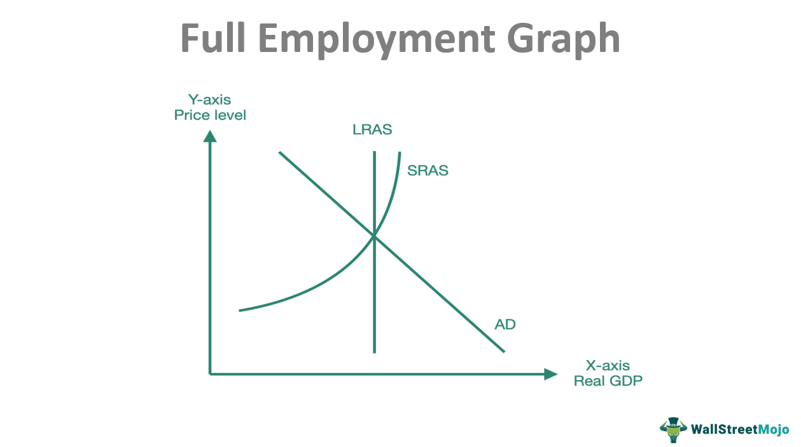

The economic equilibrium within labor markets is a fundamental concept essential for understanding macroeconomic stability. It represents the balance between job supply and demand, which directly influences various macroeconomic aspects such as salaries, job availability, and economic growth. Achieving economic equilibrium can ensure that resources in the labor market are neither underutilized nor overstrained, thereby promoting sustainable economic development.

Full employment, a state where all available labor resources are being used in the most economically efficient way, is closely linked with economic equilibrium. However, this does not imply zero unemployment. Instead, it refers to the absence of cyclical unemployment, where unemployment purely due to economic cycles is minimized. Understanding the relationship between full employment and economic equilibrium is crucial as they collectively shape wage dynamics and job availability.



Algorithmic trading, while primarily associated with financial markets, plays a significant role in influencing labor markets as well. This form of trading, which utilizes pre-programmed algorithms to execute orders at speeds and frequencies beyond human capability, affects economic indicators such as interest rates and stock market volatility. These changes can ripple through to labor markets, affecting job creation and economic stability.

A comprehensive understanding of these dynamics is not only vital for macroeconomic policy formulation but also essential for personal financial planning. With the rapid advancements in technology and the increasing influence of financial markets on the global economy, individuals and policymakers alike must grasp the intricacies of economic equilibrium and its impact on employment. This knowledge enables the development of strategies that leverage economic opportunities while navigating potential challenges in a fluctuating economic landscape.

## Table of Contents

## Understanding Economic Equilibrium in Labor Markets

Economic equilibrium in labor markets is a state where the supply of labor equals the demand, resulting in stable wages and employment levels. This balance ensures that all individuals willing and able to work at prevailing wage rates do so, and all employers find the labor they need without exerting upward or downward pressure on wages. The determination of such equilibrium involves a complex interplay of various elements.

Technological advancements significantly influence labor market equilibrium by altering the demand for specific skills and occupations. Automation and artificial intelligence, for example, can lead to structural shifts in the labor force, creating increased demand for tech-savvy professionals while reducing the need for manual labor in certain industries [1]. The rate at which these changes occur affects how quickly the labor market can reach a new equilibrium.

Government policies, including labor laws, minimum wage regulations, and taxation, also play a critical role in shaping labor market equilibrium. Policies that incentivize employment, such as tax credits for hiring or subsidies for training programs, can increase labor demand, thereby affecting the equilibrium level of employment and wages. Conversely, restrictive policies may impede hiring processes and contribute to unemployment.

Global economic conditions further impact labor market equilibrium. In open economies, the movement of goods, services, and capital across borders influences domestic labor markets. For instance, an economic upturn in a major trade partner can lead to increased demand for exports, thereby boosting domestic employment. Conversely, global downturns can reduce demand for exports, causing shifts in labor market equilibrium.

Above full employment equilibrium is an atypical scenario wherein the actual GDP surpasses the economy's potential output, often resulting in inflationary pressures. This situation can occur during periods of robust economic growth when demand for goods and services exceeds supply, driving up prices and wages as firms compete for a limited pool of labor. The Phillips Curve illustrates this relationship between unemployment and inflation, where a lower unemployment rate is associated with higher inflation.

To represent the relationship mathematically, the labor supply and demand can be expressed with functions $S(w)$ and $D(w)$ respectively, where $w$ denotes wages. Equilibrium is achieved when:

$$
S(w) = D(w)
$$

If $D(w) > S(w)$, there is excess demand, leading to rising wages until equilibrium is restored. Conversely, if $S(w) > D(w)$, excess supply exerts downward pressure on wages.

Python can be used to model this scenario and simulate changes affected by various factors:

```python
import numpy as np
import matplotlib.pyplot as plt

# Example functions for labor supply and demand
def labor_supply(w):
    return 50 + 2*w

def labor_demand(w):
    return 300 - 3*w

wages = np.linspace(0, 100, num=500)
supply = labor_supply(wages)
demand = labor_demand(wages)

plt.plot(wages, supply, label='Labor Supply')
plt.plot(wages, demand, label='Labor Demand')
plt.xlabel('Wages')
plt.ylabel('Labor')
plt.title('Labor Market Equilibrium')
plt.axvline(x=50, color='grey', linestyle='--', label='Equilibrium Wage')
plt.axhline(y=labor_supply(50), color='grey', linestyle='--', label='Equilibrium Employment')
plt.legend()
plt.show()
```

This script illustrates the equilibrium point where supply meets demand at a specific wage rate, providing a visual representation of labor market equilibrium dynamics.

Understanding these factors helps policymakers and economists predict and manage changes, ensuring the labor market remains balanced to support economic stability.

[1] Brynjolfsson, E., & McAfee, A. (2014). The Second Machine Age: Work, Progress, and Prosperity in a Time of Brilliant Technologies. Norton & Company.

## Full Employment and Its Implications

Full employment is a critical objective in labor economics, embodying a state where all available labor resources are being utilized in the most economically efficient way. Importantly, full employment does not imply zero unemployment; rather, it signifies the elimination of cyclical unemployment, where only frictional and structural unemployment exist. This distinction is imperative for understanding labor market dynamics and economic policy implications.

Achieving full employment exerts upward pressure on wages due to increased demand for workers. As companies compete for a limited pool of labor, they tend to offer higher wages and better benefits to attract and retain employees. This phenomenon can be represented by the wage-setting equation in labor economics:

$$
W = P \times (1 + \mu)
$$

where $W$ is the nominal wage, $P$ is the price level, and $\mu$ represents the mark-up on wages determined by the bargaining power of workers.

Moreover, 'overemployment', a condition where labor markets are 'hot', can further escalate this effect. In such markets, where labor demand significantly exceeds supply, the resulting wage increases contribute to higher overall spending capacity among households. This heightened spending can lead to inflationary pressures, succinctly captured through the Phillips Curve, which depicts an inverse relationship between unemployment and inflation rates.

The Phillips Curve can be expressed as:

$$
\pi_t = \pi_{t-1} +  \beta \times (u_n - u_t) + v_t
$$

where $\pi_t$ is the current inflation rate, $\pi_{t-1}$ is the previous inflation rate, $\beta$ is a constant reflecting the sensitivity of inflation to the unemployment gap, $u_n$ is the natural rate of unemployment, $u_t$ is the current unemployment rate, and $v_t$ captures shocks to the inflation process.

While full employment is desirable for maximizing economic output and improving living standards, it necessitates careful policy management to prevent excessive inflation and maintain economic stability. Understanding these implications is essential for developing economic strategies that balance growth with healthy levels of inflation.

## Algorithmic Trading and Its Economic Impact

Algorithmic trading, a method that employs complex algorithms to execute trading strategies at high speeds, has significantly reshaped financial markets by enhancing market efficiency and [liquidity](/wiki/liquidity-risk-premium). This transformation is achieved through the ability of algorithmic systems to process large volumes of data and execute trades faster than human traders, allowing for more precise pricing and reduced transaction costs. The deployment of these algorithms has reduced bid-ask spreads and improved the overall market depth, thereby contributing to a more efficient allocation of resources within the economy.

The indirect effects of [algorithmic trading](/wiki/algorithmic-trading) on labor markets manifest primarily through changes in investment patterns, which can influence economic activity and employment levels. As algorithmic trading optimizes the flow of capital, industries that are better positioned to leverage this capital experience increased investment, potentially leading to job creation. Conversely, sectors that are unable to adapt to the rapid pace of technological change may witness a decline in investment, resulting in job displacements or transformations.

Moreover, understanding the operation of algorithmic trading algorithms provides insights into potential future labor market trends. Algorithms that are designed to forecast market movements based on economic indicators can offer predictive insights into economic cycles. For instance, algorithms analyzing employment figures, gross domestic product (GDP) data, and inflation rates may adjust trading strategies accordingly, which in turn can signal shifts in economic conditions that affect employment patterns. 

The implementation of algorithmic trading requires a workforce that is skilled in both finance and technology, encouraging the demand for roles such as quantitative analysts, data scientists, and software developers. These roles are critical for developing and managing the algorithms that drive trading systems, highlighting a shift in labor demand towards more technically skilled positions.

In summary, while algorithmic trading primarily influences financial markets directly, its ripple effects on investment patterns and labor market dynamics are notable. These impacts underscore the importance of understanding how algorithmic systems operate, as they can serve as indicators for broader economic and employment trends. Adapting workforce skills to align with these trends is essential for optimizing the benefits of algorithmic trading within the economy.

## The Role of Policies in Achieving Equilibrium

Policymakers employ fiscal and monetary policies to guide economies toward equilibrium and achieve full employment. These strategies are essential to manage economic fluctuations and ensure sustainable growth.

Fiscal policy involves government adjustments to spending and taxation. During economic downturns, increasing government expenditure or reducing taxes can stimulate aggregate demand. This demand-side boost can reduce unemployment by enhancing job creation and maintaining the economy near its output potential. Conversely, in periods of excessive growth, reducing government spending or increasing taxes can temper inflationary pressures and stabilize the economy.

Monetary policy, predominantly managed by central banks, includes tools like [interest rate](/wiki/interest-rate-trading-strategies) adjustments and open market operations. By lowering interest rates, central banks encourage borrowing and investment, leading to increased consumption and demand for labor. This can reduce unemployment and push the economy towards equilibrium. However, during periods of overheating, raising interest rates can help cool down excessive spending and control inflation.

The primary challenge for policymakers is to strike a balance between fostering economic growth and maintaining price stability. An optimal policy mix that attends to both objectives is necessary for long-term economic health. In Python, the interaction between fiscal and monetary policies can be conceptualized as follows:

```python
def economic_stability(gov_spending, tax_rate, interest_rate):
    return (gov_spending - tax_rate) - interest_rate

# Example parameters
gov_spending = 1000  # Government spending
tax_rate = 200       # Taxation level
interest_rate = 5    # Interest rate

stability_index = economic_stability(gov_spending, tax_rate, interest_rate)
print(f'Economic Stability Index: {stability_index}')
```

In this model, the stability index depends on the interaction of government spending, taxation, and interest rates, reflecting the government's efforts to manage economic balance. A higher index suggests expansive fiscal policies, while lower values indicate contractionary measures, highlighting the delicate balance needed to achieve equilibrium and full employment.

## Challenges and Opportunities in Labor Markets

Technological advancements have significantly influenced labor markets, presenting both growth opportunities and challenges related to job displacement. Automation and [artificial intelligence](/wiki/ai-artificial-intelligence) (AI) have enhanced productivity and efficiency but have also led to concerns over the redundancy of certain job roles previously performed by humans. For instance, routine and manual jobs are increasingly susceptible to automation, a trend underscored by the displacement in industries reliant on such tasks (Autor, 2015).

To capitalize on the opportunities presented by technological growth, it is crucial to adapt workforce skills through comprehensive education and training initiatives. The continuous evolution of technology necessitates a workforce adept at new technologies, emphasizing the importance of reskilling and upskilling programs. These programs should focus on developing skills in areas witnessing growth, such as data science, advanced manufacturing, and digital literacy, ensuring that workers remain relevant and competitive in the labor market. Institutions like the World Economic Forum advocate for lifelong learning models and partnerships between governments, businesses, and educational institutions to facilitate this transition (World Economic Forum, 2020).

Furthermore, the global nature of modern labor markets introduces complexities that require flexible economic policies. As businesses can effortlessly operate across borders, labor markets are now interconnected, with economic fluctuations in one region potentially impacting another. For policymakers, this underscores the need for agility in economic strategies to address such interconnectedness effectively. Adaptive policies that consider global trends—such as offshoring, migration flows, and cross-border trade—are essential for fostering environments where employment growth can thrive amidst global challenges.

In response to these dynamics, economic strategies must account for the socio-economic impacts of technological change, promoting an equitable transition. Policies that support displaced workers, such as unemployment benefits and job placement services, can mitigate the adverse effects of job displacement. Additionally, promoting investments in sectors poised for growth can create new employment opportunities, offsetting jobs lost to technology.

By fostering an adaptable and well-equipped workforce, economies can leverage technological advancements to drive growth while minimizing the socio-economic disruptions that may arise from these changes. This balance is critical for sustaining economic resilience and ensuring that workforce transitions contribute positively to overall economic health.

**References:**
- Autor, D. H. (2015). Why Are There Still So Many Jobs? The History and Future of Workplace Automation. *Journal of Economic Perspectives, 29*(3), 3-30.
- World Economic Forum. (2020). *The Future of Jobs Report 2020*. World Economic Forum.

## Conclusion

Understanding economic equilibrium and full employment within labor markets is fundamental to fostering economic growth and stability. These concepts, deeply rooted in economic theory, have practical implications that extend far beyond textbooks into real-world policy formulation and personal financial decision-making. Economic equilibrium in labor markets ensures that supply meets demand, which is pivotal in determining wages and employment levels. Thus, it contributes significantly to macroeconomic stability.

The advent of algorithmic trading, a process that uses computer algorithms to manage trading decisions at speeds and frequencies that humans cannot, introduces both opportunities and challenges for economic indicators. While algorithmic trading enhances market efficiency and liquidity, its indirect effects on labor markets cannot be ignored. The shifts in investment patterns caused by algorithmic trading can lead to variations in economic activity and, subsequently, employment levels. Therefore, having a nuanced understanding of this interplay is vital for anticipating labor market trends and crafting appropriate responses.

In an era characterized by rapid technological and economic changes, responsive policy frameworks become indispensable to maintaining equilibrium and maximizing employment. Policymakers deploy an array of fiscal and monetary tools to manage economic conditions, aiming to support growth while controlling inflation. The critical balance lies in adjusting these policies to respond to technological advancements and global economic shifts effectively. For example, maintaining low levels of cyclical unemployment while avoiding inflation through proactive interest rate adjustments and strategic government spending can help stabilize economies.

Moreover, advancing technology creates an environment where new skills are constantly required, posing both a challenge and opportunity. Investing in education and training programs becomes essential to equip the workforce with necessary skills that align with evolving economic demands. In conclusion, maintaining economic equilibrium and achieving full employment should remain central objectives within dynamic and responsive economic policies to ensure robust economic health and prosperity.

## References & Further Reading

[1]: Brynjolfsson, E., & McAfee, A. (2014). *The Second Machine Age: Work, Progress, and Prosperity in a Time of Brilliant Technologies.* W. W. Norton & Company.

[2]: Autor, D. H. (2015). ["Why Are There Still So Many Jobs? The History and Future of Workplace Automation."](https://www.aeaweb.org/articles?id=10.1257/jep.29.3.3) Journal of Economic Perspectives, 29(3), 3-30.

[3]: World Economic Forum. (2020). *The Future of Jobs Report 2020*. [World Economic Forum](https://www.weforum.org/publications/the-future-of-jobs-report-2020/).

[4]: Phillips, A. W. (1958). ["The Relation Between Unemployment and the Rate of Change of Money Wage Rates in the United Kingdom, 1861-1957."](https://onlinelibrary.wiley.com/doi/full/10.1111/j.1468-0335.1958.tb00003.x) Economica, 25(100), 283–299.

[5]: Carlin, B. P., & Louis, T. A. (2009). *Bayesian Methods for Data Analysis*. CRC Press.

[6]: Lemerle, R. (2011). *Algorithmic Trading and DMA: An Introduction to Direct Access Trading Strategies.* Harriman House.

[7]: Soros, G. (1994). *The Alchemy of Finance.* Wiley.