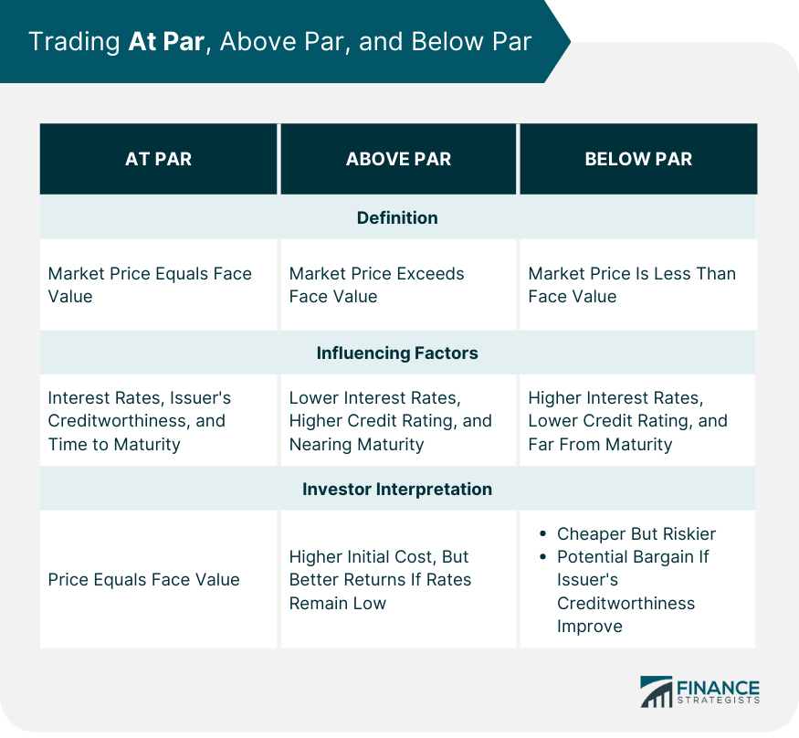

## Table of Contents

## What does 'above par' mean in everyday language?

When people say something is 'above par', they mean it's better than what is normally expected. Imagine you're playing a game and you do really well. People might say your performance was above par because you did better than most people do.

This phrase comes from golf, where 'par' is the number of strokes a good player should take to finish a hole or a round. If you take fewer strokes than par, you're doing better than expected. So, when we use 'above par' in everyday life, it's like saying someone or something is doing a great job, better than what's usual.

## How is 'above par' used in the context of golf?

In golf, 'above par' means a player took more strokes than the expected number to finish a hole or the whole game. Each hole on a golf course has a 'par' number, which is how many strokes a good golfer should need to get the ball in the hole. If a player takes more strokes than this par number, their score is above par, which is not good because it means they did worse than expected.

For example, if a hole is a par 4 and a golfer takes 5 strokes to finish it, their score for that hole is above par by one stroke. Golfers always try to score at or below par, so being above par means they need to play better on the next holes to make up for it.

## Can 'above par' have different meanings in different industries?

Yes, 'above par' can mean different things in different industries. In golf, it means a player did worse than expected because they took more strokes than the par number for a hole or the whole game. But in most other places, like at work or school, 'above par' means someone did better than what is normally expected. If a student gets really high marks on a test, people might say their performance was above par.

In the world of finance, 'above par' has another special meaning. It's used to talk about bonds. If a bond is sold for more than its face value, it's said to be trading above par. This is good for the person who owns the bond because they can sell it for more money than they paid for it. So, in finance, 'above par' is a good thing, just like it is in everyday language outside of golf.

## What is the origin of the term 'above par'?

The term 'above par' comes from the game of golf. In golf, every hole has a number called 'par,' which is how many strokes a good golfer should need to get the ball into the hole. If a golfer takes more strokes than the par number, they are 'above par,' which is bad because it means they did worse than expected.

Outside of golf, 'above par' got a different meaning. People started using it to say that something or someone was better than what is usually expected. So, if a student does really well on a test, people might say their performance was above par. This shows how words can change meaning when they move from one place to another.

## How does 'above par' relate to financial markets and bonds?

In the world of finance, 'above par' has a special meaning when it comes to bonds. A bond is like a loan you give to a company or the government. When you buy a bond, you pay a certain amount of money, which is called the face value. If you can sell that bond for more money than you paid for it, the bond is said to be trading above par. This is good for you because you can make a profit.

For example, if you bought a bond for $1,000 and later you can sell it for $1,050, the bond is trading above par. This happens when people think the bond is a good investment and are willing to pay more for it. So, in the financial markets, 'above par' means the bond is doing well and is worth more than what you originally paid for it.

## What are some common misconceptions about the term 'above par'?

A common misconception about 'above par' is that it always means something good. In everyday language and in many industries, 'above par' does mean better than expected. But in golf, it's the opposite. If a golfer scores above par, it means they took more strokes than they should have, which is bad. So, it's important to know the context when you hear 'above par' because it can mean different things.

Another misconception is that 'above par' only applies to sports or personal performance. While it's true that 'above par' is often used to talk about how well someone did at something, it also has a specific meaning in finance. In the world of bonds, 'above par' means a bond is worth more than its face value, which is good for the person who owns it. So, 'above par' can be used in different ways depending on the situation.

## How can 'above par' be measured or quantified in various fields?

In golf, 'above par' is easy to measure. Each hole on a golf [course](/wiki/best-algorithmic-trading-courses) has a 'par' number, which is how many strokes a good golfer should need to finish it. If a golfer takes more strokes than this number, they are 'above par' for that hole. For the whole game, you add up all the strokes and compare it to the total par for the course. If the total number of strokes is more than the total par, the golfer's score is above par, which means they did worse than expected.

In other fields, like school or work, 'above par' is not as clear-cut. It's more about comparing someone's performance to what is usually expected. For example, if a student gets a higher score on a test than most students, their performance might be called 'above par.' At work, if an employee does a better job than what is normally seen, their work might be described as 'above par.' It's all about being better than the average or expected level.

In finance, 'above par' is measured by looking at the price of a bond. A bond has a face value, which is the amount of money you pay for it. If you can sell that bond for more money than its face value, it's trading 'above par.' For example, if you bought a bond for $1,000 and later you can sell it for $1,050, the bond is above par. This means the bond is doing well and is worth more than what you paid for it.

## What are the implications of something being 'above par' in business performance?

When a business's performance is 'above par,' it means they are doing better than what is usually expected. This is good news for the business because it can lead to more customers, higher profits, and a better reputation. If a company is doing better than others in its industry, it might attract more investors who want to put money into a successful business. This can help the company grow and do even better in the future.

However, being 'above par' also comes with some challenges. The business might need to work hard to keep up its high performance. If they don't, they could lose their edge and fall back to being just average. Also, other companies might see their success and try to copy what they are doing, which could make it harder for the business to stay ahead. So, while being 'above par' is great, it also means the business needs to keep pushing to stay at the top.

## How does the concept of 'above par' apply to quality control and standards?

In quality control and standards, 'above par' means that a product or service is better than what is normally expected. Companies set standards to make sure their products are good enough for customers. If a product is 'above par,' it means it is even better than these standards. This can make customers happy and help the company's reputation. For example, if a car company makes cars that are safer and more reliable than what is required, those cars are 'above par.'

Reaching 'above par' in quality control can be hard work. Companies need to keep checking their products to make sure they stay better than the standard. They might need to use better materials or spend more time on making the product. But it can be worth it because customers often like to buy things that are better than average. So, being 'above par' in quality control can help a company do well in the market.

## What strategies can organizations implement to achieve performance 'above par'?

Organizations can achieve performance 'above par' by focusing on continuous improvement. This means always looking for ways to do things better. They can do this by listening to what customers want and trying to meet those needs even better than before. For example, a company might ask customers for feedback and then use that feedback to make their products or services better. They can also train their employees to do their jobs better, which can help the whole organization perform better than what is expected.

Another strategy is to set high goals and work hard to reach them. If a company aims to be better than the average, they need to set goals that are higher than what is normal. They can then make plans to reach these goals, like using new technology or finding new ways to save money. By always trying to do better than what is expected, the organization can keep improving and stay 'above par.' This can help them stand out from other companies and do well in their industry.

## How do experts analyze and interpret data to determine if results are 'above par'?

Experts look at data to see if results are 'above par' by comparing them to what is usually expected. They might use numbers like averages or benchmarks to see if the results are better than normal. For example, if a company's sales are higher than the average sales in their industry, experts might say the company's performance is 'above par.' They use charts and graphs to make it easier to see how the results compare to the expected level.

Sometimes, experts also look at trends over time to see if the results are getting better. If a student's test scores keep going up and are now higher than what most students get, experts might say the student's performance is 'above par.' By looking at the data carefully and comparing it to what is normal, experts can tell if something is doing better than expected.

## What are the future trends and potential shifts in the usage and understanding of 'above par'?

In the future, the way people use and understand 'above par' might change a bit. As more people learn about how the phrase is used differently in golf compared to other places, they might start using it more carefully. They might make sure to explain what they mean when they say 'above par' to avoid confusion. Also, as technology and data become more important in all kinds of jobs, people might use 'above par' more often to talk about how well a computer or a program is working compared to what is expected.

Another way 'above par' might change is in how it's used in new industries. For example, as more companies work on things like [artificial intelligence](/wiki/ai-artificial-intelligence) or green energy, they might start using 'above par' to talk about how well their new technologies are doing. If a new kind of solar panel works better than what is normally expected, people might say it's 'above par.' So, while the basic idea of 'above par' might stay the same, the places where it's used could grow and change over time.

## What are the key metrics for evaluating algo trading strategies?

Successful algo trading hinges on effectively evaluating trading strategies through various key metrics. These metrics provide insights into the performance and risk associated with trading algorithms, which are critical for optimizing strategies.

The **Sharpe Ratio** is one of the fundamental metrics used to assess risk-adjusted returns. It is defined as:

$$
\text{Sharpe Ratio} = \frac{R_p - R_f}{\sigma_p}
$$

where $R_p$ is the return of the portfolio, $R_f$ is the risk-free rate, and $\sigma_p$ is the standard deviation of the portfolio's excess return. The Sharpe Ratio helps determine whether the returns of a trading strategy are sufficient, considering the risk taken.

**Maximum Drawdown** is another crucial metric that measures the largest drop from a peak to a trough in the value of a portfolio before a new peak is achieved. It provides an indicator of potential downside risk, which is essential for understanding the vulnerability of a strategy to significant losses.

The **Win Rate** evaluates the percentage of profitable trades among the total number of trades executed. A high win rate indicates a significant number of successful trades, although it should be interpreted alongside other metrics to ensure overall profitability.

The **Profit Factor** is calculated by dividing the gross profit by the gross loss. This metric helps in comparing the magnitude of profits to losses, giving insights into trade effectiveness:

$$
\text{Profit Factor} = \frac{\text{Total Profit}}{\text{Total Loss}}
$$

A profit [factor](/wiki/factor-investing) greater than one indicates that a strategy is profitable.

**Average Trade** provides an understanding of the average profit or loss per trade. It is computed by dividing the total net profit by the number of trades. This metric helps in fine-tuning strategies, especially in identifying the economic value of individual trades within a strategy.

Python can be employed to calculate these metrics efficiently. Below is an example of how the Sharpe Ratio can be calculated using Python:

```python
import numpy as np

def sharpe_ratio(returns, risk_free_rate):
    excess_returns = returns - risk_free_rate
    return np.mean(excess_returns) / np.std(excess_returns)

# Example usage
daily_returns = np.array([0.01, 0.02, -0.005, 0.015, 0.005])  # hypothetical daily returns
risk_free_rate = 0.001  # hypothetical risk-free rate

sharpe = sharpe_ratio(daily_returns, risk_free_rate)
print("Sharpe Ratio:", sharpe)
```

These metrics, utilized effectively, guide traders in developing robust [algorithmic trading](/wiki/algorithmic-trading) strategies and improving their performance in financial markets. They offer a quantitative foundation for decision-making in the fast-paced world of algo trading.

## References & Further Reading

[1]: Bergstra, J., Bardenet, R., Bengio, Y., & Kégl, B. (2011). ["Algorithms for Hyper-Parameter Optimization."](https://dl.acm.org/doi/10.5555/2986459.2986743) Advances in Neural Information Processing Systems 24.

[2]: ["Advances in Financial Machine Learning"](https://www.amazon.com/Advances-Financial-Machine-Learning-Marcos/dp/1119482089) by Marcos Lopez de Prado

[3]: ["Evidence-Based Technical Analysis: Applying the Scientific Method and Statistical Inference to Trading Signals"](https://www.amazon.com/Evidence-Based-Technical-Analysis-Scientific-Statistical/dp/0470008741) by David Aronson

[4]: ["Machine Learning for Algorithmic Trading"](https://github.com/stefan-jansen/machine-learning-for-trading) by Stefan Jansen

[5]: ["Quantitative Trading: How to Build Your Own Algorithmic Trading Business"](https://www.amazon.com/Quantitative-Trading-Build-Algorithmic-Business/dp/1119800064) by Ernest P. Chan