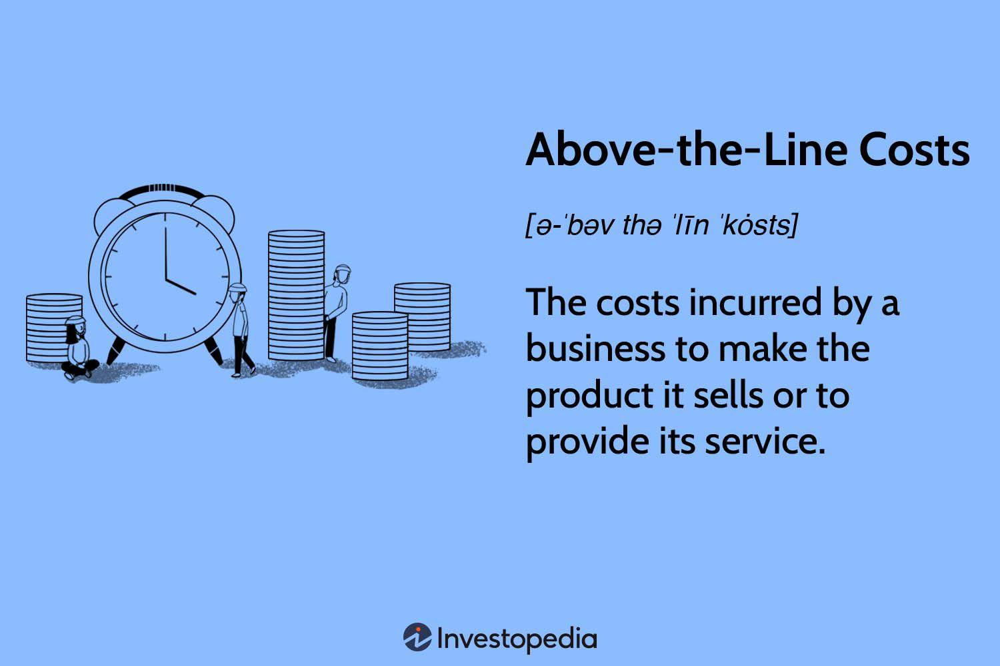

## Table of Contents

## What are above-the-line costs in the context of film and television production?

Above-the-line costs in film and television production refer to the expenses associated with the key creative talent and major production elements before the actual filming begins. This includes payments to the director, producers, screenwriters, and principal actors. These costs are called "above-the-line" because they are typically listed at the top of a budget sheet, reflecting their importance and the fact that they are often negotiated and finalized before other expenses.

In addition to salaries, above-the-line costs can also cover rights to the script or source material, as well as any development costs incurred before production starts. These expenses are crucial because they directly impact the quality and vision of the project. By securing top talent and essential rights early on, producers can ensure that the film or television show has a strong foundation, which is vital for its success.

## How do above-the-line costs differ from below-the-line costs?

Above-the-line costs and below-the-line costs are two main parts of a film or TV show budget. Above-the-line costs are the money spent on the big creative people and important parts of the project before filming starts. This includes paying the director, producers, writers, and main actors. These costs are called above-the-line because they are written at the top of the budget list. They are important because they help set up the project's vision and quality.

Below-the-line costs, on the other hand, are all the other expenses needed to make the film or TV show after the above-the-line costs are set. These include money spent on the crew, like camera operators and set designers, as well as costs for things like equipment, sets, costumes, and special effects. Below-the-line costs are called that because they are listed below the above-the-line costs on the budget sheet. They are important for actually making the project happen, but they are usually decided after the main creative team is in place.

## Can you list some common examples of above-the-line costs?

Above-the-line costs are the big money spent on the main people who make a movie or TV show. This includes paying the director, who is in charge of how the story is told. It also includes money for the producers, who help plan and manage the project. Another big part of above-the-line costs is paying the writers, who create the story and script. And of [course](/wiki/best-algorithmic-trading-courses), the salaries for the main actors, who are the stars of the show, are also above-the-line costs.

These costs also cover the money needed to buy the rights to the story or script. If the movie or TV show is based on a book or another existing work, the team has to pay to use it. Sometimes, above-the-line costs include money spent on developing the project before filming starts. This can be things like early planning meetings or making changes to the script. All these costs are important because they help set up the project and make sure it has a strong start.

## What role do above-the-line costs play in the budgeting of a production?

Above-the-line costs are really important when making a budget for a movie or TV show. They are the money spent on the big creative people like the director, producers, writers, and main actors. These costs are called above-the-line because they are listed at the top of the budget sheet. They are important because they help set up the project's vision and quality. By paying for these key people first, the team can make sure the project has a strong start.

These costs also include money for buying the rights to the story or script. If the movie or TV show is based on a book or another existing work, the team has to pay to use it. Sometimes, above-the-line costs also cover money spent on developing the project before filming starts, like early planning meetings or making changes to the script. All these costs are crucial because they help make sure the project has a solid foundation before other expenses are figured out.

## How are above-the-line costs typically negotiated and managed?

Above-the-line costs are usually negotiated before the rest of the budget is set. The producers talk with the director, writers, and main actors about how much they will be paid. These talks can take a long time because everyone wants to make sure they get a fair deal. The director might want a big salary because they are in charge of the whole project. The writers might ask for more money if their script is really good. And the main actors might want a lot of money if they are famous stars. All these negotiations happen early on to make sure the project can start with the right people.

Once the above-the-line costs are agreed on, they are written into the budget. This part of the budget is important because it sets the tone for the whole project. The producers have to make sure they have enough money to pay for these big costs before they can plan for the rest of the expenses. If the above-the-line costs are too high, the producers might have to find more money or cut back on other parts of the budget. Managing these costs carefully helps make sure the project stays on track and can be finished successfully.

## What impact do above-the-line costs have on the overall financial success of a project?

Above-the-line costs can really affect how much money a movie or TV show makes. These costs are for the big creative people like the director, writers, and main actors. If these costs are too high, it can make it hard for the project to make money. For example, if a lot of money is spent on famous actors, the project needs to make a lot of money at the box office or from TV deals to cover those costs. If it doesn't, the project might lose money, even if it's good.

On the other hand, spending money on good above-the-line talent can also help a project make more money. A famous director or popular actors can bring in more people to watch the movie or TV show. This can lead to more ticket sales or higher TV ratings, which means more money coming in. So, while high above-the-line costs can be risky, they can also be a good investment if they help the project become a big hit.

## How do above-the-line costs vary between different types of media productions, such as film versus television?

Above-the-line costs can be different for movies and TV shows. In movies, these costs often include big salaries for the director, main actors, and writers. This is because movies usually have a shorter time to make money back, so they need to attract a lot of people to the theaters. A famous actor or director can help do that, but it also means spending a lot of money upfront. For example, a big movie might pay millions of dollars to a star actor, hoping that their fame will bring in enough viewers to cover the cost.

In TV shows, above-the-line costs can be spread out over many episodes. This means the money for the director, writers, and actors is paid over time, not all at once like in movies. TV shows might not need to pay as much for each episode, but the total cost can still be high if the show runs for many seasons. Also, TV shows often have different budgets depending on whether they are on a big network or a streaming service. A popular streaming show might pay a lot for a famous actor, but the cost is spread out over the whole series, making it easier to manage.

## What strategies can be used to control or reduce above-the-line costs without compromising quality?

One way to control or reduce above-the-line costs without hurting the quality of a movie or TV show is to hire people who are good but not super famous. Instead of paying a lot for a big star, the team can find talented actors, directors, and writers who are not as well-known but can still do a great job. This can save a lot of money while still making sure the project is good. Another strategy is to negotiate deals where the key people get paid less upfront but more if the project does well. This can motivate everyone to work hard and help the project succeed, while also keeping the initial costs down.

Another approach is to use a mix of experienced and new talent. For example, a well-known director might work with a new writer or actor. This can help keep costs down because the new talent might not ask for as much money, but the experienced person can still make sure the project is high quality. Also, sometimes the team can find ways to share costs with other projects. If a director or actor is working on more than one project at the same time, they might agree to a lower salary for each one. This can help control above-the-line costs while still keeping the project's quality high.

## How do union agreements and industry standards affect above-the-line costs?

Union agreements and industry standards can have a big impact on above-the-line costs. Unions like the Directors Guild of America (DGA) and the Screen Actors Guild (SAG-AFTRA) set rules about how much directors, actors, and other key people should be paid. These rules help make sure everyone gets a fair wage, but they can also make above-the-line costs higher. For example, if a union says that a director must be paid a certain amount, the producers have to follow that rule, even if they wanted to pay less.

Industry standards also play a role in setting above-the-line costs. In the movie and TV world, there are common expectations about how much certain people should be paid based on their experience and fame. If a producer wants to hire a famous actor, they know they will have to pay a lot because that's what everyone else pays. These standards can make it hard to keep costs down, but they also help make sure that the people working on the project are paid fairly for their skills and reputation.

## What are some case studies or examples where above-the-line costs significantly influenced the outcome of a production?

One example where above-the-line costs had a big impact is the movie "Waterworld" from 1995. This movie had a huge budget, and a lot of that money went to above-the-line costs like paying the director, Kevin Reynolds, and the star, Kevin Costner. They spent a lot on these big names hoping it would make the movie a hit. But the movie ended up costing way more than expected, and it didn't make enough money at the box office to cover all the costs. This shows how high above-the-line costs can be risky if the movie doesn't do well.

Another example is the TV show "Friends." The show became really popular, and as it went on, the main actors, who are above-the-line costs, started asking for more money. By the end of the series, each of the six main actors was getting paid a million dollars per episode. This made the show very expensive to produce, but because "Friends" was so popular, the network was willing to pay. The high above-the-line costs worked out because the show kept making a lot of money, showing that sometimes spending more on key talent can be worth it if the project is a big success.

## How do international co-productions handle above-the-line costs differently compared to domestic productions?

International co-productions handle above-the-line costs differently than domestic productions because they involve multiple countries and often multiple funding sources. In an international co-production, the costs for the director, writers, and main actors might be split between different countries. This can help lower the costs for each country involved. For example, if a movie is made by teams from the U.S. and France, they might share the cost of hiring a famous director. This way, neither country has to pay the full amount, making it easier to afford big talent.

Also, international co-productions might use talent from different countries to save money. Instead of hiring a very expensive actor from one country, they might choose a well-known actor from another country who costs less. This can help keep above-the-line costs down while still getting good talent. But, working across different countries can also make things more complicated. There might be different rules and union agreements to follow, which can affect how much everyone gets paid. So, while international co-productions can help manage above-the-line costs, they also need careful planning to make sure everything works out.

## What future trends might affect the structure and management of above-the-line costs in the entertainment industry?

In the future, the way above-the-line costs are handled in the entertainment industry might change a lot because of new technology and how people watch movies and TV shows. Streaming services like Netflix and Amazon are becoming more popular, and they often have different ways of paying for movies and shows. Instead of paying big money upfront for stars, they might offer deals where actors and directors get paid based on how many people watch the show. This could help keep above-the-line costs down while still attracting good talent. Also, new technology like virtual reality and AI might change how movies and shows are made, which could affect how much money is spent on the key people.

Another trend that might affect above-the-line costs is the growing interest in diverse stories and new talent. More and more, people want to see movies and shows that tell different kinds of stories and feature new faces. This could mean that instead of spending a lot on big stars, producers might choose to hire up-and-coming actors and directors who cost less but bring fresh ideas. This shift could help control above-the-line costs while still making high-quality projects. As the industry keeps changing, how above-the-line costs are managed will need to adapt to these new trends and technologies.

## What are Above-the-Line Costs and How Can We Understand Them?

Above-the-line (ATL) costs are integral components of a company’s financial statements and budgeting process. These costs are primarily associated with the direct production of goods and services and are typically found above the gross profit line on an income statement. As such, they include expenses directly tied to the core business activities and are pivotal in calculating the gross margin, which is defined by the formula:

$$

\text{Gross Margin} = \text{Net Sales} - \text{Cost of Goods Sold (COGS)}
$$

**Definition and Role in Budgeting**

Above-the-line costs are expenses directly attributable to the production process and operational activities of a business. These costs include direct labor, raw materials, and manufacturing overheads, essential for producing goods and services. By capturing these expenses, businesses can assess the cost-efficiency of their operations. Effective management of ATL costs helps minimize the cost of goods sold (COGS), thereby improving the gross margin, which measures the efficiency of production processes and the profitability of core business operations.

**Examples of Above-the-Line Costs**

Typical above-the-line costs include:
- **Direct Labor**: Wages of employees directly involved in manufacturing or service delivery.
- **Raw Materials**: Cost of materials used in creating products.
- **Manufacturing Overheads**: Indirect costs related to production, such as maintenance of equipment and utilities utilized during production.

**Impact on Gross Margin and Profitability**

ATL costs directly impact a company’s gross margin. The gross margin is critical for gauging the financial health of a company's primary business activities. A higher gross margin indicates a more efficient production process and contributes positively to overall profitability. Firms strive to optimize these costs to gain a competitive advantage and achieve sustainable financial growth.

**Management Strategies for Controlling Above-the-Line Costs**

Organizations employ various strategies to manage ATL costs effectively:
- **Cost Control Measures**: Implementing cost-effective procurement practices and optimizing production schedules to reduce waste and inefficiencies.
- **Lean Manufacturing Techniques**: Adopting lean methodologies to streamline operations and enhance productivity without additional costs.
- **Technology Investments**: Using modern technology and automation to lower production costs and improve process accuracy.

**Relevance in Various Industries**

Above-the-line costs are relevant across numerous industries, particularly those heavily reliant on manufacturing or direct service delivery. In manufacturing sectors, efficient management of ATL costs ensures competitive pricing and profitability. In service-oriented industries, controlling direct labor costs is crucial for maintaining service quality while ensuring profitability.

In summary, above-the-line costs are fundamental in shaping a company’s financial outcomes, particularly affecting the gross margin and overall profitability. Effective management of these costs is critical for maintaining competitive pricing, optimizing resource utilization, and achieving financial and operational goals.

## References & Further Reading

[1]: Bergstra, J., Bardenet, R., Bengio, Y., & Kégl, B. (2011). ["Algorithms for Hyper-Parameter Optimization."](https://dl.acm.org/doi/10.5555/2986459.2986743) Advances in Neural Information Processing Systems 24.

[2]: ["Advances in Financial Machine Learning"](https://www.amazon.com/Advances-Financial-Machine-Learning-Marcos/dp/1119482089) by Marcos Lopez de Prado

[3]: ["Evidence-Based Technical Analysis: Applying the Scientific Method and Statistical Inference to Trading Signals"](https://www.amazon.com/Evidence-Based-Technical-Analysis-Scientific-Statistical/dp/0470008741) by David Aronson

[4]: ["Machine Learning for Algorithmic Trading"](https://github.com/PacktPublishing/Machine-Learning-for-Algorithmic-Trading-Second-Edition) by Stefan Jansen

[5]: ["Quantitative Trading: How to Build Your Own Algorithmic Trading Business"](https://books.google.com/books/about/Quantitative_Trading.html?id=j70yEAAAQBAJ) by Ernest P. Chan