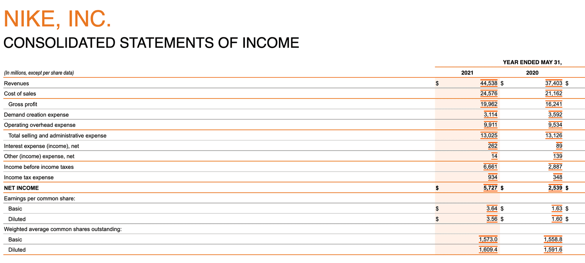

Financial budgeting and trading strategies are pivotal in ensuring the economic health and sustainability of businesses and investment activities. Financial budgeting involves the process of creating a plan to allocate resources, manage cash flows, and anticipate financial needs to achieve specific goals. Trading strategies, on the other hand, encompass the methodologies used to buy and sell financial instruments in markets with the aim of making profits.

A critical component of financial budgeting is the understanding and differentiation of costs, specifically above-the-line (ATL) and below-the-line (BTL) costs. Above-the-line costs refer to expenses directly associated with the production of goods or services. This includes costs such as raw materials and direct labor. These costs directly impact the gross margin — the difference between sales revenue and production costs. Below-the-line costs, however, include expenses related to selling, general, and administrative (SG&A) activities, as well as marketing, and do not directly contribute to production but are essential for the overall operations. Proper management of ATL and BTL costs is crucial for maintaining profitability and making informed financial decisions.



Algorithmic trading has revolutionized the modern financial landscape by employing complex algorithms to make trading decisions at speeds and volumes that are impossible for human traders. This automated approach to trading provides benefits such as increased transaction speed, reduced costs, and minimized human error. However, algorithmic trading also poses challenges, including technological risks and the need for sophisticated risk management strategies.

The purpose of this article is to explore the intricate relationships between cost management and algorithmic trading. By understanding how these elements interact, businesses can potentially optimize both their financial budgeting and trading strategies. The alignment of cost management with advanced trading technologies opens opportunities for improved financial performance and competitiveness in the market.

In the context of these dynamic financial mechanisms, optimizing both cost management and trading strategies becomes essential. Efficient cost management ensures that resources are utilized effectively, while sound trading strategies enhance the potential for profitability and risk mitigation. The integration of budgeting principles with algorithmic trading signifies a modern approach that can drive innovation and success in financial management.

## Table of Contents

## Understanding Above-the-Line Costs

Above-the-line (ATL) costs are integral components of a company’s financial statements and budgeting process. These costs are primarily associated with the direct production of goods and services and are typically found above the gross profit line on an income statement. As such, they include expenses directly tied to the core business activities and are pivotal in calculating the gross margin, which is defined by the formula:

$$

\text{Gross Margin} = \text{Net Sales} - \text{Cost of Goods Sold (COGS)}
$$

**Definition and Role in Budgeting**

Above-the-line costs are expenses directly attributable to the production process and operational activities of a business. These costs include direct labor, raw materials, and manufacturing overheads, essential for producing goods and services. By capturing these expenses, businesses can assess the cost-efficiency of their operations. Effective management of ATL costs helps minimize the cost of goods sold (COGS), thereby improving the gross margin, which measures the efficiency of production processes and the profitability of core business operations.

**Examples of Above-the-Line Costs**

Typical above-the-line costs include:
- **Direct Labor**: Wages of employees directly involved in manufacturing or service delivery.
- **Raw Materials**: Cost of materials used in creating products.
- **Manufacturing Overheads**: Indirect costs related to production, such as maintenance of equipment and utilities utilized during production.

**Impact on Gross Margin and Profitability**

ATL costs directly impact a company’s gross margin. The gross margin is critical for gauging the financial health of a company's primary business activities. A higher gross margin indicates a more efficient production process and contributes positively to overall profitability. Firms strive to optimize these costs to gain a competitive advantage and achieve sustainable financial growth.

**Management Strategies for Controlling Above-the-Line Costs**

Organizations employ various strategies to manage ATL costs effectively:
- **Cost Control Measures**: Implementing cost-effective procurement practices and optimizing production schedules to reduce waste and inefficiencies.
- **Lean Manufacturing Techniques**: Adopting lean methodologies to streamline operations and enhance productivity without additional costs.
- **Technology Investments**: Using modern technology and automation to lower production costs and improve process accuracy.

**Relevance in Various Industries**

Above-the-line costs are relevant across numerous industries, particularly those heavily reliant on manufacturing or direct service delivery. In manufacturing sectors, efficient management of ATL costs ensures competitive pricing and profitability. In service-oriented industries, controlling direct labor costs is crucial for maintaining service quality while ensuring profitability.

In summary, above-the-line costs are fundamental in shaping a company’s financial outcomes, particularly affecting the gross margin and overall profitability. Effective management of these costs is critical for maintaining competitive pricing, optimizing resource utilization, and achieving financial and operational goals.

## Exploring Below-the-Line Costs

Below-the-line costs refer to expenses that are not directly tied to the production or provision of goods and services, such as marketing expenses, administrative costs, and research and development expenditures. These costs, while not directly affecting the gross margin, play a crucial role in determining the net income of an organization. 

### Definition and Importance

Below-the-line costs include expenditures that appear below the gross profit line in an income statement. The significance of these costs stems from their impact on the net profitability of a business. Understanding and controlling these costs is essential as they can influence strategic business decisions, operational efficiency, and financial health. They are pivotal in shaping how a company allocates resources and scales its growth.

### Common Examples

1. **Marketing Expenses**: Costs incurred in promoting and selling products or services. These include advertising fees, promotional activities, and public relations efforts.

2. **Administrative Costs**: These are overhead costs related to the administration of a business, such as salaries for executive staff, office supplies, and utility expenses.

### Impact on Net Income and Business Strategy

Below-the-line costs directly affect the operating profit and net income of a business. An increase in these expenses, without a corresponding increase in revenue, can compress profit margins and impede profitability. Accordingly, businesses must strategically manage these costs to maintain a competitive edge and achieve desired financial outcomes.

### Managing and Optimizing Below-the-Line Costs

Several approaches can be employed to manage and optimize below-the-line costs:

- **Cost Analysis and Budgeting**: Regularly assessing these costs and creating a comprehensive budget can help in identifying unnecessary expenditures and allocating funds more effectively.

- **Process Automation**: Implementing technological solutions to automate routine tasks can lead to significant savings in administrative expenses.

- **Outsourcing**: Delegating certain business functions, such as payroll processing or IT services, to external providers can result in substantial cost reductions and operational efficiencies.

### Balancing Above-the-Line and Below-the-Line Costs

For sustained financial health, businesses must strike a balance between above-the-line costs (e.g., costs of goods sold) and below-the-line costs. Effective management ensures that while production and operational efficiency are maximized, supporting functions like marketing and administration are optimized for cost-effectiveness. By aligning cost structures with strategic priorities, companies can achieve a harmonious balance that supports both immediate operational needs and long-term growth objectives.

 to Algorithmic Trading

Algorithmic trading stands as a pivotal component of modern financial markets, involving the use of complex algorithms to automate trading decisions and executions. At its core, [algorithmic trading](/wiki/algorithmic-trading) uses mathematical models to make high-speed decisions and execute orders based on predefined criteria. These models process vast amounts of data to identify patterns or trends that are otherwise invisible to human traders.

The advent of algorithmic trading traces back to the development and increased availability of electronic trading systems in the 1970s and 1980s, with significant growth in the 1990s as computational power advanced. Its popularity surged due to the enhanced speed and precision it offers, allowing for trades to be completed in milliseconds. These transactions minimize human errors and enhance market efficiency by increasing order accuracy and execution speed.

The benefits of algorithmic trading are numerous. Speed is paramount, as algorithms can analyze multiple markets simultaneously and execute orders faster than any human, taking advantage of market conditions like price discrepancies or short-lived trends. Precision is another advantage; algorithms can process explicit data inputs to ensure exact order placement, reducing the risk of costly mistakes.

However, algorithmic trading is not without challenges and risks. One significant concern is the potential for market [volatility](/wiki/volatility-trading-strategies). Algorithms reacting to fluctuating conditions might lead to erratic buying or selling, contributing to price swings. Additionally, these systems require extensive testing and validation to ensure reliability. Another challenge involves the potential for malfunction due to bugs in the code, which might lead to unintended trades.

In decision-making processes, algorithms assess a wide array of data inputs, such as historical prices, volumes, and other market indicators, to determine optimal trade actions. The role of algorithms in trading decisions has increased the focus on data analytics and [machine learning](/wiki/machine-learning) within the financial sector. By continuously adapting to new data, these algorithms refine their strategies to optimize trading outcomes.

As algorithmic trading continues to evolve, its integration with [artificial intelligence](/wiki/ai-artificial-intelligence) and machine learning techniques represents a frontier of technological advancement, promising further enhancements in trading accuracy, efficiency, and profitability.

## Connecting Budgeting to Algorithmic Trading

Financial budgeting and trading strategies are interconnected components crucial to effective financial management and trading performance. Understanding how these elements interact is vital for optimizing algorithmic trading systems.

Understanding cost structures forms the backbone of informed trading decisions. Above-the-line and below-the-line costs significantly impact trading strategies by determining resource allocation and operational efficiency. Analyzing these cost structures allows traders to identify potential savings and allocate capital more effectively, thus improving profitability and reducing financial risks.

Budget optimization plays a critical role in enhancing algorithmic trading performance. By integrating precise financial planning into algorithmic models, trading algorithms can adapt to dynamic market conditions and execute cost-effective trades. Optimized budgeting facilitates rigorous scenario analyses, supporting traders in identifying lucrative opportunities while mitigating risks associated with market volatility.

The integration of above-the-line and below-the-line budgeting in trading algorithms can be demonstrated through various approaches. For instance, a trading algorithm may account for production costs (above-the-line) when predicting stock valuations or incorporate marketing expenses (below-the-line) to assess competitive positioning. These integrations ensure that the algorithmic strategies remain aligned with the overall financial health of an organization.

Aligning budgeting strategies with trading methodologies has significant financial implications. It enhances capital efficiency and ensures that trading decisions support the broader financial objectives of the entity. By synchronizing cost management with algorithmic trading approaches, businesses can achieve a holistic view of their financial landscape, promoting sustainable growth and competitiveness.

In conclusion, the intersection of financial budgeting with algorithmic trading presents a robust framework for improving trading efficiency and stability. By understanding and integrating cost structures within trading algorithms, organizations can enhance their financial performance and adapt to evolving market dynamics. This holistic approach encourages businesses to innovate and refine their strategies continually, paving the way for future advancements.

## Optimizing Trading Algorithms with Cost Management

Incorporating cost management principles within trading algorithms is essential for enhancing financial performance. These algorithms, which form the backbone of modern trading systems, can operate more efficiently by integrating cost components directly into their calculations and decision-making processes. 

**Automating Cost Calculations and Forecasts**

Automating cost calculations within trading algorithms involves integrating real-time data feeds and historical cost patterns to predict future costs effectively. This can include anything from transaction costs, slippage, funding costs, to the cost of capital. Python, often used for its simplicity and extensive library support, can be utilized for this purpose. By leveraging libraries such as NumPy and Pandas, traders can structure data efficiently and integrate complex cost functions within their trading logic.

```python
import numpy as np
import pandas as pd

# Sample function to calculate transaction costs
def transaction_costs(trades, cost_rate):
    return np.sum(trades * cost_rate)

# Example usage
trades = np.array([100, 150, 200])  # Number of trades
cost_rate = 0.001  # Cost rate per trade
total_cost = transaction_costs(trades, cost_rate)
```

**Benefits of Adaptive Algorithms with Budgetary Considerations**

Adaptive algorithms that account for budget changes provide significant benefits, including improved risk management and enhanced financial returns. By being sensitive to variations in budget allocations and market conditions, these algorithms can dynamically adjust trading strategies. This adaptability minimizes unnecessary costs and maximizes profitability. For instance, if a budget constraint is reached or anticipated, the algorithm can pivot by reducing trade sizes or pausing trading until conditions stabilize.

**Examples of Successful Integrations**

Case studies demonstrate the successful integration of cost management into trading systems. For example, some hedge funds employ algorithmic strategies that constantly optimize their portfolios by evaluating both the expected returns and the transaction costs associated with rebalancing. These systems use predictive models to determine the trade-off between potential profits and associated costs, ensuring that only beneficial trades are executed.

A notable example extends to the use of machine learning algorithms, such as [reinforcement learning](/wiki/reinforcement-learning), to balance cost management with trading decisions. These algorithms learn optimal trading actions by continually interacting with the market, refining strategies to enhance net returns while keeping costs in check.

**Potential Future Developments**

The intersection of cost management and algorithmic trading continues to evolve, with potential advancements promising greater efficiency and effectiveness. Future developments could include the deeper integration of artificial intelligence (AI) and machine learning techniques which are adept at handling large datasets and identifying cost-saving opportunities. For example, AI-driven predictive analytics can offer insights into cost fluctuations and market conditions in real-time, enabling preemptive strategy adjustments.

Moreover, advancements in quantum computing could revolutionize cost management by offering unprecedented computational power to solve complex optimization problems in trading, thereby enabling the execution of cost-efficient strategies at incredible speeds.

As markets become more algorithmically driven, the importance of integrating sophisticated cost management into trading systems will only grow, pointing towards a future where financial algorithms are not only profitable but also cost-conscious, thereby optimizing both performance and efficiency.

## Conclusion

Understanding the intricate relationship between costs and trading strategies is crucial for businesses aiming to thrive financially. The delineation of above-the-line and below-the-line costs provides a framework to manage expenses effectively, influencing both gross margin and net income. By recognizing these costs, businesses can implement better budgeting strategies, which are essential for optimizing trading algorithms. Improved cost management not only enhances profitability but also bolsters decision-making capabilities.

Integrating budgeting strategies with algorithmic trading opens new avenues for improving financial performance. Algorithms that incorporate precise cost calculations can adapt to market conditions swiftly, optimizing trades while considering potential impacts on profit margins. This holistic approach ensures that companies are better equipped to leverage financial resources, driving growth and sustainability.

The convergence of budgeting strategies with algorithmic trading holds vast potential. As trading technologies advance, companies that align their cost management with these innovations stand to gain a competitive edge. This alignment facilitates smarter investments and more resilient financial structures.

Therefore, businesses should critically reevaluate their cost management. By embracing modern trading technologies and refining their budgeting approaches, they can achieve superior financial results. This reevaluation can lead to more dynamic and responsive trading strategies, positioning businesses favorably in the market landscape.

Encouragement for further research and development in combining cost management with trading algorithms is vital. Continued exploration of this synergy promises to unveil new methodologies and tools, driving the financial industry towards greater efficiency and effectiveness. As these fields evolve, proactive adaptation and integration will be critical for maintaining strategic advantages.

## References & Further Reading

[1]: Bergstra, J., Bardenet, R., Bengio, Y., & Kégl, B. (2011). ["Algorithms for Hyper-Parameter Optimization."](https://dl.acm.org/doi/10.5555/2986459.2986743) Advances in Neural Information Processing Systems 24.

[2]: ["Advances in Financial Machine Learning"](https://www.amazon.com/Advances-Financial-Machine-Learning-Marcos/dp/1119482089) by Marcos Lopez de Prado

[3]: ["Evidence-Based Technical Analysis: Applying the Scientific Method and Statistical Inference to Trading Signals"](https://www.amazon.com/Evidence-Based-Technical-Analysis-Scientific-Statistical/dp/0470008741) by David Aronson

[4]: ["Machine Learning for Algorithmic Trading"](https://github.com/PacktPublishing/Machine-Learning-for-Algorithmic-Trading-Second-Edition) by Stefan Jansen

[5]: ["Quantitative Trading: How to Build Your Own Algorithmic Trading Business"](https://books.google.com/books/about/Quantitative_Trading.html?id=j70yEAAAQBAJ) by Ernest P. Chan