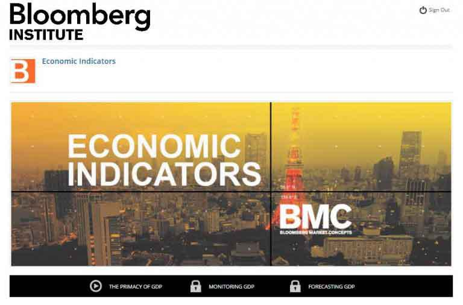

In the dynamic landscape of financial markets, understanding economic market strategies and business tactics is crucial for success. The financial sector is continuously shaped by various components that interact and influence each other. One of the key developments in recent years has been the integration of sophisticated algorithms into trading processes, significantly transforming how trades are executed and decisions are made.

This article explores the intersection of economics, market strategies, business tactics, and algorithmic trading. Traditional economic market strategies have long provided the foundation for companies to optimize their market presence and navigate macroeconomic trends. Businesses employ specific tactics to implement these strategies effectively, adapting to the ever-changing market conditions to maintain a competitive edge.



Algorithmic trading represents a significant shift in how trading is conducted on financial markets. By deploying computer algorithms, traders can automate the process, leveraging predefined conditions and complex analytical models to make decisions at speeds and volumes beyond human capabilities. This shift not only enhances efficiency but also introduces new challenges and complexities within market dynamics.

As we examine the growing influence of algorithms in trading, it becomes evident how they are shaping modern finance. The proliferation of algorithmic trading has raised questions about market efficiency, liquidity, and the role of human oversight in financial decision-making. It is essential for market participants to stay informed and adaptive to ensure successful engagement with these technological advancements.

## Table of Contents

## Understanding Economic Market Strategies

In the dynamic arena of economics, market strategies serve as essential tools for businesses striving to maintain and enhance their market presence. These strategies are devised to address the complexities inherent in financial markets and are pivotal for economic survival and success. Key economic strategies businesses employ include market segmentation, differentiation, cost leadership, and focusing on core competencies. Each strategy caters to distinct market needs and competitive environments.

**Market Segmentation and Targeting**: Market segmentation involves dividing a broader market into distinct subsets of consumers with common needs or characteristics. This allows businesses to tailor their strategies to meet the specific demands of each segment effectively. By targeting particular demographics, psychographics, or geographic regions, companies can optimize resources and increase their market share. 

**Differentiation Strategy**: Differentiation focuses on developing unique products or services that offer distinct value propositions. This uniqueness can stem from innovative features, superior quality, or exceptional customer service. The differentiation strategy enables firms to charge premium prices and cultivate brand loyalty, thereby insulating themselves from price wars and enhancing profitability.

**Cost Leadership**: Pursuing a cost leadership strategy, businesses aim to become the lowest-cost producers in their industry. Achieving cost efficiencies through economies of scale, optimized production techniques, and stringent cost control measures allows these firms to undercut competitors' pricing while maintaining healthy profit margins.

**Focus Strategy**: This strategy involves concentrating efforts on narrow market segments, targeting specialized needs and niches that larger competitors might overlook. By honing in on a particular area, businesses can build strong customer relationships and establish significant market presence in their chosen niche.

Macroeconomic trends significantly shape these strategies. For instance, during economic downturns, companies might emphasize cost leadership to offer competitive pricing while safeguarding profitability. Conversely, in periods of economic growth, firms often shift towards differentiation to capitalize on increased consumer spending. Global trends such as technological advancements, regulatory changes, and shifts in consumer behavior further mold market strategies across different regions. By continuously monitoring these macroeconomic indicators, businesses can adapt their strategies to remain competitive and responsive to the evolving economic landscape.

In conclusion, understanding and implementing effective economic market strategies is crucial for businesses aiming to thrive in the complex financial environment. By leveraging these strategies, firms can navigate economic fluctuations, capitalize on opportunities, and sustain long-term growth.

## Business Tactics in the Financial World

Business tactics are essential for transforming broader market strategies into tangible actions that drive success in the competitive landscape of financial markets. These tactics often revolve around leveraging technological advancements, optimizing resource allocation, and refining customer relations to improve profitability and market position.

Effective business practices in the financial sector can be seen through several key approaches. One significant practice involves using data analytics and technology to enhance decision-making processes. Financial institutions increasingly rely on big data analytics to gain insights into market trends, customer behaviors, and risk management. This approach allows businesses to make informed decisions that align with their strategic goals and remain competitive in rapidly changing financial environments.

Another crucial tactic is implementing a customer-centric model. By prioritizing the needs and preferences of clients, financial institutions can create more personalized services, enhancing customer satisfaction and loyalty. This tactic is particularly vital in retail banking and wealth management sectors, where client relationships significantly impact business success. Personalization efforts might include using automated systems to offer tailored investment advice or deploying AI-driven platforms for more engaging customer interactions.

Real-world examples highlight how leading financial institutions have successfully executed business tactics to bolster their market position. For instance, JPMorgan Chase has utilized blockchain technology to enhance transaction efficiency and security, thereby reducing operational costs and improving customer trust. Similarly, Goldman Sachs has invested in developing a robust digital platform to cater to the growing demand for online financial services, which has proven instrumental in attracting tech-savvy clients.

Another exemplary case is the strategic restructuring undertaken by Citibank, involving cost-cutting measures and focusing on high-growth sectors such as credit cards and global wealth management. This tactical shift has allowed Citibank to streamline operations and concentrate resources on areas with maximum profitability potential.

In summary, successful business tactics in the financial world are characterized by the innovative use of technology, a strong focus on customer engagement, and strategic allocation of resources. These elements, when combined, allow financial institutions to effectively adapt to market demands and maintain a competitive edge.

## The Rise of Algorithmic Trading

Algorithmic trading, often referred to as algo trading, represents a paradigm shift in the execution of trades within financial markets. This trading technique employs computer algorithms to automate trading processes, allowing for rapid execution of orders based on predefined criteria.

### History and Evolution

The origins of [algorithmic trading](/wiki/algorithmic-trading) can be traced back to the 1970s with the advent of electronic trading systems, which facilitated faster and more efficient market transactions. Early implementations primarily focused on simple rule-based systems. However, the proliferation of computational power and advanced data analytics in the subsequent decades significantly transformed algo trading.

In the late 1990s and early 2000s, financial markets witnessed greater adoption of algorithmic strategies, especially with the introduction of high-frequency trading ([HFT](/wiki/high-frequency-trading-strategies)). HFT leveraged low-latency technology to execute large volumes of trades at exceptionally fast speeds, further modernizing the trading landscape. The evolution continued with the integration of [artificial intelligence](/wiki/ai-artificial-intelligence) and [machine learning](/wiki/machine-learning), allowing algorithms to identify complex patterns and execute trades that maximize profitability.

### Fundamental Concepts

At its core, algorithmic trading relies on several fundamental concepts:

1. **Automation**: Automation in algorithmic trading refers to the use of technology to execute pre-set rules for trading. This eliminates the need for human intervention, reducing the time taken to place trades and minimizing the risk of human error. Automated trading systems are capable of processing large data sets in real time, identifying trading opportunities that might be missed by manual traders.

2. **Predefined Conditions**: These refer to a set of criteria that dictate the execution of trades. Conditions can be based on various market indicators, such as price movements, volume, or time. A typical example is a "mean reversion" strategy, which identifies trades based on the assumption that prices will revert to their historical mean. This can be represented mathematically as:
$$
   \text{Trade Trigger} = \begin{cases}
   \text{Buy}, & \text{if } P_t < \bar{P} - \Delta \\
   \text{Sell}, & \text{if } P_t > \bar{P} + \Delta
   \end{cases}

$$

   where $P_t$ is the current price, $\bar{P}$ is the rolling average price, and $\Delta$ represents a threshold level.

### Python Code Example

Algorithmic trading can be effectively implemented using programming languages like Python. Below is a simple example of how an algorithm might be structured to execute a basic moving average crossover trading strategy:

```python
import numpy as np
import pandas as pd

# Example data: stock prices
prices = pd.Series([100, 102, 101, 105, 107, 110, 108, 112, 115, 118])

# Calculate moving averages
short_window = 3
long_window = 5
signals = pd.DataFrame(index=prices.index)
signals['price'] = prices
signals['short_mavg'] = prices.rolling(window=short_window, min_periods=1).mean()
signals['long_mavg'] = prices.rolling(window=long_window, min_periods=1).mean()

# Generate signals: 1 for buy, -1 for sell
signals['signal'] = 0
signals['signal'][short_window:] = np.where(
    signals['short_mavg'][short_window:] > signals['long_mavg'][short_window:], 1, -1)

print(signals)
```

In this example, we calculate short and long moving averages for stock prices and generate buy/sell signals based on their crossover points. The strategy initiates a buy when the short-term moving average exceeds the long-term moving average and a sell when it falls below.

### Conclusion

Algorithmic trading has fundamentally altered how trades are executed, enabling higher efficiency and precision in financial markets. As algorithms become increasingly sophisticated, the future of trading will likely continue to evolve, integrating cutting-edge technologies to further enhance market strategies.

## Strategies in Algorithmic Trading

Algorithmic trading strategies have gained prominence due to their ability to enhance trade execution efficiency and minimize human error. Among the most commonly used strategies are [trend following](/wiki/trend-following) and [arbitrage](/wiki/arbitrage), each leveraging distinct market phenomena to optimize trading outcomes.

**Trend Following Strategies**

Trend following is predicated on the identification and exploitation of price movements in financial markets. These strategies operate on the assumption that asset prices exhibit [momentum](/wiki/momentum) and patterns over time. The concept is grounded in technical analysis, which uses historical data to forecast future price movements. A simple moving average crossover strategy is a classic approach where traders buy when a short-term moving average crosses above a long-term moving average and sell under the opposite condition. This strategy aims to capture sustained movements in price direction, allowing trades to ride the trend until it starts to reverse.

Mathematically, a simple moving average (SMA) is expressed as:

$$
\text{SMA}_n = \frac{P_1 + P_2 + \cdots + P_n}{n}
$$

Where $P_1, P_2, \ldots, P_n$ are the closing prices over a period $n$.

**Arbitrage Strategies**

Arbitrage seeks to profit from price discrepancies of the same asset in different markets or forms. This strategy involves buying an asset at a lower price in one market and simultaneously selling it at a higher price in another, effectively locking in a risk-free profit. Arbitrage can occur in various forms, including spatial arbitrage (across different exchanges), temporal arbitrage (across different times), and [statistical arbitrage](/wiki/statistical-arbitrage), which utilizes quantitative models to identify price inefficiencies.

One example is triangular arbitrage in the foreign exchange market, where a trader exchanges an initial currency for a second, then the second for a third, and finally the third back to the initial currency. The goal is to benefit from discrepancies in the quoted exchange rates.

```python
def triangular_arbitrage(exchange_rates):
    # Given exchange rates as a dictionary of tuples
    # e.g., {'USD/EUR': 0.85, 'EUR/GBP': 0.89, 'GBP/USD': 1.33}
    profit = 1.0
    for pair in exchange_rates:
        profit *= exchange_rates[pair]  # Multiply the exchange rates
    if profit > 1:  # Indicating potential arbitrage
        return f"Arbitrage Opportunity Detected. Profit Factor: {profit:.2f}"
    else:
        return "No Arbitrage Opportunity."

# Example
rates = {'USD/EUR': 0.85, 'EUR/GBP': 0.89, 'GBP/USD': 1.33}
print(triangular_arbitrage(rates))
```

**AI and Machine Learning in Algorithmic Trading**

The advent of AI and machine learning (ML) has significantly advanced algorithmic trading strategies, enabling the development of sophisticated models that enhance decision making. Machine learning algorithms can process vast amounts of data to identify patterns and correlations that are not immediately discernible through traditional analysis. Techniques such as [deep learning](/wiki/deep-learning), [reinforcement learning](/wiki/reinforcement-learning), and natural language processing are increasingly applied to build adaptive trading systems that autonomously refine their strategies.

For instance, reinforcement learning, inspired by behavioral psychology, involves training algorithms through trial and error, learning optimal policies in dynamic markets. Machine learning models can continuously improve with more data, allowing for high-frequency trading strategies that execute trades within milliseconds, capturing fleeting market inefficiencies.

In conclusion, the integration of AI and machine learning into algorithmic trading magnifies the potential of traditional strategies like trend following and arbitrage, pushing the boundaries of what automated trading systems can achieve. As technology continues to evolve, these strategies will likely become even more sophisticated, driving greater efficiency and innovation in financial markets.

## Implications of Algo Trading on Market Dynamics

Algorithmic trading, also known as algo trading, plays a significant role in the modern financial ecosystem, especially in enhancing market efficiency and [liquidity](/wiki/liquidity-risk-premium). By utilizing advanced computational algorithms, algo trading allows for the rapid execution of orders, thereby improving the speed at which information is assimilated into market prices. This rapid processing capability helps reduce the bid-ask spread, which is a core component of market liquidity. For example, the implementation of market-making algorithms helps keep the market liquid by automatically placing both buy and sell orders, thus ensuring that traders can execute transactions with minimal price movement.

However, the dominance of algorithmic, particularly high-frequency trading (HFT), presents notable regulatory challenges and ethical concerns. HFT strategies often involve executing large volumes of trades at incredibly high speeds, outpacing human capabilities. This can sometimes lead to the unfair manipulation of stock prices and market conditions. Regulatory bodies globally have raised concerns over the transparency and fairness of these practices, leading to increased scrutiny and the development of regulations aimed at curbing potential abuses. Ethical concerns arise from the potential for HFT to contribute to market instability, as witnessed during events like the 2010 Flash Crash, where rapid algorithm-driven sell-offs contributed to severe market [volatility](/wiki/volatility-trading-strategies).

AI-driven strategies are at the forefront of enhancing algorithmic trading, contributing both to market stability and, paradoxically, to volatility. On one hand, AI algorithms can predict and react to market trends with greater accuracy than traditional methods, potentially stabilizing markets by preventing erratic trading behaviors. These intelligent algorithms can assimilate vast amounts of data, detect complex patterns, and make informed trading decisions, thereby maintaining a balanced market condition. On the other hand, the same characteristics that make AI-effective can also induce volatility. The challenge lies in the algorithms' sensitivity to real-time data, which can occasionally result in overreactions to market news or events, amplifying price fluctuations rather than mitigating them.

The computational power of AI allows for the identification of sophisticated trading opportunities and the execution of trades with speed and precision. However, reliance on AI and machine learning can lead to unforeseen outcomes if the underlying models are based on flawed assumptions or if they encounter data that falls outside their training. Thus, while AI-driven strategies improve market dynamics by making them more predictable and efficient, they also pose the risk of exacerbating volatility if not correctly managed.

In conclusion, while algorithmic trading enhances market efficiency and liquidity, it does present notable regulatory and ethical challenges, particularly concerning high-frequency trading. The integration of AI within these frameworks offers both stabilization potentials as well as risks of increased volatility, necessitating careful oversight and ongoing innovation to align technological advancements with market integrity and fairness.

## Challenges and Risks of Algorithmic Trading

Algorithmic trading, while beneficial in increasing trade efficiency and liquidity, is fraught with several significant challenges and risks. One primary concern is technology failures, which can lead to substantial financial losses. These failures, whether due to hardware malfunctions, software bugs, or network issues, underscore the dependence of algorithmic trading on robust technological infrastructure. Such incidents not only disrupt trading activities but can also amplify market volatility if erroneous trades are made before issues are detected and resolved.

Another risk [factor](/wiki/factor-investing) is over-optimization, often termed as curve-fitting. Traders might design algorithms that perform supremely well on historical data due to excessive fine-tuning. However, these overly-optimized strategies often fail to translate into profits in live markets, where conditions can deviate substantially from historical patterns. Over-optimization results from a focus on past data patterns that might not reflect future market behavior, thus degrading the algorithm's predictive power.

The lack of human oversight presents additional challenges. Algorithms operate at speeds beyond human comprehension, executing thousands of trades per second. While this speed is advantageous, it eliminates real-time human supervision. This absence of oversight during the trading process might allow errors or undesirable strategies to manifest, potentially causing substantial market disruptions. Moreover, the complexity of algorithmic systems can make them difficult for even experienced traders to understand and monitor effectively.

To mitigate these risks, robust infrastructure and comprehensive risk management protocols are essential. A resilient technological framework helps prevent system failures, while effective risk management ensures that unexpected issues do not escalate into significant financial losses. Regular system audits, rigorous testing environments, and redundant systems are critical components in fortifying the infrastructure against potential threats.

Unforeseen market events, such as geopolitical events or sudden economic downturns, pose additional challenges to algorithmic trading. These events can result in market conditions that deviate significantly from normal patterns, possibly leading algorithms to execute suboptimal trades. Algorithms typically rely on historical data to identify trading opportunities, so unprecedented events may elude their predictive mechanisms. Therefore, algorithmic strategies require adaptability and dynamic recalibration capabilities to cope with such unpredictability.

Overall, while algorithmic trading offers significant benefits, it necessitates a carefully considered approach to managing its inherent risks. Through enhanced infrastructure, vigilant oversight, and adaptive strategies, these challenges can be mitigated, allowing market participants to harness the full potential of algorithmic trading effectively.

## Future Trends in Algorithmic Trading

As algorithmic trading evolves, it is increasingly shaped by rapid technological advancements. Several key trends are likely to drive the future of this sector. First, the integration of artificial intelligence (AI) and machine learning in trading algorithms is expected to become more sophisticated. These technologies enhance predictive modeling by analyzing vast datasets, identifying patterns, and making data-driven decisions with greater accuracy and speed. AI-driven algorithms can adapt to changing market conditions in real time, offering a significant competitive edge.

Moreover, quantum computing represents a potential revolution in algorithmic trading, promising to handle complex computations exponentially faster than classical computers. This could optimize trading strategies and risk assessments by processing large volumes of financial data at unprecedented speeds. The ability of quantum algorithms to solve optimization problems efficiently may lead to more effective arbitrage opportunities and portfolio management strategies.

Blockchain technology is another innovation that could reshape algorithmic trading. With its capability to ensure transactions' transparency, security, and efficiency, blockchain could streamline back-office processes, reduce settlement times, and lower costs. The decentralized nature of blockchain might also foster more collaborative and cross-border trading environments.

The evolving regulatory landscape remains a crucial consideration. As algorithmic trading gains prominence, regulators focus on ensuring market stability, fairness, and transparency. New regulations may emerge to address concerns related to high-frequency trading and the potential for market manipulation. For example, implementing circuit breakers and trading limits could mitigate excessive market volatility caused by rapid algorithmic activities.

Additionally, regulators might impose stricter requirements on algorithmic trading systems to enhance oversight and accountability. These could include mandating more robust risk management frameworks and requiring detailed records of algorithmic decision-making processes.

In conclusion, the future of algorithmic trading will likely be characterized by increased integration of AI, quantum computing, and blockchain technologies, offering enhanced capabilities and efficiencies. However, the evolving regulatory environment will play a critical role in shaping how these innovations are adopted and implemented in practice. Staying informed and adaptable to these changes will be crucial for market participants seeking to leverage algorithmic trading's potential benefits while managing its risks effectively.

## Conclusion

In reviewing economic market strategies, business tactics, and the burgeoning field of algorithmic trading, it becomes clear that these components are inextricably linked within the financial industry. Economic market strategies provide the framework for businesses to optimize their market presence and navigate through macroeconomic trends. Successful business tactics derive from these strategies, offering actionable steps to secure competitive advantage and drive growth in volatile markets. 

Algorithmic trading signifies a transformative leap within this landscape. The application of algorithms facilitates rapid, automated, and precise trade executions, minimizing human error and enhancing market efficiency. By employing predefined conditions and strategies such as trend following and arbitrage, algo trading optimizes transaction timing and capitalizes on market inefficiencies. Furthermore, the integration of artificial intelligence and machine learning into trading algorithms heralds a new era of sophisticated, data-driven decision-making processes that potentially enhance market stability.

Despite these advancements, the arena of algorithmic trading presents challenges and risks, including potential technology failures, over-optimization, and the necessity for robust infrastructure and risk management protocols. Furthermore, the rapid evolution of algorithmic trading necessitates regulatory oversight to mitigate ethical concerns, particularly regarding high-frequency trading and its impact on market dynamics.

Looking to the future, it is imperative for market participants to engage in ongoing research and innovation to harness these algorithms' full potential while adapting to an ever-changing financial ecosystem. The evolving role of technology and the impending regulatory landscape imply that adaptability will be a key determinant of success in this domain. As such, continuous learning and development in algorithmic trading methodologies will remain vital for thriving in the modern financial world.

## References & Further Reading

[1]: Biais, B., Foucault, T., & Moinas, S. (2015). ["Equilibrium High-Frequency Trading."](https://www.sciencedirect.com/science/article/abs/pii/S0304405X15000288) The Review of Economic Studies, 82(4), 1229-1261.

[2]: Aldridge, I. (2013). ["High-Frequency Trading: A Practical Guide to Algorithmic Strategies and Trading Systems."](https://onlinelibrary.wiley.com/doi/pdf/10.1002/9781119203803.fmatter) Wiley.

[3]: Narang, R. K. (2009). ["Inside the Black Box: A Simple Guide to Quantitative and High-Frequency Trading"](https://onlinelibrary.wiley.com/doi/book/10.1002/9781118267738). Wiley.

[4]: LeBaron, B. (2005). ["Agent-Based Computational Finance."](https://www.semanticscholar.org/paper/Agent-based-computational-finance-%3A-Suggested-and-LeBaron/6c4dea6d6b77ab727f5c0b391996aa1d0c5b5d65) Handbook of Computational Economics, Volume 2.

[5]: Cartea, Á., Jaimungal, S., & Penalva, J. (2015). ["Algorithmic and High-Frequency Trading."](https://assets.cambridge.org/97811070/91146/frontmatter/9781107091146_frontmatter.pdf) Cambridge University Press.

[6]: Pérez, A., Marwala, T., & Nelwamondo, F. V. (2007). ["Modeling Stock Prices Using Recurrent Neural Networks."](https://www.researchgate.net/profile/Fulufhelo-Nelwamondo/publication/42803508_Water_Demand_Prediction_using_Artificial_Neural_Networks_and_Support_Vector_Regression/links/00b4953a80faf81f95000000/Water-Demand-Prediction-using-Artificial-Neural-Networks-and-Support-Vector-Regression.pdf?origin=publication_detail) 2007 IEEE Symposium on Computational Intelligence and Data Mining.

[7]: Hendershott, T., Jones, C. M., & Menkveld, A. J. (2011). ["Does Algorithmic Trading Improve Liquidity?"](https://onlinelibrary.wiley.com/doi/full/10.1111/j.1540-6261.2010.01624.x) The Review of Financial Studies, 24(5), 1465–1489.

[8]: Lo, A. W. (2016). ["Adaptive Markets: Financial Evolution at the Speed of Thought."](https://archive.org/details/adaptivemarketsf0000loan) Princeton University Press.