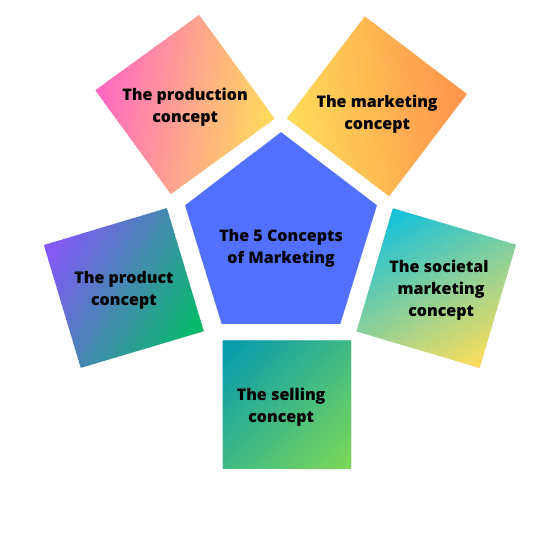

## Table of Contents

## What does 'Above the Market' mean in general terms?

When people talk about something being 'Above the Market', they usually mean that it is priced higher than what is considered normal or average for that type of item or service. For example, if a house is listed for sale at a price that is higher than other similar houses in the same area, it might be described as being priced above the market.

This term can also be used in the stock market to describe a stock that is trading at a higher price than its perceived value. Investors might say a stock is above the market if they believe it is overpriced compared to its earnings or other financial metrics. Understanding whether something is above the market can help people make better decisions about buying or selling.

## How does the concept of 'Above the Market' apply to stock prices?

When we talk about a stock being 'Above the Market', it means the stock's price is higher than what many people think it should be. This can happen for many reasons. Maybe the company is doing really well, or maybe a lot of people want to buy the stock because they think it will keep going up. But sometimes, the price can be too high compared to what the company is actually worth. Investors look at things like how much money the company makes, how fast it's growing, and what other similar companies are worth to decide if a stock is above the market.

If a stock is above the market, it might be a risky buy. That's because if the price is too high, it could go down when people realize it's not worth that much. On the other hand, some investors might still buy it if they believe the company will keep doing well and the price will keep going up. It's important for investors to do their homework and understand why a stock might be priced above the market before deciding to buy or sell.

## Can you explain the difference between market price and above-market price?

Market price is the current price at which something is being sold or bought. It's what people are willing to pay for it right now. For example, if a toy is being sold for $10 in many stores, that's its market price. It's the normal price that most people expect to pay.

An above-market price is when something is being sold for more than its market price. Using the same toy example, if one store tries to sell the toy for $15 while everyone else is selling it for $10, that's an above-market price. People might not want to buy it at that price because they can get it cheaper elsewhere. Sometimes, things can be priced above the market because they are rare or special, but often it means the seller is asking for more than what most people think it's worth.

## What are some common strategies used to achieve above-market returns?

One common strategy to achieve above-market returns is to invest in stocks that are undervalued. This means finding companies that are not as popular or well-known but have strong potential for growth. Investors look for these opportunities by studying the company's financial health, its industry, and how it compares to other companies. If they buy these stocks at a low price and the company does well, the stock price can go up a lot, giving them returns that are higher than the overall market.

Another strategy is to use active management, where investors or fund managers make specific choices about what to buy and sell. They try to pick stocks or other investments that will do better than the market average. This can involve a lot of research and quick decision-making. Sometimes, they might also use techniques like short selling, where they bet that a stock's price will go down, or they might use leverage, which means borrowing money to invest more than they have. These methods can lead to higher returns but also come with more risk.

A third approach is to invest in alternative assets, like real estate, commodities, or private equity. These types of investments often don't move in the same way as the stock market, so they can provide higher returns if chosen wisely. For example, buying a piece of land in an area that's expected to grow can lead to big profits if the area develops as expected. However, these investments can be harder to buy and sell, and they require a good understanding of the specific market.

## How do economic indicators influence above-market performance?

Economic indicators are like signs that tell us how the economy is doing. Things like unemployment rates, inflation, and how much people are spending can affect whether investments do better than the market average. For example, if unemployment goes down, it usually means more people have jobs and can spend more money. This can make companies do better, and their stock prices might go up more than the market average. On the other hand, if inflation goes up a lot, it can make things more expensive and slow down the economy, which might make it harder for investments to beat the market.

Investors pay close attention to these indicators because they help them decide where to put their money. If they see that the economy is getting stronger, they might choose to invest in companies that do well when people have more money to spend, like retail or travel companies. But if they think the economy might slow down, they might pick safer investments, like utilities or healthcare, which people need no matter what the economy is doing. By understanding economic indicators, investors can try to pick investments that will do better than the market average.

## What role do market trends play in identifying above-market opportunities?

Market trends are like the direction the market is moving. They help investors see what's popular and what's not. If a lot of people are buying tech stocks, that's a trend. By watching these trends, investors can find opportunities to make more money than the market average. For example, if they see a trend starting in a new area like green energy, they might buy stocks in that area before they get really popular and go up in price.

But it's not just about following the crowd. Sometimes, the best above-market opportunities come from going against the trend. If everyone is selling a certain type of stock because they think it's going down, but an investor thinks it's actually a good buy, they might get it at a low price. If they're right, and the stock goes back up, they can make a lot more money than if they just followed what everyone else was doing. So, understanding market trends can help investors find both popular and hidden opportunities to beat the market.

## Can you provide examples of companies that have consistently performed above the market?

One company that has often done better than the market is Apple. They make popular products like the iPhone and MacBook. People love their stuff, so Apple's stock price has gone up a lot over the years. Even when the whole market goes down, Apple sometimes keeps doing well because they have loyal customers and keep coming out with new things people want to buy.

Another company that has beaten the market a lot is Amazon. They started with just selling [books](/wiki/algo-trading-books) online, but now they sell everything and have services like Amazon Prime. Their stock has grown a lot because they keep finding new ways to make money, like with their cloud computing service, AWS. Even when the economy is not doing great, Amazon often does better than other companies because people still shop online a lot.

## How do investors typically measure above-market performance?

Investors usually measure above-market performance by comparing the returns of their investments to a benchmark, like the S&P 500. The S&P 500 is a big group of stocks that shows how the overall market is doing. If an investor's stock or fund does better than the S&P 500, they say it's performing above the market. For example, if the S&P 500 goes up by 10% in a year, but an investor's stock goes up by 15%, that stock is doing better than the market.

Another way investors measure above-market performance is by looking at something called alpha. Alpha is a number that shows how much better or worse an investment is doing compared to what you would expect based on its risk. If an investment has a positive alpha, it means it's doing better than expected, which is another way of saying it's performing above the market. So, investors use these tools to see if their choices are beating the market and making them more money.

## What are the risks associated with seeking above-market returns?

Trying to get returns that are better than the market can be risky. One big risk is that you might lose money. When you aim for higher returns, you often have to take bigger chances. For example, if you buy stocks that are not popular or well-known, they might not do well and their price could go down a lot. Also, if you use strategies like borrowing money to invest more, you could end up owing more than you can pay back if your investments don't go up like you hoped.

Another risk is that it can be hard to beat the market. A lot of smart people and big companies try to do it, but most of them don't do better than the market over a long time. It takes a lot of work to find the right investments, and even then, you might not pick the winners. If you're not careful, you could end up with returns that are worse than if you had just put your money in a simple, safe investment that follows the market.

## How does sector analysis contribute to understanding above-market dynamics?

Sector analysis helps investors understand above-market dynamics by looking at how different parts of the economy are doing. Each sector, like technology, healthcare, or energy, can have its own trends and performance. By studying these sectors, investors can see which ones are growing faster than the overall market. For example, if the technology sector is doing really well because of new inventions, stocks in that sector might go up more than the market average. This can help investors find opportunities to make more money by [picking](/wiki/asset-class-picking) the right sectors to invest in.

Understanding sector performance also helps investors see risks and opportunities that might not be obvious when looking at the whole market. If one sector is doing badly, like if oil prices drop and the energy sector struggles, investors can avoid those stocks and look for better opportunities elsewhere. On the other hand, if a sector is doing better than the market, like healthcare during a time when people need more medical care, investors might want to put more money into that sector. By focusing on sector analysis, investors can make smarter choices and aim for returns that beat the market.

## What advanced techniques can be used to predict above-market movements?

One advanced technique to predict above-market movements is using quantitative analysis. This means using math and computers to look at a lot of data about stocks and the economy. People who do this might use things like algorithms, which are like special math recipes, to find patterns that other people might miss. They can look at things like how much a stock's price moves up and down, how it compares to other stocks, and even what people are saying about it on the internet. By finding these patterns, they can try to guess which stocks will go up more than the market.

Another technique is called technical analysis. This is when investors look at charts and graphs of stock prices to see if they can spot trends. They might look for things like when a stock's price goes above a certain line on a chart, which could mean it's going to keep going up. Or they might see that a stock's price goes up and down in a certain way that has happened before, and they think it might happen again. By studying these patterns, they try to predict when a stock will do better than the market. Both of these techniques need a lot of practice and can be tricky, but they can help investors find opportunities to make more money than the market average.

## How do global economic factors impact the ability to achieve above-market results?

Global economic factors can really change how easy or hard it is to do better than the market. Things like what's happening in other countries' economies, how much money is moving around the world, and big events like wars or natural disasters can all affect stock prices. For example, if a big country like China is doing well, it might make companies that sell things to China do better, and their stocks could go up more than the market. But if there's a problem, like a big drop in oil prices, it can hurt companies in the energy sector and make it harder to get above-market returns.

Investors need to keep an eye on these global factors because they can create both risks and opportunities. If they see that a country's economy is growing fast, they might want to invest in companies that will benefit from that growth. But they also have to be careful because global events can be hard to predict. If something unexpected happens, like a new trade war, it can make stock prices go down and make it tough to beat the market. So, understanding what's happening around the world is important for trying to get above-market results.

## What is the Rise of Algorithmic Trading?

Algorithmic trading, often referred to as algo trading, represents a paradigm shift in the execution of trades within financial markets. This trading technique employs computer algorithms to automate trading processes, allowing for rapid execution of orders based on predefined criteria.

### History and Evolution

The origins of [algorithmic trading](/wiki/algorithmic-trading) can be traced back to the 1970s with the advent of electronic trading systems, which facilitated faster and more efficient market transactions. Early implementations primarily focused on simple rule-based systems. However, the proliferation of computational power and advanced data analytics in the subsequent decades significantly transformed algo trading.

In the late 1990s and early 2000s, financial markets witnessed greater adoption of algorithmic strategies, especially with the introduction of high-frequency trading ([HFT](/wiki/high-frequency-trading-strategies)). HFT leveraged low-latency technology to execute large volumes of trades at exceptionally fast speeds, further modernizing the trading landscape. The evolution continued with the integration of [artificial intelligence](/wiki/ai-artificial-intelligence) and [machine learning](/wiki/machine-learning), allowing algorithms to identify complex patterns and execute trades that maximize profitability.

### Fundamental Concepts

At its core, algorithmic trading relies on several fundamental concepts:

1. **Automation**: Automation in algorithmic trading refers to the use of technology to execute pre-set rules for trading. This eliminates the need for human intervention, reducing the time taken to place trades and minimizing the risk of human error. Automated trading systems are capable of processing large data sets in real time, identifying trading opportunities that might be missed by manual traders.

2. **Predefined Conditions**: These refer to a set of criteria that dictate the execution of trades. Conditions can be based on various market indicators, such as price movements, volume, or time. A typical example is a "mean reversion" strategy, which identifies trades based on the assumption that prices will revert to their historical mean. This can be represented mathematically as:
$$
   \text{Trade Trigger} = \begin{cases}
   \text{Buy}, & \text{if } P_t < \bar{P} - \Delta \\
   \text{Sell}, & \text{if } P_t > \bar{P} + \Delta
   \end{cases}

$$

   where $P_t$ is the current price, $\bar{P}$ is the rolling average price, and $\Delta$ represents a threshold level.

### Python Code Example

Algorithmic trading can be effectively implemented using programming languages like Python. Below is a simple example of how an algorithm might be structured to execute a basic moving average crossover trading strategy:

```python
import numpy as np
import pandas as pd

# Example data: stock prices
prices = pd.Series([100, 102, 101, 105, 107, 110, 108, 112, 115, 118])

# Calculate moving averages
short_window = 3
long_window = 5
signals = pd.DataFrame(index=prices.index)
signals['price'] = prices
signals['short_mavg'] = prices.rolling(window=short_window, min_periods=1).mean()
signals['long_mavg'] = prices.rolling(window=long_window, min_periods=1).mean()

# Generate signals: 1 for buy, -1 for sell
signals['signal'] = 0
signals['signal'][short_window:] = np.where(
    signals['short_mavg'][short_window:] > signals['long_mavg'][short_window:], 1, -1)

print(signals)
```

In this example, we calculate short and long moving averages for stock prices and generate buy/sell signals based on their crossover points. The strategy initiates a buy when the short-term moving average exceeds the long-term moving average and a sell when it falls below.

### Conclusion

Algorithmic trading has fundamentally altered how trades are executed, enabling higher efficiency and precision in financial markets. As algorithms become increasingly sophisticated, the future of trading will likely continue to evolve, integrating cutting-edge technologies to further enhance market strategies.

## What are the strategies in algorithmic trading?

Algorithmic trading strategies have gained prominence due to their ability to enhance trade execution efficiency and minimize human error. Among the most commonly used strategies are [trend following](/wiki/trend-following) and [arbitrage](/wiki/arbitrage), each leveraging distinct market phenomena to optimize trading outcomes.

**Trend Following Strategies**

Trend following is predicated on the identification and exploitation of price movements in financial markets. These strategies operate on the assumption that asset prices exhibit [momentum](/wiki/momentum) and patterns over time. The concept is grounded in technical analysis, which uses historical data to forecast future price movements. A simple moving average crossover strategy is a classic approach where traders buy when a short-term moving average crosses above a long-term moving average and sell under the opposite condition. This strategy aims to capture sustained movements in price direction, allowing trades to ride the trend until it starts to reverse.

Mathematically, a simple moving average (SMA) is expressed as:

$$
\text{SMA}_n = \frac{P_1 + P_2 + \cdots + P_n}{n}
$$

Where $P_1, P_2, \ldots, P_n$ are the closing prices over a period $n$.

**Arbitrage Strategies**

Arbitrage seeks to profit from price discrepancies of the same asset in different markets or forms. This strategy involves buying an asset at a lower price in one market and simultaneously selling it at a higher price in another, effectively locking in a risk-free profit. Arbitrage can occur in various forms, including spatial arbitrage (across different exchanges), temporal arbitrage (across different times), and [statistical arbitrage](/wiki/statistical-arbitrage), which utilizes quantitative models to identify price inefficiencies.

One example is triangular arbitrage in the foreign exchange market, where a trader exchanges an initial currency for a second, then the second for a third, and finally the third back to the initial currency. The goal is to benefit from discrepancies in the quoted exchange rates.

```python
def triangular_arbitrage(exchange_rates):
    # Given exchange rates as a dictionary of tuples
    # e.g., {'USD/EUR': 0.85, 'EUR/GBP': 0.89, 'GBP/USD': 1.33}
    profit = 1.0
    for pair in exchange_rates:
        profit *= exchange_rates[pair]  # Multiply the exchange rates
    if profit > 1:  # Indicating potential arbitrage
        return f"Arbitrage Opportunity Detected. Profit Factor: {profit:.2f}"
    else:
        return "No Arbitrage Opportunity."

# Example
rates = {'USD/EUR': 0.85, 'EUR/GBP': 0.89, 'GBP/USD': 1.33}
print(triangular_arbitrage(rates))
```

**AI and Machine Learning in Algorithmic Trading**

The advent of AI and machine learning (ML) has significantly advanced algorithmic trading strategies, enabling the development of sophisticated models that enhance decision making. Machine learning algorithms can process vast amounts of data to identify patterns and correlations that are not immediately discernible through traditional analysis. Techniques such as [deep learning](/wiki/deep-learning), [reinforcement learning](/wiki/reinforcement-learning), and natural language processing are increasingly applied to build adaptive trading systems that autonomously refine their strategies.

For instance, reinforcement learning, inspired by behavioral psychology, involves training algorithms through trial and error, learning optimal policies in dynamic markets. Machine learning models can continuously improve with more data, allowing for high-frequency trading strategies that execute trades within milliseconds, capturing fleeting market inefficiencies.

In conclusion, the integration of AI and machine learning into algorithmic trading magnifies the potential of traditional strategies like trend following and arbitrage, pushing the boundaries of what automated trading systems can achieve. As technology continues to evolve, these strategies will likely become even more sophisticated, driving greater efficiency and innovation in financial markets.

## References & Further Reading

[1]: Biais, B., Foucault, T., & Moinas, S. (2015). ["Equilibrium High-Frequency Trading."](https://www.sciencedirect.com/science/article/abs/pii/S0304405X15000288) The Review of Economic Studies, 82(4), 1229-1261.

[2]: Aldridge, I. (2013). ["High-Frequency Trading: A Practical Guide to Algorithmic Strategies and Trading Systems."](https://onlinelibrary.wiley.com/doi/pdf/10.1002/9781119203803.fmatter) Wiley.

[3]: Narang, R. K. (2009). ["Inside the Black Box: A Simple Guide to Quantitative and High-Frequency Trading"](https://onlinelibrary.wiley.com/doi/book/10.1002/9781118267738). Wiley.

[4]: LeBaron, B. (2005). ["Agent-Based Computational Finance."](https://www.semanticscholar.org/paper/Agent-based-computational-finance-%3A-Suggested-and-LeBaron/6c4dea6d6b77ab727f5c0b391996aa1d0c5b5d65) Handbook of Computational Economics, Volume 2.

[5]: Cartea, Á., Jaimungal, S., & Penalva, J. (2015). ["Algorithmic and High-Frequency Trading."](https://assets.cambridge.org/97811070/91146/frontmatter/9781107091146_frontmatter.pdf) Cambridge University Press.

[6]: Pérez, A., Marwala, T., & Nelwamondo, F. V. (2007). ["Modeling Stock Prices Using Recurrent Neural Networks."](https://www.researchgate.net/profile/Fulufhelo-Nelwamondo/publication/42803508_Water_Demand_Prediction_using_Artificial_Neural_Networks_and_Support_Vector_Regression/links/00b4953a80faf81f95000000/Water-Demand-Prediction-using-Artificial-Neural-Networks-and-Support-Vector-Regression.pdf?origin=publication_detail) 2007 IEEE Symposium on Computational Intelligence and Data Mining.

[7]: Hendershott, T., Jones, C. M., & Menkveld, A. J. (2011). ["Does Algorithmic Trading Improve Liquidity?"](https://onlinelibrary.wiley.com/doi/full/10.1111/j.1540-6261.2010.01624.x) The Review of Financial Studies, 24(5), 1465–1489.

[8]: Lo, A. W. (2016). ["Adaptive Markets: Financial Evolution at the Speed of Thought."](https://archive.org/details/adaptivemarketsf0000loan) Princeton University Press.