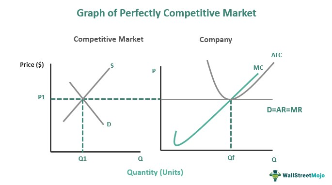

The economic theory of perfect competition provides a foundational framework for understanding market dynamics. In this theoretical model, numerous small firms produce identical products, and no single entity possesses the market power to influence prices. Firms in such a setting are price takers, and the forces of supply and demand solely govern the market price. This environment serves as an ideal benchmark in economic studies, although real-world markets seldom achieve the pure conditions of perfect competition.

Market profits within this framework can be categorized into two types: normal profit and economic profit. Normal profit is the minimum earnings necessary for a firm to remain in business in the long term. In contrast, economic profit represents the surplus gained when total revenue exceeds both explicit and implicit costs. In a perfectly competitive market, the presence of economic profit is typically short-lived since it attracts new entrants, eventually leading to a state where only normal profits persist. This erosion of economic profit through competitive pressures illustrates the self-regulating nature of such markets.

The landscape of trading and market operations has profoundly evolved with the advent of algorithmic trading. Algorithmic trading uses computer programs to execute transactions at speeds and volumes unattainable by human traders, aiming to capitalize on minute price discrepancies. This technological advancement has introduced a new dimension to market dynamics, significantly impacting liquidity, price discovery, and the traditional roles of market participants. As algorithms increasingly permeate financial markets, the interaction between perfect competition and market profits becomes more complex.

This article aims to explore how the principles of perfect competition align with the rise of algorithmic trading in today's economic environment. It addresses the impact and implications of this intersection, offering insights into the transformative nature of algorithmic trading on market structures. Understanding these dynamics is crucial for investors, economists, and policymakers seeking to navigate the intricacies of modern financial ecosystems.

## Table of Contents

## Understanding Perfect Competition

Perfect competition is an idealized market structure that is pivotal in economic theory. It is defined by several key characteristics, notably the presence of a large number of firms, each contributing insignificantly to the overall market supply. This abundance of firms ensures that no single entity can influence market prices, necessitating that all firms act as price takers. In this scenario, each firm accepts the market price as a given, determined by the aggregate forces of supply and demand.

In a perfectly competitive market, products offered are homogeneous, meaning they are identical or perceived as identical by consumers. This attribute ensures that consumer choice is determined solely by price rather than differing in product features, which further cements the firms' roles as price takers. Additionally, perfect competition assumes perfect information, where all participants have full knowledge of market conditions, prices, and product quality. 

One of the defining features of perfect competition is the ease of entry and [exit](/wiki/exit-strategy), with no barriers that prevent new firms from entering the market or existing firms from leaving. This fluidity ensures that any instance of abnormal profits attracts new entrants, which increases supply and subsequently drives down prices until only normal profits remain. Conversely, firms may exit the market if they are unable to cover their costs, which decreases supply and helps stabilize prices.

Mathematically, the concept can be expressed by the equilibrium condition where marginal cost (MC) equals marginal revenue (MR) equals price (P), or:

$$
MC = MR = P
$$

This equation illustrates that in a perfectly competitive market, firms produce at a level where their MC curve intersects the market-determined price, maximizing efficiency and allocating resources optimally.

Although perfect competition rarely exists in a pure form in the real world, it serves as a benchmark to evaluate how different market structures perform relative to this ideal. Economists utilize this model to understand deviations in real-world markets and to inform regulatory and policy decisions aimed at enhancing market efficiency. The theoretical framework of perfect competition has profound implications, influencing microeconomic policies and providing insights into the dynamics of supply, demand, and pricing.

## Economic Theory and Market Profits

The distinction between normal profit and economic profit is foundational within economic theory, especially in understanding market structures like perfect competition. Normal profit refers to the minimum earnings required for a firm to stay operational in a competitive industry. It is regarded as an implicit cost, aligning with the opportunity cost of capital. This means that the resources employed by the firm are being efficiently used, as they can't earn a higher return elsewhere. On the other hand, economic profit is the surplus a firm earns over and above normal profit. This profit arises when total revenue exceeds the sum of both explicit and implicit costs, indicating a higher-than-expected return.

In a perfectly competitive market, economic profits are typically transitory. The theory posits that the presence of economic profits attracts new firms into the market due to the lack of barriers to entry. As the number of firms increases, the supply of the product also rises, which in turn drives down the price. This process continues until economic profits are eroded, leaving firms with only normal profits. This self-regulating mechanism ensures that, over time, resources are allocated efficiently within the economy.

To better quantify these concepts, consider the following economic profit formula:

$$
\text{Economic Profit} = \text{Total Revenue} - (\text{Explicit Costs} + \text{Implicit Costs})
$$

The dynamics of normal and economic profit reveal much about market behavior and structure. In monopolistic or oligopolistic markets, economic profits can persist longer due to barriers that prevent new entrants from easily joining the market. Contrastingly, the scenario is fundamentally different in monopolistic competition or oligopoly, where economic profits might sustain longer due to differentiated products and strategic behaviours.

Understanding these profits aids in identifying potential investment opportunities and competitive strategies for firms within different market structures. Firms in markets approaching perfect competition must innovate or find efficiencies to maintain a competitive edge, as reliance on sustained economic profits would be misguided.

These concepts not only help delineate how firms perform over time in competitive environments but also contribute to broader economic analyses, showing how industries adjust and resources are distributed across an economy. They assist policymakers and economists in predicting shifts within markets, facilitating informed decision-making for regulatory interventions and economic forecasting.

## Algorithmic Trading: Transforming Market Dynamics

Algorithmic trading employs sophisticated computer algorithms to automate and optimize the execution of trades, frequently managing large volumes at high speeds. This approach fundamentally alters market dynamics by enhancing [liquidity](/wiki/liquidity-risk-premium), providing tighter bid-ask spreads, and facilitating price discovery. By executing trades based on complex algorithms, which can include statistical [arbitrage](/wiki/arbitrage) and [machine learning](/wiki/machine-learning) models, [algorithmic trading](/wiki/algorithmic-trading) enables financial markets to operate more efficiently.

The efficiency gains stem from the ability of algorithms to process vast amounts of data quickly and make split-second decisions, which are beyond human capacity. This high-frequency trading can match buyers and sellers faster and at competitive prices, leading to increased market liquidity. By doing so, it helps to ensure that prices more accurately reflect available information, thus supporting price discovery.

However, algorithmic trading also poses several challenges. One of the significant concerns is market [volatility](/wiki/volatility-trading-strategies). The speed and [volume](/wiki/volume-trading-strategy) of trades can result in rapid fluctuations in stock prices, as evident in events like the "Flash Crash" of 2010, where the Dow Jones Industrial Average plummeted nearly 1,000 points within minutes before recovering. Such incidents underscore the potential for algorithms to amplify market movements, causing instability.

Regulatory issues also arise from algorithmic trading, as traditional oversight mechanisms often struggle to keep pace with the speed and complexity of automated trading systems. Ensuring market fairness and preventing manipulative practices, such as spoofing, where traders place orders with the intent to cancel before execution, requires robust regulatory frameworks and advancements in monitoring technologies.

In summary, while algorithmic trading contributes significantly to market efficiency through enhanced liquidity and improved price discovery, it also brings about challenges that warrant careful regulatory attention to safeguard market stability and integrity.

## Impact of Algorithmic Trading in Perfect Competition

Algorithmic trading has significantly impacted markets that exhibit characteristics of perfect competition by enhancing efficiency in various ways. One notable contribution of algorithmic trading is its ability to narrow bid-ask spreads, which are the differences between the highest price a buyer is willing to pay for an asset and the lowest price a seller is willing to accept. By using sophisticated algorithms, traders can quickly process large volumes of data and execute trades at optimal prices. This rapid execution minimizes the bid-ask spread, reducing transaction costs for traders and contributing to overall market liquidity.

The ability of algorithms to ensure rapid transaction execution is another key aspect that aligns market prices more closely with their intrinsic values. This is achieved through algorithms that continuously monitor market data streams and execute trades based on predefined criteria faster than human traders. As a result, prices reflect real-time information more accurately, enhancing market efficiency. This alignment creates a more stable trading environment, where prices are less likely to deviate significantly from their true values, thereby enhancing the fairness and attractiveness of the market.

However, while algorithmic trading brings numerous benefits, it also introduces certain challenges, particularly in terms of market transparency and the profitability of individual traders. The sheer speed and volume of trades conducted by algorithms can make it difficult for market participants to discern the underlying market dynamics, thus reducing transparency. Additionally, the competitive edge provided by algorithmic trading can erode the profitability of individual traders who do not have access to similar technologies or who lack the resources to compete on the same level. This is particularly evident in markets resembling perfect competition, where barriers to entry and the availability of advanced trading technologies can skew the playing field towards those with access to superior algorithms.

Overall, while algorithmic trading enhances market efficiency by narrowing spreads and aligning prices with intrinsic values, it also brings challenges that need to be addressed to ensure that markets remain transparent and fair for all participants. This dual impact highlights the need for ongoing regulatory oversight and the adaptation of market participants to the evolving technological landscape.

## Challenges and Future Prospects

The integration of algorithmic trading into various market structures introduces significant regulatory challenges that must be addressed to ensure the integrity of financial markets. Algorithmic trading, by design, involves the use of complex algorithms to execute trades at speeds and volumes that far exceed human capabilities. This technological advancement contributes to market efficiency by narrowing bid-ask spreads and increasing liquidity. However, it also presents risks such as market manipulation and flash crashes, which necessitate robust regulatory frameworks.

Ensuring fair practice in algorithmic trading is crucial to prevent market manipulation. Given the speed at which algorithmic trades occur, regulators need to develop sophisticated surveillance tools to monitor these activities in real time. This includes detecting unfair practices such as spoofing, where traders place orders with the intent to cancel them before execution, artificially influencing stock prices. To combat such behaviors, regulators might employ machine learning algorithms capable of identifying patterns indicative of manipulation. For instance, algorithms could be trained using Python-based machine learning libraries like scikit-learn to analyze vast datasets for anomalies. 

Moreover, as algorithmic trading continues to evolve, so too must regulatory measures. Future technological innovations are likely to enhance algorithmic capabilities, introducing new trading strategies and potentially shifting competitive dynamics. Innovations such as quantum computing could further revolutionize algorithmic trading, enabling even more complex and faster analyses of market data. Regulatory bodies must therefore stay ahead of technological trends, ensuring that new rules and guidelines are in place to maintain market stability and transparency.

The future landscape of trading will likely be shaped by these technological advancements, but the challenge will be to balance innovation with regulation. By fostering a collaborative environment where regulators, financial institutions, and technology developers work together, it is possible to create a resilient ecosystem that benefits all market participants. Maintaining market integrity in this era of rapid technological change will require a proactive approach to regulation and a commitment to continuous learning and adaptation.

## Conclusion

Perfect competition, though largely theoretical, serves as a valuable benchmark for evaluating market efficiency. It establishes a framework where price-taker firms produce homogeneous products, leading to optimal resource allocation. In such an environment, the alignment of prices with marginal costs ensures that consumer and producer surplus are maximized, providing insights into the ideal functioning of markets.

Algorithmic trading has introduced significant advancements in market operations by increasing liquidity and operational efficiency. Through rapid execution of trades and narrowing bid-ask spreads, algorithmic trading brings prices closer to their intrinsic values, aligning real-world market conditions with the ideals of perfect competition. The high-frequency nature of these trades supports price discovery and market stability, contributing positively to the overall financial ecosystem.

However, algorithmic trading is not without challenges. It poses risks such as increased market volatility, potential for systemic disruptions, and reduced transparency that can impact individual traders and market participants. Additionally, regulatory challenges arise as markets strive to adapt to the pace of technological advancement, emphasizing the need for robust frameworks to ensure fair trading practices and prevent market manipulation.

Understanding the interplay between perfect competition and algorithmic trading is crucial for investors, economists, and policymakers. As markets continue evolving with technological progress, grasping these dynamics is essential to navigating the complexities of modern economies and implementing effective strategies for market participation and regulation. This understanding aids in fostering a financial environment that balances efficiency with stability, ensuring long-term growth and integrity.

## References & Further Reading

[1]: Stiglitz, J.E. (1989). ["Imperfect Information in the Product Market"](https://www.sciencedirect.com/science/article/pii/S1573448X89010162). Oxford Economic Papers.

[2]: Friedman, M. (1953). ["Essays in Positive Economics."](https://en.wikipedia.org/wiki/Essays_in_Positive_Economics) University of Chicago Press.

[3]: Pindyck, R.S. & Rubinfeld, D.L. (2017). ["Microeconomics."](https://archive.org/details/microeconomics0007pind) Pearson Education.

[4]: Hasbrouck, J. (1991). ["Measuring the Information Content of Stock Trades."](https://www.jstor.org/stable/2328693) The Review of Financial Studies.

[5]: Gomber, P., Arndt, B., Lutat, M., & Uhle, T. (2011). ["High-Frequency Trading."](https://www.researchgate.net/publication/271631628_High-Frequency-Trading) Springer, Frankfurt am Main. 

[6]: Financial Stability Board. (2017). ["Artificial Intelligence and Machine Learning in Financial Services."](https://www.fsb.org/2017/11/artificial-intelligence-and-machine-learning-in-financial-service/) 

[7]: Harris, L. (2003). ["Trading & Exchanges: Market Microstructure for Practitioners."](https://academic.oup.com/book/52292) Oxford University Press.