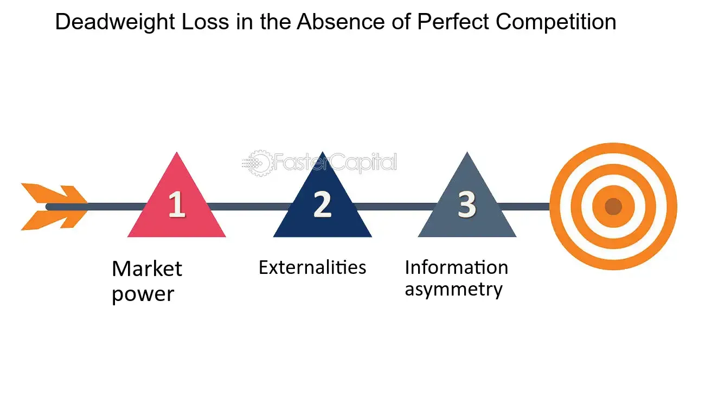

## Table of Contents

## What is a perfectly competitive market?

A perfectly competitive market is a type of market where many buyers and sellers compete with each other. In this market, all the products that are sold are very similar, so no single seller can control the price. Because there are so many sellers, if one tries to charge more than others, buyers will just go to someone else. This keeps the prices fair and the same for everyone.

In a perfectly competitive market, everyone has all the information they need about the products and prices. This means buyers know exactly what they are getting and how much it costs everywhere. Sellers also know what others are charging, so they can set their prices to stay competitive. Because of this, the market works efficiently, and resources are used in the best way possible.

## How do firms in a perfectly competitive market determine their output level?

In a perfectly competitive market, firms decide how much to produce by looking at their costs and the market price. They want to make as much profit as possible, so they keep producing more as long as the price they get for each item is higher than the cost to make one more item. This extra cost to make one more item is called the marginal cost. When the market price is equal to the marginal cost, the firm is at its best output level because making more would cost more than they earn, and making less would mean missing out on profit.

If the market price is higher than the firm's average total cost, which includes all costs like rent, wages, and materials, the firm makes a profit. But if the market price is lower than the average total cost, the firm loses money. In the long run, if firms keep losing money, some will leave the market. This reduces supply, which can push the price up until it covers the average total cost again. On the other hand, if firms are making big profits, new firms will enter the market, increasing supply and pushing the price down until it just covers the average total cost. This way, in the long run, firms in a perfectly competitive market tend to earn just enough to stay in business, but not much more.

## What is the relationship between price and marginal cost in a perfectly competitive market?

In a perfectly competitive market, the price of a product is the same as the marginal cost of making it. This happens because firms can sell as much as they want at the market price, but they will only keep making more if the cost of making one more item is less than or equal to what they get for selling it. So, they produce up to the point where the price equals the marginal cost. If the price was higher than the marginal cost, they would make more to earn more profit. If it was lower, they would make less because it wouldn't be worth it.

This relationship helps the market work efficiently. When the price equals the marginal cost, resources are used in the best way possible. Firms are making just the right amount of the product - not too much and not too little. This balance means that the market is using its resources efficiently, and consumers are getting products at the lowest possible price that still covers the cost of making them.

## Why do firms in a perfectly competitive market have no control over the market price?

In a perfectly competitive market, firms have no control over the market price because there are many buyers and sellers, and all the products are very similar. If one firm tries to charge more than the market price, buyers will just go to another seller who is selling the same thing for less. This means that no single firm can raise its price without losing all its customers. Because there are so many sellers, each one is very small compared to the whole market, so they can't influence the price on their own.

The market price is set by the overall supply and demand in the market. If there are a lot of sellers and a lot of buyers, the price will be where the amount people want to buy matches the amount sellers want to sell. Each firm just has to accept this price because if they try to change it, they will either lose customers or not be able to sell all their products. So, firms in a perfectly competitive market have to take the market price as given and focus on producing at the lowest cost to make a profit.

## How does the entry and exit of firms affect profits in a perfectly competitive market?

In a perfectly competitive market, the entry and exit of firms play a big role in keeping profits in check. When firms in the market are making big profits, it attracts new firms to enter. These new firms start selling the same product, which increases the total supply in the market. With more supply and the same demand, the market price goes down. As the price drops, the profits for all firms start to shrink until they are just enough to cover all the costs of doing business. This means that in the long run, firms can't keep making big profits because new firms keep coming in and pushing the price down.

On the other hand, if firms are losing money, some will decide to leave the market. When firms exit, the total supply of the product goes down. With less supply and the same demand, the market price starts to go up. As the price rises, the remaining firms start to lose less money or even start making small profits again. This process continues until the price is high enough that firms are just breaking even, covering all their costs but not making any extra profit. So, the entry and exit of firms help keep the market balanced, making sure that in the long run, firms earn just enough to stay in business but not much more.

## What is the concept of economic profit and how does it apply to perfectly competitive markets?

Economic profit is the money a business makes after paying all its costs, including the opportunity costs. Opportunity costs are what you give up when you choose to do one thing instead of another. For example, if you use your money to start a business instead of putting it in the bank, the interest you could have earned is an opportunity cost. Economic profit is different from accounting profit, which only looks at the money coming in and going out without considering opportunity costs.

In a perfectly competitive market, firms aim to make as much economic profit as they can. But in the long run, they usually end up making zero economic profit. This happens because if firms are making big profits, new firms will enter the market, increasing supply and lowering the price until profits are just enough to cover all costs, including opportunity costs. If firms are losing money, some will leave the market, reducing supply and raising the price until the remaining firms break even. So, in the long run, firms in a perfectly competitive market earn just enough to keep doing business, but not more than that.

## How do short-run profits and losses lead to long-run equilibrium in a perfectly competitive market?

In a perfectly competitive market, short-run profits and losses help the market move toward long-run equilibrium. If firms are making big profits in the short run, it means the price is higher than the cost of making the product. This attracts new firms to enter the market because they see a chance to make money too. As more firms start selling the product, the total supply goes up. With more supply and the same demand, the price starts to drop. As the price falls, the profits for all firms get smaller until they are just enough to cover all the costs of doing business, including the opportunity costs. This is when the market reaches long-run equilibrium, where firms are making zero economic profit.

On the other hand, if firms are losing money in the short run, it means the price is lower than the cost of making the product. Some firms will decide to leave the market because they can't keep losing money. As firms exit, the total supply of the product goes down. With less supply and the same demand, the price starts to go up. As the price rises, the remaining firms start to lose less money or even start making small profits again. This process continues until the price is high enough that firms are just breaking even, covering all their costs but not making any extra profit. This is also when the market reaches long-run equilibrium, where firms are making zero economic profit.

## What role does the demand curve play in determining profits in a perfectly competitive market?

In a perfectly competitive market, the demand curve is very important for figuring out how much profit a firm can make. The demand curve shows how many people want to buy the product at different prices. In a perfectly competitive market, the demand curve for each firm is a straight, flat line. This is because each firm is so small compared to the whole market that it can sell as much as it wants at the market price. If a firm tries to charge more, no one will buy from them because they can get the same thing cheaper from someone else. So, the price the firm gets for its product is the same as the market price, which is shown by the demand curve.

The demand curve helps firms decide how much to produce to make the most profit. If the market price, which is the same as the demand curve for the firm, is higher than the cost to make one more item (the marginal cost), the firm will keep making more to earn more profit. They will keep doing this until the price equals the marginal cost. If the price is higher than all the costs of making the product (the average total cost), the firm makes a profit. But if the price is lower than the average total cost, the firm loses money. Over time, the demand curve helps the market find a balance where firms are making just enough to stay in business, but not much more.

## Can firms in a perfectly competitive market earn above-normal profits in the long run? Why or why not?

In a perfectly competitive market, firms cannot earn above-normal profits in the long run. This is because if firms are making big profits, it attracts new firms to enter the market. These new firms start selling the same product, which increases the total supply. With more supply and the same demand, the market price goes down. As the price drops, the profits for all firms start to shrink until they are just enough to cover all the costs of doing business, including the opportunity costs. This means that in the long run, firms can't keep making big profits because new firms keep coming in and pushing the price down.

On the other hand, if firms are losing money, some will decide to leave the market. When firms exit, the total supply of the product goes down. With less supply and the same demand, the market price starts to go up. As the price rises, the remaining firms start to lose less money or even start making small profits again. This process continues until the price is high enough that firms are just breaking even, covering all their costs but not making any extra profit. So, the entry and exit of firms help keep the market balanced, making sure that in the long run, firms earn just enough to stay in business but not much more.

## How do market dynamics ensure that firms in a perfectly competitive market operate at zero economic profit in the long run?

In a perfectly competitive market, if firms are making big profits, it attracts new firms to enter the market. These new firms start selling the same product, which increases the total supply. With more supply and the same demand, the market price goes down. As the price drops, the profits for all firms start to shrink until they are just enough to cover all the costs of doing business, including the opportunity costs. This means that in the long run, firms can't keep making big profits because new firms keep coming in and pushing the price down.

On the other hand, if firms are losing money, some will decide to leave the market. When firms exit, the total supply of the product goes down. With less supply and the same demand, the market price starts to go up. As the price rises, the remaining firms start to lose less money or even start making small profits again. This process continues until the price is high enough that firms are just breaking even, covering all their costs but not making any extra profit. So, the entry and exit of firms help keep the market balanced, making sure that in the long run, firms earn just enough to stay in business but not much more.

## What are the implications of zero economic profit for resource allocation in a perfectly competitive market?

When firms in a perfectly competitive market make zero economic profit in the long run, it means they are using resources in the best way possible. Zero economic profit means that firms are just covering all their costs, including the opportunity costs. This tells us that resources are being used where they are most valuable because if they could be used better somewhere else, firms would leave the market and go to that other place. So, the market is working efficiently, and resources are going to where they can do the most good.

This also means that the market is in balance. If firms were making big profits, it would mean that resources could be used better in that market, and more firms would come in. But because they are making zero economic profit, it shows that the market has found the right level of production. No more firms need to enter, and no firms need to leave. This balance helps make sure that the economy is using its resources well, and everyone is getting what they need at the lowest possible cost.

## How do external factors like technological changes or shifts in consumer preferences impact the absence of profits in perfectly competitive markets?

In a perfectly competitive market, external factors like technological changes or shifts in consumer preferences can shake things up. If a new technology comes along that makes it cheaper to make a product, firms that use this technology can produce at a lower cost. This might let them make more profit for a while. But soon, other firms will start using the new technology too, or new firms will enter the market with it. This increases the supply of the product, which pushes the price down until everyone is back to making zero economic profit. So, even though technology can change things, the market still ends up balanced in the long run.

Shifts in consumer preferences can also affect the market. If people start wanting a different kind of product, the demand for the old product goes down, and the price drops. Firms making the old product might start losing money, and some will leave the market. This reduces the supply of the old product, which can bring the price back up until the remaining firms are just breaking even. On the other hand, if demand for a new product goes up, firms making that product might make big profits at first. But this will attract new firms to start making the new product, increasing supply and bringing the price down until profits are back to zero. So, even big changes in what people want can't stop the market from finding its balance in the long run.

## What is Understanding Perfect Competition?

Perfect competition is an idealized market structure that is pivotal in economic theory. It is defined by several key characteristics, notably the presence of a large number of firms, each contributing insignificantly to the overall market supply. This abundance of firms ensures that no single entity can influence market prices, necessitating that all firms act as price takers. In this scenario, each firm accepts the market price as a given, determined by the aggregate forces of supply and demand.

In a perfectly competitive market, products offered are homogeneous, meaning they are identical or perceived as identical by consumers. This attribute ensures that consumer choice is determined solely by price rather than differing in product features, which further cements the firms' roles as price takers. Additionally, perfect competition assumes perfect information, where all participants have full knowledge of market conditions, prices, and product quality. 

One of the defining features of perfect competition is the ease of entry and [exit](/wiki/exit-strategy), with no barriers that prevent new firms from entering the market or existing firms from leaving. This fluidity ensures that any instance of abnormal profits attracts new entrants, which increases supply and subsequently drives down prices until only normal profits remain. Conversely, firms may exit the market if they are unable to cover their costs, which decreases supply and helps stabilize prices.

Mathematically, the concept can be expressed by the equilibrium condition where marginal cost (MC) equals marginal revenue (MR) equals price (P), or:

$$
MC = MR = P
$$

This equation illustrates that in a perfectly competitive market, firms produce at a level where their MC curve intersects the market-determined price, maximizing efficiency and allocating resources optimally.

Although perfect competition rarely exists in a pure form in the real world, it serves as a benchmark to evaluate how different market structures perform relative to this ideal. Economists utilize this model to understand deviations in real-world markets and to inform regulatory and policy decisions aimed at enhancing market efficiency. The theoretical framework of perfect competition has profound implications, influencing microeconomic policies and providing insights into the dynamics of supply, demand, and pricing.

## How does Economic Theory relate to Market Profits?

The distinction between normal profit and economic profit is foundational within economic theory, especially in understanding market structures like perfect competition. Normal profit refers to the minimum earnings required for a firm to stay operational in a competitive industry. It is regarded as an implicit cost, aligning with the opportunity cost of capital. This means that the resources employed by the firm are being efficiently used, as they can't earn a higher return elsewhere. On the other hand, economic profit is the surplus a firm earns over and above normal profit. This profit arises when total revenue exceeds the sum of both explicit and implicit costs, indicating a higher-than-expected return.

In a perfectly competitive market, economic profits are typically transitory. The theory posits that the presence of economic profits attracts new firms into the market due to the lack of barriers to entry. As the number of firms increases, the supply of the product also rises, which in turn drives down the price. This process continues until economic profits are eroded, leaving firms with only normal profits. This self-regulating mechanism ensures that, over time, resources are allocated efficiently within the economy.

To better quantify these concepts, consider the following economic profit formula:

$$
\text{Economic Profit} = \text{Total Revenue} - (\text{Explicit Costs} + \text{Implicit Costs})
$$

The dynamics of normal and economic profit reveal much about market behavior and structure. In monopolistic or oligopolistic markets, economic profits can persist longer due to barriers that prevent new entrants from easily joining the market. Contrastingly, the scenario is fundamentally different in monopolistic competition or oligopoly, where economic profits might sustain longer due to differentiated products and strategic behaviours.

Understanding these profits aids in identifying potential investment opportunities and competitive strategies for firms within different market structures. Firms in markets approaching perfect competition must innovate or find efficiencies to maintain a competitive edge, as reliance on sustained economic profits would be misguided.

These concepts not only help delineate how firms perform over time in competitive environments but also contribute to broader economic analyses, showing how industries adjust and resources are distributed across an economy. They assist policymakers and economists in predicting shifts within markets, facilitating informed decision-making for regulatory interventions and economic forecasting.

## References & Further Reading

[1]: Stiglitz, J.E. (1989). ["Imperfect Information in the Product Market"](https://www.sciencedirect.com/science/article/pii/S1573448X89010162). Oxford Economic Papers.

[2]: Friedman, M. (1953). ["Essays in Positive Economics."](https://en.wikipedia.org/wiki/Essays_in_Positive_Economics) University of Chicago Press.

[3]: Pindyck, R.S. & Rubinfeld, D.L. (2017). ["Microeconomics."](https://archive.org/details/microeconomics0007pind) Pearson Education.

[4]: Hasbrouck, J. (1991). ["Measuring the Information Content of Stock Trades."](https://www.jstor.org/stable/2328693) The Review of Financial Studies.

[5]: Gomber, P., Arndt, B., Lutat, M., & Uhle, T. (2011). ["High-Frequency Trading."](https://www.researchgate.net/publication/271631628_High-Frequency-Trading) Springer, Frankfurt am Main. 

[6]: Financial Stability Board. (2017). ["Artificial Intelligence and Machine Learning in Financial Services."](https://www.fsb.org/2017/11/artificial-intelligence-and-machine-learning-in-financial-service/) 

[7]: Harris, L. (2003). ["Trading & Exchanges: Market Microstructure for Practitioners."](https://academic.oup.com/book/52292) Oxford University Press.