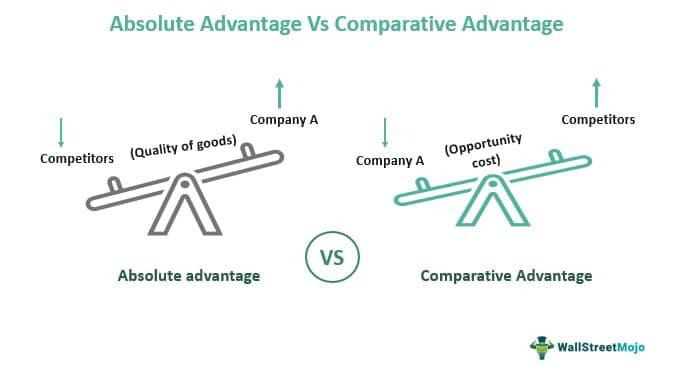

The concepts of comparative advantage and absolute advantage are cornerstones of economic theory. These principles, introduced by Adam Smith and further developed by David Ricardo, have been instrumental in explaining the motivations for international trade. Absolute advantage refers to the ability of an individual, firm, or country to produce more of a good or service with the same amount of resources, thereby demonstrating greater productivity or efficiency. On the other hand, comparative advantage emphasizes the relative efficiency in producing goods, suggesting that even if one nation does not have an absolute advantage, it can benefit from trade by specializing in goods that it can produce at a lower opportunity cost compared to others.

The theories of comparative and absolute advantage not only lay the groundwork for why and how nations trade but also provide a framework for understanding the benefits of specialization. In a globalized economy, where nations vary in resource endowments and technological capabilities, these concepts help explain the patterns of trade and allocation of resources across borders. 



With the advent of algorithmic trading, the relevance of these economic theories has grown significantly. Algorithmic trading involves using sophisticated mathematical models and software to execute trades at speeds and frequencies that are beyond the capabilities of human traders. By leveraging insights from comparative and absolute advantage, traders and economists can design algorithms that optimize trading strategies, capitalize on market inefficiencies, and realize lucrative opportunities in real-time.

This article will explore how the foundational ideas of comparative and absolute advantage are integrated into algorithmic trading. By understanding these economic theories, traders can program algorithms to identify and exploit advantageous trade opportunities, thereby enhancing the efficiency of global markets.

## Table of Contents

## Understanding Absolute Advantage

Absolute advantage is a concept in economic theory that pertains to the capability of a country or entity to produce more of a specific good using fewer resources compared to another country or entity. This advantage emphasizes efficiency in production, offering a straightforward measurement of productive capability. It is particularly observable in industries such as technology and manufacturing, where innovation and process improvements facilitate higher output with reduced input.

To illustrate, consider two countries, Country A and Country B, both producing cars and wheat. If Country A can produce 10 cars using the same amount of resources that Country B would use to produce 7 cars, then Country A holds an absolute advantage in car production. This notion extends beyond simple output, reflecting technological advancements and resource management strategies that enhance production efficiency.

The significance of absolute advantage in global trade arises from its relationship with resource distribution and productivity levels. When countries focus on goods for which they have an absolute advantage, they can maximize output and economic gains, driving international competitiveness and economic growth.

Despite its importance, absolute advantage alone may not determine trade patterns as profoundly as other factors, such as comparative advantage, due to the role of opportunity cost. Opportunity cost refers to the benefits forgone when choosing one option over another and is central to understanding comparative advantage. Nevertheless, the existence of absolute advantage remains a vital component of economic analysis and strategy, laying the foundation for nations to harness their resources effectively and engage in mutually beneficial trade.

## Exploring Comparative Advantage

Comparative advantage is a key concept in economics which emphasizes the relative efficiency of producing goods, grounded in the notion of opportunity cost. It explains how nations or entities can benefit from trade by focusing on the production of goods for which they have the lowest opportunity cost, even if they do not hold an absolute advantage. This theory, first articulated by David Ricardo in the early 19th century, plays a significant role in global trade patterns and specialization strategies.

Opportunity cost is the cost of forgoing the next best alternative when making a decision. In terms of comparative advantage, it means evaluating which goods or services a country can produce at a lower relative opportunity cost compared to others. For example, if Country A can produce either 10 units of wine or 5 units of cloth in a day, while Country B can produce 6 units of wine or 4 units of cloth, we calculate the opportunity costs to determine their comparative advantages. The opportunity cost for Country A to produce wine is 0.5 units of cloth per unit of wine (5 cloths / 10 wines), while for Country B it is 0.67 units of cloth per unit of wine (4 cloths / 6 wines). Therefore, Country A has a comparative advantage in producing wine, and Country B has a comparative advantage in producing cloth, assuming that the nations trade based on these efficiencies.

The comparative advantage principle suggests that countries should allocate resources and specialize in producing goods where they have the lowest opportunity cost, thereby optimizing both production and trade benefits. Python can simulate how these calculations are made:

```python
def comparative_advantage(country_a, country_b):
    # (production of wine, production of cloth)
    wine_a, cloth_a = country_a
    wine_b, cloth_b = country_b

    opportunity_cost_a = cloth_a / wine_a
    opportunity_cost_b = cloth_b / wine_b

    if opportunity_cost_a < opportunity_cost_b:
        return "Country A has a comparative advantage in producing wine"
    else:
        return "Country B has a comparative advantage in producing wine"

country_a = (10, 5)  # Country A can produce 10 units of wine or 5 units of cloth
country_b = (6, 4)   # Country B can produce 6 units of wine or 4 units of cloth

print(comparative_advantage(country_a, country_b))
```

Increased specialization and trade guided by comparative advantage enhance global market efficiency by ensuring optimal resource allocation. It enables countries to focus on industries where they are relatively more efficient, leading to an increase in overall economic prosperity. This theoretical framework remains central to understanding why international trade can be beneficial even among nations that do not necessarily have an absolute efficiency in producing goods. As such, comparative advantage is crucial in shaping national economic policies and determining the international trade dynamics where countries seek to maximize their production capabilities by leveraging their unique relative efficiencies.

## Economic Theory and Trade Dynamics

Economic theory suggests that the principles of absolute and comparative advantage are foundational in driving international trade and specialization. Absolute advantage describes a situation where a country or economic entity can produce a certain good more efficiently, using fewer resources than its counterparts. When a nation possesses an absolute advantage, it can lead to increased productivity and potential trade surplus in that specific sector. However, trade dynamics are not solely dictated by absolute efficiencies, but also by comparative advantage. This theory, introduced by David Ricardo, posits that even if a nation does not have the best absolute efficiencies, it can still benefit from trade by specializing in goods where it has the lowest opportunity cost.

The interaction between these advantages accounts for intricate trade flows and the benefits derived from specialization across nations. Through the lens of comparative advantage, countries are incentivized to focus on producing goods that they can create relatively more efficiently, given their resource constraints, thereby increasing overall economic welfare. Consequently, two countries can mutually benefit from trade even if one is absolutely more efficient in the production of all goods.

Real-world trade dynamics are not solely the result of these economic theories. Factors such as tariffs, quotas, and technological advancements continuously modulate the way these theories are applied. For instance, the imposition of tariffs can alter the comparative advantage by artificially inflating the prices of imported goods, potentially reversing the incentives for efficient production and trade. Quotas, on the other hand, limit the quantity of goods that can be traded, thus impacting how nations choose to allocate their production resources.

Technological advancements further complicate and enrich the landscape of international trade. As technology evolves, it can shift comparative advantages swiftly by altering production efficiencies. A country investing in new technologies may gain a temporary edge in producing certain goods more efficiently, thereby affecting its economic interactions and trade policies.

The mathematical representation of these trade theories can be expressed through equations comparing opportunity costs. Consider two countries, A and B, producing goods X and Y. If country A can produce one unit of X with fewer sacrificed units of Y than country B, country A has the comparative advantage in producing X. The essential equation would be: 

$$
\frac{OC_{A}(X)}{OC_{A}(Y)} < \frac{OC_{B}(X)}{OC_{B}(Y)}
$$

where $OC$ denotes the opportunity cost. The comparison of such opportunity costs guides nations in deciding which goods to specialize in and trade.

Moreover, the programming of these theories into [algorithmic trading](/wiki/algorithmic-trading) models often involves the integration of econometric analyses and simulations. A Python snippet to calculate opportunity costs might look like this:

```python
def opportunity_cost(production_X, production_Y):
    return production_Y / production_X

country_A_cost_X = opportunity_cost(100, 200) # Example production capabilities
country_B_cost_X = opportunity_cost(150, 100)

if country_A_cost_X < country_B_cost_X:
    print("Country A should specialize in good X")
else:
    print("Country B should specialize in good X")
```

Such computational techniques underscore the relevance of economic theories in today’s sophisticated trading environments, where algorithms leverage global trade data to optimize resource allocation and enhance market efficiencies.

## Algorithmic Trading and Economic Theories

Algorithmic trading leverages economic theories to optimize trade execution and maximize market opportunities. Both comparative and absolute advantages are pivotal in crafting algorithms that efficiently navigate the complexities of financial markets. By understanding these economic principles, traders and programmers can design systems that identify and act on advantageous trading opportunities.

Comparative advantage, which involves producing goods at a lower opportunity cost, translates into algorithms that assess various financial instruments to determine where investments yield the highest relative returns. These algorithms analyze markets to detect scenarios where a certain asset's trade-off relative to others presents profit opportunities. This analysis factors in not only the asset's inherent qualities but also broader market trends and price dynamics.

Similarly, absolute advantage, which is the ability to produce more or better products with the same resources, drives algorithmic strategies that seek outright efficiency. An algorithm might capitalize on a particular market's inefficiencies, ensuring that trades are executed faster and at better prices than competitors.

Algorithmic trading strategies are often structured to incorporate both comparative and absolute advantages through advanced data analysis and [machine learning](/wiki/machine-learning) algorithms. These strategies can parse vast datasets to uncover patterns and predict future price movements. Python, the preferred language for many trading algorithms, can efficiently process this data and automate complex trading strategies. For instance, an algorithm might be structured to predict price movements using a simple linear regression model:

```python
import numpy as np
from sklearn.linear_model import LinearRegression

# Example: predicting price based on past data
X = np.array([[1], [2], [3], [4], [5]])  # time periods
y = np.array([10, 12, 17, 20, 24])  # asset prices

model = LinearRegression().fit(X, y)
predicted_price = model.predict([[6]])

print("Predicted price for the next period:", predicted_price)
```

This code illustrates how traders can model price tendencies, relying on past data to anticipate future value changes and execute trades optimally. It reflects how algorithmic trading utilizes economic theories to both identify and exploit market inefficiencies, achieving economic benefits through strategic execution.

In summary, algorithms rooted in the principles of comparative and absolute advantage guide the trading platforms towards increased market efficiency. By continuously adapting to economic conditions, these technologies not only enhance decision-making but also contribute to more agile and responsive market dynamics.

## Impact on Global Trade and Market Efficiency

The integration of algorithmic trading with the concepts of comparative and absolute advantages has a profound influence on global trade and market efficiency. By leveraging these economic theories, algorithmic trading platforms are able to optimize resource allocation, effectively reshaping global trade patterns.

Algorithms are designed to identify and exploit differences in market efficiencies, which are often guided by the principles of absolute and comparative advantage. Absolute advantage pertains to a country's ability to produce goods more efficiently than others, while comparative advantage focuses on producing goods at a lower opportunity cost. When applied to algorithmic trading, these concepts enable algorithms to make data-driven decisions about when and where to allocate resources to maximize returns.

One of the key impacts of algorithmic trading is the enhancement of market efficiency. Algorithms reduce the time and costs associated with trading, leading to increased [liquidity](/wiki/liquidity-risk-premium) across markets. Liquidity refers to the ease with which assets can be bought or sold in the market without causing significant price changes. Higher liquidity often results in narrower bid-ask spreads, making markets more efficient. The formula for the bid-ask spread, $\text{Spread} = \text{Ask Price} - \text{Bid Price}$, can be minimized as algorithms quickly adjust to new information and execute trades at optimal prices.

Additionally, algorithmic trading can reduce transaction costs. By executing trades rapidly and efficiently, algorithms lower the indirect costs of trading, such as market impact costs, and improve the precision of trade execution. This efficiency is further amplified through the use of high-frequency trading ([HFT](/wiki/high-frequency-trading-strategies)), which allows for the execution of a large number of orders at extremely high speeds.

Algorithmic trading also supports the globalization of financial markets. With the ability to process vast amounts of global market data, algorithms gauge the comparative and absolute advantages of different markets, enabling cross-border trading strategies that capitalize on global disparities in production capabilities and resource distribution.

Python code used in algorithmic trading often encapsulates these strategies. For instance, the use of libraries such as `numpy`, `pandas`, and `scikit-learn` allows for the implementation of complex algorithms that can handle the multivariate data involved in evaluating comparative advantages:

```python
import numpy as np
import pandas as pd
from sklearn.linear_model import LinearRegression

# Sample data for global market analysis
data = pd.DataFrame({
    'country_A': [140, 180, 210],
    'country_B': [120, 130, 125],
    'opportunity_cost': [0.8, 0.9, 0.85]
})

# Linear regression to model the relationship
X = data[['country_A', 'opportunity_cost']]
y = data['country_B']

model = LinearRegression().fit(X, y)
predicted_advantage = model.predict(np.array([[200, 0.88]]))

print(f"Predicted comparative advantage for country_B: {predicted_advantage[0]}")
```

In summary, the application of algorithmic trading aligned with the economic principles of comparative and absolute advantage enhances global market efficiency by optimizing resource allocation, increasing liquidity, and reducing transaction costs. These improvements not only facilitate smoother trading operations but also support more interconnected and responsive global markets.

## Conclusion

Comparative and absolute advantages continue to be foundational concepts for understanding the dynamics of global economic interactions. They are central to the decision-making processes of countries and businesses regarding the production and trade of goods and services. These economic principles underpin the rationale for specialization and trade, facilitating the optimization of resources on a global scale.

In the context of algorithmic trading, these theories merge with technology to create sophisticated strategies aimed at enhancing market efficiencies. Algorithms leverage the insights derived from comparative and absolute advantages to analyze market data and execute trades at opportune moments, thereby capitalizing on inefficiencies and trade opportunities. This integration leads to more liquid markets and often results in reduced transaction costs, as algorithms efficiently navigate and allocate resources within the financial markets.

Looking forward, it is imperative for traders and economists to continuously integrate these classic economic theories with modern analytical tools and technologies. By doing so, they can optimize economic benefits and adapt to the evolving landscape of global markets. The future of global trade and finance will likely be driven by the synergy between enduring economic theories and cutting-edge technological advancements, providing a robust framework for enhancing market functionality and economic growth.

## FAQs

How do absolute and comparative advantages differ?

Absolute and comparative advantages are both concepts within economic theory that help explain the dynamics of trade. Absolute advantage relates to the capability of an entity, such as a country, to produce more of a good or service with fewer resources than another entity. It essentially points to efficiency in production. For instance, if Country A can produce 10 units of a good using 5 resources, whereas Country B can only produce 8 units using the same resources, then Country A has an absolute advantage.

On the other hand, comparative advantage considers the opportunity cost of production. Even if a country does not have an absolute advantage, it can still have a comparative advantage by specializing in goods that it can produce at a lower opportunity cost compared to others. For example, using opportunity cost matrices, if Country A can produce either 10 units of cloth or 20 units of wheat and Country B can produce either 15 units of cloth or 30 units of wheat, Country A should specialize in cloth and Country B in wheat, optimizing trade benefits between them.

Why is comparative advantage considered more significant in modern economics?

Comparative advantage is deemed more significant because it provides a basis for mutually beneficial trade even when one country is less efficient in all goods. This principle, based on opportunity costs, facilitates specialization and trade efficiency. In modern economics, it underscores the benefits of trade liberalization and globalization, supporting the argument that countries can achieve better economic outcomes not by producing all goods independently (even if they have absolute advantages in multiple sectors) but by specializing according to their comparative advantages.

How do these economic theories impact algorithmic trading strategies?

Algorithmic trading utilizes the principles of absolute and comparative advantages by designing strategies that detect and exploit market efficiencies and opportunities. Algorithms analyze vast datasets for trading signals that indicate when a particular security, currency, or commodity might be under or overvalued, relative to others. Applying comparative advantage, these algorithms might be programmed to assess opportunity costs and resource differentials in trading, optimizing decisions based on real-time data.

For example, a Python script for an algorithmic trading model might utilize linear regression or other statistical methods to determine the expected returns of different trading assets:

```python
import numpy as np
from sklearn.linear_model import LinearRegression

# Example datasets: historical trading data for two assets
X = np.array([[1, 3], [2, 6], [3, 9], [4, 12], [5, 15]])
y = np.array([5, 9, 13, 17, 21])

# Creating a linear regression model
model = LinearRegression()
model.fit(X, y)

# Predictive trading decision based on comparative advantage
predicted_returns = model.predict(np.array([[6, 18]]))
print("Predicted Returns:", predicted_returns)
```

This ability to quickly identify and act on market differences enhances liquidity and efficiency in markets, embodying the essence of economic theories in technological frameworks.

## References & Further Reading

[1]: Ricardo, D. (1817). ["On the Principles of Political Economy and Taxation"](https://www.econlib.org/library/Ricardo/ricP.html). John Murray.

[2]: Smith, A. (1776). ["An Inquiry into the Nature and Causes of the Wealth of Nations"](https://archive.org/details/inquiryintonatur01smit_0/). W. Strahan and T. Cadell.

[3]: Grossman, G., & Rogoff, K. (Eds.). (1995). ["Handbook of International Economics, Vol. 3"](https://www.sciencedirect.com/handbook/handbook-of-international-economics/vol/3/suppl/C). Elsevier.

[4]: Mankiw, N. G. (2018). ["Principles of Economics"](https://ngl.cengage.com/products/9781337292603). Cengage Learning.

[5]: Kolb, R. A., & Overdahl, J. A. (2007). ["Futures, Options, and Swaps"](https://www.amazon.com/Futures-Options-Swaps-Robert-Kolb/dp/1405150491). Wiley-Blackwell.

[6]: Jones, C. M. (2017). ["Algorithmic and High-Frequency Trading"](https://api.pageplace.de/preview/DT0400.9781316455579_A25606943/preview-9781316455579_A25606943.pdf). Columbia Business School Research Paper No. 13-11.

[7]: Varian, H. R. (2010). ["Intermediate Microeconomics: A Modern Approach"](https://archive.org/details/hal-r.-varian-intermediate-microeconomics-a-modern-approach-8th-edition-w.-w.-norton-co.-2010). W.W. Norton & Company.

[8]: Lopez de Prado, M. (2018). ["Advances in Financial Machine Learning"](https://www.amazon.com/Advances-Financial-Machine-Learning-Marcos/dp/1119482089). Wiley.