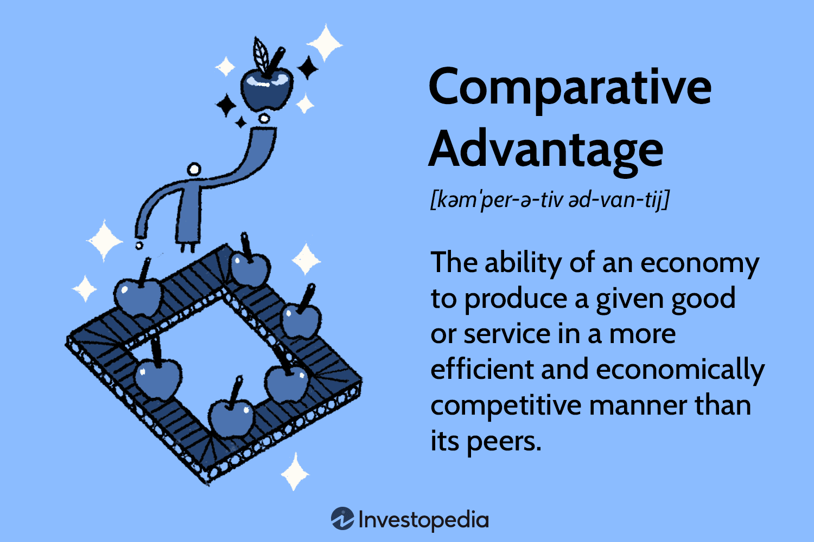

## Table of Contents

## What is the basic definition of absolute advantage?

Absolute advantage is a concept in economics that describes when one country can produce a good or service more efficiently than another country. This means they can use fewer resources, like time, labor, or materials, to make the same amount of the product. For example, if Country A can produce 10 cars using fewer resources than Country B, Country A has an absolute advantage in car production.

This idea is important because it helps countries decide what goods they should produce and trade. If a country has an absolute advantage in making a certain product, it makes sense for them to focus on producing that product and then trade with other countries for goods they are less efficient at making. This can lead to more efficient global production and can benefit all countries involved through trade.

## What is the basic definition of comparative advantage?

Comparative advantage is a concept in economics that explains why countries should trade with each other even if one country is better at making everything. It's about being more efficient in producing one thing compared to another. A country has a comparative advantage in producing a good if it can produce that good at a lower opportunity cost than another country. Opportunity cost is what you give up to produce something else. For example, if Country A can produce both cars and computers, but it's better at making computers, it should focus on computers and trade with Country B for cars, even if Country B is not as good at making cars.

This idea helps countries decide what to produce and trade. If a country focuses on what it's comparatively better at, it can produce more overall and trade for the things it's not as good at. This makes the whole world more efficient because countries are specializing in what they do best. In the end, everyone can have more goods and services than if each country tried to make everything on its own.

## How does absolute advantage differ from comparative advantage?

Absolute advantage and comparative advantage are two important ideas in economics that help countries decide what to make and trade. Absolute advantage is when one country can make a product using fewer resources than another country. For example, if Country A can make 10 cars with less time and materials than Country B, Country A has an absolute advantage in making cars. This means Country A is simply better at making cars than Country B.

Comparative advantage is different because it's about what a country gives up to make something else. It's not just about being the best at making something, but about being better at making one thing compared to another. A country has a comparative advantage in a product if it can make that product at a lower opportunity cost than another country. For example, if Country A can make both cars and computers, but it's much better at making computers, it should focus on computers and trade with Country B for cars, even if Country B isn't as good at making cars. This way, both countries can benefit from trade by focusing on what they do best.

In short, absolute advantage looks at who can make something more efficiently, while comparative advantage looks at what a country should make based on what it gives up. Both ideas help countries decide what to produce and trade, but they focus on different aspects of efficiency and opportunity cost.

## Can you provide a simple example of absolute advantage in trade?

Imagine there are two countries, Country A and Country B. Country A can make 100 shirts using the same amount of resources that Country B uses to make only 50 shirts. This means Country A has an absolute advantage in making shirts because it can make more shirts with the same resources.

Because of this advantage, Country A should focus on making shirts. It can make a lot of shirts and then trade some of them with Country B for other things that Country B is better at making. This way, both countries can benefit from trade. Country A gets more of what it needs from Country B, and Country B gets more shirts than it could make on its own.

## Can you provide a simple example of comparative advantage in trade?

Imagine there are two countries, Country A and Country B. Country A can make 10 computers or 5 cars with the same amount of resources. Country B can make 2 computers or 4 cars with the same amount of resources. Even though Country A is better at making both computers and cars, it has a comparative advantage in making computers because it gives up fewer cars to make them. Country B has a comparative advantage in making cars because it gives up fewer computers to make them.

Country A should focus on making computers because it's better at making computers compared to cars. Country B should focus on making cars because it's better at making cars compared to computers. They can then trade with each other. Country A can trade some of its computers to Country B in exchange for cars. This way, both countries can have more computers and cars than if they tried to make everything themselves. By focusing on what they do best and trading, both countries benefit.

## How do countries determine which goods to specialize in based on these concepts?

Countries use the ideas of absolute and comparative advantage to decide what goods to make and trade. Absolute advantage is when a country can make a product using fewer resources than another country. If a country is really good at making something, like Country A being able to make more shirts than Country B with the same resources, it should focus on making that product. This way, the country can make a lot of that product and trade it with other countries for things it's not as good at making.

Comparative advantage is a bit different. It's about what a country gives up to make something else. Even if a country is good at making many things, it should focus on what it's best at compared to other things. For example, if Country A can make both computers and cars but is much better at making computers, it should make computers and trade with Country B for cars, even if Country B isn't as good at making cars. By focusing on what they do best and trading, both countries can have more of everything than if they tried to make everything themselves.

## What are the limitations of using absolute advantage in international trade?

Using absolute advantage to decide what to make and trade can be helpful, but it has some problems. One big problem is that it only looks at who can make something using fewer resources. It doesn't think about what a country gives up to make that thing. For example, if a country is good at making both cars and computers, but it's much better at making computers, it might still focus on cars if it only looks at absolute advantage. This can make the country miss out on better trade deals.

Another problem is that absolute advantage doesn't always show the full picture of trade. Sometimes, a country might not be the best at making anything, but it can still benefit from trade by focusing on what it's less bad at. If a country only looks at absolute advantage, it might think it has nothing to trade and miss out on chances to grow its economy. So, while absolute advantage is a good start, it's not enough to make the best trade decisions.

## How does comparative advantage lead to gains from trade?

Comparative advantage helps countries make more of what they're good at and trade for things they're not as good at. Imagine Country A is really good at making computers but not so great at making cars. Country B is the opposite - it's better at making cars than computers. If both countries focus on what they do best, Country A can make a lot of computers and Country B can make a lot of cars. Then, they can trade with each other. Country A can give some of its computers to Country B in exchange for cars. This way, both countries end up with more computers and cars than if they tried to make everything themselves.

By focusing on what they do best and trading, both countries can have more stuff. This is because they're using their resources in the best way possible. When countries trade based on comparative advantage, they're not just making more of what they're good at; they're also making the whole world more efficient. Everyone can have more goods and services, which makes life better for people in both countries. So, comparative advantage is a big reason why trade can help everyone.

## What role do opportunity costs play in comparative advantage?

Opportunity costs are really important when we talk about comparative advantage. They help us figure out what a country should make and trade. Opportunity cost is what you give up to do something else. For example, if Country A can make either 10 computers or 5 cars with the same resources, the opportunity cost of making 10 computers is 5 cars. If Country B can make either 2 computers or 4 cars with the same resources, the opportunity cost of making 2 computers is 4 cars. By looking at these opportunity costs, we can see that Country A gives up fewer cars to make computers than Country B does. So, Country A has a lower opportunity cost for making computers and should focus on that.

When countries use opportunity costs to decide what to make, they can make more of what they're good at and trade for the rest. This makes the whole world more efficient. In our example, Country A should make computers and trade them with Country B for cars. Country B should make cars and trade them with Country A for computers. By doing this, both countries end up with more computers and cars than if they tried to make everything themselves. So, understanding opportunity costs helps countries use their resources in the best way and makes trade better for everyone.

## How have economists like David Ricardo contributed to the theory of comparative advantage?

David Ricardo was a famous economist who came up with the idea of comparative advantage in the early 1800s. He explained it in his book called "On the Principles of Political Economy and Taxation." Before Ricardo, people thought that countries should only trade if they were better at making something than other countries. But Ricardo showed that even if one country is better at making everything, it still makes sense to trade. He used a simple example with two countries, England and Portugal, making wine and cloth. He showed that if each country focused on what it was better at compared to the other thing it could make, both countries could have more wine and cloth by trading.

Ricardo's idea changed how people thought about trade. He made it clear that it's not just about being the best at something, but about what you give up to make it. This idea of opportunity cost is a big part of comparative advantage. When countries focus on what they're good at compared to other things they could make, they can make more of that thing and trade for the rest. This makes the whole world more efficient and helps everyone have more stuff. Ricardo's work is still important today because it helps countries decide what to make and trade to make life better for their people.

## Can absolute and comparative advantage coexist in the same economy? How?

Yes, absolute and comparative advantage can both be part of the same economy. Imagine two countries, Country A and Country B. Country A can make 100 shirts or 50 computers with the same resources, while Country B can make 50 shirts or 25 computers with the same resources. Country A has an absolute advantage in making both shirts and computers because it can make more of each with the same resources. But when we look at what each country gives up to make these things, we see something different. Country A gives up 2 shirts to make 1 computer, while Country B gives up 2 shirts to make 1 computer too. So, both countries have the same opportunity cost for making computers, but Country A still has an absolute advantage in making both.

Even though Country A has an absolute advantage in making both shirts and computers, it should focus on what it's better at compared to the other thing it can make. In this case, Country A should make computers because it's better at making computers compared to shirts. Country B should make shirts because it's better at making shirts compared to computers. By focusing on what they do best compared to other things, both countries can make more of what they're good at and trade for the rest. This way, they can both have more shirts and computers than if they tried to make everything themselves. So, even though absolute advantage and comparative advantage are different ideas, they can work together to help countries decide what to make and trade.

## How do modern trade theories expand on the concepts of absolute and comparative advantage?

Modern trade theories build on the ideas of absolute and comparative advantage by looking at more things that affect trade. They think about things like how much it costs to move goods from one place to another, how technology changes what countries can make, and how big companies can affect trade. These theories also look at how countries can work together to make things, like when parts of a car are made in different countries and then put together. This is called global value chains. By thinking about all these things, modern trade theories help us understand why countries trade the way they do and how they can do it better.

Another way modern trade theories expand on absolute and comparative advantage is by looking at how people and companies make choices. They think about how people might want different things in different countries, and how companies might decide to make things in certain places because of things like taxes or rules. These theories also look at how countries can help each other grow by sharing knowledge and technology. By looking at all these different parts of trade, modern theories give us a fuller picture of how trade works and how it can help everyone have a better life.

## What is the relationship between Economic Theory and Trade Dynamics?

Economic theory suggests that the principles of absolute and comparative advantage are foundational in driving international trade and specialization. Absolute advantage describes a situation where a country or economic entity can produce a certain good more efficiently, using fewer resources than its counterparts. When a nation possesses an absolute advantage, it can lead to increased productivity and potential trade surplus in that specific sector. However, trade dynamics are not solely dictated by absolute efficiencies, but also by comparative advantage. This theory, introduced by David Ricardo, posits that even if a nation does not have the best absolute efficiencies, it can still benefit from trade by specializing in goods where it has the lowest opportunity cost.

The interaction between these advantages accounts for intricate trade flows and the benefits derived from specialization across nations. Through the lens of comparative advantage, countries are incentivized to focus on producing goods that they can create relatively more efficiently, given their resource constraints, thereby increasing overall economic welfare. Consequently, two countries can mutually benefit from trade even if one is absolutely more efficient in the production of all goods.

Real-world trade dynamics are not solely the result of these economic theories. Factors such as tariffs, quotas, and technological advancements continuously modulate the way these theories are applied. For instance, the imposition of tariffs can alter the comparative advantage by artificially inflating the prices of imported goods, potentially reversing the incentives for efficient production and trade. Quotas, on the other hand, limit the quantity of goods that can be traded, thus impacting how nations choose to allocate their production resources.

Technological advancements further complicate and enrich the landscape of international trade. As technology evolves, it can shift comparative advantages swiftly by altering production efficiencies. A country investing in new technologies may gain a temporary edge in producing certain goods more efficiently, thereby affecting its economic interactions and trade policies.

The mathematical representation of these trade theories can be expressed through equations comparing opportunity costs. Consider two countries, A and B, producing goods X and Y. If country A can produce one unit of X with fewer sacrificed units of Y than country B, country A has the comparative advantage in producing X. The essential equation would be: 

$$
\frac{OC_{A}(X)}{OC_{A}(Y)} < \frac{OC_{B}(X)}{OC_{B}(Y)}
$$

where $OC$ denotes the opportunity cost. The comparison of such opportunity costs guides nations in deciding which goods to specialize in and trade.

Moreover, the programming of these theories into [algorithmic trading](/wiki/algorithmic-trading) models often involves the integration of econometric analyses and simulations. A Python snippet to calculate opportunity costs might look like this:

```python
def opportunity_cost(production_X, production_Y):
    return production_Y / production_X

country_A_cost_X = opportunity_cost(100, 200) # Example production capabilities
country_B_cost_X = opportunity_cost(150, 100)

if country_A_cost_X < country_B_cost_X:
    print("Country A should specialize in good X")
else:
    print("Country B should specialize in good X")
```

Such computational techniques underscore the relevance of economic theories in today’s sophisticated trading environments, where algorithms leverage global trade data to optimize resource allocation and enhance market efficiencies.

## References & Further Reading

[1]: Ricardo, D. (1817). ["On the Principles of Political Economy and Taxation"](https://www.econlib.org/library/Ricardo/ricP.html). John Murray.

[2]: Smith, A. (1776). ["An Inquiry into the Nature and Causes of the Wealth of Nations"](https://archive.org/details/inquiryintonatur01smit_0/). W. Strahan and T. Cadell.

[3]: Grossman, G., & Rogoff, K. (Eds.). (1995). ["Handbook of International Economics, Vol. 3"](https://www.sciencedirect.com/handbook/handbook-of-international-economics/vol/3/suppl/C). Elsevier.

[4]: Mankiw, N. G. (2018). ["Principles of Economics"](https://ngl.cengage.com/products/9781337292603). Cengage Learning.

[5]: Kolb, R. A., & Overdahl, J. A. (2007). ["Futures, Options, and Swaps"](https://www.amazon.com/Futures-Options-Swaps-Robert-Kolb/dp/1405150491). Wiley-Blackwell.

[6]: Jones, C. M. (2017). ["Algorithmic and High-Frequency Trading"](https://api.pageplace.de/preview/DT0400.9781316455579_A25606943/preview-9781316455579_A25606943.pdf). Columbia Business School Research Paper No. 13-11.

[7]: Varian, H. R. (2010). ["Intermediate Microeconomics: A Modern Approach"](https://archive.org/details/hal-r.-varian-intermediate-microeconomics-a-modern-approach-8th-edition-w.-w.-norton-co.-2010). W.W. Norton & Company.

[8]: Lopez de Prado, M. (2018). ["Advances in Financial Machine Learning"](https://www.amazon.com/Advances-Financial-Machine-Learning-Marcos/dp/1119482089). Wiley.