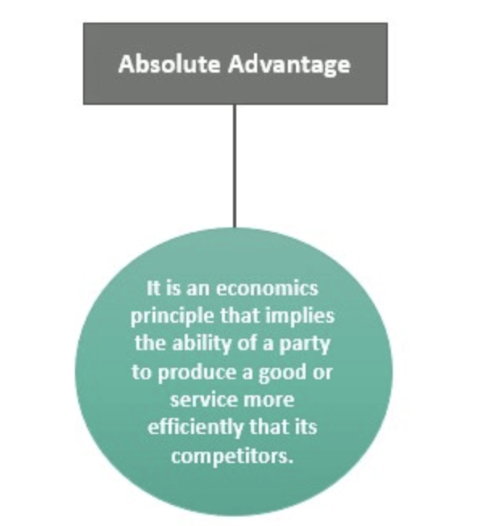

## Table of Contents

## What is absolute advantage in simple terms?

Absolute advantage is a simple idea in economics. It means that one country or person can produce a certain good or service more efficiently than another. For example, if Country A can produce more cars in a day than Country B using the same amount of resources, then Country A has an absolute advantage in car production.

This concept helps countries decide what to produce and trade. If a country has an absolute advantage in making something, it makes sense for them to focus on that product. They can then trade it with other countries for goods that those countries produce more efficiently. This way, everyone can benefit from specialization and trade.

## Who first introduced the concept of absolute advantage?

The concept of absolute advantage was first introduced by Adam Smith, a famous economist, in his book "The Wealth of Nations" which was published in 1776. Adam Smith used this idea to explain why countries should specialize in producing goods they are good at and then trade with other countries. He believed that this would make everyone better off.

Smith's idea was simple but powerful. He said that if one country can produce a product more efficiently than another country, it should focus on making that product. Then, it can trade the product with the other country for something that the other country is better at making. This way, both countries can benefit from trading with each other.

## How does absolute advantage differ from comparative advantage?

Absolute advantage and comparative advantage are two important ideas in economics, but they are different. Absolute advantage is when one country can produce a good or service more efficiently than another country. For example, if Country A can make more cars than Country B using the same amount of resources, then Country A has an absolute advantage in making cars. This idea was introduced by Adam Smith, and it helps countries decide what to produce and trade.

Comparative advantage, on the other hand, is about which country has the lowest opportunity cost when producing a good or service. This means that even if a country is not the best at making something, it can still benefit from producing it if it is less costly for them to give up other things to make it. For example, if Country A is better at making both cars and computers than Country B, but it is much better at making computers, then Country A should focus on making computers and let Country B make cars, even if Country B is not as good at making cars. This idea was introduced by David Ricardo, and it shows that trade can benefit all countries, even if one country is better at everything.

In short, absolute advantage focuses on who can produce more with the same resources, while comparative advantage focuses on who should produce what based on the lowest opportunity cost. Both ideas help explain why countries trade with each other and how they can all benefit from it.

## Can you provide a basic example of absolute advantage in trade?

Imagine there are two countries, Country A and Country B. Country A is really good at growing wheat. They can grow 100 tons of wheat using the same amount of resources that Country B uses to grow only 50 tons of wheat. So, Country A has an absolute advantage in growing wheat.

Because of this advantage, it makes sense for Country A to focus on growing wheat. They can grow a lot of wheat and then trade some of it with Country B. Country B, on the other hand, might be good at making something else, like cloth. They can focus on making cloth and trade it with Country A for wheat. This way, both countries can get more of what they need by specializing in what they are good at and trading with each other.

## What are the key benefits of absolute advantage for a country?

The key benefit of absolute advantage for a country is that it can produce goods or services more efficiently than other countries. This means they can make more of something using the same amount of resources. When a country has an absolute advantage, it can focus on making that product and then trade it with other countries. This helps the country use its resources in the best way possible and can lead to more wealth and a stronger economy.

Another benefit is that absolute advantage can help a country become a leader in certain industries. If a country is really good at making something, it can become known for that product all over the world. This can attract more business and investment, which can create more jobs and help the country grow. By focusing on what they are good at, countries can improve their skills and technology, making them even better at what they do.

## How does absolute advantage impact international trade?

Absolute advantage impacts international trade by helping countries decide what to produce and what to trade. If a country can make a product more efficiently than other countries, it makes sense for them to focus on making that product. They can then trade it with other countries for things that those countries are better at making. This way, countries can use their resources in the best way possible and get more of what they need.

When countries trade based on absolute advantage, it can lead to more wealth and a stronger economy for everyone involved. For example, if one country is really good at making cars and another country is good at growing wheat, they can trade cars for wheat. Both countries get more of what they need, and they can both benefit from the trade. This can also help countries become leaders in certain industries, attract more business, and create more jobs.

## What are the limitations or criticisms of the absolute advantage theory?

One limitation of the absolute advantage theory is that it assumes countries will only trade if they can produce something more efficiently than others. But in the real world, countries often trade even if they are not the best at making everything. This is where the idea of comparative advantage comes in, which says countries can still benefit from trade even if they don't have an absolute advantage in any product.

Another criticism is that the theory doesn't take into account other factors that can affect trade, like transportation costs, trade barriers, or political relationships between countries. For example, it might be cheaper for a country to trade with a nearby country that is not as efficient, rather than with a far-away country that has an absolute advantage. These real-world factors can make the theory less useful for explaining actual trade patterns.

Overall, while the absolute advantage theory helps explain why countries might specialize in certain products, it is a simple model that doesn't capture all the complexities of international trade. It can be a good starting point, but it needs to be used along with other theories and real-world data to get a full picture of how trade works.

## How can a country measure its absolute advantage in a specific industry?

To measure its absolute advantage in a specific industry, a country needs to compare how efficiently it can produce a good or service compared to other countries. This means looking at how much of the product can be made using the same amount of resources, like time, labor, and materials. For example, if Country A can produce 100 cars in a day with the same resources that Country B uses to produce only 50 cars, then Country A has an absolute advantage in car production.

However, measuring absolute advantage isn't just about counting how many products are made. It also involves looking at the quality of the products and the costs involved in making them. If the cars from Country A are of higher quality or if it costs less for Country A to produce them, then the absolute advantage is even stronger. By comparing these factors, a country can understand where it stands in the global market and decide which industries to focus on for trade.

## Can absolute advantage change over time? If so, how?

Yes, absolute advantage can change over time. This happens because many things in the world keep changing. For example, a country might find new ways to make things faster or cheaper. They might use new technology or find new resources. Or, they might train their workers to be better at their jobs. All these changes can help a country become better at making certain products, giving them an absolute advantage where they didn't have one before.

On the other hand, a country might lose its absolute advantage. This can happen if other countries start making things more efficiently. Maybe they find a new way to do things, or they get better resources. Also, if a country doesn't keep up with new technology or if their resources run out, they might not be able to make things as well as before. So, a country that used to have an absolute advantage might lose it if they don't keep improving.

## What role does technology play in altering a country's absolute advantage?

Technology plays a big role in changing a country's absolute advantage. When a country uses new technology, they can make things faster and better. For example, if a country starts using new machines to grow wheat, they can grow more wheat in less time. This means they can have an absolute advantage in growing wheat if other countries don't have the same technology. So, by using new technology, a country can become better at making certain things and gain an advantage over other countries.

On the other hand, if a country doesn't keep up with new technology, they might lose their absolute advantage. If other countries start using new machines or better ways of doing things, they can make products more efficiently. For example, if another country starts using new technology to make cars and can make more cars in less time, they can take away the absolute advantage from the first country. So, staying up to date with technology is important for a country to keep or gain an absolute advantage.

## How do global economic policies influence absolute advantage?

Global economic policies can affect a country's absolute advantage by changing the rules and costs of trade. For example, if a country has trade barriers like tariffs or quotas, it might be harder for them to sell their products to other countries. This can make it less worthwhile for them to focus on products they are good at making, even if they have an absolute advantage. On the other hand, if a country joins a free trade agreement, it can be easier for them to sell their products and keep their absolute advantage.

Also, global economic policies can affect how easy it is for a country to get the resources it needs. If there are rules that make it hard to get certain materials or technology, a country might not be able to make things as efficiently as before. This can cause them to lose their absolute advantage. But if global policies help a country get better resources or technology, they can become better at making things and gain an absolute advantage. So, these policies can have a big impact on which countries are good at making what.

## Can you discuss a real-world case study where absolute advantage has significantly affected trade dynamics?

A good example of absolute advantage affecting trade dynamics is the case of Saudi Arabia and oil. Saudi Arabia has a lot of oil under its ground, more than many other places. Because they can get oil out of the ground easily and cheaply, they have an absolute advantage in oil production. They use this advantage to make a lot of oil and sell it to other countries. This has made Saudi Arabia a big player in the world oil market. Other countries that don't have as much oil, or can't get it out as easily, buy oil from Saudi Arabia because it's cheaper and easier than trying to get their own.

This situation has shaped how countries trade with each other. Countries that need oil, like the United States or Japan, depend on Saudi Arabia for a lot of their oil needs. In return, these countries might sell things they are good at making to Saudi Arabia. For example, the United States might sell technology or cars, while Japan might sell electronics. This trade helps everyone because Saudi Arabia can focus on what it's good at - making oil - and other countries can focus on what they are good at, too. So, absolute advantage in oil has made Saudi Arabia a key part of the global trade system.

## References & Further Reading

[1]: Smith, A. (1776). ["The Wealth of Nations."](https://www.ibiblio.org/ml/libri/s/SmithA_WealthNations_p.pdf) 

[2]: Bergstra, J., Bardenet, R., Bengio, Y., & Kégl, B. (2011). ["Algorithms for Hyper-Parameter Optimization."](https://dl.acm.org/doi/10.5555/2986459.2986743) Advances in Neural Information Processing Systems.

[3]: Lopez de Prado, M. (2018). ["Advances in Financial Machine Learning."](https://www.amazon.com/Advances-Financial-Machine-Learning-Marcos/dp/1119482089) Wiley.

[4]: Aronson, D. (2007). ["Evidence-Based Technical Analysis: Applying the Scientific Method and Statistical Inference to Trading Signals."](https://www.amazon.com/Evidence-Based-Technical-Analysis-Scientific-Statistical/dp/0470008741) Wiley.

[5]: Jansen, S. (2020). ["Machine Learning for Algorithmic Trading."](https://github.com/stefan-jansen/machine-learning-for-trading) Packt Publishing.

[6]: Chan, E. P. (2008). ["Quantitative Trading: How to Build Your Own Algorithmic Trading Business."](https://github.com/ftvision/quant_trading_echan_book) Wiley.