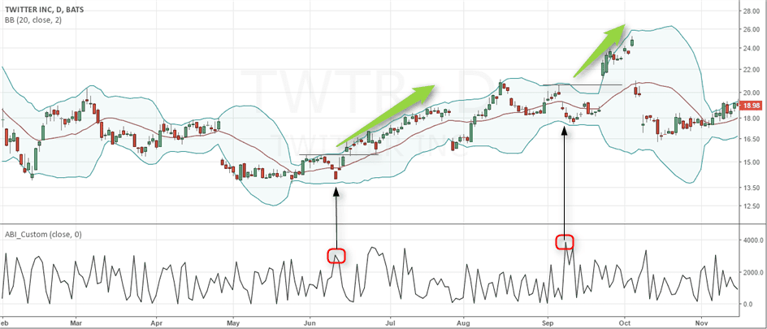

## Table of Contents

## What is the Absolute Breadth Index (ABI)?

The Absolute Breadth Index (ABI) is a technical indicator used in stock market analysis. It measures the difference between the number of advancing stocks and the number of declining stocks on a given day. If more stocks are going up than down, the ABI will be a positive number. If more stocks are going down than up, the ABI will be a negative number. The ABI helps investors understand the overall market sentiment and can signal potential market turning points.

The ABI is calculated by taking the absolute value of the difference between the number of advancing and declining stocks. This means that whether the market is strongly up or strongly down, the ABI will always be a positive number. Traders often use the ABI to spot extreme market conditions. For example, if the ABI stays high for a long time, it might mean the market is overbought and could soon drop. On the other hand, if the ABI stays low for a long time, it might mean the market is oversold and could soon rise.

## How is the Absolute Breadth Index calculated?

The Absolute Breadth Index (ABI) is a way to see how many stocks are going up or down in the market. To find the ABI, you first count the number of stocks that went up in a day. Then, you count the number of stocks that went down in that same day. After that, you subtract the number of declining stocks from the number of advancing stocks. This gives you a number that can be positive or negative.

Next, you take the absolute value of that number. This means you turn any negative number into a positive one. So, if you had -50 from the subtraction, the absolute value would be 50. The ABI is always a positive number because of this step. It shows how strong the market movement is, whether stocks are mostly going up or mostly going down.

## What does the Absolute Breadth Index measure in the stock market?

The Absolute Breadth Index (ABI) measures how many stocks are going up or down in the stock market on a given day. It does this by taking the difference between the number of stocks that went up and the number of stocks that went down. Then, it turns that number into a positive value, no matter if it was originally positive or negative. This helps show how strong the market movement is, whether it's going up or down.

The ABI is useful because it can tell investors about the overall mood of the market. If the ABI is high, it means a lot of stocks are moving in the same direction, which could mean the market is very strong or very weak. If the ABI stays high for a long time, it might be a sign that the market is overbought and could soon go down. On the other hand, if the ABI is low for a long time, it might mean the market is oversold and could soon go up. This helps investors make better decisions about when to buy or sell stocks.

## Why is the Absolute Breadth Index important for investors?

The Absolute Breadth Index (ABI) is important for investors because it helps them understand how the stock market is doing overall. It shows how many stocks are going up or down on a given day. By looking at the ABI, investors can see if the market is moving strongly in one direction or if it's more balanced. This can help them decide if it's a good time to buy or sell stocks.

Investors also use the ABI to spot when the market might be about to change direction. If the ABI stays high for a long time, it might mean the market is overbought and could soon go down. On the other hand, if the ABI stays low for a long time, it might mean the market is oversold and could soon go up. By watching the ABI, investors can try to time their trades better and make more informed decisions about their investments.

## How can beginners use the Absolute Breadth Index to understand market trends?

Beginners can use the Absolute Breadth Index (ABI) to understand market trends by looking at how many stocks are going up or down each day. If the ABI is high, it means a lot of stocks are moving in the same direction, either up or down. This can show that the market is feeling very strong or very weak. When the ABI is high, it might be a good time for beginners to be careful, as the market might be overbought and could soon drop.

On the other hand, if the ABI is low, it means fewer stocks are moving strongly in one direction. This can show that the market is more balanced or that it's feeling weak. When the ABI stays low for a while, it might be a good time for beginners to look for buying opportunities, as the market might be oversold and could soon go up. By watching the ABI, beginners can get a sense of the overall market mood and make better decisions about when to buy or sell stocks.

## What are the typical values of the Absolute Breadth Index and what do they signify?

The Absolute Breadth Index (ABI) can have different values, but there are some typical ranges that can help beginners understand market trends. When the ABI is low, like below 500, it usually means that the market is not moving strongly in one direction. This can show that the market is balanced or feeling a bit weak. If the ABI stays low for a while, it might be a good time to look for buying opportunities because the market could be oversold and might go up soon.

On the other hand, when the ABI is high, like above 1000, it means that a lot of stocks are moving in the same direction, either up or down. This can show that the market is feeling very strong or very weak. If the ABI stays high for a long time, it might be a sign that the market is overbought and could soon drop. By watching these typical values, beginners can get a sense of the overall market mood and make better decisions about when to buy or sell stocks.

## Can the Absolute Breadth Index predict market volatility?

The Absolute Breadth Index (ABI) can give clues about market volatility. It shows how many stocks are going up or down each day. If the ABI is high, it means a lot of stocks are moving in the same direction, which can mean the market is very strong or very weak. This strong movement can lead to more ups and downs in the market, which is what we call volatility. So, a high ABI might be a sign that the market could be more volatile soon.

On the other hand, if the ABI is low, it means fewer stocks are moving strongly in one direction. This can show that the market is more balanced or feeling weak. When the ABI stays low for a while, it might mean the market is not going to have big ups and downs soon. So, a low ABI might suggest that the market will be less volatile. By watching the ABI, investors can get a sense of how much the market might move around in the near future.

## How does the Absolute Breadth Index differ from other market breadth indicators?

The Absolute Breadth Index (ABI) is different from other market breadth indicators because it focuses on the absolute difference between the number of advancing and declining stocks. While other indicators like the Advance-Decline Line (AD Line) or the Arms Index (TRIN) might show the net difference or a ratio, the ABI always gives a positive number. This means it shows the strength of market movement, whether stocks are mostly going up or mostly going down. This can help investors see how strong the market is moving, no matter the direction.

Another way the ABI differs is in how it can signal market extremes. For example, the McClellan Oscillator uses moving averages to show short-term market trends, while the ABI simply shows the raw strength of market movement. If the ABI stays high for a long time, it might mean the market is overbought and could soon drop. If it stays low, it might mean the market is oversold and could soon rise. This makes the ABI a useful tool for spotting when the market might be about to change direction, which is different from other indicators that might focus more on the current trend or balance of the market.

## What are the limitations of using the Absolute Breadth Index in market analysis?

The Absolute Breadth Index (ABI) has some limitations that investors should know about. One big limitation is that it only shows how many stocks are going up or down, but it doesn't tell you why they are moving. This means the ABI can't tell you if the market is moving because of good news, bad news, or something else. It's just a number that shows how strong the market movement is, but it doesn't give you the full story.

Another limitation is that the ABI can be misleading if you look at it by itself. For example, a high ABI might mean the market is strong, but it could also mean the market is about to drop because it's overbought. You need to use other tools and indicators along with the ABI to get a better picture of what's happening in the market. If you only use the ABI, you might make decisions based on incomplete information, which can lead to mistakes in your investing.

## How can advanced traders incorporate the Absolute Breadth Index into their trading strategies?

Advanced traders can use the Absolute Breadth Index (ABI) to spot when the market might be about to change direction. If the ABI stays high for a long time, it might mean the market is overbought and could soon drop. Traders can use this information to sell their stocks before the market goes down. On the other hand, if the ABI stays low for a while, it might mean the market is oversold and could soon go up. This can be a good time for traders to buy stocks, hoping to make money when the market rises again. By watching the ABI, advanced traders can time their trades better and make more informed decisions.

Traders can also use the ABI along with other indicators to get a fuller picture of the market. For example, they might look at the Advance-Decline Line or the Arms Index to see if the market is balanced or if there's a lot of buying or selling pressure. By combining the ABI with these other tools, traders can see if the market is moving strongly in one direction and if that movement is likely to continue or change. This can help them decide when to enter or [exit](/wiki/exit-strategy) the market, making their trading strategies more effective.

## What historical market events have been correlated with significant changes in the Absolute Breadth Index?

During the 2008 financial crisis, the Absolute Breadth Index (ABI) showed big changes. Before the crisis hit, the ABI was high for a long time, which meant a lot of stocks were moving in the same direction. This high ABI was a sign that the market was overbought and could soon drop. When the crisis started, the ABI dropped a lot, showing that the market was moving strongly down. This helped traders see that the market was in trouble and many sold their stocks to avoid losing more money.

Another time the ABI was important was during the 2020 stock market crash caused by the COVID-19 pandemic. In the weeks before the crash, the ABI was high, showing that the market was moving strongly up. But when the news about the virus got worse, the ABI dropped quickly, showing that the market was moving strongly down. This big change in the ABI helped traders see that the market was about to change direction, and many used this information to adjust their trading strategies.

## How can the Absolute Breadth Index be used in conjunction with other technical indicators for more accurate market predictions?

Advanced traders can use the Absolute Breadth Index (ABI) along with other technical indicators to make better guesses about where the market is going. For example, they might look at the Advance-Decline Line to see if more stocks are going up or down over time. If the ABI is high and the Advance-Decline Line is also going up, it might mean the market is very strong and could keep going up. But if the ABI is high and the Advance-Decline Line is going down, it might mean the market is overbought and could soon drop. By looking at both indicators, traders can get a better idea of what's happening in the market and make smarter decisions about when to buy or sell stocks.

Another way to use the ABI with other indicators is to look at the Arms Index (TRIN). The TRIN shows if the market is balanced or if there's a lot of buying or selling pressure. If the ABI is high and the TRIN is low, it might mean there's a lot of buying pressure and the market could keep going up. But if the ABI is high and the TRIN is high too, it might mean the market is overbought and could soon drop. By combining the ABI with the TRIN, traders can see if the market's strong movement is likely to continue or if it's time to be careful. This can help them time their trades better and make more accurate predictions about the market.

## What is the Absolute Breadth Index (ABI) and how is it understood?

The Absolute Breadth Index (ABI) is a market breadth indicator that provides insights into market volatility by examining the absolute difference between the number of advancing and declining stocks within a given period. Unlike other indicators that may focus on price trends or volumes, the ABI concentrates solely on the breadth of market movements, disregarding the direction of price changes. This makes the ABI a useful tool for analyzing overall market sentiment and gauging volatility levels.

The ABI is calculated using a straightforward formula:

$$
\text{ABI} = |\text{Advances} - \text{Declines}|
$$

Here, "Advances" represents the number of stocks that have closed higher in a given trading session, whereas "Declines" signifies the number of stocks that have closed lower. By taking the absolute value of the difference, the ABI purely measures the size of market fluctuations without attributing those movements to upward or downward trends.

The strength of the ABI lies in its ability to reflect market sentiment and [volatility](/wiki/volatility-trading-strategies). High ABI values are typically indicative of heightened market volatility, suggesting that a larger proportion of stocks are experiencing significant movements, either upwards or downwards. This can signal potential trading opportunities or risks, as investors may anticipate substantial price changes. Conversely, low ABI values denote relative market stability, indicating that the number of advancing and declining stocks are closer in number, pointing to a tranquil market environment with limited volatility.

In summary, the ABI offers a unique perspective on market activity by providing a measure of market breadth that is independent of price direction. Its focus on volatility makes it an invaluable tool for investors and analysts looking to understand overall market sentiment and the potential for significant market movements.

## How do you calculate the Absolute Breadth Index?

The Absolute Breadth Index (ABI) serves as a fundamental metric for evaluating market volatility, achieved through a straightforward calculation. The ABI is determined by taking the absolute difference between the number of advancing stocks and the number of declining stocks within a particular market or index. 

Mathematically, the formula for calculating the ABI is expressed as:

$$
\text{ABI} = |\text{Advancing Stocks} - \text{Declining Stocks}|
$$

This formula emphasizes its simplicity, as it does not account for the direction of price changes but purely focuses on the breadth of market movements. Such an approach makes ABI an ideal measure when volatility takes precedence over directional trends.

To illustrate, consider a scenario where a market segment consists of 20 advancing stocks and 5 declining stocks. The calculation for ABI would be as follows: 

$$
\text{ABI} = |20 - 5| = 15
$$

In this case, an ABI of 15 highlights a significant level of market volatility, reflecting the overall movement in stock activity irrespective of the direction in which the prices are headed. This numerical insight aids traders and analysts in determining the scale of market fluctuations, crucial for subsequent investment strategies.

## References & Further Reading

[1]: Fosback, N.G. (1993). ["Stock Market Logic: A Sophisticated Approach to Profits on Wall Street."](https://archive.org/details/stockmarketlogic00fosb) Dearborn Financial Publishing.

[2]: Pring, M. J. (2002). ["Technical Analysis Explained: The Successful Investor's Guide to Spotting Investment Trends and Turning Points."](https://www.amazon.com/Technical-Analysis-Explained-Fifth-Successful/dp/0071825177) McGraw-Hill Education.

[3]: Murphy, J. J. (1999). ["Technical Analysis of the Financial Markets: A Comprehensive Guide to Trading Methods and Applications."](https://archive.org/details/technicalanalysi0000murp) New York Institute of Finance.

[4]: Knight, J. L., & Satchell, S. (2007). ["Forecasting Volatility in the Financial Markets."](https://www.sciencedirect.com/book/9780750669429/forecasting-volatility-in-the-financial-markets) Butterworth-Heinemann.

[5]: Achelis, S. B. (2000). ["Technical Analysis from A to Z."](https://www.mhebooklibrary.com/doi/book/10.1036/9780071380119) McGraw-Hill Education.