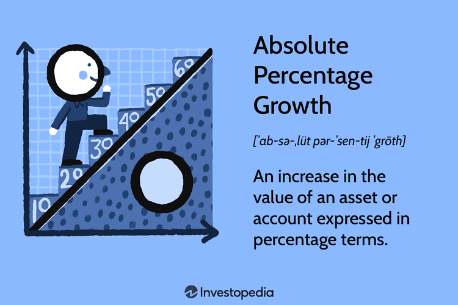

## Table of Contents

## What is Absolute Percentage Growth?

Absolute Percentage Growth is a way to measure how much something has grown over time. It tells you the percentage increase from the starting point to the end point. For example, if you started with 100 apples and ended up with 150 apples, the absolute percentage growth would show you how much bigger the number of apples got, in percentage terms.

To calculate it, you take the difference between the final value and the initial value, divide that by the initial value, and then multiply by 100 to get a percentage. Using the apple example, you would subtract 100 from 150 to get 50, then divide 50 by 100 to get 0.5, and finally multiply by 100 to get 50%. This means the number of apples grew by 50% from the start to the end.

## How is Absolute Percentage Growth calculated?

Absolute Percentage Growth is a way to see how much something has grown in percentage terms. You start by finding the difference between the final number and the starting number. For example, if you had 100 apples at the start and 150 apples at the end, the difference is 50 apples.

Next, you take that difference and divide it by the starting number. In our apple example, you divide 50 by 100, which gives you 0.5. Then, to turn that into a percentage, you multiply by 100. So, 0.5 times 100 equals 50%. This means the number of apples grew by 50% from the start to the end.

## Why is Absolute Percentage Growth important in data analysis?

Absolute Percentage Growth is important in data analysis because it helps us understand how much something has changed over time. When we look at numbers, it's not always easy to see how big the change is just by looking at the final number. But when we use Absolute Percentage Growth, we can see the change as a percentage, which makes it easier to understand and compare. For example, if a company's sales went from $100,000 to $150,000, knowing that the growth was 50% helps us see how big that change really is.

This measure is also useful because it lets us compare growth across different things. If one company's sales grew by 10% and another's by 50%, we can easily see which one did better. It's a simple way to make sense of numbers and see patterns or trends. This can help businesses make decisions, like where to focus their efforts or how to plan for the future.

## Can you provide a simple example of calculating Absolute Percentage Growth?

Let's say you have a small garden and you want to see how much your tomato plants have grown over the summer. At the start of the summer, you had 20 tomato plants. By the end of the summer, you had 30 tomato plants. To find out the Absolute Percentage Growth, you first need to find the difference between the end number and the start number. So, you subtract 20 from 30, which gives you 10.

Next, you take that difference of 10 and divide it by the starting number, which was 20. So, 10 divided by 20 equals 0.5. To turn that into a percentage, you multiply 0.5 by 100, which gives you 50%. This means your tomato plants grew by 50% over the summer. It's a simple way to see how much your garden has changed.

## How does Absolute Percentage Growth differ from Relative Percentage Growth?

Absolute Percentage Growth and Relative Percentage Growth are two ways to measure how much something has changed, but they look at it from different angles. Absolute Percentage Growth tells you the percentage increase from the starting point to the end point. For example, if you started with 100 apples and ended up with 150 apples, the Absolute Percentage Growth would be 50%. It's like looking at the total change in percentage terms, starting from zero.

Relative Percentage Growth, on the other hand, looks at the change in relation to the previous value, not the starting value. It's often used to see how much something grows over time, period by period. For instance, if you had 100 apples last month and 110 apples this month, the Relative Percentage Growth for this month would be 10%. This method is useful for understanding growth rates over time, especially when the numbers keep changing.

## What are the common applications of Absolute Percentage Growth in business?

In business, Absolute Percentage Growth is often used to measure how much sales or revenue has grown over a certain period. For example, if a company's sales were $1 million at the start of the year and $1.2 million at the end, they can use Absolute Percentage Growth to see that their sales grew by 20%. This helps business owners and managers understand how well their company is doing and if they are meeting their goals. It's a simple way to see if the business is growing and by how much.

Another common use of Absolute Percentage Growth in business is to compare the growth of different parts of the company. For instance, if one department's sales grew by 10% and another's by 30%, the company can see which part is doing better. This helps them decide where to focus their efforts or where they might need to make changes. It's a useful tool for making decisions and planning for the future.

## What are the limitations of using Absolute Percentage Growth?

One limitation of using Absolute Percentage Growth is that it doesn't tell you the whole story. It only shows you the percentage increase from the start to the end, but it doesn't show you what happened in between. For example, if a company's sales went up and down a lot during the year but ended up higher than at the start, the Absolute Percentage Growth would just show the final increase. It wouldn't show the ups and downs that happened along the way.

Another limitation is that Absolute Percentage Growth can be misleading when you're comparing things that started at different sizes. If one company starts with $100 in sales and grows to $200, that's a 100% increase. But if another company starts with $1,000 and grows to $1,100, that's only a 10% increase. Even though the second company grew by more money, the first company's growth looks bigger in percentage terms. This can make it hard to compare growth fairly between different things.

## How can Absolute Percentage Growth be misleading if not used correctly?

Absolute Percentage Growth can be misleading if you don't use it the right way. It only shows you the percentage increase from the start to the end, but it doesn't tell you about what happened in between. For example, if a company's sales went up and down a lot during the year but ended up higher than at the start, the Absolute Percentage Growth would just show the final increase. It wouldn't show the ups and downs that happened along the way. This can make it seem like the growth was steady when it really wasn't.

Another way Absolute Percentage Growth can be misleading is when you're comparing things that started at different sizes. If one company starts with $100 in sales and grows to $200, that's a 100% increase. But if another company starts with $1,000 and grows to $1,100, that's only a 10% increase. Even though the second company grew by more money, the first company's growth looks bigger in percentage terms. This can make it hard to compare growth fairly between different things.

## What advanced statistical methods can be used to enhance the analysis of Absolute Percentage Growth?

To make the analysis of Absolute Percentage Growth better, you can use something called time series analysis. This method looks at how numbers change over time, not just from the start to the end. It can show you the ups and downs that happen along the way, which Absolute Percentage Growth doesn't show. For example, if a company's sales go up and down a lot during the year, time series analysis can help you see those changes and understand why they happen. This can give you a fuller picture of how the company is doing.

Another way to improve the analysis is by using regression analysis. This method helps you see how different things affect the growth. For example, you might want to know how advertising or the economy affects a company's sales growth. Regression analysis can show you how much each of these things matters. By using this, you can get a better understanding of what's driving the growth and make smarter decisions about where to focus your efforts.

## How does Absolute Percentage Growth relate to other financial metrics like CAGR?

Absolute Percentage Growth and Compound Annual Growth Rate (CAGR) are both ways to measure how much something has grown, but they look at it differently. Absolute Percentage Growth tells you the total percentage increase from the start to the end. For example, if a company's sales went from $100,000 to $150,000, the Absolute Percentage Growth would be 50%. It's a simple way to see how much something has grown over a certain period.

CAGR, on the other hand, looks at the average yearly growth rate over a period of time. It's useful when you want to see how something grows over several years, not just from the start to the end. For example, if a company's sales grew from $100,000 to $150,000 over three years, the CAGR would show you the average yearly growth rate that got you to that final number. This can help you understand the steady growth of a company or investment over time, which is something Absolute Percentage Growth doesn't show.

## What software tools are commonly used to calculate and analyze Absolute Percentage Growth?

To calculate and analyze Absolute Percentage Growth, people often use spreadsheet software like Microsoft Excel or Google Sheets. These tools are easy to use and let you put in numbers, do calculations, and make charts to see how things have grown. For example, you can type in the starting and ending numbers, use a simple formula to find the percentage growth, and then make a graph to see the change over time. This makes it simple to understand and share the results with others.

Another tool that's often used is statistical software like R or Python. These programs are more advanced and can do more complex analysis, like time series analysis or regression analysis, to get a deeper understanding of growth. For example, you can use R to look at how sales have changed over time and see if there are any patterns or trends. Python can also help you make predictions about future growth based on past data. These tools are great for businesses that want to do more detailed analysis and make better decisions.

## Can you discuss a case study where Absolute Percentage Growth was crucial in decision-making?

In a small bakery called "Sweet Delights," the owner wanted to see how much their sales had grown over the past year. They used Absolute Percentage Growth to find out that their sales had gone up by 30%. This number was important because it showed the owner that their new marketing campaign was working well. The campaign had cost a lot of money, so knowing that sales had grown by 30% helped the owner feel confident that it was worth the investment. They decided to keep the campaign going and even thought about expanding it to reach more customers.

The bakery's owner also used Absolute Percentage Growth to compare the growth of different products. They found out that their new line of gluten-free cakes had grown by 50%, while their traditional cakes had only grown by 10%. This information was crucial for deciding where to focus their efforts. The owner decided to put more resources into promoting the gluten-free cakes because they were growing faster. This helped the bakery make better use of their time and money, leading to even more growth in the future.

## What is the importance of understanding financial metrics in algo trading?

Financial metrics play a pivotal role in assessing the performance and viability of investments in [algorithmic trading](/wiki/algorithmic-trading). These metrics offer quantifiable and systematic means of evaluating trading strategies, transforming vast amounts of market data into actionable insights. They encompass a variety of measures, each serving specific roles in the analysis and optimization of trading strategies.

One of the fundamental financial metrics is the Compound Annual Growth Rate (CAGR), which measures the mean annual growth rate of an investment over a specified time period longer than one year. Contrary to assuming constant growth year-over-year, CAGR provides a smoothed annual growth rate that ignores the effects of [volatility](/wiki/volatility-trading-strategies), allowing for an accurate comparison of growth across different investments or portfolios. The formula for CAGR is:

$$
\text{CAGR} = \left( \frac{V_f}{V_i} \right)^{\frac{1}{n}} - 1
$$

where $V_f$ is the final value, $V_i$ is the initial value, and $n$ is the number of years.

Beyond growth rates, evaluating risk-adjusted returns is essential for developing robust trading strategies. The Sharpe Ratio is one of the most widely-used metrics for this purpose. It measures the average return earned in excess of the risk-free rate per unit of volatility or total risk, allowing for a standardized comparison of investment performance. The formula is as follows:

$$
\text{Sharpe Ratio} = \frac{R_p - R_f}{\sigma_p}
$$

where $R_p$ is the portfolio return, $R_f$ is the risk-free rate, and $\sigma_p$ is the standard deviation of the portfolio's excess return.

Similarly, the Sortino Ratio offers a refined perspective by focusing exclusively on downside risk, which aligns closely with the interests of risk-averse investors. By only considering the negative deviation of returns, the Sortino Ratio provides a more accurate assessment of the risk related to losses. The formula is:

$$
\text{Sortino Ratio} = \frac{R_p - R_f}{\sigma_d}
$$

where $\sigma_d$ represents the standard deviation of negative asset returns.

These metrics collectively inform the development of algorithmic trading strategies by providing insights into growth consistency and risk-adjusted returns. By integrating these metrics into the analysis process, traders can assess the historical effectiveness and potential future performance of their strategies. This integration is particularly useful when [backtesting](/wiki/backtesting), as it allows for systematic refinement and optimization of trading algorithms based on historical data, thus enhancing their robustness in future market conditions.

## What are the growth rates in financial calculations?

Growth rates are critical metrics that quantify how much the value of an investment changes over a specified period, allowing investors to measure performance and predict future potential. Among these, the Compound Annual Growth Rate (CAGR) stands out as it provides a normalized rate of return over multiple years, thus offering a clearer picture of an investment’s trajectory by accounting for volatility and compounding effects.

### Compound Annual Growth Rate (CAGR)

CAGR is a useful metric for assessing the performance of an investment, particularly over multiple time periods. It effectively transforms the total return on investment over a specific period into a consistent annual growth rate, eliminating the effects of volatility and providing a smoothed growth figure. CAGR is defined by the formula:

$$
CAGR = \left( \frac{V_f}{V_i} \right)^{\frac{1}{n}} - 1
$$

where:
- $V_f$ is the final value.
- $V_i$ is the initial value.
- $n$ is the number of years.

By calculating CAGR, investors gain a standardized annual rate that enables straightforward comparisons between various investment opportunities, irrespective of differing time frames or specific market fluctuations observed during the investment period.

### Application and Benefits of Using Growth Rates

The calculation of growth rates like CAGR assists investors in several ways. Firstly, it separates short-term anomalies and market noise, providing a comprehensive view of an investment's growth trend over time. This aids in forecasting potential future returns, essential for strategic planning and decision-making in investment portfolios.

Furthermore, CAGR allows for the evaluation of performance among different securities, asset classes, or portfolios by offering a mutual comparison ground that considers both collective gains and the duration of investments. The insight gained from such comparisons is pivotal for risk analysis and capital allocation.

For practical implementation of CAGR calculations, investors often use software tools like Microsoft Excel or programming languages such as Python, allowing for extensive analysis and automation. Below is an example of how to calculate CAGR using Python:

```python
def calculate_cagr(start_value, end_value, years):
    return (end_value / start_value) ** (1 / years) - 1

# Example usage
initial_value = 1000
final_value = 1800
period_years = 3

cagr = calculate_cagr(initial_value, final_value, period_years)
print(f'CAGR: {cagr * 100:.2f}%')
```

In conclusion, understanding and applying growth rates like CAGR empower investors with the knowledge to effectively manage their investments. This results in informed decision-making, accurate performance evaluation, and potential forecasting, all of which are vital aspects in the field of algorithmic trading.

## What are the Formulae for Calculating Financial Metrics?

Mastering the formulas for calculating financial metrics such as the Compound Annual Growth Rate (CAGR) and the Sharpe Ratio is essential for accurate evaluation of investment performance and risk. These calculations can be efficiently automated using tools like Microsoft Excel and programming languages, with Python being particularly popular due to its extensive libraries and ease of use.

### Compound Annual Growth Rate (CAGR)

CAGR is a widely used metric that provides a smoothed annual growth rate over a specified period, eliminating the effects of volatility. The formula for calculating CAGR is:

$$
\text{CAGR} = \left( \frac{\text{End Value}}{\text{Start Value}} \right)^{\frac{1}{n}} - 1
$$

Where:
- **End Value** is the final value of the investment.
- **Start Value** is the initial value of the investment.
- **n** is the number of years.

#### Calculating CAGR in Python
Below is a sample Python code snippet to calculate CAGR:

```python
def calculate_cagr(start_value, end_value, years):
    return ((end_value / start_value) ** (1 / years)) - 1

# Example usage
start_value = 1000
end_value = 2000
years = 5
cagr = calculate_cagr(start_value, end_value, years)
print(f"The CAGR is {cagr:.2%}")
```

### Sharpe Ratio

The Sharpe Ratio is a measure of risk-adjusted return, indicating how much excess return is received for the additional volatility of holding a riskier asset. It is calculated as:

$$
\text{Sharpe Ratio} = \frac{R_p - R_f}{\sigma_p}
$$

Where:
- $R_p$ is the return of the portfolio.
- $R_f$ is the risk-free rate.
- $\sigma_p$ is the standard deviation of the portfolio's excess return.

#### Calculating Sharpe Ratio in Python
Below is a Python code snippet to calculate the Sharpe Ratio:

```python
def calculate_sharpe_ratio(returns, risk_free_rate):
    excess_returns = returns - risk_free_rate
    return excess_returns.mean() / excess_returns.std()

# Example usage
import numpy as np

returns = np.array([0.05, 0.02, 0.03, 0.04, 0.06])
risk_free_rate = 0.01
sharpe_ratio = calculate_sharpe_ratio(returns, risk_free_rate)
print(f"The Sharpe Ratio is {sharpe_ratio:.2f}")
```

### Automating Calculations with Excel

In addition to Python, Excel provides built-in functions for calculating these metrics. The `RATE` function can be used to calculate CAGR, while standard deviation functions (`STDEV.P` for population standard deviation) can assist in calculating the Sharpe Ratio from historical data.

By using such tools and programming environments, traders can automate and streamline their financial metric calculations, allowing for more efficient and precise strategy evaluations.

## How can financial metrics be applied to algorithmic trading?

Algorithmic trading significantly depends on the use of financial metrics to enhance strategy precision and maximize performance. The integration of metrics such as win rate, average trade return, and maximum drawdown provides a quantitative framework for assessing the effectiveness and inherent risk associated with trading strategies.

Win rate refers to the proportion of trades that result in a profit relative to the total number of trades executed. It is calculated as follows:

$$
\text{Win Rate} = \left(\frac{\text{Number of Winning Trades}}{\text{Total Number of Trades}}\right) \times 100
$$

A higher win rate generally indicates a potentially effective strategy, but it is crucial to consider it alongside other metrics, as a high win rate might not equate to overall profitability if the gains from winning trades are minimal compared to losses from losing trades.

Average trade return measures the mean return generated per trade, assessing the profitability of trades over time. It can be derived using:

$$
\text{Average Trade Return} = \frac{\text{Total Profit or Loss from Trades}}{\text{Total Number of Trades}}
$$

This metric helps traders understand the expected value of each trade, assisting in setting realistic profit targets and managing expectations regarding strategy performance.

Maximum drawdown quantifies the largest peak-to-trough decline during a trading period, representing the potential risk of substantial capital loss. It is expressed as a percentage:

$$
\text{Maximum Drawdown} = \left(\frac{\text{Peak Value - Trough Value}}{\text{Peak Value}}\right) \times 100
$$

Understanding and managing drawdown is critical for risk management, as it indicates the resilience of a trading strategy in adverse market conditions.

To refine trading strategies, backtesting with historical data using these metrics is imperative. Backtesting involves simulating a trading strategy over past data to evaluate its effectiveness without deploying real capital. This process allows traders to observe how strategies would have performed and adjust them to optimize performance based on quantitative evidence.

Backtesting can be implemented in Python using libraries such as Pandas for data manipulation, NumPy for numerical operations, and Matplotlib for visualization. Here's a basic Python snippet demonstrating a simple backtesting framework:

```python
import pandas as pd
import numpy as np

# Sample trading data
data = pd.DataFrame({
    'Price': [100, 102, 101, 105, 107, 106],
    'Signal': [1, 0, 1, 0, 1, 0]  # 1 = Buy, 0 = No Action
})

# Calculate returns
data['Return'] = data['Price'].pct_change()
data['Strategy Return'] = data['Signal'].shift(1) * data['Return']

# Calculate cumulative returns
data['Cumulative Return'] = (1 + data['Strategy Return']).cumprod()

# Calculate performance metrics
win_rate = (data['Strategy Return'] > 0).mean()
average_trade_return = data['Strategy Return'].mean()
max_drawdown = (1 - data['Cumulative Return'] / data['Cumulative Return'].cummax()).max()

print(f"Win Rate: {win_rate:.2%}")
print(f"Average Trade Return: {average_trade_return:.2%}")
print(f"Maximum Drawdown: {max_drawdown:.2%}")
```

By assessing these key metrics through backtesting, traders can fine-tune their strategies with evidence-based insights, positioning themselves to react more effectively to volatile market dynamics and improve the robustness of algorithmic trading systems. However, it remains essential to remember the limitations of historical data and proactively adapt strategies to reflect current market conditions for sustained success.

## What is the conclusion?

Financial metrics and growth rates play a pivotal role in enhancing algorithmic trading strategies by offering quantitative insights necessary for making informed investment decisions. Key metrics such as the Compound Annual Growth Rate (CAGR), Sharpe Ratio, and Sortino Ratio enable traders to evaluate the performance, risk, and potential return of their trading strategies with precision.

Understanding how to calculate and apply these metrics is essential. For instance, the CAGR is calculated using the formula:

$$
\text{CAGR} = \left( \frac{\text{Ending value}}{\text{Beginning value}} \right)^{\frac{1}{n}} - 1
$$

where $n$ represents the number of years. This formula helps traders assess the compounded growth rate of an investment over a specific time period, providing a smoothed annual rate that accounts for volatility.

The Sharpe Ratio, another critical metric, measures risk-adjusted return, computed as:

$$
\text{Sharpe Ratio} = \frac{\text{Average portfolio return} - \text{Risk-free rate}}{\text{Standard deviation of portfolio return}}
$$

This ratio offers investors insights into the return of an investment compared to its risk, aiding in the selection of strategies that maximize returns for a given level of risk.

Similarly, the Sortino Ratio refines the Sharpe Ratio by differentiating harmful volatility (downside risk) from total volatility, calculated as:

$$
\text{Sortino Ratio} = \frac{\text{Average portfolio return} - \text{Risk-free rate}}{\text{Downside deviation}}
$$

Integrating these metrics into algorithmic trading systems enables traders to continually evaluate and refine their strategies. By using backtesting with historical data, these metrics can be applied dynamically to adapt to changing market conditions, which is essential for long-term success.

In dynamic markets, continuously evaluating and adjusting strategies based on these metrics ensures that trading systems remain robust and effective. This approach mitigates risks associated with relying solely on static historical data, thus balancing quantitative analysis with market realities. Through the precise application of financial metrics, traders can significantly improve their decision-making processes, leading to optimized performance and sustained success in algorithmic trading.

## References & Further Reading

Advances in Financial Machine Learning by Marcos Lopez de Prado is a key resource for understanding the application of [machine learning](/wiki/machine-learning) techniques in finance, particularly in algorithmic trading and portfolio management. It covers advanced methods such as backtesting, feature engineering, and model evaluation, which are crucial for developing robust trading strategies.

Evidence-Based Technical Analysis by David Aronson challenges traditional technical analysis by applying scientific methods to test the validity of trading rules. The book emphasizes the importance of statistical rigor and provides a framework for evaluating the performance of technical indicators.

Machine Learning for Algorithmic Trading by Stefan Jansen offers insights into developing trading algorithms using various machine learning models. The book covers practical aspects, including data handling, feature selection, and algorithm tuning, providing readers with hands-on experience in creating data-driven trading strategies.

Quantitative Trading: How to Build Your Own Algorithmic Trading Business by Ernest P. Chan provides a comprehensive guide to starting an algorithmic trading business. It includes topics such as trading strategy development, risk management, and infrastructure setup, making it a valuable resource for aspiring quantitative traders.

The Sharpe Ratio by W. F. Sharpe is an authoritative text on one of the most widely used metrics for risk-adjusted return. The book explains the mathematical foundation of the Sharpe Ratio and discusses its applications, strengths, and limitations in evaluating investment performance.

Downside Risk by F. A. Sortino & R. Van der Meer introduces the Sortino Ratio, an alternative to the Sharpe Ratio that focuses on downside risk. The book provides a thorough examination of downside risk metrics and their importance in constructing portfolios that align with investor risk preferences.

