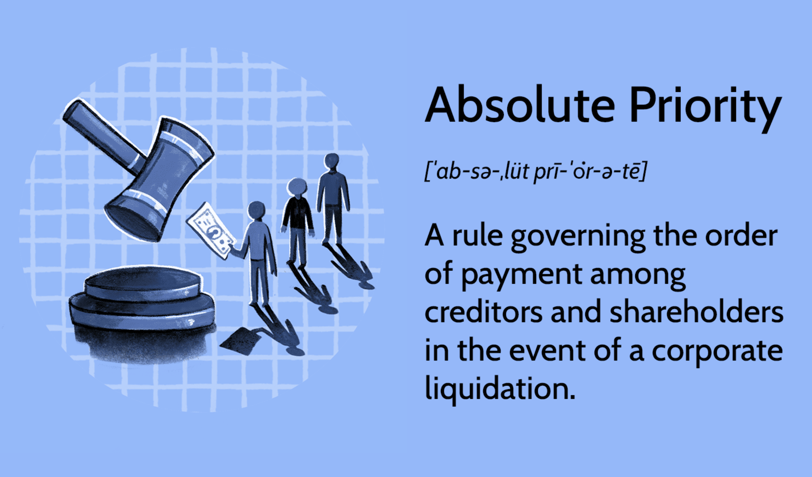

Bankruptcy is a structured legal process that provides individuals or entities, unable to meet their financial obligations, with an opportunity to seek relief from debts. This mechanism aims to balance the interests of debtors seeking a fresh start with those of creditors attempting to recoup their loans. Central to the resolution of bankruptcy cases is the 'absolute priority rule.' This principle establishes a clear sequence for distributing payments to creditors and stakeholders, ensuring a systematic approach in settling financial obligations during bankruptcy proceedings.

The absolute priority rule forms the backbone of the bankruptcy hierarchy, offering a structured framework in which secured creditors—those with collateral-backed claims—receive priority over unsecured creditors and equity holders. By enforcing this sequence, the rule attempts to maximize creditor recovery while adhering to legal guidelines. This structured approach is essential for maintaining order and predictability in insolvency situations.



In the intricate landscape of financial markets, the interaction between bankruptcy rules and algorithmic trading (algo trading) presents distinct challenges and opportunities. Algo trading employs sophisticated algorithms to automate trading processes and enhance market efficiency, often operating at speeds beyond human capability. In the context of distressed assets, understanding the hierarchy of claims and the absolute priority rule becomes crucial for finance professionals navigating corporate restructuring and distressed asset management.

The interplay between legal bankruptcy frameworks and algorithmic trading necessitates a comprehensive understanding of both financial and technological domains. For finance professionals, this means grasping the complexities of bankruptcy proceedings while integrating them into technology-driven trading strategies. Such integration is essential for effectively managing investments in distressed markets and ensuring compliance with legal standards. This article aims to elucidate these components, providing finance professionals with the insights needed to navigate the complexities of bankruptcy and its implications for algorithmic trading.

## Table of Contents

## Understanding the Bankruptcy Hierarchy

Bankruptcy hierarchy is a critical aspect of legal and financial proceedings that influences the order in which creditors’ claims are addressed during bankruptcy. This hierarchical structure is designed to provide a systematic approach in managing insolvency, thereby optimizing the recovery process for creditors.

At the top of this hierarchy are secured creditors. These are creditors whose claims are supported by specific collateral. The legal rights conferred upon secured creditors allow them to repossess or liquidate the collateral if the debtor defaults, ensuring that their claims are prioritized and are often settled first. This security reduces the risk associated with lending, reflecting in generally lower interest rates compared to unsecured debts.

Following secured creditors are unsecured creditors, including suppliers, vendors, and contractors. Unlike secured creditors, unsecured creditors do not have collateral backing their claims, exposing them to a higher degree of financial risk. This lack of security typically results in higher interest rates on unsecured loans to compensate for the increased risk. In bankruptcy proceedings, unsecured creditors are reliant on any remaining assets after the claims of secured creditors have been satisfied.

Finally, shareholders or equity holders are at the bottom of the bankruptcy hierarchy. Equity holders are the owners of the company’s residual value, meaning they are entitled to the remaining assets only after all preceding claims, those of both secured and unsecured creditors, have been fully addressed. In many cases, shareholders may receive little to no recovery if the company's liabilities exceed its asset value.

This structured hierarchy not only provides clarity and order in bankruptcy proceedings but also ensures that different stakeholders understand their respective rights and recoverability prospects. Such a framework is fundamental in maintaining a well-functioning credit market by fostering transparency and fairness in financial transactions and insolvency resolutions.

## The Absolute Priority Rule in Bankruptcy

The absolute priority rule is a cornerstone of bankruptcy proceedings, delineating a clear hierarchy in the payment distribution to creditors and shareholders. This rule ensures a structured and predictable approach during the liquidation or reorganization of distressed entities. Specifically, the rule, as outlined in the U.S. Bankruptcy Code, mandates that senior creditors must be fully satisfied before any payments can be allocated to junior creditors or equity holders. This sequence protects the interests of higher-ranking creditors, who generally assume less risk due to their seniority.

In practical terms, senior creditors typically include secured creditors whose debts are backed by collateral. Junior creditors consist of unsecured creditors, such as suppliers and vendors, who do not have similar guarantees. Equity holders, including shareholders, are at the lowest echelon, receiving any residual value only after all creditor claims are addressed.

Courts regularly emphasize the enforcement of this rule, intervening in cases where stakeholders attempt to bypass the established priority order. This judicial oversight reinforces the rule's role in maintaining fairness and order during bankruptcy settlements. The strict enforcement complicates negotiations, as creditors and other stakeholders often have conflicting interests in the restructuring process.

The application of the absolute priority rule is not confined to corporate bankruptcies alone. It extends to individual bankruptcy cases and the distribution of a deceased person's estate. In individual bankruptcies, the rule helps ensure that personal assets are distributed equitably among creditors, according to legal precedence.

While the absolute priority rule introduces a level of certainty in bankruptcy proceedings, it can also pose challenges. Negotiations between creditors may become more complex, with junior parties seeking ways to maximize their recoveries despite their subordinate position. In restructurings, the rigidity of the rule may require innovative solutions to align the interests of various stakeholders while adhering to legal mandates.

Overall, the absolute priority rule serves as a fundamental principle within bankruptcy law, framing how financial obligations are resolved and ensuring that proceedings are conducted in a fair and orderly manner. Its implications for negotiations and creditor interactions underline its significance in both corporate and individual financial contexts.

## Algorithmic Trading and Bankruptcy

Algorithmic trading, commonly known as algo trading, is a sophisticated framework that involves utilizing complex algorithms and mathematical formulas to execute trades across various markets. This approach aims to optimize both performance and efficiency, allowing traders to capitalize on market opportunities with precision and speed. In bankruptcy scenarios, the interplay between [algorithmic trading](/wiki/algorithmic-trading) and the inherent dynamics of distressed assets presents unique challenges and considerations.

When dealing with bankruptcy, algorithmic traders must incorporate the hierarchy of claims and the absolute priority rule into their trading strategies. The bankruptcy hierarchy dictates that secured creditors have priority over unsecured creditors and equity holders, while the absolute priority rule ensures senior creditors are paid before junior creditors. These legal principles are crucial in shaping market perceptions and valuations of distressed assets.

Incorporating these considerations into algorithmic models involves accounting for legal and financial uncertainties associated with distressed securities and debt instruments. For instance, an algorithm designed to trade distressed bonds must adapt to changing valuations as bankruptcy proceedings unfold, recognizing that certain creditors will recover more than others based on their priority status.

The rapid pace of algorithmic trading requires a careful balance between traditional finance principles and the agility offered by technology. Algorithm designers must ensure their models reflect the latest legislative and procedural developments in bankruptcy law to remain compliant. This often involves integrating real-time data feeds on court rulings and restructuring announcements, which can significantly impact bond prices and equity valuations.

Professionals operating in this space must also emphasize compliance and profitability. Compliance involves not only adhering to regulatory requirements but also ensuring that algorithms act within the legal frameworks governing distressed markets. Profitability, on the other hand, requires the algorithms to effectively manage risk while exploiting [arbitrage](/wiki/arbitrage) opportunities that arise from mispriced securities affected by bankruptcy proceedings.

In conclusion, the intersection of algorithmic trading and bankruptcy requires a multidimensional approach that merges financial acumen with technological prowess. By integrating the complexities of bankruptcy law into algorithmic strategies, traders can better navigate this intricate landscape, optimizing their approach to distressed asset trading in an efficient and compliant manner.

## Challenges and Opportunities

Integrating the absolute priority rule and bankruptcy hierarchy into algorithmic trading presents several challenges that require attention to legal complexities and data quality issues. One major challenge is the need to constantly monitor evolving regulations and court decisions, which can significantly alter market behavior and influence trading strategies. Algorithmic traders must incorporate legal interpretations of bankruptcy laws into their models to ensure compliance and maintain competitive advantage.

In addition to legal issues, data quality is a crucial [factor](/wiki/factor-investing) in successful algorithmic trading. Incomplete or inaccurate data can lead to erroneous trading decisions, particularly when dealing with distressed assets where information can be volatile and less reliable. Traders must implement robust data validation techniques and continuously update their data sources to reflect real-time market conditions.

Despite these challenges, there are unique opportunities in the landscape of distressed markets. One such opportunity lies in identifying and exploiting arbitrage opportunities. Algorithmic trading systems can be designed to detect price discrepancies between related securities of financially troubled companies, potentially leading to profitable trades. The ability to rapidly analyze patterns and correlations in large datasets allows traders to identify undervalued or overvalued securities quickly.

Technological advancements provide new tools that enhance decision-making processes in the face of bankruptcy scenarios. Machine learning algorithms, for example, can be used to predict bankruptcy probabilities and assess credit risks, aiding traders in making more informed decisions. The integration of [artificial intelligence](/wiki/ai-artificial-intelligence) and big data analytics enables the simultaneous evaluation of numerous market variables, facilitating better risk management.

Python, as a preferred programming language, offers libraries such as `pandas` and `numpy` that are particularly useful for handling large datasets and performing complex calculations necessary in algorithmic trading. These libraries can be utilized to automate the analysis of company financials, credit ratings, and market trends derived from numerous data sources.

Here is a simple Python example demonstrating how traders might start to build a model to predict potential arbitrage opportunities:

```python
import pandas as pd
import numpy as np
from sklearn.linear_model import LinearRegression

# Sample historical price data for two related securities
data = pd.DataFrame({
    'AssetA': [100, 102, 101, 103, 105],
    'AssetB': [98, 99, 97, 100, 104]
})

# Calculate price differences
data['PriceDiff'] = data['AssetA'] - data['AssetB']

# Using linear regression to identify price correlation
model = LinearRegression()
X = data['AssetB'].values.reshape(-1, 1)
y = data['AssetA'].values
model.fit(X, y)

# Predict potential arbitrage by calculating expected price of AssetA
data['ExpectedAssetA'] = model.predict(X)
data['ArbitrageOpportunity'] = data['ExpectedAssetA'] - data['AssetA']

print(data)
```

Continuous advancements in data processing capabilities and algorithmic sophistication allow professionals to integrate multiple disciplinary perspectives, combining quantitative finance with insights from law and computer science. This interdisciplinary approach is invaluable in navigating the complexities of financial markets impacted by bankruptcy, providing a strategic edge in a challenging yet rewarding field.

## Conclusion

The evolving landscape at the intersection of bankruptcy laws, the absolute priority rule, and algorithmic trading presents a pivotal specialization for today's financial professionals. Understanding how these elements interplay is not merely academic; it confers tangible strategic benefits when navigating the complex and often volatile waters of distressed markets. Mastery of these intricate principles enhances compliance and bolsters risk management practices, thus underpinning more informed and effective decision-making in the face of financial uncertainties.

As the financial environment continues to evolve, guided by both regulatory frameworks and technological innovations, professionals must engage in continuous learning and adapt to remain effective and competitive. The dynamic fusion of legal requirements with algorithmic trading offers both challenges and opportunities, creating a landscape ripe with potential for those equipped to navigate it. This convergence not only complicates traditional paradigms in financial trading but also heralds a promising frontier for future advancements in bankruptcy management. As the sector advances, professionals equipped with a nuanced understanding of these domains will be well-positioned to drive progress and capitalise on emerging opportunities.

## Further Reading and Resources

For those interested in pursuing further knowledge on bankruptcy proceedings and algorithmic trading, numerous resources and expert analyses are readily available:

- **Legal Cases and Decisions**: Examining key legal cases and decisions in bankruptcy law can offer deeper insights into the application of the absolute priority rule. Landmark rulings such as the Supreme Court's decision in *Jevic Holding Corp.* greatly influence how bankruptcy trustees prioritize creditor claims, providing foundational knowledge for understanding complex bankruptcy dynamics.

- **Industry Publications and Textbooks**: Industry-specific journals and textbooks on algorithmic trading provide essential frameworks and strategies for integrating legal considerations into trading algorithms. Notable texts like "Algorithmic Trading and DMA" by Barry Johnson and "Trading and Exchanges: Market Microstructure for Practitioners" by Larry Harris demystify the technological and strategic aspects of algorithmic trading in the context of financial laws.

- **Webinars and Seminars**: Keeping abreast of current developments, webinars and seminars conducted by financial and legal professionals offer a platform to gain up-to-date knowledge about recent regulations, market behavior, and practical trading strategies. Platforms like Coursera and industry organizations frequently host sessions that bring together thought leaders and practitioners.

- **Educational Content and Professional Courses**: Engaging with structured educational programs and professional courses can enhance one's understanding and proficiency in these complex areas. Universities and financial institutions offer courses that cover the intersection of finance and technology, such as the "Certificate in Quantitative Finance" (CQF) and specialized online courses on Coursera or edX that offer modules on both bankruptcy law and algorithmic trading.

These resources can effectively equip professionals to navigate the intricate blend of financial regulations and technological advancements, ultimately strengthening competency in managing distressed assets and optimizing trading strategies.

## References & Further Reading

[1]: Baird, Douglas G. (2001). ["The Elements of Bankruptcy."](https://www.amazon.com/Elements-Bankruptcy-Concepts-Insights/dp/1647083761) Thomson West.

[2]: Moyer, R. Charles. (2009). ["Distressed Debt Analysis: Strategies for Speculative Investors."](https://www.amazon.com/Distressed-Debt-Analysis-Strategies-Speculative/dp/1932159185) J. Ross Publishing.

[3]: Baxter, Thomas C., Hansen, Joyce, & Summers, Joseph H. (1997). ["Financial Institutions and the Bankruptcy Code"](https://www.newyorkfed.org/medialibrary/media/research/epr/2014/1412somm.pdf). Banking Law Journal, 114(3), 197-220.

[4]: Spohr, Henry W. (2012). ["Algorithmic Trading and DMA: An Introduction to Direct Access Trading Strategies."](https://archive.org/details/algorithmictradi0000john) 4Myeloma Press.

[5]: Casey, Anthony J., & Morrison, Edward R. (2011). ["The Impact of Credit Default Swaps on Bankruptcy."](https://faculty.westacademic.com/Book/Detail?id=2724) Journal of Law, Economics, & Organization, 27(3), 457-484.