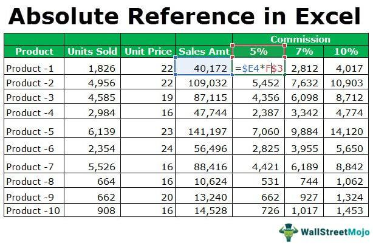

In the world of finance, particularly within algorithmic trading, understanding and accurately calculating financial metrics is crucial for evaluating the performance of trading strategies. Algorithmic trading involves using computer programs to execute financial transactions based on pre-defined criteria, often centering on complex mathematical models and large datasets. Such trading strategies require robust evaluation metrics to ensure they perform optimally under varying market conditions.

This article explores how financial metrics, with an emphasis on rate calculations, play a critical role in algorithmic trading. Rates, such as interest rates and rate of return, serve as fundamental components in assessing the profitability and risk associated with trading strategies. Among these, the absolute rate holds significant importance for traders engaged in interest rate swaps—a type of derivative contract where two parties exchange interest rate cash flows based on a specified principal amount.

Interest rate swaps often involve swapping a fixed interest rate for a floating one, thereby enabling traders to manage risks and leverage potential market advantages. The absolute rate, also known as the absolute swap yield, is key for these traders as it affects swap spreads and provides insights into interest rate fluctuations. This understanding is vital for traders to predict market trends and adapt their strategies accordingly.

Beyond the absolute rate, various popular financial metrics are employed to assess the effectiveness of trading strategies. These include absolute and annualized returns, volatility, and risk-adjusted performance measures like the Sharpe Ratio. Each of these metrics offers unique insights into the strategy's performance, helping traders identify the most profitable and least risky approaches.

By examining these aspects of financial metrics, traders can refine their algorithmic strategies to achieve better performance and profitability. With the right metrics, traders can make informed decisions, optimizing their trading algorithms to navigate the dynamic and often unpredictable financial markets successfully.

## Table of Contents

## Understanding Financial Metrics in Algo Trading

Financial metrics are essential in evaluating the effectiveness and reliability of algorithmic trading strategies. They serve as quantitative measures that facilitate the comparison of different trading strategies, aiding traders in making informed decisions based on potential profit and risk.

**Absolute Return**: Absolute return measures the overall gain or loss of an asset or strategy, without considering the performance of other benchmarks or assets. Calculated as the percentage increase or decrease in the value of an investment over a specific period, absolute return provides a straightforward measure of financial performance. 

**Annualized Return**: This metric extends the concept of absolute return, providing an annual rate of return irrespective of the investment horizon. It is particularly useful for comparing strategies with different durations. The formula for annualized return is:

$$
\text{Annualized Return} = \left( (1 + \text{Total Return})^{\frac{1}{N}} \right) - 1
$$

where $N$ is the number of years.

**Volatility**: Volatility assesses the degree of variation in an asset's prices over time. It is commonly calculated using the standard deviation of periodic returns and is a critical indicator of the risk associated with an investment strategy. High volatility implies a higher risk of large price swings, which can be both opportunities and threats for traders.

**Risk-Adjusted Performance Metrics**: These include the Sharpe Ratio, which accounts for both the return of an investment and the risk taken to achieve that return. The Sharpe Ratio is calculated as:

$$
\text{Sharpe Ratio} = \frac{\text{Average Return} - \text{Risk-Free Rate}}{\text{Standard Deviation of Return}}
$$

A higher Sharpe Ratio indicates a more attractive risk-adjusted return. This metric is indispensable for traders aiming to maximize returns while minimizing risk exposure.

By employing these financial metrics, traders can effectively evaluate and compare [algorithmic trading](/wiki/algorithmic-trading) strategies. They provide insights into the efficiency, profitability, and risk profile of different approaches, enabling traders to select strategies that best align with their financial goals and risk tolerance.

## What Is the Absolute Rate?

The absolute rate, also referred to as the absolute swap yield, is a key metric in the context of [interest rate](/wiki/interest-rate-trading-strategies) swaps, which are derivative contracts where two counterparties exchange one stream of interest payments for another, typically swapping a fixed interest rate for a floating rate, or vice versa. The absolute rate encapsulates the total yield earned by both parties to an interest rate swap transaction by incorporating both fixed and variable rate components. Essentially, it provides a holistic measure of the yield generated by the swap agreement.

In an interest rate swap, one party agrees to pay a fixed rate while receiving a floating rate, connected to a benchmark interest rate such as LIBOR or a government bond yield, or conversely pays a floating rate while receiving a fixed rate. The absolute rate is determined by the sum of these fixed and variable rates. For instance, if the fixed rate in the swap is 2% and the variable rate is 3% at a specific time, then the absolute rate would be 5%. This straightforward calculation is fundamental to assessing the potential yield and profitability of a swap.

$$
\text{Absolute Rate} = \text{Fixed Rate} + \text{Variable Rate}
$$

This metric holds significant importance for swaps traders as it directly influences swap spreads, which are the differences between the swap rate and the benchmark rates. Understanding these spreads enables traders to better comprehend interest rate movements and the compensation required for bearing the risk associated with the swap. As such, the absolute rate provides critical insights, not only into the potential returns from a swap but also into broader interest rate trends which can impact diverse financial instruments and strategies. Understanding and monitoring absolute rates can lead to more informed trading decisions and strategic adjustments in portfolios dealing with interest rate swaps.

## Calculating the Absolute Rate

To calculate the absolute rate in an interest rate swap, one must sum the fixed and variable rates that are characteristic of such financial agreements. An interest rate swap typically involves two parties agreeing to exchange a series of interest payments. One party pays a fixed rate while the other pays a variable rate, often linked to a benchmark such as the London Interbank Offered Rate (LIBOR).

In mathematical terms, if we denote the fixed rate as $R_f$ and the variable rate at any given time $t$ as $R_v(t)$, the absolute rate $R_a(t)$ can be expressed as:

$$
R_a(t) = R_f + R_v(t)
$$

For example, if a swap has a fixed rate of 2% and the current variable rate is 3%, the absolute rate at that time would be:

$$
R_a = 2\% + 3\% = 5\%
$$

This calculation of the absolute rate is integral for determining the total yield generated from the swap, thus impacting its profitability. By computing the absolute rate, traders and financial analysts can evaluate the potential return from the interest rate swap, considering the spread between the fixed payments and the fluctuating variable payments. This assessment aids traders in determining the attractiveness and expected performance of engaging in a particular interest rate swap, especially in volatile market environments.

## Performance Metrics in Algorithmic Trading

Performance metrics are essential for assessing the effectiveness of investment strategies and trading algorithms. These metrics provide quantitative measures that help traders evaluate the potential risks and rewards of their strategies.

**Absolute Return**: This metric measures the total return of an investment strategy, disregarding external factors like market performance. It is the gain or loss realized over a specific period, expressed in percentage terms. Absolute return serves as a fundamental gauge of a strategy's profitability.

**Volatility**: Volatility quantifies the degree of variation in asset prices and is crucial for understanding the risk associated with a trading strategy. It is typically calculated using the standard deviation of returns. A higher volatility indicates a higher degree of variability in returns, suggesting potential risks. The formula for calculating volatility ($\sigma$) is:

$$
\sigma = \sqrt{\frac{1}{N-1} \sum_{i=1}^{N} (R_i - \bar{R})^2}
$$

where $N$ is the number of observations, $R_i$ is each return, and $\bar{R}$ is the average return.

**Drawdown**: This metric assesses the peak-to-trough decline in investment value, illustrating the potential loss from the highest point before a downturn. Drawdown helps traders understand the worst-case scenarios in terms of potential losses. It is expressed as a percentage:

$$
\text{Drawdown} = \frac{\text{Peak Value} - \text{Trough Value}}{\text{Peak Value}} \times 100
$$

**Risk-Adjusted Return Metrics**: These metrics evaluate a strategy's returns relative to its risk, facilitating comparisons among various strategies. Key metrics include the Sharpe Ratio and the Sortino Ratio.

- **Sharpe Ratio**: Represents the average return earned in excess of the risk-free rate per unit of volatility. It is calculated as:

$$
\text{Sharpe Ratio} = \frac{\bar{R} - R_f}{\sigma}
$$

where $\bar{R}$ is the average return, $R_f$ is the risk-free rate, and $\sigma$ is the standard deviation of returns.

- **Sortino Ratio**: An improvement over the Sharpe Ratio, it penalizes only downside volatility. It is calculated as:

$$
\text{Sortino Ratio} = \frac{\bar{R} - R_f}{\text{Downside Deviation}}
$$

Understanding these performance metrics enables traders to make informed assessments of their strategies' risk and reward profiles, aiding in the optimization of algorithmic trading strategies for better performance and profitability.

## The Role of Volatility and Drawdown

Volatility and drawdown are crucial components in evaluating the robustness and risk profile of algorithmic trading strategies. These metrics are vital for traders aiming to balance risk and return while optimizing trading strategies.

Volatility quantifies the degree to which asset prices fluctuate over a certain period. This fluctuation is typically measured using the standard deviation of asset returns. Mathematically, if we represent a series of returns as $r_1, r_2, \ldots, r_n$, the [volatility](/wiki/volatility-trading-strategies) $\sigma$ can be calculated using the formula:

$$
\sigma = \sqrt{\frac{1}{n-1} \sum_{i=1}^{n} (r_i - \bar{r})^2}
$$

where $\bar{r}$ is the average return over the period considered. High volatility indicates significant price swings, which might imply higher risk but also potential for greater returns. Conversely, low volatility suggests more stable price movements.

Drawdown, on the other hand, measures the extent of a decline from a peak to a trough in the value of an investment portfolio. It helps traders understand the potential losses an investment might endure. The drawdown is expressed as a percentage, calculated by:

$$
\text{Drawdown} = \frac{\text{Peak Value} - \text{Trough Value}}{\text{Peak Value}} \times 100\%
$$

Monitoring drawdown levels is essential for assessing an algorithm's risk exposure. It provides insights into the worst-case scenarios and the resilience of a trading strategy during adverse market conditions.

Together, volatility and drawdown form a comprehensive risk assessment framework, enabling traders to gauge the stability and risk-reward profile of their strategies. By diligently monitoring these metrics, traders can make informed decisions, adjust their risk management practices, and ultimately enhance their algorithmic trading performance. This risk assessment is vital for avoiding excessive losses and optimizing strategies for better returns.

## Tools and Platforms for Performance Evaluation

Various tools assist traders in measuring and analyzing performance metrics, making performance evaluation more accessible and thorough. These tools typically encompass [backtesting](/wiki/backtesting) platforms and statistical analysis utilities, which allow traders to assess their strategies by simulating trading scenarios with historical data. Backtesting platforms such as QuantConnect and NinjaTrader provide environments where traders can test their algorithms against past market conditions to evaluate performance, uncover potential weaknesses, and refine their strategies.

Visualization tools are integral in this evaluation process, helping traders to interpret complex data effectively. Through graphical representations of data, traders can identify underlying patterns, trends, and anomalies in their trading performance. Modern visualization tools enable the dissecting of intricate datasets, offering insights that can be critical for decision-making. Example frameworks include Matplotlib and Seaborn in Python, which are widely used for generating plots and statistical graphics.

Popular performance evaluation platforms also offer diverse functionalities that cater to different trading needs. For instance, QuantConnect grants access to a rich library of datasets, covering equities, [forex](/wiki/forex-system), options, and cryptocurrencies, coupled with cloud-based backtesting and live trading support. It leverages Python and C# for algorithm development.

Alpaca allows users to manage their portfolio through API-driven trading, featuring integrations with various data providers and algorithmic frameworks. It supports languages like Python, making it accessible to a broad range of developers. 

NinjaTrader is another powerful platform, offering advanced charting, market analytics, and automated trading systems. It provides a comprehensive suite of tools for technical analysis, with support for multiple asset classes.

These platforms and tools equip traders with the resources necessary to analyze, simulate, and visualize their trading strategies' performance, promoting informed strategic improvements. By leveraging these technologies, traders can enhance their capabilities to adapt to market dynamics, ensuring their strategies remain robust and profitable.

## Conclusion

Financial metrics are essential in algorithmic trading, playing a crucial role in the optimization and refinement of trading strategies. These metrics, when well understood and accurately assessed, provide traders with valuable insights into both risks and returns associated with their trading activities. By analyzing metrics such as absolute return, volatility, and risk-adjusted performance indicators like the Sharpe Ratio, traders can make informed decisions, enhancing their ability to navigate the complexities of the financial markets.

A comprehensive understanding of financial metrics enables traders to measure the effectiveness of their strategies and make systematic improvements. This understanding is pivotal for calculating potential profitability and mitigating risks, which in turn paves the way for informed decision-making. For instance, by monitoring volatility and drawdowns, traders can assess the stability of their investment and manage risks accordingly.

Leveraging performance metrics and advanced analytical tools further amplifies strategy development. Tools such as backtesting platforms and statistical analysis software provide traders with a robust framework for evaluating the historical performance and potential future outcomes of their strategies. Platforms like QuantConnect or NinjaTrader offer advanced capabilities for visualizing data, identifying patterns, and predicting trends, thus providing a competitive edge.

In conclusion, integrating a sound knowledge of financial metrics and employing cutting-edge analytical tools empower traders to optimize their strategies effectively. These capabilities enhance the trader's chances of succeeding within the dynamic and rapidly evolving financial landscape, ultimately leading to a more systematic approach to trading and improved financial outcomes.

## References & Further Reading

[1]: Hull, J. C. (2017). ["Options, Futures, and Other Derivatives"](https://www.semanticscholar.org/paper/Options%2C-Futures%2C-and-Other-Derivatives-Hull/89bdee500c8623864fc9eb7a471546aa713acc44) (10th Edition). Pearson.

[2]: ["Algorithmic Trading & DMA: An Introduction to Direct Access Trading Strategies"](https://www.amazon.com/Algorithmic-Trading-DMA-introduction-strategies/dp/0956399207) by Barry Johnson

[3]: ["Interest Rate Swaps and Other Derivatives"](https://www.blinkist.com/en/books/interest-rate-swaps-and-other-derivatives-en) by Howard Corb

[4]: Black, F., & Scholes, M. (1973). ["The Pricing of Options and Corporate Liabilities."](https://www.cs.princeton.edu/courses/archive/fall09/cos323/papers/black_scholes73.pdf) Journal of Political Economy, 81(3), 637-654.

[5]: ["Quantitative Finance For Dummies"](https://www.amazon.com/Quantitative-Finance-Dummies-Steve-DPhil/dp/1118769465) by Stephen Blyth

[6]: Sharpe, W. F. (1966). ["Mutual Fund Performance."](https://www.scirp.org/reference/ReferencesPapers?ReferenceID=1451307) Journal of Business, 39(1), 119-138.

[7]: ["Python for Finance: Analyze Big Financial Data"](https://www.amazon.com/Python-Finance-Analyze-Financial-Data/dp/1491945281) by Yves Hilpisch