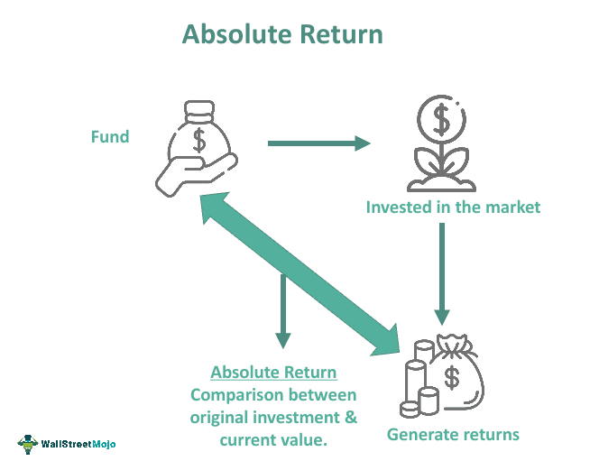

## Table of Contents

## What is the absolute return attribution method?

The absolute return attribution method is a way to figure out how well an investment portfolio is doing. It looks at the total return of the portfolio and breaks it down into different parts to see what helped or hurt the performance. This method is useful for investors who want to understand which parts of their investments are working well and which ones need improvement.

By using the absolute return attribution method, investors can see the impact of their investment choices, like picking certain stocks or bonds, and how much those choices added to or took away from the overall return. It also shows the effect of other factors, like how the market is doing or how much risk the investor is taking. This helps investors make smarter decisions about where to put their money in the future.

## How does the absolute return attribution method differ from other attribution methods?

The absolute return attribution method looks at the total return of a portfolio and breaks it down to see what made it go up or down. It focuses on the actual performance of the investments, without comparing them to a benchmark. This means it shows how much each part of the portfolio, like stocks or bonds, contributed to the overall return. It's useful for investors who want to understand the performance of their specific choices, without worrying about how they stack up against a general market index.

Other attribution methods, like the relative return attribution method, compare the portfolio's performance to a benchmark. This helps investors see if they did better or worse than the market. For example, if a portfolio's return is 10% and the benchmark's return is 8%, the relative method would show a positive performance. These methods are good for investors who want to know if their strategy beats the market, but they might not give as clear a picture of what's driving the portfolio's performance as the absolute return method does.

In summary, the absolute return attribution method gives a detailed look at what's happening inside a portfolio, focusing on the actual returns from each investment. On the other hand, other methods like the relative return attribution method focus on how the portfolio performs compared to a benchmark. Both approaches have their uses, depending on what an investor wants to know about their investments.

## What are the key components of the absolute return attribution method?

The absolute return attribution method breaks down a portfolio's total return into different parts to see what made it go up or down. It looks at things like the returns from stocks, bonds, and other investments. This method helps investors understand which parts of their portfolio are doing well and which ones are not. For example, if stocks in the portfolio did really well, the method would show how much of the total return came from those stocks.

Another key part of the absolute return attribution method is looking at the effects of other factors, like how the market is doing or how much risk the investor is taking. This helps investors see if their choices to take more or less risk paid off. For instance, if an investor chose to invest in riskier stocks and those stocks did well, the method would show how much that choice added to the overall return. By understanding these components, investors can make better decisions about where to put their money in the future.

## Can you explain the process of applying the absolute return attribution method?

To apply the absolute return attribution method, you start by looking at the total return of your investment portfolio over a certain time, like a year. You then break down this total return into smaller parts to see what made it go up or down. For example, if you have stocks, bonds, and cash in your portfolio, you would figure out how much each of these added to or took away from the total return. This helps you see which parts of your investments are doing well and which ones are not.

Next, you look at other factors that might have affected your portfolio's performance. This includes things like how the overall market did during that time or how much risk you took with your investments. For instance, if you chose to invest in riskier stocks and they did well, you would see how much that choice helped your total return. By understanding all these parts, you can make better decisions about where to put your money in the future. This method is all about figuring out what's working and what's not in your investment choices.

## What are the benefits of using the absolute return attribution method for portfolio analysis?

Using the absolute return attribution method helps investors understand what's happening in their portfolio. It breaks down the total return into smaller parts, showing how much each investment, like stocks or bonds, added to or took away from the overall performance. This way, investors can see which parts of their portfolio are doing well and which ones need improvement. For example, if stocks in the portfolio did really well, the method would show how much of the total return came from those stocks.

Another benefit is that the absolute return attribution method looks at other factors that affect the portfolio, like market conditions and the level of risk taken. This helps investors see if their choices to take more or less risk paid off. For instance, if an investor chose to invest in riskier stocks and those stocks did well, the method would show how much that choice added to the overall return. By understanding these components, investors can make better decisions about where to put their money in the future, helping them to improve their investment strategy.

## What types of investments are best suited for the absolute return attribution method?

The absolute return attribution method works well for all kinds of investments, but it's especially useful for portfolios with a mix of different types of assets. This includes stocks, bonds, and even cash. If you have a portfolio with many different investments, this method helps you see how each part is doing. For example, if you have some money in tech stocks and some in government bonds, the method will show you how much each of these added to your total return. This is helpful because it lets you know which parts of your portfolio are working well and which ones might need a change.

This method is also good for investors who want to understand the impact of their choices, like how much risk they're taking. If you decide to invest in riskier stocks and they do well, the absolute return attribution method will show you how much that choice helped your overall return. It's also useful for looking at how market conditions affect your investments. By breaking down the total return into smaller parts, you can see what's driving your portfolio's performance and make better decisions about where to put your money in the future.

## How can the absolute return attribution method help in identifying sources of portfolio returns?

The absolute return attribution method helps investors see where their portfolio's returns are coming from by breaking down the total return into smaller parts. It shows how much each investment, like stocks or bonds, added to or took away from the overall performance. For example, if you have money in tech stocks and government bonds, this method will tell you how much each of these contributed to your total return. This way, you can easily see which parts of your portfolio are doing well and which ones might need some changes.

This method also looks at other factors that can affect your portfolio, like how the market is doing or how much risk you're taking. If you choose to invest in riskier stocks and they do well, the absolute return attribution method will show you how much that choice helped your overall return. By understanding all these parts, you can make better decisions about where to put your money in the future. It's like having a detailed map of your investments, showing you exactly what's working and what's not.

## What are the common challenges faced when implementing the absolute return attribution method?

One common challenge when using the absolute return attribution method is getting all the data right. You need to know the exact returns from each part of your portfolio, like stocks, bonds, and cash. If any of this data is wrong or missing, it can mess up your whole analysis. It's like trying to solve a puzzle with missing pieces; it's hard to see the full picture.

Another challenge is understanding how different factors affect your investments. Things like market conditions and the level of risk you take can change a lot, and it's not always easy to figure out how much they helped or hurt your returns. It takes time and some knowledge to break down all these parts correctly. But once you do, it can really help you see what's working and what's not in your portfolio.

## How does the absolute return attribution method handle multi-currency portfolios?

The absolute return attribution method can handle multi-currency portfolios by looking at how changes in currency values affect the total return. When you have investments in different countries, the value of those investments can go up or down because of changes in exchange rates. The method breaks down the total return to show how much of it came from the investments themselves and how much came from these currency changes. This helps investors see if their choices to invest in different currencies paid off or not.

For example, if you have some money in US stocks and some in European bonds, the absolute return attribution method will show you how much the returns from the stocks and bonds added to your total return, and how much the changes in the value of the US dollar and the euro affected it. By understanding these parts, you can make better decisions about where to put your money in the future, especially when it comes to investing in different currencies.

## What advanced techniques can be used to enhance the accuracy of the absolute return attribution method?

To make the absolute return attribution method more accurate, you can use something called multi-factor models. These models look at many different things that can affect your investments, like how the economy is doing, how much risk you're taking, and even what's happening in different industries. By using these models, you can get a clearer picture of what's driving your portfolio's performance. It's like using a more detailed map to find your way, helping you see all the little things that can make a big difference.

Another way to improve accuracy is by using better data and more frequent updates. If you have the most up-to-date information about your investments and the market, you can make better guesses about what's going to happen next. This means checking your data often and making sure it's right. It's like keeping your tools sharp; the better your data, the more accurate your analysis will be. By doing these things, you can get a more precise understanding of where your returns are coming from and make smarter choices about your investments.

## How can the absolute return attribution method be integrated with risk management strategies?

The absolute return attribution method can be integrated with risk management strategies by helping investors understand how different parts of their portfolio affect their overall risk and return. When you use this method, you break down your total return to see how much each investment, like stocks or bonds, added to or took away from it. This helps you see which parts of your portfolio are riskier and which ones are safer. By knowing this, you can adjust your investments to either take on more risk if you want higher returns or reduce risk if you want to protect your money.

For example, if the absolute return attribution method shows that your stocks are doing well but also adding a lot of risk, you might decide to sell some of those stocks and buy more bonds, which are usually less risky. This way, you can balance your portfolio to match your risk comfort level. By using the absolute return attribution method alongside risk management, you can make smarter choices about where to put your money, helping you reach your investment goals while keeping your risk in check.

## What are the latest developments and research in the field of absolute return attribution?

Recent developments in the field of absolute return attribution have focused on improving the accuracy and detail of the method. Researchers are using more advanced multi-factor models to break down portfolio returns into even smaller parts. These models consider a wider range of factors, like economic conditions, industry performance, and even specific company events. By doing this, investors can get a clearer picture of what's driving their portfolio's performance. For example, a new study might look at how changes in interest rates affect bond returns, helping investors understand the impact of monetary policy on their investments.

Another area of research is the integration of [machine learning](/wiki/machine-learning) and [artificial intelligence](/wiki/ai-artificial-intelligence) into absolute return attribution. These technologies can help analyze large amounts of data quickly and find patterns that might be hard for humans to see. This can lead to more accurate predictions about future returns and better decision-making. For instance, AI can be used to predict how different stocks will perform based on past data and current market conditions. By using these advanced tools, investors can enhance their understanding of their portfolio's performance and make more informed investment choices.

## What is the Role of Risk Models in Algo Trading?

Risk models play a crucial role in [algorithmic trading](/wiki/algorithmic-trading) by quantifying the risk and return profiles of various trading strategies. These models are essential for understanding how different factors contribute to the overall performance of an investment portfolio. Through careful analysis, traders can optimize their strategies to enhance returns while managing exposure to risk.

In algorithmic trading, risk models assess potential outcomes by simulating various market conditions and their impacts on asset returns. By using historical data and statistical methods, these models provide insights into the likelihood of different scenarios and help in constructing portfolios that aim to achieve desired risk-adjusted returns. A key aspect of risk modeling is the identification and assessment of factors that drive asset returns.

Common factors used in risk models include style factors and sector allocations. Style factors refer to attributes such as value, growth, size, [momentum](/wiki/momentum), and [volatility](/wiki/volatility-trading-strategies), which can affect an asset's performance. For example, value-based factors focus on undervalued assets, whereas momentum factors target assets with short-term price increases. Sector allocations consider the distribution of investments across different industries, such as technology, healthcare, or finance, each responding differently to economic changes.

Understanding [factor](/wiki/factor-investing) loadings is crucial for interpreting the impact on absolute returns. Factor loadings represent the sensitivity of an asset's return to a particular factor. Mathematically, the return of an asset (R) in a multi-factor model can be expressed as:

$$
R = \alpha + \beta_1F_1 + \beta_2F_2 + ... + \beta_nF_n + \epsilon
$$

Here, $\alpha$ denotes the expected return independent of factors, $\beta_n$ represents the loading or sensitivity to the nth factor $F_n$, and $\epsilon$ captures the unexplained return, or error term. Accurately estimating these loadings is important as they indicate how much of the asset's return can be accounted for by the exposure to different systematic risks.

Recognizing the importance of these factors enables traders to make informed decisions regarding portfolio adjustments. For instance, if a portfolio exhibits high sensitivity to [interest rate](/wiki/interest-rate-trading-strategies) movements, traders may reduce exposure to long-duration bonds to mitigate potential losses in a rising rate environment.

In conclusion, risk models equipped with detailed analysis of style factors and sector allocations provide essential insights for algorithmic trading. By understanding factor loadings and their impact on absolute returns, traders can craft strategies that align with their risk tolerance and return expectations. This understanding not only aids in achieving better risk-adjusted returns but also enhances the robustness and adaptability of trading strategies.

## What are some case studies and examples?

Algorithmic trading strategies have increasingly employed absolute return attribution analysis to enhance performance evaluation and decision-making. This section provides real and hypothetical examples illustrating how absolute return attribution facilitates better understanding and management of algorithmic trading strategies.

### Examples of Algorithmic Strategies

1. **Quantitative Momentum Strategy**:
   A quantitative momentum strategy, which capitalizes on stocks with upward price trends, can utilize absolute return attribution to dissect performance drivers. By analyzing contributions from individual securities and sectors, traders can identify which segments of the portfolio were most influential in generating returns. For instance, if a strategy focused on technology and healthcare stocks outperforms, the attribution analysis may reveal that healthcare contributed 60% to the returns due to a significant rally in biotechnology.

2. **Statistical Arbitrage**:
   Statistical [arbitrage](/wiki/arbitrage) strategies involve forecasting expected returns based on statistical relationships. An example is a [pair trading](/wiki/pair-trading) strategy where traders exploit mean-reverting relationships between two correlated assets. Absolute return attribution can help identify how much of the total return was attributed to the convergence of price spreads of the pairs. If a pair of stocks A and B, historically correlated, deviate but then revert, the attribution can quantify the return derived solely from this convergence process. 

### Real-World Scenarios

1. **Hedge Fund Performance**:
   A [hedge fund](/wiki/hedge-fund-trading-strategies) utilizing machine learning algorithms for stock selection finds its strategy underperforming. Absolute return attribution analysis reveals that unexpected geopolitical events impacted energy stocks disproportionately, pulling down returns. Identifying this factor allowed the fund to hedge against such contingencies in future iterations of the strategy, thereby stabilizing returns.

2. **Currency Trading**:
   In the foreign exchange market, an algorithmic trading firm uses machine learning models to predict currency movements. After integrating absolute return attribution, they discover that trades based on interest rate differentials were consistently profitable, while others were not. This insight prompted a strategic shift to focus more on interest-based trading, improving overall returns.

### Hypothetical Case

Consider a hypothetical equity long-short strategy designed to exploit pricing inefficiencies. Let:
- $R$ be the total return of the strategy,
- $R_L$ be the return from long positions,
- $R_S$ be the return from short positions,
- Fees and costs $C$.

The total absolute return $R_{abs}$ can be expressed as:

$$
R_{abs} = R_L + R_S - C
$$

By attributing absolute returns, one might find:
- $R_L = 8\%$
- $R_S = 4\%$
- Costs $C = 2\%$

Resulting in a net absolute return:

$$
R_{abs} = 8\% + 4\% - 2\% = 10\%
$$

This hypothetical case demonstrates how breaking down returns enables traders to understand where their performance is strongest, whether from long or short allocations, and consider operational costs.

These examples underscore the critical role of absolute return attribution in refining strategy effectiveness and enabling informed tactical adjustments in algorithmic trading. Such analyses help traders identify lucrative segments, allocate resources efficiently, and mitigate risks intelligently.

## References & Further Reading

[1]: Leshik, E., & Cralle, J. (2011). ["An Introduction to Algorithmic Trading: Basic to Advanced Strategies."](https://onlinelibrary.wiley.com/doi/book/10.1002/9781119206033) Wiley.

[2]: Grinold, R. C., & Kahn, R. N. (1999). ["Active Portfolio Management: A Quantitative Approach for Producing Superior Returns and Controlling Risk."](https://books.google.com/books/about/Active_Portfolio_Management_A_Quantitati.html?id=a1yB8LTQnOEC) McGraw-Hill.

[3]: Carver, R. (2015). ["Systematic Trading: A Unique New Method for Designing Trading and Investing Systems."](https://www.amazon.com/Systematic-Trading-designing-trading-investing/dp/0857194453) Harriman House.

[4]: Lopez de Prado, M. (2018). ["Advances in Financial Machine Learning."](https://www.amazon.com/Advances-Financial-Machine-Learning-Marcos/dp/1119482089) Wiley.

[5]: Jansen, S. (2018). ["Machine Learning for Algorithmic Trading."](https://www.amazon.com/Hands-Machine-Learning-Algorithmic-Trading/dp/178934641X) Packt Publishing.