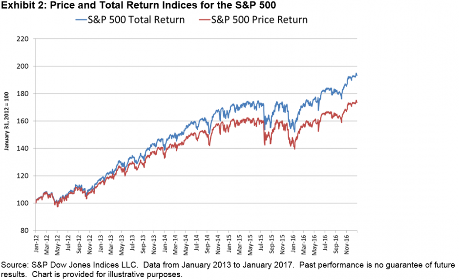

## Table of Contents

## What is an Absolute Return Index?

An Absolute Return Index is a type of investment measure that tracks the performance of a portfolio or fund against a specific goal, rather than comparing it to a market benchmark. Instead of trying to beat a stock market index like the S&P 500, an absolute return index focuses on achieving a positive return, regardless of how the overall market is doing. This approach is often used by investors who want to minimize risk and aim for steady gains over time.

These indices are popular in the world of hedge funds and other alternative investments, where the goal is to make money in any market condition. By focusing on absolute returns, managers can use a variety of strategies, like buying and selling different types of assets, to try and achieve their target. This flexibility can be appealing to investors who are more concerned with preserving their capital and earning consistent returns, rather than trying to outperform the market during good times and potentially losing money during downturns.

## How does an Absolute Return Index differ from a traditional index?

An Absolute Return Index is different from a traditional index because it doesn't compare its performance to a market benchmark like the S&P 500. Instead, it focuses on achieving a specific positive return, no matter what the market is doing. This means that the goal is to make money in any market condition, not just when the market is going up. Traditional indexes, on the other hand, track the performance of a specific group of stocks or bonds and are used to measure how well the market or a particular sector is doing.

Because of this difference, Absolute Return Indexes are often used by investors who want to minimize risk and aim for steady gains over time. They are popular in the world of hedge funds and other alternative investments where the focus is on preserving capital and [earning](/wiki/earning-announcement) consistent returns. Traditional indexes, however, are more commonly used by investors who want to see how their investments are doing compared to the overall market or a specific sector. This can be riskier because if the market goes down, their investments might lose value too.

## What are the key components of an Absolute Return Index?

The main part of an Absolute Return Index is its focus on making a positive return, no matter what the market is doing. Instead of trying to beat a market benchmark like the S&P 500, it aims to achieve a specific goal, like earning a certain percentage each year. This means that the index looks at how well it's doing on its own, not how it compares to other investments.

To reach this goal, an Absolute Return Index uses different strategies. It might invest in a mix of stocks, bonds, and other assets. The idea is to find the best way to make money, even if the market is going up or down. This flexibility helps the index try to protect the money invested and earn steady returns over time.

## How is performance measured in an Absolute Return Index?

Performance in an Absolute Return Index is measured by how well it meets its goal of making a positive return. Instead of comparing itself to a market benchmark like the S&P 500, it focuses on achieving a specific target, like earning a certain percentage each year. This means the index looks at its own performance to see if it's making money, no matter what the market is doing.

To measure this, the index tracks its returns over time. It might use different strategies and invest in a mix of stocks, bonds, and other assets to try and reach its goal. The key is to see if the index is making steady gains and protecting the money invested, even if the market goes up or down.

## What are the benefits of using an Absolute Return Index for investors?

Using an Absolute Return Index can help investors in a few important ways. One big benefit is that it focuses on making a positive return no matter what the market is doing. This means that even if the stock market goes down, the index tries to keep making money. This can be really helpful for investors who want to protect their money and not lose it during bad times in the market.

Another benefit is that an Absolute Return Index can use different strategies to try and reach its goal. It might invest in a mix of stocks, bonds, and other things to find the best way to make money. This flexibility can help the index earn steady returns over time, which is good for investors who want to see their money grow slowly but surely. By focusing on absolute returns, investors can feel more secure knowing that their money is being managed to grow in any market condition.

## Can you explain the methodology behind constructing an Absolute Return Index?

The methodology behind constructing an Absolute Return Index starts with setting a clear goal. This goal is usually a specific positive return that the index wants to achieve, like earning a certain percentage each year. Instead of trying to beat a market benchmark like the S&P 500, the focus is on making money no matter what the market is doing. To reach this goal, the index uses different strategies. It might invest in a mix of stocks, bonds, and other assets to find the best way to make money. This flexibility helps the index try to protect the money invested and earn steady returns over time.

Once the goal is set, the next step is to track the performance of the index. This means looking at how well the index is doing in meeting its target. The index doesn't compare itself to other investments but focuses on its own performance. It keeps an eye on its returns over time to see if it's making steady gains. By using different strategies and investing in a variety of assets, the index tries to make money even if the market goes up or down. This approach helps investors feel more secure knowing that their money is being managed to grow in any market condition.

## What are some common strategies used to achieve absolute returns?

One common strategy to achieve absolute returns is called market neutral investing. This means the index tries to make money no matter if the market goes up or down. It does this by balancing investments that go up with investments that go down. For example, it might buy some stocks and also sell other stocks short. This way, if the market goes down, the short sales can make money to offset any losses from the stocks that were bought.

Another strategy is called long/short equity. This is similar to market neutral investing but focuses more on [picking](/wiki/asset-class-picking) specific stocks. The index buys stocks it thinks will go up (long) and sells short stocks it thinks will go down (short). By doing this, the index tries to make money from the difference between the winners and losers, no matter what the overall market does.

A third strategy is using derivatives and other financial instruments. These can be things like options, futures, and swaps. The index might use these to hedge against market risks or to take advantage of price movements. By carefully managing these instruments, the index can try to make steady gains and protect the money invested, even in tough market conditions.

## How do Absolute Return Indices handle market volatility?

Absolute Return Indices handle market [volatility](/wiki/volatility-trading-strategies) by using strategies that aim to make money no matter what the market is doing. Instead of trying to beat the market, these indices focus on achieving a specific positive return. They do this by balancing investments that might go up with investments that might go down. For example, they might buy some stocks and also sell other stocks short. This way, if the market goes down, the short sales can make money to offset any losses from the stocks that were bought.

Another way Absolute Return Indices handle market volatility is by using a mix of different investments. They might invest in stocks, bonds, and other assets to spread out the risk. By doing this, they can try to make steady gains even when the market is going up and down a lot. This approach helps protect the money invested and aims to earn consistent returns over time, no matter what the market is doing.

## What are the potential risks associated with investing in funds that track an Absolute Return Index?

Investing in funds that track an Absolute Return Index can have some risks. One big risk is that these funds might not always reach their goal of making a positive return. Even though they try to make money no matter what the market is doing, sometimes the strategies they use don't work out. This can happen if the market moves in unexpected ways or if the investments they choose don't perform as expected.

Another risk is that these funds can be more complex than traditional funds. They might use strategies like buying and selling stocks at the same time, or using special financial tools like options and futures. This can make it harder for investors to understand what's going on with their money. Also, these strategies can sometimes lead to bigger losses if they don't work out. So, it's important for investors to know what they're getting into and to be okay with the possibility of losing some money.

## How do regulatory frameworks impact the operation of Absolute Return Indices?

Regulatory frameworks can have a big impact on how Absolute Return Indices work. These rules are set by governments and financial watchdogs to make sure that investments are safe and fair. For example, they might limit the kinds of strategies that funds can use, like how much they can borrow or what kinds of financial tools they can trade. This can make it harder for funds to reach their goal of making a positive return no matter what the market is doing.

Also, these rules can affect how much information funds have to share with investors. They might need to tell investors more about their strategies and risks, which can be good for transparency but might also limit what the funds can do. Overall, while regulations are important for protecting investors, they can also make it trickier for Absolute Return Indices to operate and achieve their goals.

## What are some real-world examples of Absolute Return Indices and their performance?

One real-world example of an Absolute Return Index is the HFRX Absolute Return Index, which is managed by Hedge Fund Research, Inc. This index aims to give investors a way to see how well hedge funds are doing when they focus on making a positive return no matter what the market is doing. Over the years, the HFRX Absolute Return Index has had ups and downs. For example, in some years, it might go up by a few percent, while in other years, it might go down. This shows that even though the goal is to make money no matter what, it's not always easy to do.

Another example is the Credit Suisse Hedge Fund Index, which has a category called "Multi-Strategy" that often focuses on absolute returns. This index tracks the performance of hedge funds that use different strategies to try and make money. Like the HFRX Absolute Return Index, the performance of the Credit Suisse Multi-Strategy category can vary a lot from year to year. Sometimes it does well, and other times it struggles. This shows that while Absolute Return Indices aim to protect money and make steady gains, they still face challenges and risks.

## How can advanced statistical models enhance the accuracy of an Absolute Return Index?

Advanced statistical models can help make an Absolute Return Index more accurate by looking at a lot of data and finding patterns that might be hard to see otherwise. These models can use things like [machine learning](/wiki/machine-learning) to predict how different investments might do in the future. By doing this, they can help the index pick the best mix of stocks, bonds, and other assets to try and reach its goal of making a positive return no matter what the market is doing. This can make the index better at handling risks and finding opportunities to make money.

Also, these models can help the index adjust its strategies as the market changes. They can look at how the market has moved in the past and use that information to guess what might happen next. This means the index can be more flexible and change its investments to keep making money even when the market is going up and down a lot. By using advanced statistical models, an Absolute Return Index can be more accurate and better at reaching its goal of making steady gains over time.

## What are Financial Performance Metrics?

Evaluating financial performance requires a comprehensive analysis of investment returns, associated risks, and the efficiency of various investments. Understanding these dimensions enables investors to assess the effectiveness of their investment strategies accurately.

**Absolute Return** is a fundamental performance metric that quantifies the gain or loss of an investment, expressed as a percentage of the initial investment. Unlike relative return, which is measured against a benchmark index, absolute return simply measures how much the investment has picked up or lost over a given period. This metric is crucial for investors focused on achieving consistent gains regardless of market fluctuations.

**Annualized Return** provides a standardized measure of return that accounts for the compounding effect of returns over time. It is calculated by converting the total return into an annual return, providing a clearer picture of the investment's performance over longer periods. The formula for annualized return is:

$$
\text{Annualized Return} = \left( \left( \frac{\text{Ending Value}}{\text{Beginning Value}} \right)^{\frac{1}{n}} - 1 \right) \times 100
$$

where $n$ is the number of years the investment is held. This metric allows investors to compare returns across different investment vehicles and time frames effectively.

**Risk-Adjusted Returns** account for the level of risk undertaken to achieve returns, providing a more comprehensive perspective on investment performance. The Sharpe Ratio is one of the most commonly used measures, which evaluates returns relative to risk. It is defined as:

$$
\text{Sharpe Ratio} = \frac{R_p - R_f}{\sigma_p}
$$

where $R_p$ is the portfolio's return, $R_f$ is the risk-free rate, and $\sigma_p$ is the standard deviation of the portfolio's excess return. A higher Sharpe Ratio indicates that the investment offers better risk-adjusted returns, making it an essential consideration for risk-averse investors.

These metrics collectively empower investors to understand the nuanced dimensions of their investment's performance, enabling more informed decision-making. By assessing returns relative to absolute benchmarks, time frames, and risk factors, investors can tailor their strategies to align with their specific financial goals and risk tolerance.

## What are the key aspects of exploring absolute return strategies?

Absolute return strategies are designed to achieve consistent positive returns regardless of market fluctuations. This investment philosophy is contrasted with traditional strategies that aim to outperform specific benchmarks or indexes. In essence, the objective is to secure gains with minimal exposure to market risk, thereby ensuring portfolio stability and growth.

Hedge funds predominantly adopt absolute return strategies due to their flexibility and potential for high returns. These strategies are characterized by their diverse and sometimes intricate approaches, including long/short positions, [arbitrage](/wiki/arbitrage), derivatives usage, and market-neutral strategies. By employing various asset classes and techniques, hedge funds can exploit inefficiencies across global markets to achieve targeted returns.

The Absolute Return Index (ARI) serves a critical role in this context by gauging the performance of these strategies relative to the broader [hedge fund](/wiki/hedge-fund-trading-strategies) market. This index offers an insightful comparison for investors seeking to evaluate the effectiveness of absolute return strategies. By analyzing the ARI, investors can discern how well their investments perform independently of traditional market movements.

Mathematically, the absolute return can be expressed as:

$$
\text{Absolute Return} = \frac{\text{(Ending Value - Beginning Value)}}{\text{Beginning Value}} \times 100\%
$$

For example, a hedge fund employing an absolute return strategy that begins the year with $100 million and ends with $110 million would achieve an absolute return of 10%. Such a metric is crucial for investors to assess the capacity of these strategies to deliver irrespective of external economic conditions.

In summary, absolute return strategies are a vital tool in modern investment portfolios, offering a means to achieve steady and positive returns while monitoring the Absolute Return Index for performance benchmarking.

## References & Further Reading

[1]: Fabozzi, F. J., Focardi, S. M., & Kolm, P. N. (2016). ["Financial Modeling of the Equity Market: From CAPM to Cointegration."](https://onlinelibrary.wiley.com/doi/book/10.1002/9781119201236) Wiley.

[2]: Lopez de Prado, M. (2018). ["Advances in Financial Machine Learning."](https://www.amazon.com/Advances-Financial-Machine-Learning-Marcos/dp/1119482089) Wiley.

[3]: Chan, E. P. (2009). ["Quantitative Trading: How to Build Your Own Algorithmic Trading Business."](https://github.com/ftvision/quant_trading_echan_book) Wiley.

[4]: Jansen, S. (2020). ["Machine Learning for Algorithmic Trading: Predictive models to extract signals from market and alternative data for systematic trading strategies with Python."](https://github.com/stefan-jansen/machine-learning-for-trading) Packt Publishing.

[5]: Aronson, D. R. (2006). ["Evidence-Based Technical Analysis: Applying the Scientific Method and Statistical Inference to Trading Signals."](https://www.amazon.com/Evidence-Based-Technical-Analysis-Scientific-Statistical/dp/0470008741) Wiley.

[6]: Fama, E. F., & French, K. R. (1992). ["The Cross‐Section of Expected Stock Returns."](https://onlinelibrary.wiley.com/doi/full/10.1111/j.1540-6261.1992.tb04398.x) The Journal of Finance, 47(2), 427-465.